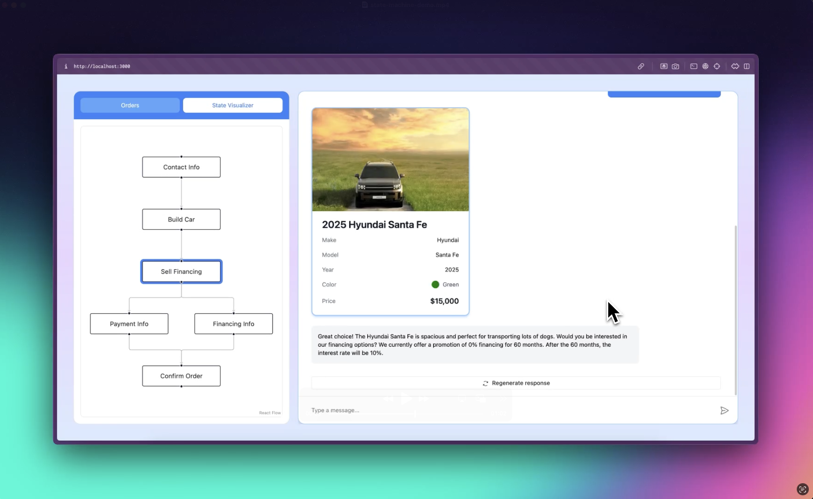

# CopilotKit State Machine Example

This example demonstrates how to build an AI-powered car sales application using CopilotKit and Next.js. It showcases a state machine pattern for managing complex conversational flows with an AI assistant.



## Overview

The application simulates a car dealership experience where an AI assistant guides users through the process of:
1. Collecting contact information
2. Helping select a car
3. Offering financing options
4. Processing payment or financing details
5. Confirming the final order

## State Machine

State machines are a common pattern for managing complex conversational flows. With CopilotKit, you can easily use the built-in
API surface to create your own state machines. In this example, we've created a state machine for the car sales process.

### Stages
There are 6 stages in the state machine, each with a corresponding hook in the `stages` directory. Click through to read 
more information about each stage.
1. [getContactInfo](./src/lib/stages/use-stage-get-contact-info.tsx)
2. [buildCar](./src/lib/stages/use-stage-build-car.tsx)
3. [sellFinancing](./src/lib/stages/use-stage-sell-financing.tsx)
4. [getFinancingInfo](./src/lib/stages/use-stage-get-financing-info.tsx)
5. [getPaymentInfo](./src/lib/stages/use-stage-get-payment-info.tsx)
6. [confirmOrder](./src/lib/stages/use-stage-confirm-order.tsx)

Each stage hook encapsulates the stage-specific CopilotKit configuration as well as the prompts for those stages.

### Global State

Glueing all of these stages together is the [car-sales-chat.tsx](./src/components/car-sales-chat.tsx) component and the
[use-global-state.tsx](./src/lib/stages/use-global-state.tsx) hook which manages the global state of the application.

### Visualizer
Included for visualizing the state machine is a [React Flow](https://reactflow.dev/) powered state machine visualizer. As the 
assistant progress through the stages, the visualizer will update to reflect the current stage.

## Running Locally

1. Clone the repository:
```bash
git clone https://github.com/your-username/copilotkit.git
cd copilotkit/examples/state-machine
```

2. Install dependencies:
```bash
pnpm install
```

3. Get a public API key from [Copilot Cloud](https://cloud.copilotkit.ai) (free).

4. Set up your environment variables:
```bash
cp .env.example .env.local
```

Add your CopilotKit Public API key to `.env.local`:
```
NEXT_PUBLIC_CPK_PUBLIC_API_KEY=your_api_key_here
```

4. Run the development server:
```bash
pnpm dev
```

5. Open [http://localhost:3000](http://localhost:3000) with your browser to see the result.

## Learn More

- [CopilotKit Documentation](https://docs.copilotkit.ai)
- [Next.js Documentation](https://nextjs.org/docs)
- [OpenAI API Documentation](https://platform.openai.com/docs)

## Contributing

Contributions are welcome! Please feel free to submit a Pull Request.
