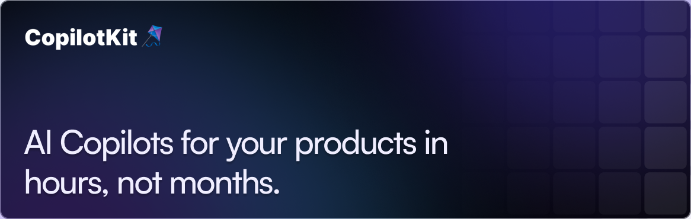
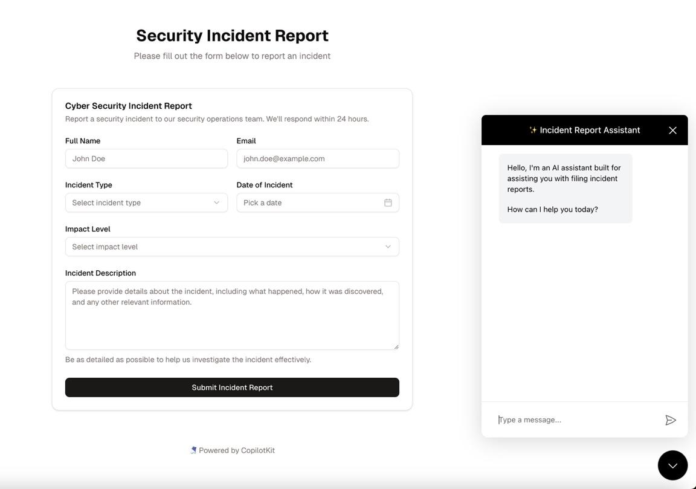

<div align="center">
  <a href="https://copilotkit.ai" target="_blank">
    
  </a>

  <br/>

  <h3>
    Build deeply-integrated AI assistants & agents<br/>
    that work <em>alongside</em> your users inside your applications.
  </h3>
  
</div>

<!-- -->

<br/>

<div align="center">
  <a href="https://www.npmjs.com/package/@copilotkit/react-core" target="_blank">
    
  </a>
  
  <a href="https://discord.gg/6dffbvGU3D" target="_blank">
    
  </a>
</div>
<br/>

<div align="center">
  <a href="https://discord.gg/6dffbvGU3D?ref=github_readme" target="_blank">
    
  </a>
  <a href="https://docs.copilotkit.ai?ref=github_readme" target="_blank">
    
  </a>
  <a href="https://cloud.copilotkit.ai?ref=github_readme" target="_blank">
    
  </a>
  
</div>


<h3 align="center"> 
Stay up to date with our latest releases!
</h3>

<div align="center">
  <a href="https://go.copilotkit.ai/gh-linkedin" target="_blank">
    
  </a>
  <a href="https://go.copilotkit.ai/gh-twitter" target="_blank">
    
  </a>
</div>

<br/>
<div align="center">
  <a href="https://www.producthunt.com/posts/copilotkit" target="_blank">
    
  </a>
</div>
<br />


# 🚀 Showcase: Build Anything with CopilotKit

<div align="center">
  <h3>From simple chat interfaces to complex AI-native applications</h3>
</div>

## 🤖 Agent Native Applications

<table>
  <tr>
    <td width="33%" align="center">
      <a href="https://github.com/CopilotKit/CopilotKit/blob/main/examples/coagents-research-canvas/readme.md">
        
        <br/>
        <b>🔍 Research Canvas</b>
      </a>
      <p>Document analysis with multi-agent collaboration</p>
      <a href="https://github.com/CopilotKit/CopilotKit/blob/main/examples/coagents-research-canvas/readme.md"><code>View Example →</code></a>
    </td>
    <td width="33%" align="center">
      <a href="https://docs.copilotkit.ai/coagents/tutorials/ai-travel-app/overview">
        
        <br/>
        <b>✈️ Travel Planner</b>
      </a>
      <p>Agent-native app with itinerary generation & visualization</p>
      <a href="https://docs.copilotkit.ai/coagents/tutorials/ai-travel-app/overview"><code>View Tutorial →</code></a>
    </td>
  </tr>
</table>

## 🧠 Context Aware Copilot

<table>
  <tr>
    <td width="33%" align="center">
      <a href="https://form-filling-copilot.vercel.app/">
                <br/>
        <b>📝 Form Filling Copilot</b>
      </a>
      <p>Transform tedious form-filling into natural conversations with AI assistance</p>
      <a href="https://form-filling-copilot.vercel.app/"><code>View Example →</code></a>
      <a href="https://github.com/CopilotKit/CopilotKit/blob/main/examples/copilot-form-filling/README.md"><code>Project Page →</code></a>
    </td>
    <td width="33%" align="center">
      <a href="https://github.com/CopilotKit/demo-banking">
                <br/>
        <b>💰 Banking Copilot</b>
      </a>
      <p>Context-aware financial assistant with transaction insights</p>
      <a href="https://github.com/CopilotKit/demo-banking"><code>View Demo Repository →</code></a>
    </td>
    <td width="33%" align="center">
      <a href="https://github.com/CopilotKit/demo-spreadsheet">
                <br/>
        <b>📊 AI Spreadsheet Assistant</b>
      </a>
      <p>Natural language data analysis & formula generation</p>
      <a href="https://github.com/CopilotKit/demo-spreadsheet"><code>View Demo Repository →</code></a>
    </td>
  </tr>
</table>

# Getting Started
Get started in minutes - check out the [quickstart documentation](https://docs.copilotkit.ai/quickstart).

# Code Samples
```ts
// Headless UI with full control
const { visibleMessages, appendMessage, setMessages, ... } = useCopilotChat();

// Pre-built components with deep customization options (CSS + pass custom sub-components)
<CopilotPopup 
  instructions={"You are assisting the user as best as you can. Answer in the best way possible given the data you have."} 
  labels={{ title: "Popup Assistant", initial: "Need any help?" }} 
/>

// ---

// Frontend RAG
useCopilotReadable({
  description: "The current user's colleagues",
  value: colleagues,
});

// knowledge-base integration
useCopilotKnowledgebase(myCustomKnowledgeBase)

// ---

// Frontend actions + generative UI, with full streaming support
useCopilotAction({
  name: "appendToSpreadsheet",
  description: "Append rows to the current spreadsheet",
  parameters: [
    { name: "rows", type: "object[]", attributes: [{ name: "cells", type: "object[]", attributes: [{ name: "value", type: "string" }] }] }
  ],
  render: ({ status, args }) => <Spreadsheet data={canonicalSpreadsheetData(args.rows)} />,
  handler: ({ rows }) => setSpreadsheet({ ...spreadsheet, rows: [...spreadsheet.rows, ...canonicalSpreadsheetData(rows)] }),
});

// ---

// structured autocomplete for anything
const { suggestions } = useCopilotStructuredAutocompletion(
  {
    instructions: `Autocomplete or modify spreadsheet rows based on the inferred user intent.`,
    value: { rows: spreadsheet.rows.map((row) => ({ cells: row })) },
    enabled: !!activeCell && !spreadsheetIsEmpty,
  },
  [activeCell, spreadsheet]
);
```

# Code Samples (CoAgents: in-app LangGraph Agents)

```ts
// Share state between app and agent
const { agentState } = useCoAgent({ 
  name: "basic_agent", 
  initialState: { input: "NYC" } 
});

// agentic generative UI
useCoAgentStateRender({
  name: "basic_agent",
  render: ({ state }) => <WeatherDisplay {...state.final_response} />,
});

// Human in the Loop (Approval)
useCopilotAction({
    name: "email_tool",
    parameters: [{ name: "email_draft", type: "string", description: "The email content", required: true }],
    renderAndWaitForResponse: ({ args, status, respond }) => (
      <EmailConfirmation
        emailContent={args.email_draft || ""}
        isExecuting={status === "executing"}
        onCancel={() => respond?.({ approved: false })}
        onSend={() => respond?.({ approved: true, metadata: { sentAt: new Date().toISOString() } })}
      />
    ),
  });

// ---

// intermediate agent state streaming (supports both LangGraph.js + LangGraph python)
const modifiedConfig = copilotKitCustomizeConfig(config, {
  emitIntermediateState: [{ 
    stateKey: "outline", 
    tool: "set_outline", 
    toolArgument: "outline" 
  }],
});
const response = await ChatOpenAI({ model: "gpt-4o" }).invoke(messages, modifiedConfig);
```


## Contributing

Thanks for your interest in contributing to CopilotKit! 💜

We value all contributions, whether it's through code, documentation, creating demo apps, or just spreading the word.

Here are a few useful resources to help you get started:

- For code contributions, [CONTRIBUTING.md](./CONTRIBUTING.md).
- For documentation-related contributions, [check out the documentation contributions guide](https://docs.copilotkit.ai/contributing/docs-contributions?ref=github_readme).

- Want to contribute but not sure how? [Join our Discord](https://discord.gg/6dffbvGU3D) and we'll help you out!

> 💡 **NOTE:** All contributions must be submitted via a pull request and be reviewed by our team. This ensures all contributions are of high quality and align with the project's goals.

## Get in touch

You are invited to join our community on [Discord](https://discord.gg/6dffbvGU3D) and chat with our team and other community members.

## License

This repository's source code is available under the [MIT License](https://github.com/CopilotKit/CopilotKit/blob/main/LICENSE).
