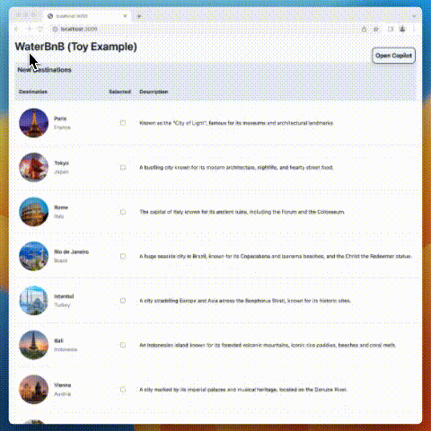

<div align="center">
  
</div>

# CopilotKit🪁 [](https://discord.gg/6dffbvGU3D)

Add a powerful & hackable copilot to any app, in an afternoon.

## Demo

CopilotKit in action.



## Installation

```bash
pnpm install @copilotkit/react-core @copilotkit/react-ui
```

## Examples

### NEW! CopilotTextarea
```typescript
```


### Integrate copilot

```typescript
import "@copilotkit/react-ui/styles.css";
import { CopilotProvider } from "@copilotkit/react-core";
import { CopilotSidebarUIProvider } from "@copilotkit/react-ui";

export default function App(): JSX.Element {
  return (
    <CopilotProvider> {/* Global state & copilot logic. Put this around the entire app */}
      <CopilotSidebarUIProvider> {/* A built-in Copilot UI (or bring your own UI). Put around individual pages, or the entire app. */}

        <YourContent />

      </CopilotSidebarUIProvider>
    </CopilotProvider>
  );
}
```

### Give the copilot read permissions

```typescript
import { useMakeCopilotReadable } from "@copilotkit/react-core";


function Employee(props: EmployeeProps): JSX.Element {
  const { employeeData, copilotParentPointer } = props;

  // Give the copilot information about this employee, and associate it with its parent department.
  useMakeCopilotReadable(employeeData.description(), copilotParentPointer);

  return (
    // Render as usual...
  );
}

function Department(props: DepartmentProps): JSX.Element {
  const { departmentData, employees } = props;

  // Give the copilot information about this department. Keep the pointer, to associate employees w departments.
  const departmentCopilotPointer = useMakeCopilotReadable(departmentData.description());

  return ( // Render as usual.
    <>      
      {employees.map((employeeData) => (
        <Employee copilotParentPointer={departmentCopilotPointer} employeeData={employeeData} />
      ))}
    </>
  );
}

```

### Give the copilot write permissions

```typescript
import { useMakeCopilotActionable } from "@copilotkit/react-core";

function Department(props: DepartmentProps): JSX.Element {
  // ...

  // Let the copilot take action on behalf of the user.
  useMakeCopilotActionable(
    {
      name: "setEmployeesAsSelected",
      description: "Set the given employees as 'selected'",
      argumentAnnotations: [
        {
          name: "employeeIds",
          type: "array", items: { type: "string" }
          description: "The IDs of employees to set as selected",
          required: true
        }
      ],
      implementation: async (employeeIds) => setEmployeesAsSelected(employeeIds),
    },
    []
  );

  // ...
}
```


## Near-Term Roadmap

### 📊 Please vote on features via the Issues tab!

### Copilot-App Interaction

- ✅ `useMakeCopilotReadable`: give static information to the copilot, in sync with on-screen state
- ✅ `useMakeCopilotActionable`: Let the copilot take action on behalf of the user
- 🚧 `useMakeCopilotAskable`: let the copilot ask for additional information when needed (coming soon)
- 🚧 `useEditCopilotMessage`: edit the (unsent) typed user message to the copilot (coming soon)
- 🚧 copilot-assisted navigation: go to the best page to achieve some objective.

### UI components

- ✅ `<CopilotSidebarUIProvider>`: Built in, hackable Copilot UI (optional - you can bring your own UI).

### Integrations

- ✅ Vercel AI SDK
- ✅ OpenAI APIs
- 🚧 Langchain
- 🚧 Additional LLM providers

### Frameworks

- ✅ React
- 🚧 Vue
- 🚧 Svelte
- 🚧 Swift (Mac + iOS)

## Contribute

Contributions are welcome! 🎉

[Join the Discord](https://discord.gg/6dffbvGU3D)
[](https://discord.gg/6dffbvGU3D)
<!-- [](https://discord.gg/6dffbvGU3D) -->

