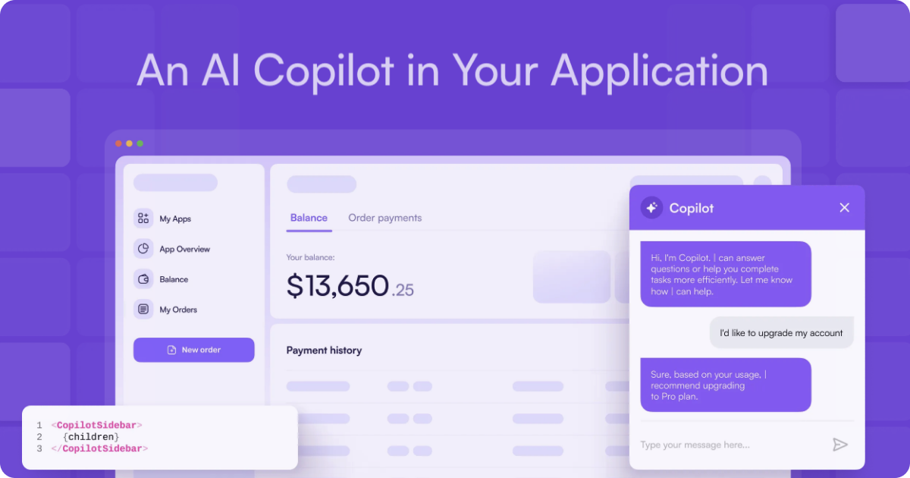

> Copilot Cloud v1 has been released! 🎉 [Read more about it here](https://ai88.substack.com/p/copilotkit-v1-launch).

<div align="center">
  <a href="https://copilotkit.ai" target="_blank">
    
  </a>

  <strong>
    CopilotKit is the open-source framework for integrating powerful AI Copilots into any application. Easily implement custom AI Chatbots, AI Agents, AI Textareas, and more.
  </strong>
</div>

<br/>

<div align="center">
  <a href="https://www.npmjs.com/package/@copilotkit/react-core" target="_blank">
    
  </a>
  
  <a href="https://discord.gg/6dffbvGU3D" target="_blank">
    
  </a>
</div>
<br/>
<div align="center">
  <a href="https://www.producthunt.com/posts/copilotkit" target="_blank">
    
  </a>
</div>

<br />

<div align="center">
  
</div>

<br />

<div>
<p>
  👉 Check out the docs at <a href="https://docs.copilotkit.ai?ref=github_readme" target="_blank">https://docs.copilotkit.ai</a>
</p>
</div>

## Table of Contents
- [Getting Started](#getting-started)
  - [Quickstart & Tutorials](#quickstart--tutorials)
  - [Examples & Starter Templates](#examples--starter-templates)
- [Building Blocks](#building-blocks)
  - [Components](#-components)
  - [Hooks](#-hooks)
- [Architecture](#architecture)
- [Contributing](#contributing)
- [Get in touch](#get-in-touch)
- [License](#license)

## Getting Started

### Quickstart & Tutorials

There are several easy ways to get started with CopilotKit:

- [**Quickstart: Chatbot:**](https://docs.copilotkit.ai/quickstart-chatbot?ref=github_readme) In just two minutes, add an AI Chatbot to your app with the ability to read application state and take actions.
- [**Tutorial: Todo List Copilot:**](https://docs.copilotkit.ai/tutorial-ai-todo-list-copilot/overview?ref=github_readme) For a better deep dive into CopilotKit, take a simple todo list app and supercharge it with an AI chat popup.
- [**Tutorial: Textarea Autocomplete:**](https://docs.copilotkit.ai/tutorial-textarea/overview?ref=github_readme) For a better deep dive into CopilotKit, we'll take a simple email client app and add an AI-powered textarea to it with autocompeltions and AI insertions/edits.

### Examples & Starter Templates
<div align="center">
<table align="center">
  <tr>
    <td align="center" valign="top">
      PowerPoint + Copilot <br/><br/>
      <a href="https://github.com/CopilotKit/demo-presentation">
        
      </a>
      <br/>
      <a href="https://github.com/CopilotKit/demo-presentation" target="_blank">View Source Code</a> 
    </td>
    <td align="center" valign="top">
      "Hello World" (A Todo App) <br/>
      <a href="https://github.com/CopilotKit/demo-todo">https://github.com/CopilotKit/demo-todo</a> <br/><br>
      <a href="https://github.com/CopilotKit/demo-todo">
        
      </a>
    </td>
    </tr>
    <tr>
    <td align="center" valign="top">
      Spreadsheets + Copilot <br/>
      <a href="https://github.com/CopilotKit/demo-spreadsheet">https://github.com/CopilotKit/demo-spreadsheet</a> <br/><br>
      <a href="https://github.com/CopilotKit/demo-spreadsheet">
        
      </a>
    </td>
    <td align="center" valign="top">
      PowerPoint + Copilot + Voice <br/>
      <a href="https://github.com/CopilotKit/demo-presentation-voice">https://github.com/CopilotKit/demo-presentation-voice</a> <br/><br>
      <a href="https://github.com/CopilotKit/demo-presentation-voice">
        
      </a>
    </td>
  </tr>
</table>
</div>

## Building Blocks

> 💡 Looking for more? Check out the [CopilotKit Documentation](https://docs.copilotkit.ai?ref=github_readme).

### 🧩 Components

<table>
  <tbody>
    <tr>
      <td>
        <a href="https://docs.copilotkit.ai/reference/components/CopilotTextarea?ref=github_readme">
          <code>CopilotTextarea</code>
        </a>
      </td>
      <td>An AI-powered textarea with autocompletions and AI-powered insertions/edits.</td>
    </tr>
    <tr>
      <td>
        <a href="https://docs.copilotkit.ai/reference/components/CopilotPopup?ref=github_readme">
          <code>CopilotPopup</code>
        </a>
      </td>
      <td>AI-powered chat floating chat popup component.</td>
    </tr>
    <tr>
      <td>
        <a href="https://docs.copilotkit.ai/reference/components/CopilotSidebar?ref=github_readme">
          <code>CopilotSidebar</code>
        </a>
      </td>
      <td>AI-powered chat sidebar component.</td>
    </tr>
    <tr>
      <td>
        <a href="https://docs.copilotkit.ai/reference/components/CopilotChat?ref=github_readme">
          <code>CopilotChat</code>
        </a>
      </td>
      <td>AI-powered plain chat component.</td>
    </tr>
  </tbody>
</table>

### ⚡️ Hooks

<table>
  <tbody>
    <tr>
      <td>
        <a href="https://docs.copilotkit.ai/reference/hooks/useCopilotReadable?ref=github_readme">
          <code>useCopilotReadable</code>
        </a>
      </td>
      <td>Provide in-app state and any other information to your Copilot.</td>
    </tr>
    <tr>
      <td>
        <a href="https://docs.copilotkit.ai/reference/hooks/useCopilotAction?ref=github_readme">
          <code> useCopilotAction</code>
        </a>
      </td>
      <td>
        Enable your Copilot to perform actions and render custom-generated UI in the chat.
      </td>
    </tr>
    <tr>
      <td>
        <a href="https://docs.copilotkit.ai/reference/hooks/useCopilotChat?ref=github_readme">
          <code>useCopilotChat</code>
        </a>
      </td>
      <td>
        Directly interact with the Copilot chat instance to add messages and manipulate the chat history.
      </td>
    </tr>
    <tr>
      <td>
        <a href="https://docs.copilotkit.ai/reference/hooks/useCopilotChatSuggestions?ref=github_readme">
          <code>useCopilotChatSuggestions</code>
        </a>
      </td>
      <td>
        Integrate AI-powered chat follow-up suggestions that are aware of your app's state and chat history.
      </td>
    </tr>
  </tbody>
</table>

## Architecture

Architecture goes here

## Contributing

Thanks for your interest in contributing to CopilotKit! 💜

We value all contributions, whether it's through code, documentation, creating demo apps, or just spreading the word.

Here are a few useful resources to help you get started:

- For code contributions, [check out the contribution guide](https://docs.copilotkit.ai/code-contributions/how-to-contribute?ref=github_readme).
- For documentation-related contributions, [check out the documentation Contributions guide](https://docs.copilotkit.ai/code-contributions/how-to-contribute?ref=github_readme).
- Want to contribute but not sure how? [Join our Discord](https://discord.gg/6dffbvGU3D) and we'll help you out!


> 💡 **NOTE:** All contributions must be submitted via a pull request and be reviewed by our team. This is to ensure that all contributions are of high quality and align with the project's goals.


## Get in touch

Get in touch goes here

## License

License goes here

## Components

🌟 **\<CopilotChat />:** <br />
Build **app-aware AI chatbots** that can "see" the current app state + take action inside your app. <br />
The AI chatbot can talk to your app frontend & backend, and to 3rd party services (Salesforce, Dropbox, etc.) via plugins. <br />
Supports generative UI. Start in seconds:

🌟 **\<CopilotTextarea />:** <br />
Drop-in replacement for any `<textarea />.` AI-assisted text generation. <br />
Autocompletions + AI editing + generate from scratch. Grounded on your users' data and Copilot application context.<br/>
Simply change `textarea` to `CopilotTextarea`.

🌟 **In-App Agents (powered by LangChain):** <br />
Give agents access to realtime application context, and let agents take action inside applications.

🌟 **Co-Agents (powered by LangChain. Coming soon.):** <br />
Allow end-users to observe and intervene in an in-app agent’s operations, with native application UX.
End users can **_correct_** mistakes in intermediate steps if any were made, and **restart agent operation from that point onwards**.

## How does it work

**Define the following simple entry-points** into your application, and the CopilotKit🪁 execution engine takes care of the rest!

- **Application state** (frontend + backend + 3rd party)
- **Application interaction** (via plain typescript code, frontend + backend)
- **Purpose-specific LLM chains**
- and more.

## Installation

```bash
npm i @copilotkit/react-core @copilotkit/react-ui @copilotkit/react-textarea
```

## Getting started

See quickstart in the [docs](https://docs.copilotkit.ai)

## Demo

**3-min showcase + 3-min implementation tutorial:**

[CopilotKit_Demo_Jan_zjgjk0.webm](https://github.com/CopilotKit/CopilotKit/assets/746397/b1749282-a3e4-4ef4-a780-7d03f30edf5b)

## Building blocks

A more comprehensive and up-to-date overview is available in the [docs](https://docs.copilotkit.ai). <br/>
But roughly:

### Copilot entrypoints

- ✅ `useCopilotReadable`: give frontend state to the copilot
- ✅ `useMakeCopilotDocumentReadable`: give document state to the copilot, especially useful with 3rd party state (e.g. Gong call transcript).
- ✅ `useCopilotAction`: frontend application interaction
- ✅ `CopilotRuntime`: server side runtime
- 🚧 `useCopilotChain`: provide usecase-specific LLM chains

### Built-in UI components

- ✅ `<CopilotSidebar>`: Built in, hackable Copilot UI (optional - you can bring your own UI).
- ✅ `<CopilotPopup>`: Built in popup UI.
- ✅ `<CopilotChat>`: Standalone chat UI
- ✅ `<CopilotTextarea />`: drop-in `<textarea />` replacement with Copilot autocompletions.
- ✅ `useCopilotChat()` for fully-custom UI component
- 🚧 use custom UX elements inside the chat (coming soon)

## Examples

### `<CopilotSidebar />`

```typescript
import "@copilotkit/react-ui/styles.css"; // add to the app-global css
import { CopilotKit } from "@copilotkit/react-core";
import { CopilotSidebar } from "@copilotkit/react-ui";

function MyAmazingContent() {
  const importantInfo = useImportantInfo();
  useCopilotReadable({
    description: "Very important information",
    value: importantInfo,
  });

  useCopilotAction(
    {
      name: `selectDestinations_${toCamelCase(heading)}`,
      description: `Set the given destinations as 'selected', on the ${heading} table`,
      parameters: [
        {
          name: "destinationNames",
          type: "string[]",
          description: "The names of the destinations to select",
          required: true,
        },
      ],
      handler: async ({ destinationNames }) => {
        setCheckedRows((prevState) => {
          const newState = { ...prevState };
          destinationNames.forEach((destinationName) => {
            newState[destinationName] = true;
          });
          return newState;
        });
      },
    },
    []
  );

  return <YourContent />;
}

export default function App() {
  return (
    <CopilotKit url="/api/copilotkit/chat">
      {" "}
      {/* Global state & copilot logic. Put this around the entire app */}
      <CopilotSidebar>
        {" "}
        {/* A built-in Copilot UI (or bring your own UI). Put around individual pages, or the entire app. */}
        <MyAmazingContent />
      </CopilotSidebar>
    </CopilotKit>
  );
}
```

### `<CopilotTextarea />`

A drop-in <textarea /> replacement with autocompletions, AI insertions/edits, and generate-from-scratch. <br/>
Indexed on data provided to the Copilot.

<p align="center">
  
</p>

```typescript
import "@copilotkit/react-textarea/styles.css"; // add to the app-global css
import { CopilotTextarea } from "@copilotkit/react-textarea";
import { CopilotKit } from "@copilotkit/react-core";

// call ANYWHERE in your app to provide external context (make sure you wrap the app with a <CopilotKit >):
// See below for more features (parent/child hierarchy, categories, etc.)
useCopilotReadable({
  description: "The description of your data",
  value: relevantInformation,
});
useMakeCopilotDocumentReadable(document);

return (
  <CopilotKit url="/api/copilotkit/chat">
    {" "}
    {/* Global state & copilot logic. Put this around the entire app */}
    <CopilotTextarea
      className="p-4 w-1/2 aspect-square font-bold text-3xl bg-slate-800 text-white rounded-lg resize-none"
      placeholder="A CopilotTextarea!"
      autosuggestionsConfig={{
        purposePrompt:
          "A COOL & SMOOTH announcement post about CopilotTextarea. Be brief. Be clear. Be cool.",
        forwardedParams: {
          // additional arguments to customize autocompletions
          max_tokens: 25,
          stop: ["\n", ".", ","],
        },
      }}
    />
  </CopilotKit>
);
```

## Near-Term Roadmap

### 📊 Please vote on features via the Issues tab!

### Copilot-App Interaction

- ✅ `useCopilotReadable`: give frontend state to the copilot
- ✅ `useMakeCopilotDocumentReadable`: give document state to the copilot, especially useful with 3rd party state (e.g. Gong call transcript)
- ✅ `useCopilotAction`: Let the copilot interact with the application
- 🚧 `useMakeCopilotAskable`: let the copilot ask for additional information when needed (coming soon)
- 🚧 `useCopilotChain`: provide usecase-specific chain
- 🚧 `useEditCopilotMessage`: edit the (unsent) typed user message to the copilot (coming soon)
- 🚧 copilot-assisted navigation: go to the best page to achieve some objective.
- 🚧 Copilot Cloud: From hosting, chat history, analytics, and evals, to automatic Copilot personalization and self-improvement.

### Integrations

- ✅ Vercel AI SDK
- ✅ OpenAI APIs
- 🚧 Langchain
- 🚧 Additional LLM providers

### Frameworks

- ✅ React
- 🚧 Vue
- 🚧 Svelte
- 🚧 Swift (Mac + iOS)

## Contribute

Contributions are welcome! 🎉

We have a dedicated [Contributing](https://docs.copilotkit.ai/contributing/how-to-contribute) section in our documentation with detailed guides on how to get started contributing to CopilotKit.

[Join the Discord](https://discord.gg/6dffbvGU3D)
[](https://discord.gg/6dffbvGU3D)

## Contact

atai `<at>` copilotkit.ai
