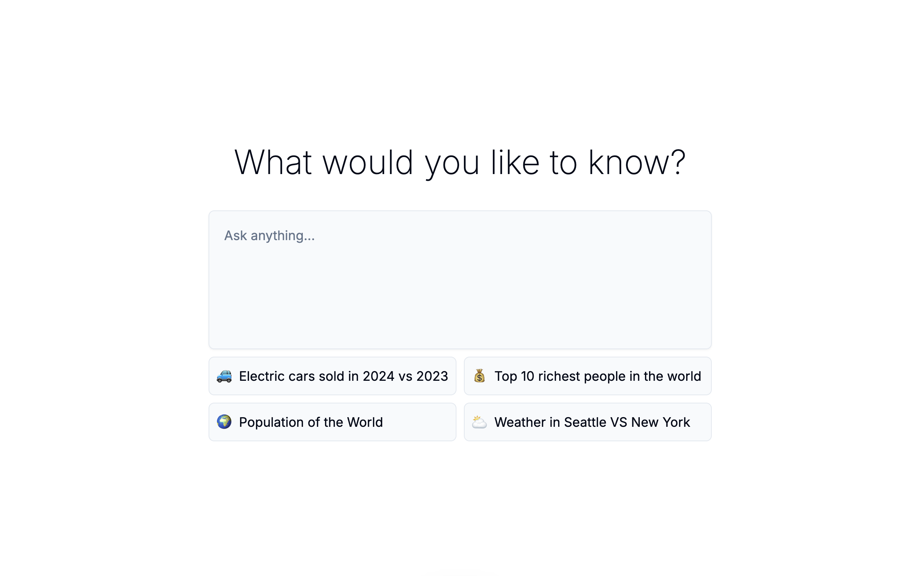
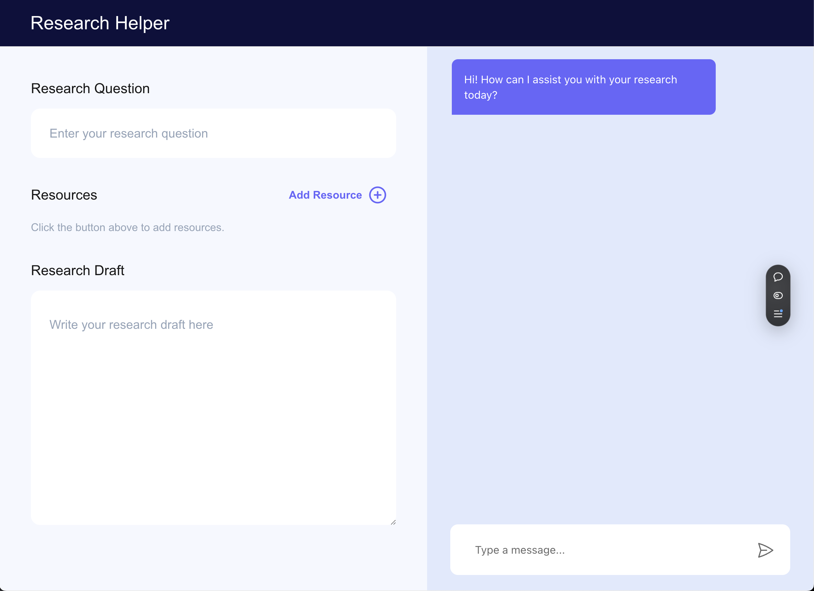

> Here for Hacktoberfest? 🎉 [Get started here :rocket: :confetti_ball:](https://github.com/CopilotKit/CopilotKit/tree/main/community/content).

  

   

  <strong>
    CopilotKit is the open-source framework for integrating powerful AI Copilots into any application. Easily implement custom AI Chatbots, AI Agents, AI Textareas, and more.
  </strong>

 

  
  
  

 

  
  
  

 

  

 

  

  

 

  👉 Check out the docs at <a href="https://docs.copilotkit.ai?ref=github_readme" target="_blank">https://docs.copilotkit.ai</a>

**Table of Contents**

- [Getting Started](#getting-started)
  - [Quickstart & Tutorials](#quickstart--tutorials)
  - [Examples & Starter Templates](#examples--starter-templates)
- [Building Blocks](#building-blocks)
  - [Components](#-components)
  - [Hooks](#-hooks)
- [Contributing](#contributing)
- [Get in touch](#get-in-touch)
- [License](#license)

## Getting Started

### Quickstart & Tutorials

There are several easy ways to get started with CopilotKit:

- [**Quickstart: Chatbot:**](https://docs.copilotkit.ai/quickstart?ref=github_readme) In just two minutes, add an AI Chatbot to your app with the ability to read application state and take actions.
- [**Tutorial: Todo List Copilot:**](https://docs.copilotkit.ai/tutorials/ai-todo-app/overview?ref=github_readme) For a deeper dive into CopilotKit, take a simple todo list app and supercharge it with an AI chat popup.
- [**Tutorial: Textarea Autocomplete:**](https://docs.copilotkit.ai/tutorials/ai-powered-textarea/overview?ref=github_readme) For a deeper dive into CopilotKit, we'll take a simple email client app and add an AI-powered textarea with autocompletions and AI insertions/edits.

### Examples & Starter Templates

<table align="center">
  <tr>
    <td align="center" valign="top">
      🕹️ PowerPoint Clone + Copilot 
      <a href="https://go.copilotkit.ai/GitHubPresentation">https://github.com/CopilotKit/demo-presentation</a>   
      <a href="https://go.copilotkit.ai/GitHubPresentation">
        
         
        <a href="https://go.copilotkit.ai/GitHubPresentationVoice">See example with voice control</a>
      </a>
    </td>
    <td align="center" valign="top">
      🕹️ Simple Todo App + Copilot  
      <a href="https://go.copilotkit.ai/GitHubToDo">https://github.com/CopilotKit/demo-todo</a>   
      
    </td>
  </tr>
  <tr>
    <td align="center" valign="top">
      🕹️ Spreadsheets + Copilot  
      <a href="https://go.copilotkit.ai/GitHubSpreadsheet">https://github.com/CopilotKit/demo-spreadsheet</a>   
      
    </td>
    <td align="center" valign="top">
      🕹️ Banking App + Copilot 
      <a href="https://github.com/CopilotKit/demo-banking">https://github.com/CopilotKit/demo-banking</a>   
      
    </td>
  </tr>
  <tr>
    <td align="center" valign="top">
      🕹️ CoAgents (LangGraph) Perplexity Clone 
      <a href="https://go.copilotkit.ai/coagents-perplexity-clone">https://github.com/CopilotKit/CopilotKit/examples/coagents-ai-researcher</a>   
      
    </td>
    <td align="center" valign="top">
      🕹️ CoAgents (LangGraph) Research Canvas Demo 
      <a href="https://go.copilotkit.ai/coagents-research-canvas">https://github.com/CopilotKit/CopilotKit/examples/coagents-research-canvas</a>   
      
    </td>
  </tr>
</table>

## Building Blocks

> 💡 Want to learn more? Check out the [CopilotKit Documentation](https://docs.copilotkit.ai?ref=github_readme).

### 🧩 Components

- [**`<CopilotTextarea />`**](https://docs.copilotkit.ai/reference/components/CopilotTextarea?ref=github_readme): An AI-powered textarea with autocompletions and AI-powered insertions/edits.
- [**`<CopilotPopup />`**](https://docs.copilotkit.ai/reference/components/chat/CopilotPopup?ref=github_readme): AI-powered floating chat popup component.
- [**`<CopilotSidebar />`**](https://docs.copilotkit.ai/reference/components/chat/CopilotSidebar?ref=github_readme): AI-powered chat sidebar component.
- [**`<CopilotChat />`**](https://docs.copilotkit.ai/reference/components/chat/CopilotChat?ref=github_readme): AI-powered plain chat component.

### 👨🏻‍💻 Languages and Tools:

           

### ⚡️ Hooks

- [**`useCopilotReadable`**](https://docs.copilotkit.ai/reference/hooks/useCopilotReadable?ref=github_readme): Provide in-app state and any other information to your Copilot.
- [**`useCopilotAction`**](https://docs.copilotkit.ai/reference/hooks/useCopilotAction?ref=github_readme): Enable your Copilot to perform actions and render custom-generated UI in the chat.
- [**`useCopilotChat`**](https://docs.copilotkit.ai/reference/hooks/useCopilotChat?ref=github_readme): Directly interact with the Copilot chat instance to add messages and manipulate the chat history.
- [**`useCopilotChatSuggestions`**](https://docs.copilotkit.ai/reference/hooks/useCopilotChatSuggestions?ref=github_readme): Integrate AI-powered chat follow-up suggestions that are aware of your app's state and chat history.

## Contributing

Thanks for your interest in contributing to CopilotKit! 💜

We value all contributions, whether it's through code, documentation, creating demo apps, or just spreading the word.

Here are a few useful resources to help you get started:

- For code contributions, [check out the contribution guide](https://docs.copilotkit.ai/contributing/code-contributions?ref=github_readme).
- For documentation-related contributions, [check out the documentation contributions guide](https://docs.copilotkit.ai/contributing/docs-contributions?ref=github_readme).
- Want to contribute but not sure how? [Join our Discord](https://discord.gg/6dffbvGU3D) and we'll help you out!

> 💡 **NOTE:** All contributions must be submitted via a pull request and be reviewed by our team. This is to ensure that all contributions are of high quality and align with the project's goals.

## Get in touch

You are welcome to join our [Discord](https://discord.gg/6dffbvGU3D) and chat with our team and other community members.

Additionally, you can reach out to us at [hello@copilotkit.ai](mailto:hello@copilotkit.ai).

## License

This repository's source code is available under the [MIT License](https://github.com/CopilotKit/CopilotKit/blob/main/LICENSE).
