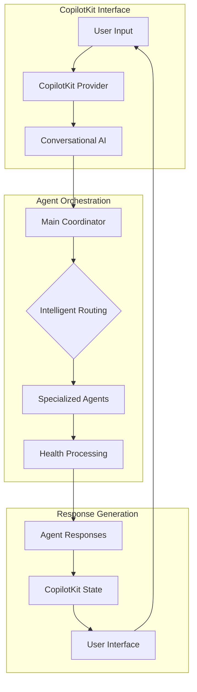

# FemTracker Agent - AI-Powered Women's Health Companion

## 2. Use Case 
FemTracker Agent is an innovative AI-powered women's health tracking platform that leverages cutting-edge multi-agent technology to provide personalized health insights, cycle predictions, and comprehensive wellness monitoring. The system features 8 specialized AI agents that work together to deliver intelligent health assistance, real-time analytics, and WHO-standard health scoring.

**Key Problems Solved:**
- Complex health data tracking and pattern recognition across multiple health domains
- Lack of personalized, AI-driven health insights and recommendations for women's health
- Fragmented health management between cycle tracking, fertility, nutrition, and fitness
- Limited conversational AI assistance for women's health-specific concerns
- Need for intelligent coordination and orchestration of specialized health agents

## 3. Technologies Used 
**Frontend Stack:**
- Next.js 15 (App Router)
- React 19
- TypeScript 5
- CopilotKit (AI Integration & Conversational Interface)
- TailwindCSS + Custom Design System
- Radix UI Components
- Framer Motion

**Backend & AI Stack:**
- Python 3.12
- LangGraph (AI Agent Orchestration)
- OpenAI GPT-4
- Supabase PostgreSQL
- Redis (Performance Optimization)
- Vercel Blob Storage

**Specialized AI Agents:**
- Main Coordinator Agent (CopilotKit Integration)
- Cycle Tracker Agent
- Fertility Tracker Agent
- Symptom Mood Agent
- Nutrition Guide Agent
- Exercise Coach Agent
- Lifestyle Manager Agent
- Health Insights Agent

## 4. GitHub + YouTube

- [x] GitHub Repo:
https://github.com/ChanMeng666/femtracker-agent

- [x] Deployed Demo:
https://femtracker-agent.vercel.app/

- [x] YouTube: 
https://youtu.be/VVCQKmeEtRs?si=j74lzM_UfeACgYKu

Note: Include a screenshot of your demo in action


## 6. Who Are You?

**Chan Meng** - AI & Healthcare Technology Developer

**LinkedIn**: [chanmeng666](https://www.linkedin.com/in/chanmeng666/)

## ⭐️ Project README with installation and getting started steps ⭐️👇

<div align="center">

# 🌸 FemTracker Agent
### AI-Powered Women's Health Companion

An innovative women's health tracking platform that leverages cutting-edge AI multi-agent technology to provide personalized health insights, cycle predictions, and comprehensive wellness monitoring.

**Built with CopilotKit for seamless conversational AI experience**

[🚀 Live Demo](https://femtracker-agent.vercel.app/) · [📖 Documentation](https://github.com/ChanMeng666/femtracker-agent) · [🐛 Issues](https://github.com/ChanMeng666/femtracker-agent/issues)

</div>

## 🌟 Introduction

FemTracker Agent is a cutting-edge women's health companion that combines the power of AI multi-agent systems with comprehensive health tracking. Built with **CopilotKit integration**, it features 8 specialized AI agents that provide personalized health insights, cycle predictions, and wellness monitoring through natural language conversations.

## ✨ Key Features

### 🤖 CopilotKit-Powered Conversational AI
- **Natural Language Interface**: Seamless conversation with health AI agents
- **Intelligent Agent Coordination**: CopilotKit orchestrates 8 specialized health agents
- **Real-time AI Assistance**: Instant health guidance and recommendations
- **Context-Aware Responses**: AI understands your health history and patterns

### 📊 AI Multi-Agent Architecture
- **Main Coordinator Agent**: Routes queries to specialized agents via CopilotKit
- **Cycle Tracker Agent**: Menstrual cycle prediction and pattern analysis
- **Fertility Tracker Agent**: Ovulation prediction and conception guidance
- **Symptom Mood Agent**: Emotional health and symptom pattern recognition
- **Nutrition Guide Agent**: Personalized dietary recommendations
- **Exercise Coach Agent**: Cycle-aware fitness guidance
- **Lifestyle Manager Agent**: Sleep optimization and stress management
- **Health Insights Agent**: AI-powered analytics and correlation analysis

### 💎 Advanced Health Analytics
- **WHO-Standard Scoring**: Medical-grade health metrics (0-100 scores)
- **Predictive Insights**: AI-powered trend analysis and health forecasting
- **Correlation Analysis**: Identify patterns between lifestyle factors and health
- **Real-time Synchronization**: Live updates across all health modules

## 🚀 Getting Started

### Prerequisites

```bash
# Required
Node.js 18.0+
Python 3.12+
Supabase Account
OpenAI API Key

# Optional for enhanced performance
Redis
```

### Quick Installation

**1. Clone Repository**
```bash
git clone https://github.com/ChanMeng666/femtracker-agent.git
cd femtracker-agent
```

**2. Frontend Setup**
```bash
npm install
# or
pnpm install
```

**3. AI Agent Setup**
```bash
cd agent
python -m venv venv
source venv/bin/activate  # Windows: venv\Scripts\activate
pip install -r requirements.txt
```

### Environment Configuration

**Frontend (.env.local):**
```bash
# OpenAI Configuration
OPENAI_API_KEY=your_openai_api_key_here

# Supabase Configuration
NEXT_PUBLIC_SUPABASE_URL=your_supabase_project_url
NEXT_PUBLIC_SUPABASE_ANON_KEY=your_supabase_anon_key
SUPABASE_SERVICE_ROLE_KEY=your_supabase_service_role_key

# CopilotKit Agent Configuration
NEXT_PUBLIC_COPILOTKIT_AGENT_NAME=main_coordinator
NEXT_PUBLIC_COPILOTKIT_AGENT_DESCRIPTION="AI health companion with specialized agents for women's health tracking"

# Optional: Redis for Performance
REDIS_URL=your_redis_connection_string
```

**Backend (agent/.env):**
```bash
# OpenAI Configuration
OPENAI_API_KEY=your_openai_api_key_here
```

### Database Setup

Execute SQL files in your Supabase SQL Editor in order:
1. `database/1-database-setup.sql` - Core schema
2. `database/2-database-fix.sql` - RLS policies
3. `database/6-fertility-tables.sql` - Fertility tracking
4. `database/7-recipe-tables.sql` - Recipe management
5. Additional SQL files as needed

### Development Mode

**Terminal 1 - AI Agent System:**
```bash
cd agent
langgraph dev
```

**Terminal 2 - Frontend:**
```bash
npm run dev
```

**Access Application:**
- Frontend: http://localhost:3000
- AI Agent System: http://localhost:2024

## 🏗️ CopilotKit Integration Architecture

### Agent Coordination Flow



### CopilotKit Agent Configuration

```typescript
// src/app/api/copilotkit/route.ts
const agents = [
  {
    name: "main_coordinator",
    description: "Main health coordinator that routes requests to specialized agents",
    graph_id: "main_coordinator"
  },
  {
    name: "cycle_tracker", 
    description: "Specialized agent for menstrual cycle tracking and predictions",
    graph_id: "cycle_tracker"
  },
  // Additional specialized agents...
];
```

## 💬 Usage Examples

### Natural Language Health Conversations

**Cycle Tracking:**
```
User: "I think my period started today, can you help me track it?"
AI: "I'll help you track your period! Let me log that your cycle started today and update your predictions. Based on your history, your next period is likely around [date]. How is your flow today - light, medium, or heavy?"
```

**Fertility Monitoring:**
```
User: "Am I in my fertile window this week?"
AI: "Based on your cycle data, you're approaching your fertile window! Your predicted ovulation is in 2-3 days. I recommend tracking your BBT and cervical mucus for more accurate predictions. Would you like me to set up reminders?"
```

**Health Insights:**
```
User: "I've been feeling more tired lately, any patterns you notice?"
AI: "I've analyzed your recent data and noticed your fatigue tends to increase during the luteal phase of your cycle, which is normal. Your sleep quality has also decreased by 15% this week. Let me suggest some cycle-aware wellness strategies..."
```

## 🎯 Key Benefits

- **🤖 Conversational AI**: Natural language interaction via CopilotKit
- **🧠 Multi-Agent Intelligence**: 8 specialized agents for comprehensive health support
- **📊 Medical-Grade Analytics**: WHO-standard health scoring algorithms
- **🔒 Privacy-First**: Military-grade encryption for all health data
- **📱 Mobile-Optimized**: Progressive Web App with offline capabilities
- **⚡ High Performance**: 95+ Lighthouse score, Redis caching, real-time sync
- **🌐 Accessible**: WCAG 2.1 compliant for inclusive health tracking

## 🛳 Deployment

### Vercel (Frontend)
[](https://vercel.com/new/clone?repository-url=https%3A%2F%2Fgithub.com%2FChanMeng666%2Ffemtracker-agent)

### LangGraph Platform (AI Agents)
```bash
cd agent
langgraph up
```

### Manual Deployment
```bash
# Install Vercel CLI
npm i -g vercel

# Deploy frontend
vercel --prod

# Deploy AI agents
cd agent && langgraph up
```

## 🤝 Contributing

We welcome contributions to advance women's health technology:

1. **Fork the repository**
2. **Create feature branch** (`git checkout -b feature/health-improvement`)
3. **Follow development guidelines** (TypeScript, accessibility, medical accuracy)
4. **Add comprehensive tests** for health modules
5. **Submit pull request** with detailed description

**Contribution Areas:**
- 🤖 New AI agent capabilities
- 📊 Health analytics improvements
- 🎨 UI/UX enhancements
- 📚 Documentation and guides
- 🔒 Security and privacy features

## 📄 License

This project is licensed under the MIT License - see the [LICENSE](https://github.com/ChanMeng666/femtracker-agent/blob/main/LICENSE) file for details.

## 🙏 Acknowledgments

- **CopilotKit Team** for providing exceptional AI integration capabilities
- **LangGraph** for powerful agent orchestration framework
- **Supabase** for robust database and authentication services
- **WHO Guidelines** for health standard compliance
- **Open Source Community** for advancing women's health technology

## 🌟 Star History

If you find FemTracker Agent helpful, please consider giving it a star!

[](https://star-history.com/#ChanMeng666/femtracker-agent&Date)

---

<div align="center">
<strong>🌸 Empowering Women's Health Through AI Technology 💖</strong>
<br/>
<em>Built with CopilotKit • Pioneering the future of conversational healthcare</em>
<br/><br/>

⭐ **Star us on GitHub** • 🚀 **Try Live Demo** • 🤖 **Explore AI Agents** • 🤝 **Join Community**

**Made with ❤️ for women's health empowerment**
</div> 