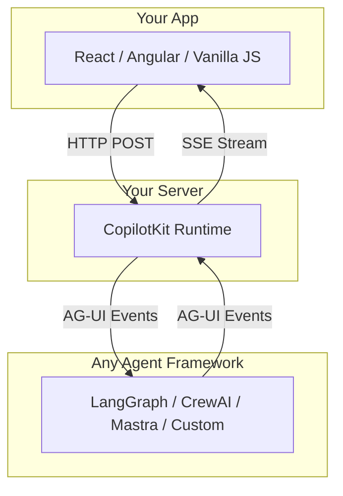
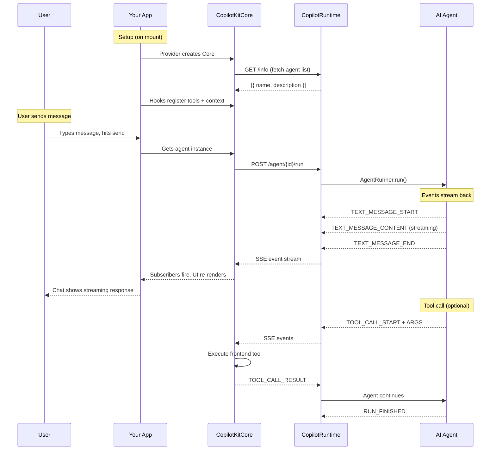
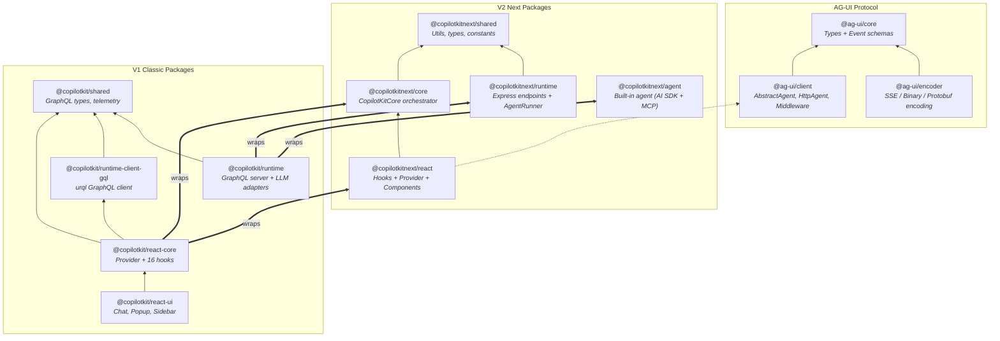
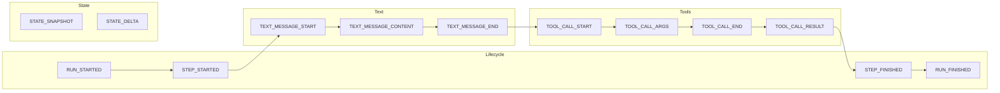

# CopilotKit Architecture Guide

CopilotKit lets you add AI agents to your app. You write hooks (React/Angular) or use the core API (vanilla JS), CopilotKit handles the rest — connecting your UI to any AI agent framework.

---

## The 30-Second Version



That's it. Your app talks to a runtime on your server. The runtime talks to an AI agent. They communicate using **AG-UI** — an event-based protocol (think: "text is streaming", "agent wants to call a tool", "state changed").

---

## The Three Layers

### Layer 1: Frontend (your app)

You use hooks/services to wire up your app — registering tools agents can call, providing context, and getting agent instances.

### Layer 2: Runtime (your server)

A few lines create the backend that receives requests from the frontend, runs agents, and streams events back.

### Layer 3: Agent (any framework)

The agent is anything that speaks AG-UI protocol. CopilotKit has integrations for 13+ frameworks, or you build your own.

---

## How a Message Flows Through the System



---

## Guides

| Guide                                      | What you'll learn                                       |
| ------------------------------------------ | ------------------------------------------------------- |
| [React Setup](setup-react.md)              | Provider, hooks, chat UI — full React integration       |
| [Angular Setup](setup-angular.md)          | DI tokens, services, signals — full Angular integration |
| [Vanilla JS Setup](setup-vanilla.md)       | CopilotKitCore API without any framework                |
| [Runtime / Backend](setup-runtime.md)      | Express/Hono endpoints, agents, runners, middleware     |
| [Multi-Agent Patterns](multi-agent.md)     | Multiple agents, routing, agent-specific tools          |
| [Pluggable Architecture](plugin-points.md) | Every optional extension point with diagrams            |

---

## Package Dependency Map



> **Why V1 + V2?** V2 is a rewrite with cleaner architecture. V1 wraps V2 so existing apps don't break. When you import `@copilotkit/react-core`, it internally uses `@copilotkitnext/core` and `@copilotkitnext/react`.

---

## AG-UI Protocol at a Glance

AG-UI is the communication contract between agents and UIs. Everything is an **event** streamed over SSE.



| Package          | Role                                     | Key exports                                                       |
| ---------------- | ---------------------------------------- | ----------------------------------------------------------------- |
| `@ag-ui/core`    | The contract — event types + data shapes | `EventType` enum, Zod schemas, `RunAgentInput`, `Message`, `Tool` |
| `@ag-ui/client`  | Client-side agent abstraction            | `AbstractAgent`, `HttpAgent`, `Middleware`, re-exports core       |
| `@ag-ui/encoder` | Serializes events for transport          | `EventEncoder` (SSE, binary, protobuf)                            |
| `@ag-ui/proto`   | Protobuf binary transport                | `encode()`, `decode()`                                            |

13+ framework integrations at `ag-ui/integrations/`: LangGraph, CrewAI, Mastra, Vercel AI SDK, Agno, AWS Strands, LlamaIndex, and more.

---

## Quick Reference

**"I want to..."** — here's where to look:

### Setup & Configuration

| Goal                             | Package                   | Key file / API                               |
| -------------------------------- | ------------------------- | -------------------------------------------- |
| Set up a React app               | `@copilotkit/react-core`  | `<CopilotKit runtimeUrl="...">` provider     |
| Set up an Angular app            | `@copilotkitnext/angular` | `provideCopilotKit({ runtimeUrl })` DI token |
| Set up vanilla JS                | `@copilotkitnext/core`    | `new CopilotKitCore({ runtimeUrl })`         |
| Set up the backend (Express)     | `@copilotkitnext/runtime` | `createCopilotEndpointExpress({ runtime })`  |
| Set up the backend (Hono)        | `@copilotkitnext/runtime` | `createCopilotEndpointHono({ runtime })`     |
| Configure authentication headers | Provider / Core config    | `headers: { Authorization: "Bearer ..." }`   |
| Forward cookies to runtime       | Provider / Core config    | `credentials: "include"`                     |

### Agent Communication

| Goal                            | Package                   | Key file / API                                 |
| ------------------------------- | ------------------------- | ---------------------------------------------- |
| Get an agent instance (React)   | `@copilotkitnext/react`   | `useAgent({ agentId })`                        |
| Get an agent instance (Angular) | `@copilotkitnext/angular` | `AgentStore` with signals                      |
| Get an agent instance (vanilla) | `@copilotkitnext/core`    | `copilotkit.getAgent(id)`                      |
| Run an agent                    | Core / hooks              | `copilotkit.runAgent({ agent })`               |
| Use multiple agents             | Runtime config            | `agents: { research: agent1, coding: agent2 }` |
| Agent-specific tools            | `useFrontendTool`         | `{ name, agentId: "specific-agent", handler }` |
| Shared context for all agents   | `useAgentContext`         | `useAgentContext("desc", value)`               |

### Tools & Interactivity

| Goal                            | Package                  | Key file / API                                   |
| ------------------------------- | ------------------------ | ------------------------------------------------ |
| Register a tool agents can call | `react-core` or `react`  | `useFrontendTool({ name, parameters, handler })` |
| Give agents context data        | `react-core` or `react`  | `useCopilotReadable()` / `useAgentContext()`     |
| Share state with an agent (V1)  | `@copilotkit/react-core` | `useCoAgent({ name, initialState })`             |
| Custom UI for tool execution    | Provider or hook         | `renderToolCalls` / `useRenderToolCall()`        |
| Require human approval          | Provider or hook         | `humanInTheLoop` / `useHumanInTheLoop()`         |
| Auto-generate suggestions       | Hook                     | `useConfigureSuggestions({ instructions })`      |
| Inject system instructions (V1) | `@copilotkit/react-core` | `useCopilotAdditionalInstructions()`             |

### UI Components

| Goal                   | Package                      | Component           |
| ---------------------- | ---------------------------- | ------------------- |
| Full chat interface    | `@copilotkit/react-ui`       | `<CopilotChat>`     |
| Floating popup chat    | `@copilotkit/react-ui`       | `<CopilotPopup>`    |
| Side panel chat        | `@copilotkit/react-ui`       | `<CopilotSidebar>`  |
| Inline panel chat      | `@copilotkit/react-ui`       | `<CopilotPanel>`    |
| AI text autocompletion | `@copilotkit/react-textarea` | `<CopilotTextarea>` |

### Backend & Runtime

| Goal                         | Package                         | Key file / API                                       |
| ---------------------------- | ------------------------------- | ---------------------------------------------------- |
| Custom agent runner          | `@copilotkitnext/runtime`       | Extend `AgentRunner` abstract class                  |
| Persistent agent state       | `@copilotkitnext/sqlite-runner` | `SQLiteAgentRunner`                                  |
| Request/response middleware  | `CopilotRuntime` options        | `beforeRequestMiddleware` / `afterRequestMiddleware` |
| Audio transcription          | `CopilotRuntime` options        | `transcriptionService`                               |
| Voice (speech-to-text / TTS) | `@copilotkit/voice`             | Voice services                                       |
| Build a custom agent         | `@copilotkit/sdk-js`            | LangGraph / LangChain helpers                        |

### Debugging & Internals

| Goal                             | Package                           | Key file / API                                                 |
| -------------------------------- | --------------------------------- | -------------------------------------------------------------- |
| Understand event types           | `@ag-ui/core`                     | `src/events.ts` — `EventType` enum                             |
| Understand the agent abstraction | `@ag-ui/client`                   | `src/agent/agent.ts` — `AbstractAgent`                         |
| See how an integration works     | `ag-ui/integrations/{framework}/` | Each extends `AbstractAgent`                                   |
| Understand the core orchestrator | `@copilotkitnext/core`            | `src/core/core.ts` — `CopilotKitCore`                          |
| Debug agent interactions         | `@copilotkitnext/web-inspector`   | Lit web component, enabled via `showDevConsole`                |
| Subscribe to lifecycle events    | Core API                          | `copilotkit.subscribe({ onError, onToolExecutionStart, ... })` |

---

## Monorepo Structure

```
cpk/
├── ag-ui/                          # AG-UI Protocol (open standard)
│   ├── sdks/typescript/packages/
│   │   ├── core/                   # @ag-ui/core — types + events
│   │   ├── client/                 # @ag-ui/client — AbstractAgent, HttpAgent
│   │   ├── encoder/                # @ag-ui/encoder — SSE/binary encoding
│   │   └── proto/                  # @ag-ui/proto — protobuf
│   └── integrations/               # 13+ framework adapters
│       ├── langgraph/
│       ├── crewai/
│       ├── mastra/
│       └── ...
│
└── CopilotKit/                     # CopilotKit Product
    └── packages/
        ├── v2/                     # "Next" — modern implementation
        │   ├── shared/             # @copilotkitnext/shared
        │   ├── core/               # @copilotkitnext/core — CopilotKitCore
        │   ├── react/              # @copilotkitnext/react — hooks + components
        │   ├── runtime/            # @copilotkitnext/runtime — Express/Hono server
        │   ├── agent/              # @copilotkitnext/agent — built-in agent
        │   ├── angular/            # @copilotkitnext/angular
        │   ├── web-inspector/      # @copilotkitnext/web-inspector
        │   └── sqlite-runner/      # @copilotkitnext/sqlite-runner
        │
        └── v1/                     # "Classic" — public API (wraps V2)
            ├── shared/             # @copilotkit/shared
            ├── react-core/         # @copilotkit/react-core
            ├── react-ui/           # @copilotkit/react-ui
            ├── react-textarea/     # @copilotkit/react-textarea
            ├── runtime/            # @copilotkit/runtime
            ├── runtime-client-gql/ # @copilotkit/runtime-client-gql
            └── sdk-js/             # @copilotkit/sdk-js
```
