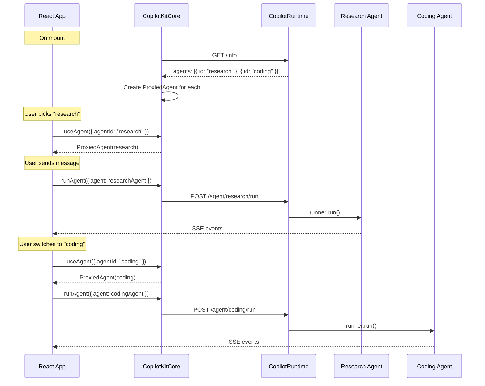
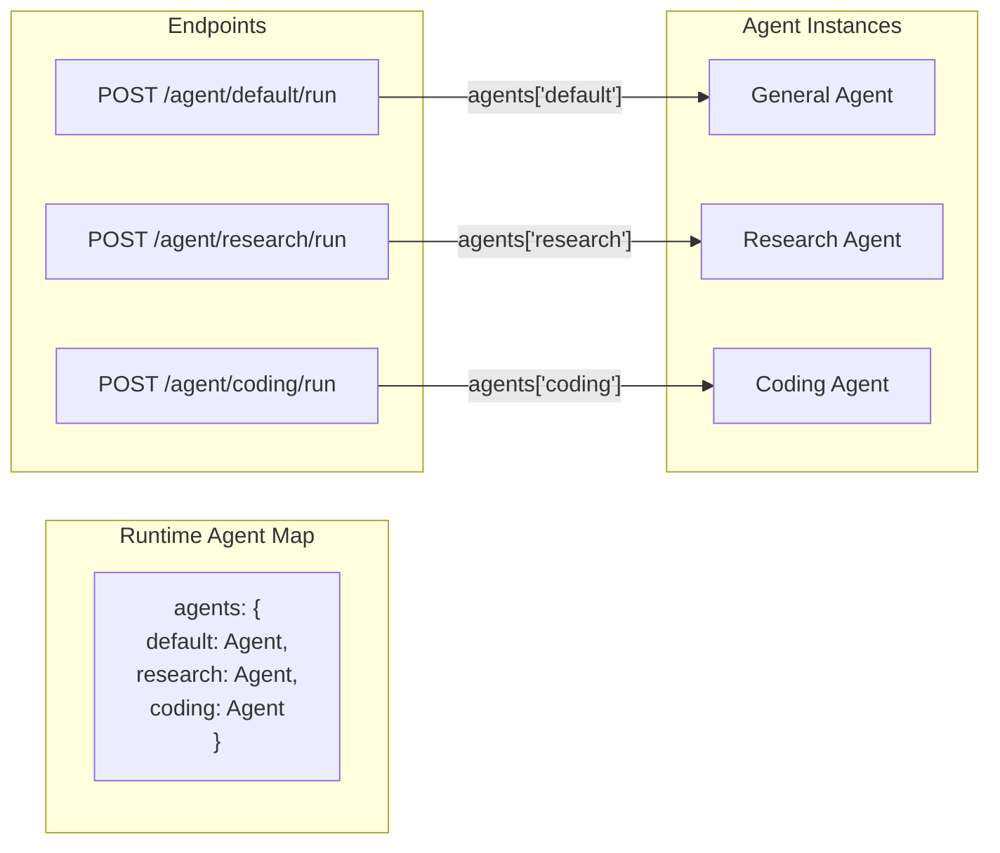
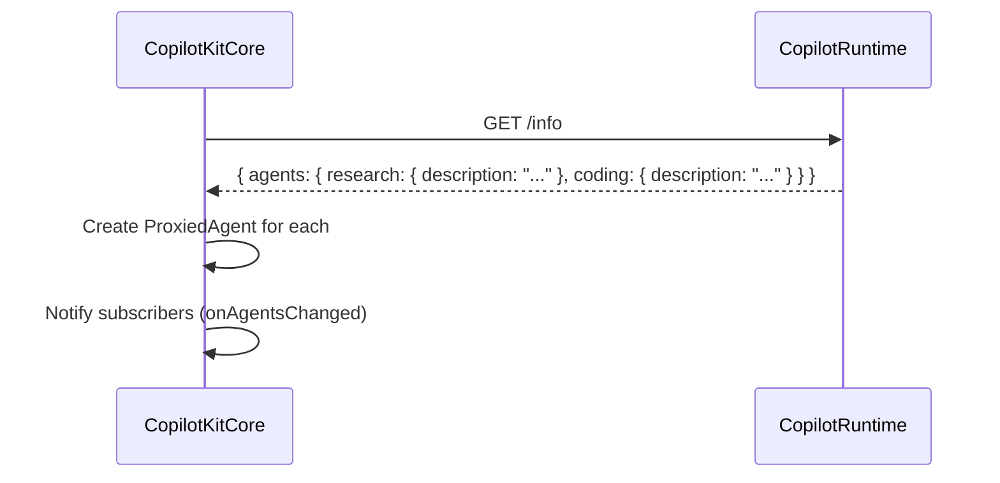
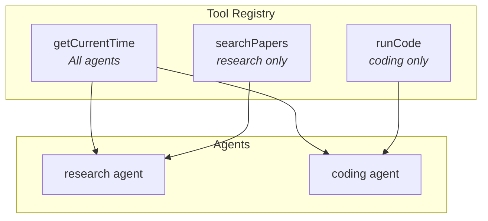
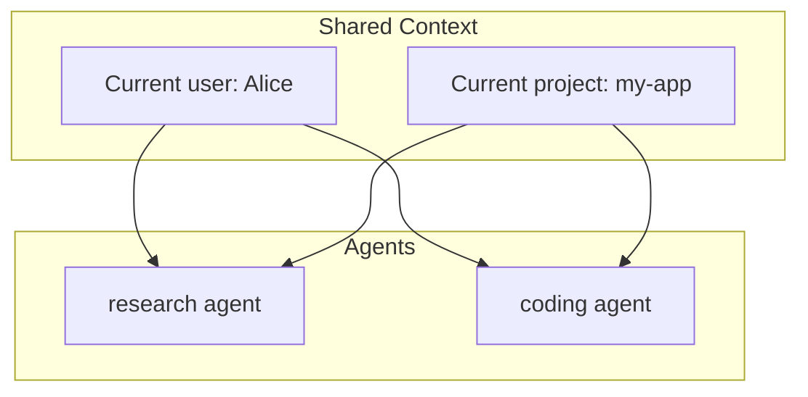
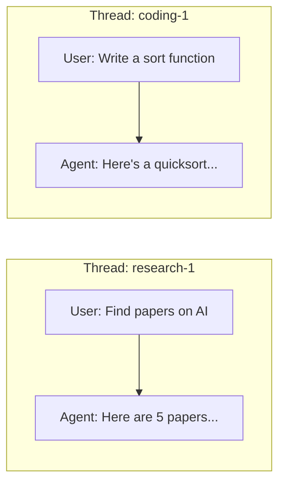

# Multi-Agent Patterns Guide

This guide shows how to use multiple agents in CopilotKit — from basic routing to agent-specific tools and shared context.

---

## How Multi-Agent Routing Works



---

## Backend: Register Multiple Agents

```typescript
import { CopilotRuntime } from "@copilotkitnext/runtime";
import { createCopilotEndpointExpress } from "@copilotkitnext/runtime/express";

const runtime = new CopilotRuntime({
  agents: {
    // Each key is the agent ID
    default: generalAgent, // Fallback agent
    research: researchAgent, // Specialist for research
    coding: codingAgent, // Specialist for code
    writing: writingAgent, // Specialist for content
  },
});

app.use("/api/copilotkit", createCopilotEndpointExpress({ runtime }));
```

The runtime exposes each agent at its own endpoint:

| Agent ID   | Run Endpoint               |
| ---------- | -------------------------- |
| `default`  | `POST /agent/default/run`  |
| `research` | `POST /agent/research/run` |
| `coding`   | `POST /agent/coding/run`   |
| `writing`  | `POST /agent/writing/run`  |



---

## Frontend: Select an Agent

### React

```tsx
import { useAgent } from "@copilotkitnext/react";

function ResearchPanel() {
  // Gets the "research" agent
  const { agent } = useAgent({ agentId: "research" });

  const sendMessage = async (text: string) => {
    agent.addMessage({ id: crypto.randomUUID(), role: "user", content: text });
    await copilotKit.runAgent({ agent });
  };

  return <div>{/* research UI */}</div>;
}

function CodingPanel() {
  // Gets the "coding" agent
  const { agent } = useAgent({ agentId: "coding" });
  // ...
}
```

### Using CopilotChat with agent IDs

```tsx
import { CopilotChat } from "@copilotkitnext/react";

function App() {
  return (
    <CopilotKitProvider runtimeUrl="/api/copilotkit">
      <div style={{ display: "flex" }}>
        {/* Two separate chats, each talking to a different agent */}
        <CopilotChat agentId="research" threadId="research-1" />
        <CopilotChat agentId="coding" threadId="coding-1" />
      </div>
    </CopilotKitProvider>
  );
}
```

### Angular

```typescript
@Component({
  /* ... */
})
export class MultiAgentComponent {
  private copilotKit = inject(CopilotKit);

  researchStore = this.copilotKit.getAgentStore("research");
  codingStore = this.copilotKit.getAgentStore("coding");
}
```

### Vanilla JS

```typescript
const researchAgent = copilotKit.getAgent("research");
const codingAgent = copilotKit.getAgent("coding");

// Each agent has its own messages, state, and thread
await copilotKit.runAgent({ agent: researchAgent });
await copilotKit.runAgent({ agent: codingAgent });
```

---

## The DEFAULT_AGENT_ID

When you don't specify an `agentId`, CopilotKit uses `"default"`:

```typescript
// These are equivalent:
useAgent(); // Uses "default"
useAgent({ agentId: "default" }); // Explicit

// Your backend must have a "default" agent:
const runtime = new CopilotRuntime({
  agents: {
    default: myAgent, // This is required if any component omits agentId
  },
});
```

---

## Agent Discovery

On mount, the frontend fetches available agents from the runtime:



You can react to agent changes:

```typescript
copilotKit.subscribe({
  onAgentsChanged: ({ agents }) => {
    console.log("Available agents:", Object.keys(agents));
    // e.g. ["default", "research", "coding"]
  },
});
```

---

## Agent-Specific Tools

Tools can be scoped to specific agents:

```tsx
// This tool is available to ALL agents
useFrontendTool({
  name: "getCurrentTime",
  handler: async () => new Date().toISOString(),
});

// This tool is ONLY available to the "research" agent
useFrontendTool({
  name: "searchPapers",
  agentId: "research",
  parameters: z.object({ query: z.string() }),
  handler: async ({ query }) => await searchPapers(query),
});

// This tool is ONLY available to the "coding" agent
useFrontendTool({
  name: "runCode",
  agentId: "coding",
  parameters: z.object({ code: z.string(), language: z.string() }),
  handler: async ({ code, language }) => await executeCode(code, language),
});
```



---

## Shared Context

Context is shared across all agents by default:

```tsx
function App() {
  // Both research and coding agents can see this
  useAgentContext("Current user", { name: "Alice", role: "developer" });
  useAgentContext("Current project", {
    name: "my-app",
    language: "TypeScript",
  });

  return (
    <>
      <CopilotChat agentId="research" />
      <CopilotChat agentId="coding" />
    </>
  );
}
```



---

## Thread Isolation

Each agent conversation runs on its own thread:

```tsx
// These are separate conversations with separate histories
<CopilotChat agentId="research" threadId="research-thread-1" />
<CopilotChat agentId="coding" threadId="coding-thread-1" />
```



Each thread maintains its own:

- Message history
- Agent state
- Running status

---

## Full Example: Multi-Agent Dashboard

### Backend

```typescript
import { CopilotRuntime } from "@copilotkitnext/runtime";
import { createCopilotEndpointExpress } from "@copilotkitnext/runtime/express";
import { BuiltInAgent } from "@copilotkitnext/agent";

const agents = {
  default: new BuiltInAgent({
    model: "openai/gpt-4o",
    systemPrompt: "You are a general assistant.",
  }),
  research: new BuiltInAgent({
    model: "openai/gpt-4o",
    systemPrompt:
      "You are a research specialist. Search for papers and summarize findings.",
  }),
  coding: new BuiltInAgent({
    model: "openai/gpt-4o",
    systemPrompt: "You are a coding expert. Write clean, tested code.",
  }),
};

const runtime = new CopilotRuntime({ agents });
app.use("/api/copilotkit", createCopilotEndpointExpress({ runtime }));
```

### Frontend (React)

```tsx
import {
  CopilotKitProvider,
  CopilotChat,
  useAgent,
  useFrontendTool,
  useAgentContext,
} from "@copilotkitnext/react";
import { z } from "zod";

export default function App() {
  return (
    <CopilotKitProvider runtimeUrl="/api/copilotkit">
      <SharedContext />
      <div style={{ display: "grid", gridTemplateColumns: "1fr 1fr" }}>
        <ResearchPanel />
        <CodingPanel />
      </div>
    </CopilotKitProvider>
  );
}

// Shared context — all agents see this
function SharedContext() {
  useAgentContext("Current project", {
    name: "my-saas-app",
    stack: "React + Node.js + PostgreSQL",
    description: "A SaaS platform for team collaboration",
  });
  return null;
}

// Research agent with its own tools
function ResearchPanel() {
  useFrontendTool({
    name: "saveFindings",
    agentId: "research",
    description: "Save research findings to the knowledge base",
    parameters: z.object({
      title: z.string(),
      summary: z.string(),
      sources: z.array(z.string()),
    }),
    handler: async ({ title, summary, sources }) => {
      await knowledgeBase.save({ title, summary, sources });
      return "Saved to knowledge base";
    },
  });

  return (
    <div>
      <h2>Research Assistant</h2>
      <CopilotChat agentId="research" />
    </div>
  );
}

// Coding agent with its own tools
function CodingPanel() {
  useFrontendTool({
    name: "createFile",
    agentId: "coding",
    description: "Create a new file in the project",
    parameters: z.object({
      path: z.string(),
      content: z.string(),
    }),
    handler: async ({ path, content }) => {
      await fileSystem.write(path, content);
      return `Created ${path}`;
    },
  });

  return (
    <div>
      <h2>Coding Assistant</h2>
      <CopilotChat agentId="coding" />
    </div>
  );
}
```
