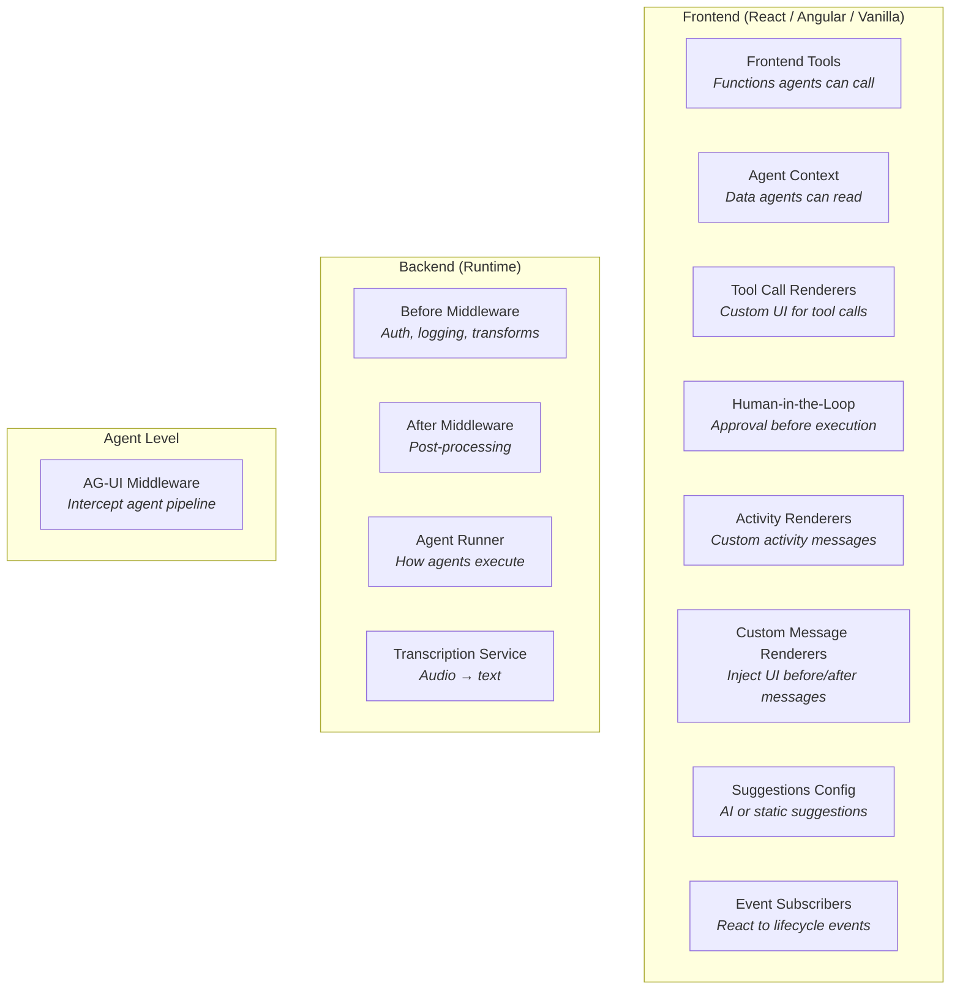
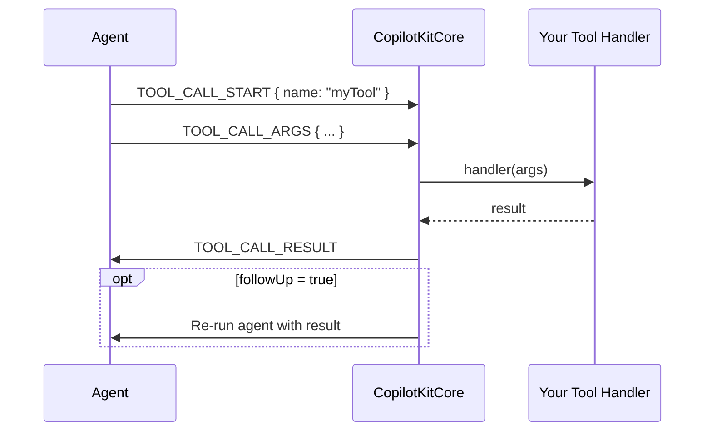
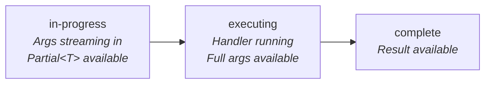
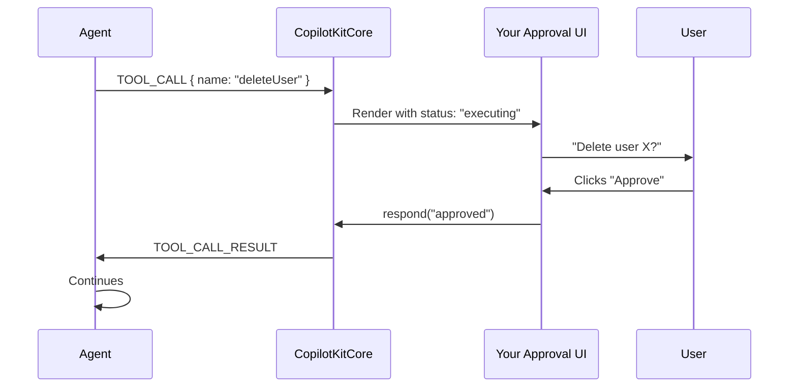
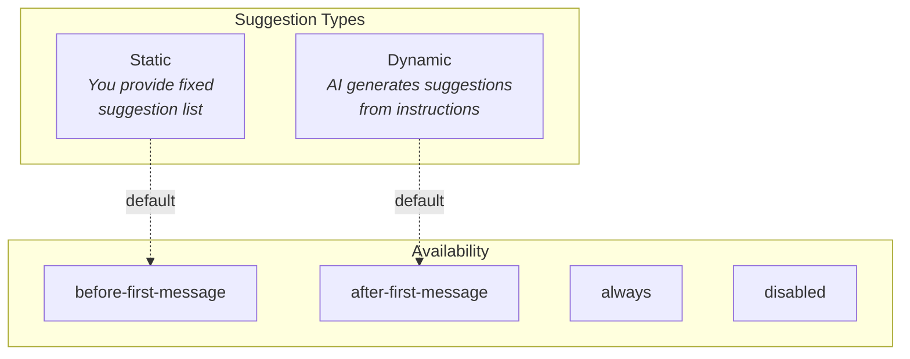
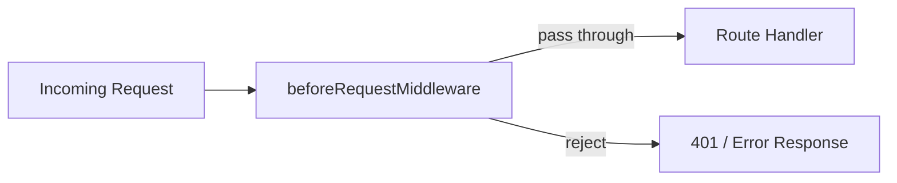
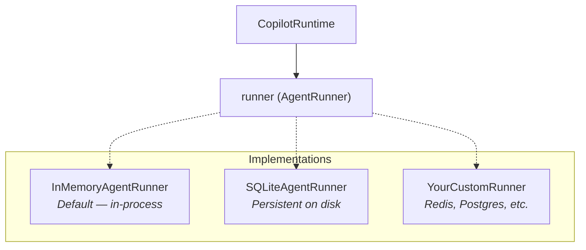
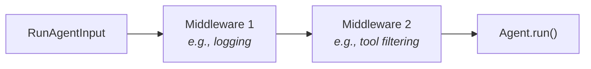
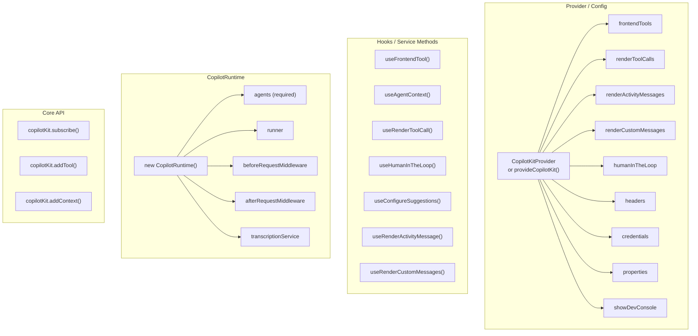

# Pluggable Architecture Guide

CopilotKit is built around extension points. Almost everything is optional and replaceable. This guide catalogs **every** pluggable part, where it's configured, and what happens when you don't provide it.

---

## Overview: All Extension Points



---

## Frontend Extension Points

### 1. Frontend Tools

**What:** Functions in your app that agents can call during a conversation.

**Where configured:**

- React: `useFrontendTool()` hook or `frontendTools` provider prop
- Angular: `copilotKit.addTool()` or `tools` in config
- Vanilla: `copilotKit.addTool()`

**Default when not provided:** No tools — agent can only send text messages.

```typescript
// Type signature
type FrontendTool<T> = {
  name: string;
  description?: string;
  parameters?: z.ZodType<T>;
  handler?: (args: T, context: FrontendToolHandlerContext) => Promise<unknown>;
  followUp?: boolean; // Re-run agent after tool completes
  agentId?: string; // Scope to specific agent
};
```



---

### 2. Agent Context

**What:** JSON data that gets sent to agents as context (like "the user is on the settings page").

**Where configured:**

- React: `useAgentContext()` hook
- Angular / Vanilla: `copilotKit.addContext()` / `removeContext()`

**Default when not provided:** No extra context — agent only sees messages and tool definitions.

```typescript
type AgentContextInput = {
  description: string; // Human-readable label
  value: JsonSerializable; // Any JSON value
};
```

---

### 3. Tool Call Renderers

**What:** Custom React components that render while a tool is being called — showing progress, args, and results.

**Where configured:**

- React: `useRenderToolCall()` hook or `renderToolCalls` provider prop
- Angular: `renderToolCalls` in config

**Default when not provided:** Generic built-in rendering.

```typescript
type ReactToolCallRenderer<T> = {
  name: string; // Tool name to render
  args: z.ZodSchema<T>; // Schema for type-safe args
  agentId?: string; // Scope to specific agent
  render: React.ComponentType<
    | { status: "in-progress"; args: Partial<T>; result: undefined }
    | { status: "executing"; args: T; result: undefined }
    | { status: "complete"; args: T; result: string }
  >;
};
```



---

### 4. Human-in-the-Loop

**What:** Tools that pause and wait for user input before continuing. The user sees a custom UI with approve/deny buttons.

**Where configured:**

- React: `useHumanInTheLoop()` hook or `humanInTheLoop` provider prop
- Angular: `humanInTheLoop` in config

**Default when not provided:** No approval required — tools execute immediately.

```typescript
type ReactHumanInTheLoop<T> = Omit<FrontendTool<T>, "handler"> & {
  render: React.ComponentType<{
    args: T;
    status: "in-progress" | "executing" | "complete";
    respond: (result: unknown) => Promise<void>; // Call this to approve/deny
  }>;
};
```



---

### 5. Activity Message Renderers

**What:** Custom UI for structured activity messages (non-chat messages like progress indicators or MCP app outputs).

**Where configured:**

- React: `useRenderActivityMessage()` hook or `renderActivityMessages` provider prop

**Default when not provided:** Built-in MCP Apps renderer is included. Other activity types show generic display.

```typescript
type ReactActivityMessageRenderer<T> = {
  activityType: string; // Use "*" for wildcard
  agentId?: string;
  content: z.ZodSchema<T>;
  render: React.ComponentType<{
    activityType: string;
    content: T;
    message: ActivityMessage;
    agent: AbstractAgent | undefined;
  }>;
};
```

---

### 6. Custom Message Renderers

**What:** Inject custom UI before or after specific messages (e.g., add a "copy" button, show state snapshots).

**Where configured:**

- React: `useRenderCustomMessages()` hook or `renderCustomMessages` provider prop

**Default when not provided:** No custom rendering — standard message display.

```typescript
type ReactCustomMessageRenderer = {
  agentId?: string;
  render: React.ComponentType<{
    message: Message;
    position: "before" | "after";
    runId: string;
    messageIndex: number;
    agentId: string;
    stateSnapshot: any;
  }> | null;
};
```

---

### 7. Suggestions Configuration

**What:** Configure AI-generated or static prompt suggestions shown to users.

**Where configured:**

- React: `useConfigureSuggestions()` hook
- Core: `suggestionsConfig` in config

**Default when not provided:** No suggestions.

```typescript
// AI-generated suggestions
type DynamicSuggestionsConfig = {
  instructions: string; // What to suggest
  minSuggestions?: number; // Default: 1
  maxSuggestions?: number; // Default: 3
  available?: SuggestionAvailability; // When to show
  providerAgentId?: string; // Which agent generates them
  consumerAgentId?: string; // Which agent receives them ("*" = all)
};

// Static suggestions
type StaticSuggestionsConfig = {
  suggestions: Array<{ title: string; message: string }>;
  available?: SuggestionAvailability;
  consumerAgentId?: string;
};

type SuggestionAvailability =
  | "before-first-message" // Default for static
  | "after-first-message" // Default for dynamic
  | "always"
  | "disabled";
```



---

### 8. Event Subscribers

**What:** Listen to lifecycle events — connection status, tool execution, agent changes, errors.

**Where configured:**

- Any: `copilotKit.subscribe(subscriber)`
- Returns: `{ unsubscribe() }` for cleanup

**Default when not provided:** No listeners — events still fire internally.

```typescript
type CopilotKitCoreSubscriber = {
  onRuntimeConnectionStatusChanged?: (event) => void;
  onToolExecutionStart?: (event) => void;
  onToolExecutionEnd?: (event) => void;
  onAgentsChanged?: (event) => void;
  onContextChanged?: (event) => void;
  onSuggestionsChanged?: (event) => void;
  onSuggestionsStartedLoading?: (event) => void;
  onSuggestionsFinishedLoading?: (event) => void;
  onPropertiesChanged?: (event) => void;
  onHeadersChanged?: (event) => void;
  onError?: (event) => void;
};
```

---

## Backend Extension Points

### 9. Before Request Middleware

**What:** Intercept HTTP requests before they reach the handler. Use for auth, logging, request transformation.

**Where configured:** `CopilotRuntime` constructor — `beforeRequestMiddleware`

**Default when not provided:** Requests pass through unchanged.

```typescript
type BeforeRequestMiddleware = (params: {
  runtime: CopilotRuntime;
  request: Request;
  path: string;
}) => MaybePromise<Request | void>;
// Return modified Request, or void to pass through
// Return a Response to short-circuit (e.g., 401)
```



---

### 10. After Request Middleware

**What:** Run code after the response is prepared. Use for logging, metrics, cleanup.

**Where configured:** `CopilotRuntime` constructor — `afterRequestMiddleware`

**Default when not provided:** No post-processing.

```typescript
type AfterRequestMiddleware = (params: {
  runtime: CopilotRuntime;
  response: Response;
  path: string;
}) => MaybePromise<void>;
```

---

### 11. Agent Runner

**What:** Controls how agents are executed and how thread state is managed.

**Where configured:** `CopilotRuntime` constructor — `runner`

**Default when not provided:** `InMemoryAgentRunner` — in-process, ephemeral (threads lost on restart).

```typescript
abstract class AgentRunner {
  abstract run(request: AgentRunnerRunRequest): Observable<BaseEvent>;
  abstract connect(request: AgentRunnerConnectRequest): Observable<BaseEvent>;
  abstract isRunning(request: AgentRunnerIsRunningRequest): Promise<boolean>;
  abstract stop(request: AgentRunnerStopRequest): Promise<boolean | undefined>;
}
```

| Implementation        | Storage     | Persistence | Use case                         |
| --------------------- | ----------- | ----------- | -------------------------------- |
| `InMemoryAgentRunner` | RAM         | No          | Development, stateless apps      |
| `SQLiteAgentRunner`   | Disk        | Yes         | Production, long-running threads |
| Custom                | Your choice | Your choice | Redis, PostgreSQL, etc.          |



---

### 12. Transcription Service

**What:** Convert audio files to text. Enables the `/transcribe` endpoint.

**Where configured:** `CopilotRuntime` constructor — `transcriptionService`

**Default when not provided:** `/transcribe` endpoint returns 404.

```typescript
abstract class TranscriptionService {
  abstract transcribeFile(options: {
    audioFile: File;
    mimeType?: string;
    size?: number;
  }): Promise<string>;
}
```

---

## Agent-Level Extension Points

### 13. AG-UI Middleware

**What:** Intercept and transform the agent execution pipeline. Cross-cutting concerns like logging, filtering, and backward compatibility.

**Where configured:** At the agent level (outside CopilotKit core).

**Default when not provided:** Direct agent execution.

```typescript
abstract class Middleware {
  abstract run(
    input: RunAgentInput,
    next: AbstractAgent,
  ): Observable<BaseEvent>;
}

// Built-in implementations:
// - FunctionMiddleware — wrap a function as middleware
// - FilterToolCallsMiddleware — filter which tools are sent
```



---

## Complete Map: Where Each Extension Plugs In



---

## Summary Table

| Extension Point              | Location | Config Method                 | Default             | Optional |
| ---------------------------- | -------- | ----------------------------- | ------------------- | -------- |
| **Frontend Tools**           | Frontend | Hook / Provider / `addTool()` | None                | Yes      |
| **Agent Context**            | Frontend | Hook / `addContext()`         | None                | Yes      |
| **Tool Call Renderers**      | Frontend | Hook / Provider               | Generic rendering   | Yes      |
| **Human-in-the-Loop**        | Frontend | Hook / Provider               | Immediate execution | Yes      |
| **Activity Renderers**       | Frontend | Hook / Provider               | MCP Apps included   | Yes      |
| **Custom Message Renderers** | Frontend | Hook / Provider               | None                | Yes      |
| **Suggestions Config**       | Frontend | Hook / Config                 | None                | Yes      |
| **Event Subscribers**        | Frontend | `subscribe()`                 | None                | Yes      |
| **Before Middleware**        | Backend  | Runtime constructor           | Pass-through        | Yes      |
| **After Middleware**         | Backend  | Runtime constructor           | None                | Yes      |
| **Agent Runner**             | Backend  | Runtime constructor           | InMemoryAgentRunner | Yes      |
| **Transcription Service**    | Backend  | Runtime constructor           | None (404)          | Yes      |
| **AG-UI Middleware**         | Agent    | Agent-level config            | Direct execution    | Yes      |
