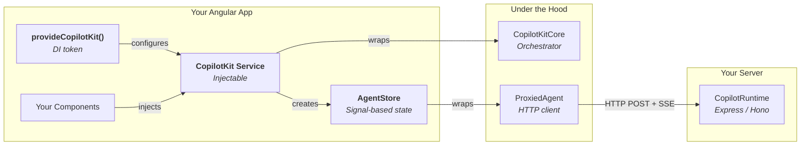
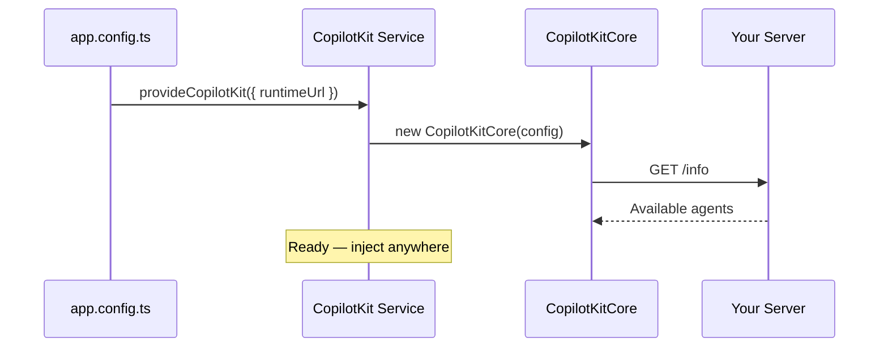
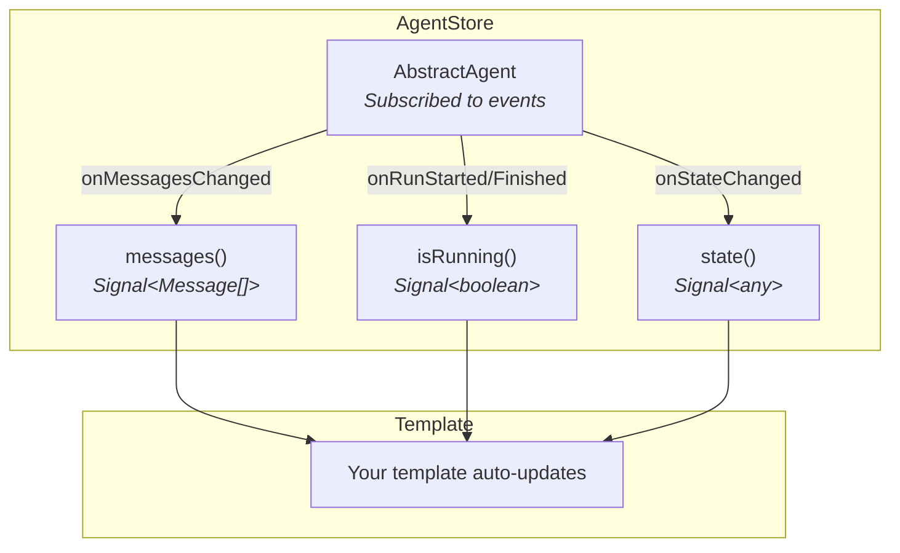
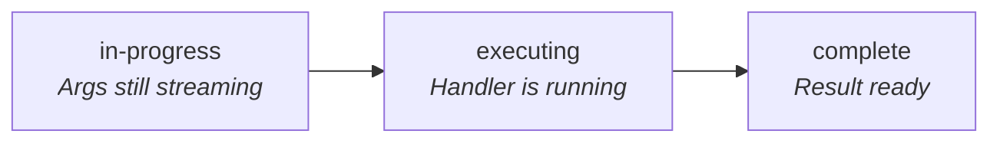
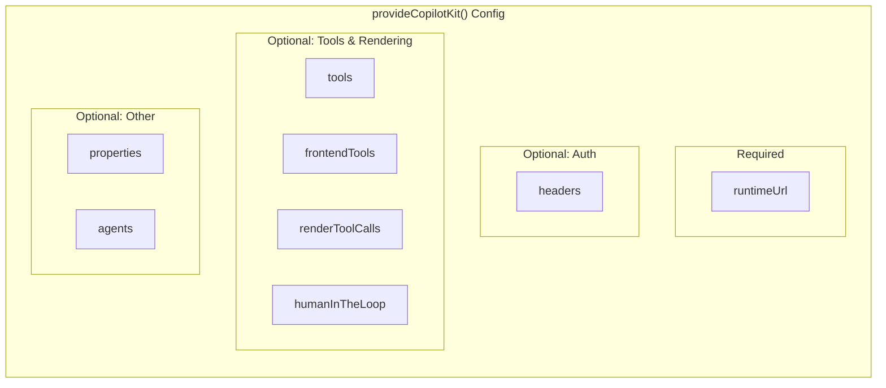

# Angular Setup Guide

This guide shows how to set up CopilotKit in an Angular app — from minimal to fully configured.

---

## What Talks to What



---

## Minimal Setup

### 1. Install

```bash
npm install @copilotkitnext/angular
```

### 2. Configure the DI token

```typescript
// app.config.ts
import { ApplicationConfig } from "@angular/core";
import { provideCopilotKit } from "@copilotkitnext/angular";

export const appConfig: ApplicationConfig = {
  providers: [
    provideCopilotKit({
      runtimeUrl: "/api/copilotkit",
    }),
  ],
};
```

### 3. Use the service in a component

```typescript
// chat.component.ts
import { Component, inject } from "@angular/core";
import { CopilotKit } from "@copilotkitnext/angular";

@Component({
  selector: "app-chat",
  template: `
    <div>
      <div *ngFor="let msg of agentStore.messages()">
        <b>{{ msg.role }}:</b> {{ msg.content }}
      </div>
      <input #input (keydown.enter)="send(input.value); input.value = ''" />
    </div>
  `,
})
export class ChatComponent {
  private copilotKit = inject(CopilotKit);
  agentStore = this.copilotKit.getAgentStore(); // default agent

  async send(message: string) {
    this.agentStore.addMessage({
      id: crypto.randomUUID(),
      role: "user",
      content: message,
    });
    await this.copilotKit.runAgent({ agent: this.agentStore.agent });
  }
}
```

That's it — the DI token creates a `CopilotKit` service backed by `CopilotKitCore`, and `AgentStore` gives you signal-based reactive state.



---

## Angular Signals for Reactive State

`AgentStore` uses Angular signals, so your templates react to changes automatically:

```typescript
@Component({
  template: `
    @if (agentStore.isRunning()) {
      <p>Agent is thinking...</p>
    }

    @for (msg of agentStore.messages(); track msg.id) {
      <div [class]="msg.role">{{ msg.content }}</div>
    }

    <pre>{{ agentStore.state() | json }}</pre>
  `,
})
export class ChatComponent {
  private copilotKit = inject(CopilotKit);
  agentStore = this.copilotKit.getAgentStore("my-agent");
}
```

### AgentStore Signals

| Signal        | Type        | What it tracks                         |
| ------------- | ----------- | -------------------------------------- |
| `messages()`  | `Message[]` | All messages in the conversation       |
| `isRunning()` | `boolean`   | Whether the agent is currently running |
| `state()`     | `any`       | Agent state (arbitrary JSON)           |



---

## Registering Tools

```typescript
// In your component or service
import { CopilotKit } from "@copilotkitnext/angular";
import { z } from "zod";

@Component({
  /* ... */
})
export class ProductComponent implements OnInit, OnDestroy {
  private copilotKit = inject(CopilotKit);

  ngOnInit() {
    // Register a tool the agent can call
    this.copilotKit.addTool({
      name: "addToCart",
      description: "Add a product to cart",
      parameters: z.object({
        productId: z.string(),
        quantity: z.number().default(1),
      }),
      handler: async ({ productId, quantity }) => {
        this.cartService.add(productId, quantity);
        return `Added ${quantity} item(s)`;
      },
    });
  }

  ngOnDestroy() {
    // Clean up when component is destroyed
    this.copilotKit.removeTool("addToCart");
  }
}
```

---

## Providing Context

```typescript
@Component({
  /* ... */
})
export class DashboardComponent implements OnInit, OnDestroy {
  private copilotKit = inject(CopilotKit);
  private contextId?: string;

  ngOnInit() {
    this.contextId = this.copilotKit.addContext({
      description: "Current dashboard metrics",
      value: JSON.stringify({
        revenue: this.metricsService.revenue(),
        activeUsers: this.metricsService.activeUsers(),
      }),
    });
  }

  ngOnDestroy() {
    if (this.contextId) {
      this.copilotKit.removeContext(this.contextId);
    }
  }
}
```

---

## Tool Call Rendering

Angular uses the `AngularToolCall` type for rendering tool calls:

```typescript
import { AngularToolCall } from "@copilotkitnext/angular";

// Configure in provideCopilotKit
provideCopilotKit({
  runtimeUrl: "/api/copilotkit",
  renderToolCalls: [
    {
      name: "searchProducts",
      // The Angular component receives the AngularToolCall
    },
  ],
});
```

### AngularToolCall Status Flow



| Field    | Type                                         | Description                              |
| -------- | -------------------------------------------- | ---------------------------------------- |
| `status` | `"in-progress" \| "executing" \| "complete"` | Current lifecycle stage                  |
| `name`   | `string`                                     | Tool name                                |
| `args`   | `Partial<T>` or `T`                          | Tool arguments (partial while streaming) |
| `result` | `string \| undefined`                        | Result (only when complete)              |

---

## All Configuration Options

```typescript
// app.config.ts
import { provideCopilotKit } from "@copilotkitnext/angular";

provideCopilotKit({
  // Required
  runtimeUrl: "/api/copilotkit",

  // Authentication
  headers: { Authorization: "Bearer token" },

  // Custom properties forwarded to agents
  properties: { userId: "123", plan: "pro" },

  // Local agents for development
  agents: { test: myTestAgent },

  // Tools (can also add via service)
  tools: [
    {
      name: "myTool",
      parameters: z.object({ input: z.string() }),
      handler: async ({ input }) => `Processed: ${input}`,
    },
  ],

  // Tool call rendering
  renderToolCalls: [
    /* ... */
  ],

  // Frontend tools
  frontendTools: [
    /* ... */
  ],

  // Human-in-the-loop
  humanInTheLoop: [
    /* ... */
  ],
});
```



---

## Full Example: Dashboard App

```typescript
// app.config.ts
import { ApplicationConfig } from "@angular/core";
import { provideCopilotKit } from "@copilotkitnext/angular";

export const appConfig: ApplicationConfig = {
  providers: [
    provideCopilotKit({
      runtimeUrl: "/api/copilotkit",
      headers: { Authorization: `Bearer ${getToken()}` },
    }),
  ],
};
```

```typescript
// dashboard.component.ts
import { Component, inject, OnInit, OnDestroy } from "@angular/core";
import { CopilotKit } from "@copilotkitnext/angular";
import { z } from "zod";

@Component({
  selector: "app-dashboard",
  template: `
    <div class="dashboard">
      <app-metrics />

      <div class="chat">
        @if (agentStore.isRunning()) {
          <div class="typing">Agent is thinking...</div>
        }

        @for (msg of agentStore.messages(); track msg.id) {
          <div [class]="'message ' + msg.role">
            {{ msg.content }}
          </div>
        }

        <input
          #input
          placeholder="Ask about your metrics..."
          (keydown.enter)="send(input.value); input.value = ''"
        />
      </div>
    </div>
  `,
})
export class DashboardComponent implements OnInit, OnDestroy {
  private copilotKit = inject(CopilotKit);
  private metricsService = inject(MetricsService);

  agentStore = this.copilotKit.getAgentStore();
  private contextId?: string;

  ngOnInit() {
    // Provide context
    this.contextId = this.copilotKit.addContext({
      description: "Dashboard metrics",
      value: JSON.stringify({
        revenue: this.metricsService.revenue(),
        users: this.metricsService.activeUsers(),
      }),
    });

    // Register tool
    this.copilotKit.addTool({
      name: "filterMetrics",
      description: "Filter dashboard metrics by date range",
      parameters: z.object({
        startDate: z.string(),
        endDate: z.string(),
      }),
      handler: async ({ startDate, endDate }) => {
        this.metricsService.setDateRange(startDate, endDate);
        return `Filtered to ${startDate} - ${endDate}`;
      },
    });
  }

  ngOnDestroy() {
    if (this.contextId) this.copilotKit.removeContext(this.contextId);
    this.copilotKit.removeTool("filterMetrics");
  }

  async send(message: string) {
    this.agentStore.addMessage({
      id: crypto.randomUUID(),
      role: "user",
      content: message,
    });
    await this.copilotKit.runAgent({ agent: this.agentStore.agent });
  }
}
```

---

## Key Differences from React

| Aspect            | React                                     | Angular                                             |
| ----------------- | ----------------------------------------- | --------------------------------------------------- |
| Configuration     | `<CopilotKitProvider>` JSX                | `provideCopilotKit()` DI token                      |
| Service access    | `useCopilotKit()` hook                    | `inject(CopilotKit)`                                |
| Agent state       | `useAgent()` hook returns reactive values | `AgentStore` with Angular signals                   |
| Tool registration | `useFrontendTool()` hook (auto-cleanup)   | `addTool()` / `removeTool()` (manual cleanup)       |
| Context           | `useAgentContext()` hook (auto-cleanup)   | `addContext()` / `removeContext()` (manual cleanup) |
| Reactivity        | React re-renders on state change          | Angular signals trigger change detection            |
