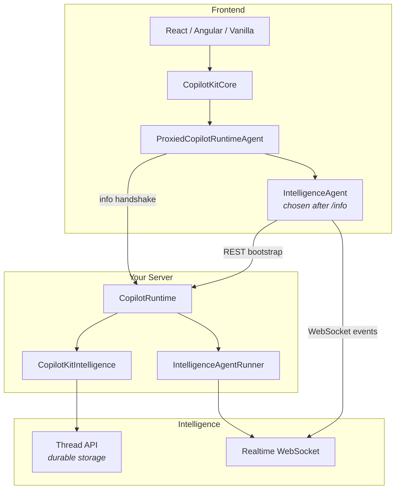
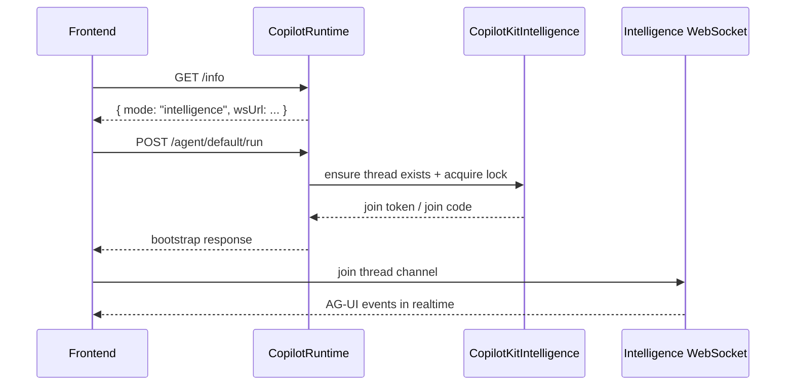

# Intelligence Setup Guide

This guide shows how to set up **CopilotKit Intelligence**: durable thread storage plus a websocket transport for realtime events.

Intelligence is designed to feel like a small runtime configuration change, not a separate product integration. You provide an Intelligence SDK to the runtime, and the rest of the stack switches from plain SSE mode into Intelligence mode automatically.

---

## What Changes in Intelligence Mode



### SSE Mode vs Intelligence Mode

| Mode         | Thread storage                              | Realtime transport | `/info` reports                               |
| ------------ | ------------------------------------------- | ------------------ | --------------------------------------------- |
| SSE          | Ephemeral unless your runner persists state | SSE                | `mode: "sse"`                                 |
| Intelligence | Durable thread APIs                         | WebSocket          | `mode: "intelligence"` + `intelligence.wsUrl` |

The important design rule is:

- The **runtime** decides the mode.
- The **client** waits for `/info` before choosing the concrete remote agent implementation.
- The **developer** only opts in by providing `intelligence`.

---

## Minimal Runtime Setup

### 1. Install runtime packages

```bash
npm install @copilotkitnext/runtime
```

### 2. Create the Intelligence SDK

```typescript
import { CopilotKitIntelligence } from "@copilotkitnext/runtime";

const intelligence = new CopilotKitIntelligence({
  apiKey: process.env.COPILOTKIT_INTELLIGENCE_API_KEY!,
  tenantId: process.env.COPILOTKIT_INTELLIGENCE_TENANT_ID!,
  apiUrl: "https://your-intelligence-host/api",
  wsUrl: "wss://your-intelligence-host/socket",
});
```

### 3. Pass it to `CopilotRuntime`

```typescript
import express from "express";
import { CopilotRuntime } from "@copilotkitnext/runtime";
import { createCopilotEndpointExpress } from "@copilotkitnext/runtime/express";

const app = express();

const runtime = new CopilotRuntime({
  agents: {
    default: myAgent,
  },
  intelligence,
});

app.use(
  "/api/copilotkit",
  createCopilotEndpointExpress({
    runtime,
    basePath: "/",
  }),
);
```

That is the mode switch. You do **not** separately configure Intelligence handlers in the endpoint layer. The runtime selects them.

---

## What `CopilotRuntime` Does For You

When `intelligence` is present, `CopilotRuntime`:

- switches its mode from `"sse"` to `"intelligence"`
- uses the Intelligence handler path for `run`, `connect`, and `threads`
- auto-configures the Intelligence runner from `intelligence.wsUrl`
- reports Intelligence metadata from `/info`

Example `/info` response:

```json
{
  "version": "1.x.x",
  "mode": "intelligence",
  "agents": {
    "default": {
      "name": "default",
      "description": "My agent",
      "className": "BuiltInAgent"
    }
  },
  "audioFileTranscriptionEnabled": false,
  "intelligence": {
    "wsUrl": "wss://your-intelligence-host/socket"
  }
}
```

The frontend uses that response to decide whether to keep using the HTTP/SSE path or switch to the Intelligence websocket path.

---

## Frontend Behavior

You do not configure a special provider flag for Intelligence.

This stays the same:

```tsx
import { CopilotKitProvider, CopilotChat } from "@copilotkitnext/react";

export function App() {
  return (
    <CopilotKitProvider runtimeUrl="/api/copilotkit">
      <CopilotChat />
    </CopilotKitProvider>
  );
}
```

What changes under the hood:

1. The provider connects to the runtime as usual.
2. `CopilotKitCore` fetches `/info`.
3. `ProxiedCopilotRuntimeAgent` waits until the runtime reports its mode.
4. If the mode is:
   - `"sse"`: normal HTTP/SSE behavior continues.
   - `"intelligence"`: the proxy uses `IntelligenceAgent` and the runtime-provided websocket URL.

This is why the runtime owns the mode decision instead of the frontend guessing from config.

---

## Durable Threads

Intelligence mode adds thread APIs on the runtime:

| Route                        | Method | Purpose                |
| ---------------------------- | ------ | ---------------------- |
| `/threads`                   | GET    | List durable threads   |
| `/threads/:threadId`         | PATCH  | Update thread metadata |
| `/threads/:threadId/archive` | POST   | Archive a thread       |
| `/threads/:threadId`         | DELETE | Delete a thread        |

These routes are **Intelligence-only**.

In SSE mode they should reject with an explicit error, because SSE runtimes do not have the durable thread backend required to satisfy them.

---

## How Agent Runs Work in Intelligence Mode



The runtime is still the contract boundary the frontend talks to. Intelligence is not exposed as a separate frontend integration surface.

---

## Local Agents vs Runtime-Discovered Agents

Local or self-managed agents still matter in Intelligence mode.

The intended precedence is:

1. local/self-managed agents
2. runtime-discovered remote agents

That lets application code override a runtime-reported agent with a local implementation for development, testing, or custom routing behavior.

---

## Recommended Mental Model

Think of Intelligence as a **runtime capability**, not a second transport API developers need to learn.

- `CopilotKitIntelligence` configures the runtime's Intelligence backend.
- `CopilotRuntime` exposes that capability through the same frontend-facing contract.
- `/info` tells the client which concrete remote-agent implementation to use.
- Frontend app code stays mostly unchanged.

If the setup feels bigger than “add the SDK to the runtime,” the abstraction is probably leaking.
