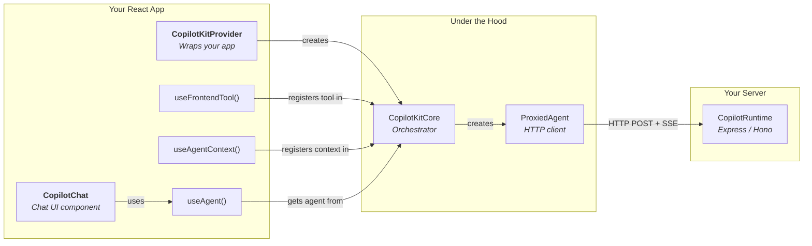
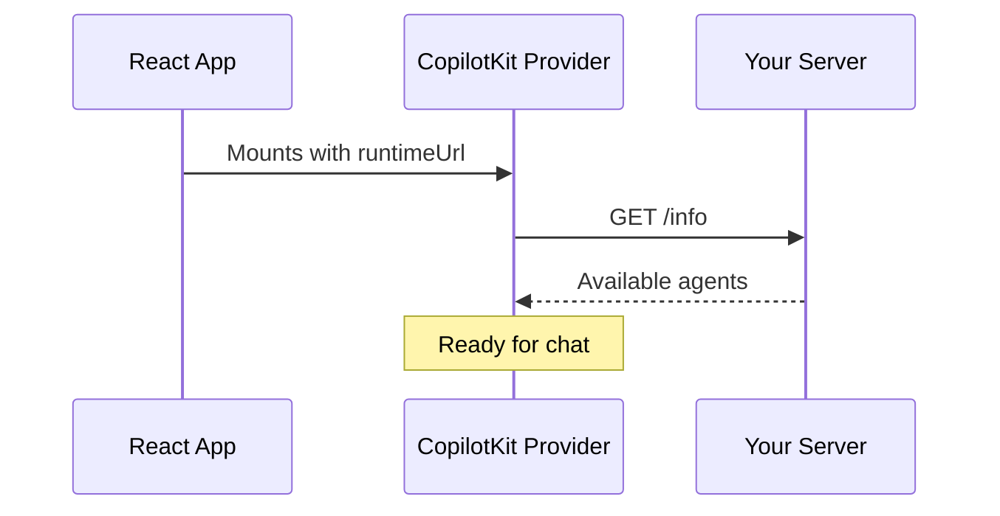
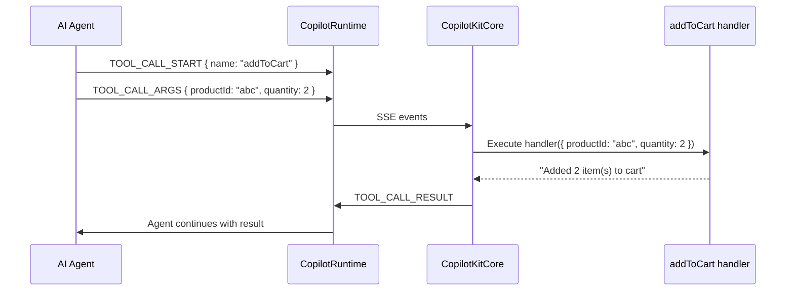
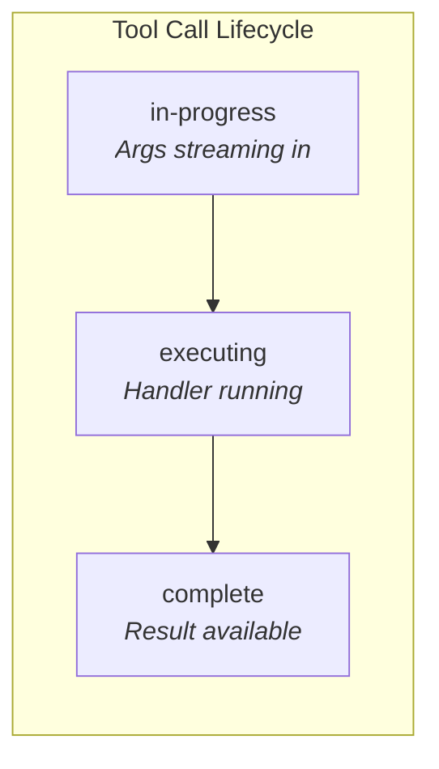
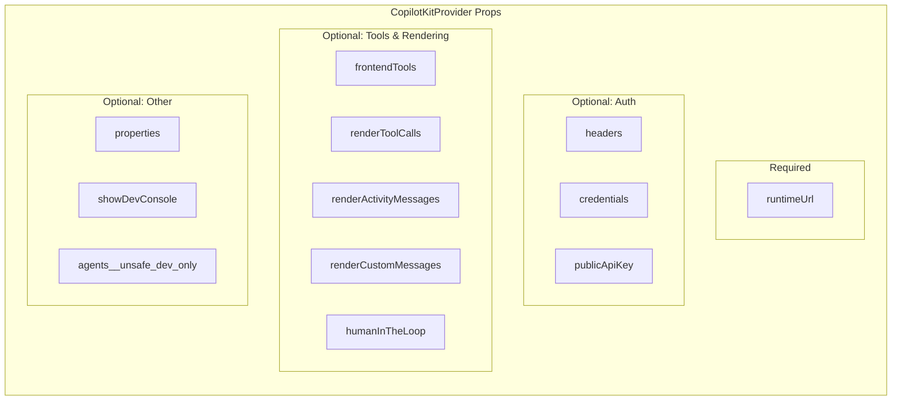

# React Setup Guide

This guide shows how to set up CopilotKit in a React app — from minimal to fully configured.

---

## What Talks to What



---

## Minimal Setup (V1 — recommended starting point)

### 1. Install

```bash
npm install @copilotkit/react-core @copilotkit/react-ui
```

### 2. Wrap your app with the provider

```tsx
// app.tsx
import { CopilotKit } from "@copilotkit/react-core";
import "@copilotkit/react-ui/styles.css";

export default function App() {
  return (
    <CopilotKit runtimeUrl="/api/copilotkit">
      <YourApp />
    </CopilotKit>
  );
}
```

### 3. Add a chat component

```tsx
// components/chat.tsx
import { CopilotPopup } from "@copilotkit/react-ui";

export function ChatWidget() {
  return (
    <CopilotPopup
      labels={{ title: "AI Assistant", initial: "How can I help?" }}
    />
  );
}
```

That's it — you now have a working AI chat. The provider connects to your runtime, fetches available agents, and the popup gives users a chat interface.



---

## V2 Setup (direct)

If you're building new features and want the V2 API directly:

```bash
npm install @copilotkitnext/react
```

```tsx
import { CopilotKitProvider, CopilotChat } from "@copilotkitnext/react";

export default function App() {
  return (
    <CopilotKitProvider runtimeUrl="/api/copilotkit">
      <CopilotChat />
    </CopilotKitProvider>
  );
}
```

> V1's `<CopilotKit>` wraps V2's `<CopilotKitProvider>` under the hood, so both work the same way.

---

## Adding Tools

Tools are functions the AI agent can call. They run in the browser.

```tsx
import { useFrontendTool } from "@copilotkitnext/react";
// or: import { useCopilotAction } from "@copilotkit/react-core"; (V1 equivalent)
import { z } from "zod";

function ProductPage({ products }) {
  // The agent can now call "addToCart" during a conversation
  useFrontendTool({
    name: "addToCart",
    description: "Add a product to the user's shopping cart",
    parameters: z.object({
      productId: z.string().describe("The product ID to add"),
      quantity: z.number().default(1).describe("How many to add"),
    }),
    handler: async ({ productId, quantity }) => {
      await cartApi.add(productId, quantity);
      return `Added ${quantity} item(s) to cart`;
    },
  });

  return <div>{/* your product UI */}</div>;
}
```



---

## Providing Context

Context tells the agent about what the user currently sees.

```tsx
import { useAgentContext } from "@copilotkitnext/react";
// or: import { useCopilotReadable } from "@copilotkit/react-core"; (V1 equivalent)

function Dashboard({ user, metrics }) {
  // The agent now knows about the current user and their metrics
  useAgentContext("Current user and dashboard metrics", {
    user: { name: user.name, role: user.role },
    metrics: { revenue: metrics.revenue, activeUsers: metrics.activeUsers },
  });

  return <div>{/* your dashboard UI */}</div>;
}
```

---

## Custom Tool Rendering

Show custom UI while a tool is being called:

```tsx
import { useRenderToolCall } from "@copilotkitnext/react";
import { z } from "zod";

function App() {
  useRenderToolCall({
    name: "searchProducts",
    args: z.object({ query: z.string() }),
    render: ({ args, status, result }) => {
      if (status === "in-progress") {
        return <div>Searching for "{args.query}"...</div>;
      }
      if (status === "executing") {
        return <Spinner>Running search...</Spinner>;
      }
      // status === "complete"
      return <div>Found results: {result}</div>;
    },
  });
}
```



---

## Human-in-the-Loop

Require user approval before a tool executes:

```tsx
import { useHumanInTheLoop } from "@copilotkitnext/react";
import { z } from "zod";

function App() {
  useHumanInTheLoop({
    name: "deleteAccount",
    description: "Permanently delete a user account",
    parameters: z.object({ userId: z.string() }),
    render: ({ args, status, respond }) => {
      if (status === "executing") {
        return (
          <div>
            <p>Delete account {args.userId}?</p>
            <button onClick={() => respond("approved")}>Approve</button>
            <button onClick={() => respond("denied")}>Deny</button>
          </div>
        );
      }
      if (status === "complete") {
        return <div>Action completed</div>;
      }
      return <div>Preparing...</div>;
    },
  });
}
```

---

## Suggestions

Auto-generate prompt suggestions for users:

```tsx
import { useConfigureSuggestions } from "@copilotkitnext/react";

function App() {
  useConfigureSuggestions({
    instructions: "Suggest questions about the user's dashboard data",
    minSuggestions: 2,
    maxSuggestions: 4,
    available: "always", // "before-first-message" | "after-first-message" | "always" | "disabled"
  });
}
```

---

## All Provider Props (optional)

```tsx
<CopilotKitProvider
  // Required
  runtimeUrl="/api/copilotkit"
  // Authentication
  headers={{ Authorization: "Bearer token" }}
  credentials="include" // Forward cookies
  publicApiKey="ck_..." // CopilotKit Cloud key
  // Custom properties forwarded to agents
  properties={{ userId: "123", plan: "pro" }}
  // Tools & rendering (can also use hooks instead)
  frontendTools={
    [
      /* ... */
    ]
  }
  renderToolCalls={
    [
      /* ... */
    ]
  }
  renderActivityMessages={
    [
      /* ... */
    ]
  }
  renderCustomMessages={
    [
      /* ... */
    ]
  }
  humanInTheLoop={
    [
      /* ... */
    ]
  }
  // Dev tools
  showDevConsole="auto" // true | false | "auto"
  // Advanced: local agents for development
  agents__unsafe_dev_only={{ test: myTestAgent }}
/>
```



---

## Chat Component Variants

```tsx
import {
  CopilotChat, // Inline chat, fills its container
  CopilotPopup, // Floating popup button + chat
  CopilotSidebar, // Side panel
  CopilotPanel, // Inline panel
} from "@copilotkit/react-ui";

// All accept the same core props:
<CopilotChat
  agentId="research" // Which agent to talk to (default: "default")
  labels={{
    title: "Research Assistant",
    initial: "What would you like to research?",
    placeholder: "Ask me anything...",
  }}
/>;
```

---

## Full Example: E-Commerce App

```tsx
import { CopilotKit } from "@copilotkit/react-core";
import { CopilotSidebar } from "@copilotkit/react-ui";
import "@copilotkit/react-ui/styles.css";
import { z } from "zod";

export default function App() {
  return (
    <CopilotKit
      runtimeUrl="/api/copilotkit"
      headers={{ Authorization: `Bearer ${getToken()}` }}
    >
      <CopilotSidebar labels={{ title: "Shopping Assistant" }}>
        <ProductCatalog />
      </CopilotSidebar>
    </CopilotKit>
  );
}

function ProductCatalog() {
  const [products] = useProducts();
  const [cart, setCart] = useCart();

  // Context: tell the agent what the user sees
  useAgentContext("Product catalog the user is browsing", {
    products: products.map((p) => ({ id: p.id, name: p.name, price: p.price })),
    cartTotal: cart.total,
    cartItems: cart.items.length,
  });

  // Tool: agent can add items to cart
  useFrontendTool({
    name: "addToCart",
    description: "Add a product to the shopping cart",
    parameters: z.object({
      productId: z.string(),
      quantity: z.number().default(1),
    }),
    handler: async ({ productId, quantity }) => {
      setCart((prev) => addItem(prev, productId, quantity));
      return "Added to cart";
    },
  });

  // Tool: agent can search products
  useFrontendTool({
    name: "searchProducts",
    description: "Search for products by name or category",
    parameters: z.object({ query: z.string() }),
    handler: async ({ query }) => {
      const results = products.filter((p) =>
        p.name.toLowerCase().includes(query.toLowerCase()),
      );
      return JSON.stringify(
        results.map((p) => ({ id: p.id, name: p.name, price: p.price })),
      );
    },
  });

  // Suggestions
  useConfigureSuggestions({
    instructions:
      "Suggest shopping-related questions based on the product catalog",
    maxSuggestions: 3,
    available: "always",
  });

  return <div>{/* product grid UI */}</div>;
}
```
