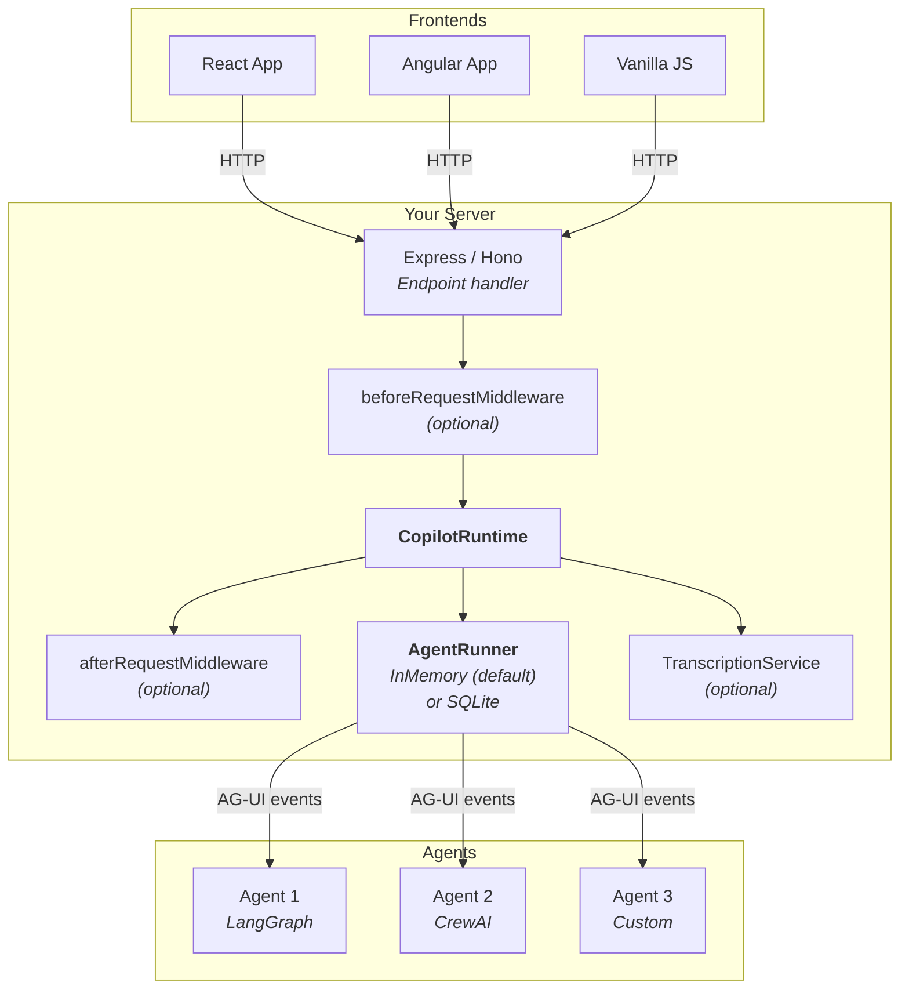
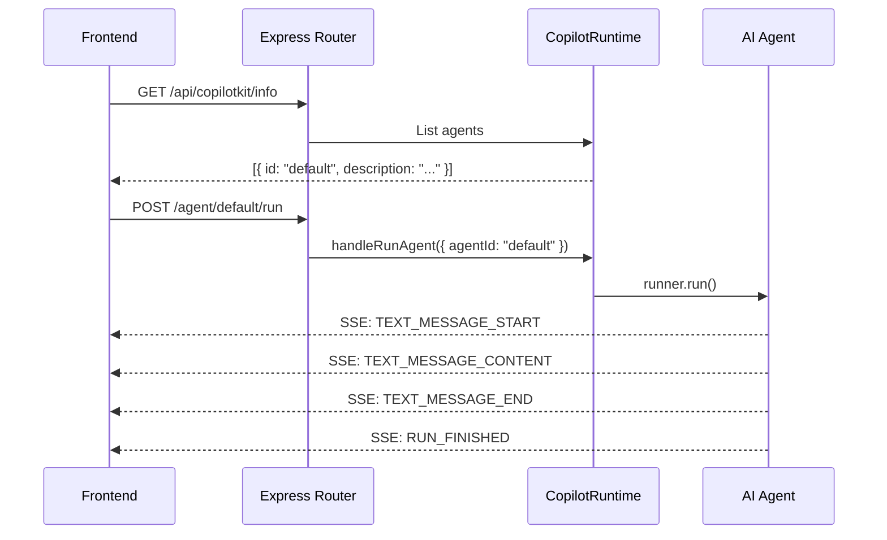
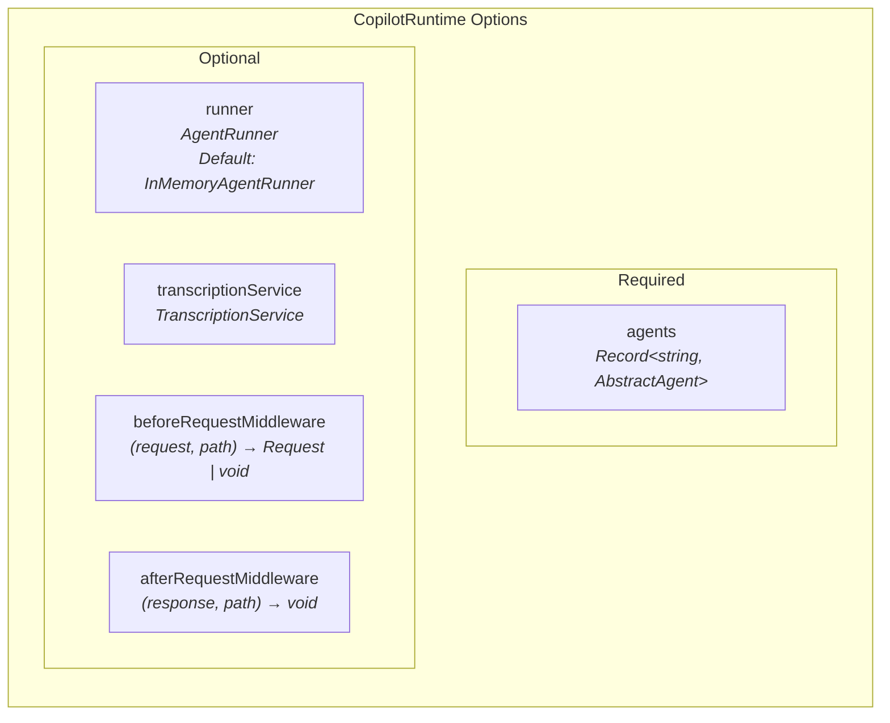
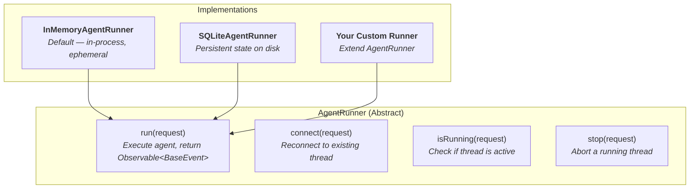
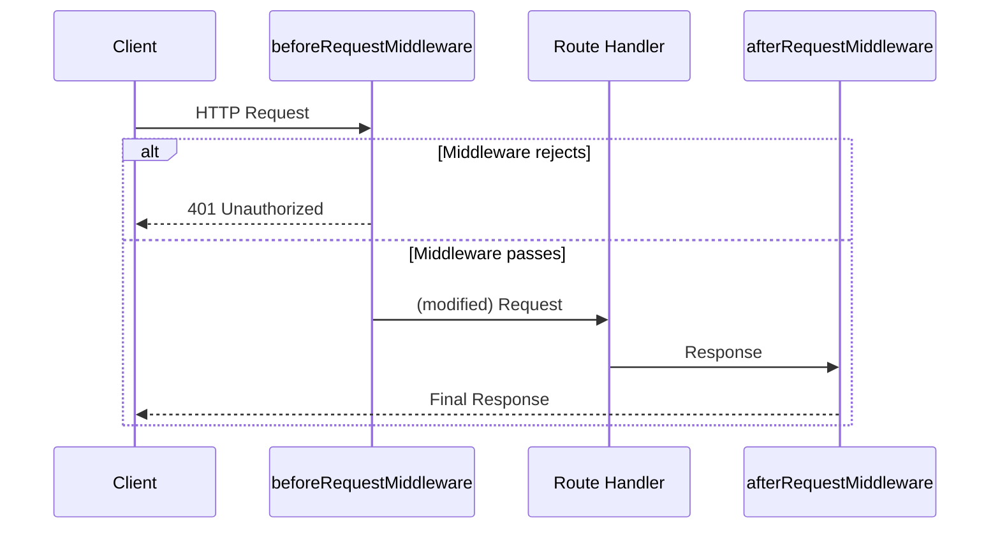
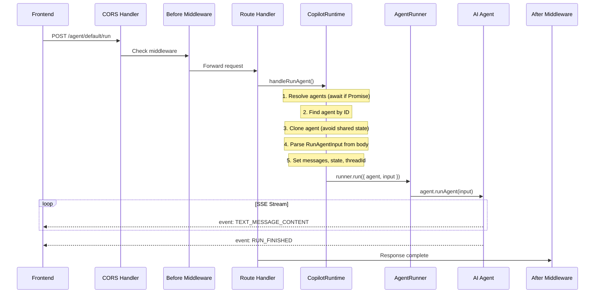

# Runtime / Backend Setup Guide

This guide shows how to set up the CopilotKit backend — from minimal to fully configured with all optional extension points.

---

## What Talks to What



---

## Minimal Setup (Express)

### 1. Install

```bash
npm install @copilotkitnext/runtime @copilotkitnext/agent express
```

### 2. Create the runtime

```typescript
// server.ts
import express from "express";
import { CopilotRuntime } from "@copilotkitnext/runtime";
import { createCopilotEndpointExpress } from "@copilotkitnext/runtime/express";

const app = express();

const runtime = new CopilotRuntime({
  agents: {
    default: myAgent, // Any AbstractAgent implementation
  },
});

app.use("/api/copilotkit", createCopilotEndpointExpress({ runtime }));

app.listen(3000);
```

That's it. The endpoint handler creates these routes automatically:

| Route                                           | Method | What it does                        |
| ----------------------------------------------- | ------ | ----------------------------------- |
| `/api/copilotkit/info`                          | GET    | Returns list of available agents    |
| `/api/copilotkit/agent/:agentId/run`            | POST   | Run an agent (returns SSE stream)   |
| `/api/copilotkit/agent/:agentId/connect`        | POST   | Connect/reconnect to a thread       |
| `/api/copilotkit/agent/:agentId/stop/:threadId` | POST   | Stop a running agent                |
| `/api/copilotkit/transcribe`                    | POST   | Audio transcription (if configured) |



---

## Hono Setup

```typescript
import { Hono } from "hono";
import { CopilotRuntime } from "@copilotkitnext/runtime";
import { createCopilotEndpointHono } from "@copilotkitnext/runtime/hono";

const app = new Hono();

const runtime = new CopilotRuntime({
  agents: { default: myAgent },
});

app.route("/api/copilotkit", createCopilotEndpointHono({ runtime }));

export default app;
```

---

## Using the Built-in Agent

CopilotKit includes a built-in agent powered by the Vercel AI SDK:

```typescript
import { CopilotRuntime } from "@copilotkitnext/runtime";
import { BuiltInAgent } from "@copilotkitnext/agent";

const agent = new BuiltInAgent({
  model: "openai/gpt-4o",
  systemPrompt: "You are a helpful shopping assistant.",
});

const runtime = new CopilotRuntime({
  agents: { default: agent },
});
```

---

## Lazy-Loaded Agents

Agents can be a `Promise` — useful for dynamic loading:

```typescript
const runtime = new CopilotRuntime({
  agents: loadAgents(), // Returns Promise<Record<string, AbstractAgent>>
});

async function loadAgents() {
  const config = await fetchConfig();
  return {
    default: new BuiltInAgent({ model: config.model }),
    research: new HttpAgent({ url: config.researchAgentUrl }),
  };
}
```

---

## All CopilotRuntime Options

```typescript
const runtime = new CopilotRuntime({
  // Required: map of agent IDs to agent instances
  agents: {
    default: defaultAgent,
    research: researchAgent,
    coding: codingAgent,
  },

  // Optional: how agents are executed
  runner: new InMemoryAgentRunner(), // default

  // Optional: audio → text
  transcriptionService: myTranscriptionService,

  // Optional: intercept requests before processing
  beforeRequestMiddleware: async ({ request, path }) => {
    console.log(`[${path}] Request received`);
    // Return modified request, or void to pass through
  },

  // Optional: run after response is prepared
  afterRequestMiddleware: async ({ response, path }) => {
    console.log(`[${path}] Response sent`);
  },
});
```



---

## AgentRunner: How Agents Execute

The `AgentRunner` is the abstraction that actually executes agents. It manages threads, streaming, and agent lifecycle.



### InMemoryAgentRunner (default)

Stores agent threads in memory. Simple, no persistence. Threads are lost on server restart.

```typescript
import { InMemoryAgentRunner } from "@copilotkitnext/runtime";

const runtime = new CopilotRuntime({
  agents: { default: myAgent },
  runner: new InMemoryAgentRunner(), // This is the default
});
```

### SQLiteAgentRunner (persistent)

Stores agent threads in SQLite. Survives restarts.

```typescript
import { SQLiteAgentRunner } from "@copilotkitnext/sqlite-runner";

const runtime = new CopilotRuntime({
  agents: { default: myAgent },
  runner: new SQLiteAgentRunner({ dbPath: "./agent-state.db" }),
});
```

### Custom Runner

```typescript
import { AgentRunner } from "@copilotkitnext/runtime";
import { Observable } from "rxjs";

class RedisAgentRunner extends AgentRunner {
  async run(request) {
    // Store in Redis, return event stream
    return new Observable((subscriber) => {
      // ... your implementation
    });
  }

  async connect(request) {
    // Reconnect to existing Redis-stored thread
  }

  async isRunning(request) {
    // Check Redis for active thread
  }

  async stop(request) {
    // Signal thread to stop
  }
}
```

---

## Middleware

Middleware lets you intercept requests before and after processing.

### Before Request Middleware

Runs before any handler. Use it for auth, logging, request modification.

```typescript
const runtime = new CopilotRuntime({
  agents: { default: myAgent },
  beforeRequestMiddleware: async ({ request, path, runtime }) => {
    // Example: verify auth token
    const token = request.headers.get("authorization");
    if (!token) {
      return new Response("Unauthorized", { status: 401 });
    }

    // Example: add user context to request
    const user = await verifyToken(token);
    request.headers.set("x-user-id", user.id);

    // Return modified request (or void to pass through)
    return request;
  },
});
```

### After Request Middleware

Runs after the response is prepared but before it's sent.

```typescript
const runtime = new CopilotRuntime({
  agents: { default: myAgent },
  afterRequestMiddleware: async ({ response, path, runtime }) => {
    // Example: log responses
    console.log(`[${path}] Response status: ${response.status}`);

    // Example: add custom headers
    // (Note: response may be SSE stream)
  },
});
```



---

## Transcription Service

Enable audio-to-text transcription:

```typescript
import { TranscriptionService } from "@copilotkitnext/runtime";

class OpenAITranscription extends TranscriptionService {
  async transcribeFile({ audioFile, mimeType, size }) {
    const formData = new FormData();
    formData.append("file", audioFile);
    formData.append("model", "whisper-1");

    const response = await fetch(
      "https://api.openai.com/v1/audio/transcriptions",
      {
        method: "POST",
        headers: { Authorization: `Bearer ${process.env.OPENAI_API_KEY}` },
        body: formData,
      },
    );

    const result = await response.json();
    return result.text;
  }
}

const runtime = new CopilotRuntime({
  agents: { default: myAgent },
  transcriptionService: new OpenAITranscription(),
});
```

The `/transcribe` endpoint is only active when `transcriptionService` is configured.

---

## Request Flow Detail



---

## Full Example: Express + Multiple Agents + Middleware

```typescript
import express from "express";
import { CopilotRuntime } from "@copilotkitnext/runtime";
import { createCopilotEndpointExpress } from "@copilotkitnext/runtime/express";
import { BuiltInAgent } from "@copilotkitnext/agent";
import { SQLiteAgentRunner } from "@copilotkitnext/sqlite-runner";

const app = express();

// Create agents
const generalAgent = new BuiltInAgent({
  model: "openai/gpt-4o",
  systemPrompt: "You are a helpful assistant.",
});

const codeAgent = new BuiltInAgent({
  model: "openai/gpt-4o",
  systemPrompt: "You are a coding expert. Always provide code examples.",
});

// Create runtime with all optional features
const runtime = new CopilotRuntime({
  agents: {
    default: generalAgent,
    coding: codeAgent,
  },

  // Persistent agent state
  runner: new SQLiteAgentRunner({ dbPath: "./data/agents.db" }),

  // Auth middleware
  beforeRequestMiddleware: async ({ request, path }) => {
    const token = request.headers.get("authorization")?.replace("Bearer ", "");
    if (!token) {
      return new Response(JSON.stringify({ error: "Unauthorized" }), {
        status: 401,
        headers: { "Content-Type": "application/json" },
      });
    }
    // Validate token...
  },

  // Logging middleware
  afterRequestMiddleware: async ({ path }) => {
    console.log(`[CopilotKit] ${new Date().toISOString()} ${path}`);
  },
});

// Mount CopilotKit endpoints
app.use("/api/copilotkit", createCopilotEndpointExpress({ runtime }));

app.listen(3000, () => {
  console.log("Server running on :3000");
  console.log("CopilotKit endpoints at /api/copilotkit/*");
});
```
