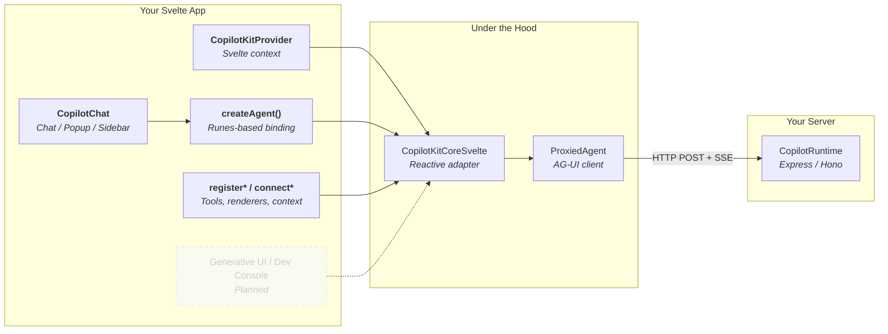

# Svelte Setup Guide

This guide shows how to set up CopilotKit in a Svelte 5 app — from a minimal chat to reactive agent state, frontend tools, and custom UI.

> **Status notation:** normal text describes APIs implemented in `@copilotkit/svelte`. <span style="color: #8b949e; opacity: 0.7; font-style: italic;">Faded italic text marked **Planned** describes API or UI parity that is not implemented yet.</span>

---

## What Talks to What



---

## Minimal Setup

### 1. Install

```bash
pnpm add @copilotkit/svelte
```

Add `zod` when registering typed tools:

```bash
pnpm add zod
```

`@copilotkit/svelte` requires Svelte 5.

### 2. Add the provider

Put the provider above every component that calls a CopilotKit factory or registration function.

```svelte
<!-- src/routes/+layout.svelte -->
<script lang="ts">
  import { CopilotKitProvider } from "@copilotkit/svelte";

  let { children } = $props();
</script>

<CopilotKitProvider runtimeUrl="/api/copilotkit">
  {@render children()}
</CopilotKitProvider>
```

### 3. Render chat

```svelte
<!-- src/routes/+page.svelte -->
<script lang="ts">
  import { CopilotChat } from "@copilotkit/svelte";
</script>

<div class="chat">
  <CopilotChat agentId="default" />
</div>

<style>
  .chat {
    height: 700px;
  }
</style>
```

The provider creates a stable `CopilotKitCoreSvelte` instance, synchronizes its reactive props, and exposes it through Svelte context. `CopilotChat` creates the agent binding, streams messages, and renders suggestions and tool calls.

---

## Svelte 5 Reactive Bindings

Stateful APIs use `create*` because they create reactive state and subscriptions. They return a stable object with live getters.

```svelte
<script lang="ts">
  import { createAgent, useCopilotKit } from "@copilotkit/svelte";

  const agentHandle = createAgent({ agentId: "default" });
  const { copilotkit } = useCopilotKit();

  // The getters on agentHandle read from $state, so they're reactive
  // without wrapping in $derived. Use them directly in templates.
  async function send(content: string) {
    const a = agentHandle.agent;
    if (!a) return;
    a.addMessage({ id: crypto.randomUUID(), role: "user", content });
    await copilotkit.runAgent({ agent: a });
  }
</script>

{#if agentHandle.isRunning}<p>Agent is thinking…</p>{/if}

{#each agentHandle.messages as message (message.id)}
  <p><strong>{message.role}</strong></p>
{/each}
```

### Direct getter access

Getters that read `$state` signals are already reactive in Svelte 5 — use them directly in markup:

```svelte
{#if agentHandle.isRunning}<p>Agent is thinking…</p>{/if}
```

<details>
<summary><code>$derived</code> aliases (optional)</summary>

`$derived` is needed only when you want a local alias or computed value — not for reactivity, which the getters already provide:

```svelte
<script lang="ts">
  const agentHandle = createAgent();

  // Alias — shorter local name
  const { messages, isRunning } = $derived(agentHandle);

  // Computed value
  const lastAgentState = $derived(agentHandle.agent?.state);
</script>
```

</details>

<details>
<summary>Avoid plain destructuring</summary>

Plain JavaScript destructuring evaluates the getter once and snapshots it:

```svelte
<script lang="ts">
  // Avoid: reads the getter once and loses reactivity.
  const { isRunning: staleRunning } = agentHandle;
</script>
```

This matters for AG-UI `STATE_DELTA` events — the `agent` getter depends on an internal revision signal that bumps when external agent state mutates.

</details>

---

## Frontend Tools

Registration APIs use `register*`. They register during component setup and automatically unregister when the component is destroyed.

```svelte
<script lang="ts">
  import { registerFrontendTool } from "@copilotkit/svelte";
  import { z } from "zod";

  registerFrontendTool({
    name: "showToast",
    description: "Show a notification in the browser",
    parameters: z.object({
      message: z.string(),
      type: z.enum(["success", "error", "info"]),
    }),
    handler: async ({ message, type }) => {
      alert(`[${type}] ${message}`);
      return "Notification shown";
    },
  });
</script>
```

Set `agentId` to scope a tool to one agent. Omit it to register the tool globally.

---

## Agent Context

`connectAgentContext` adds application state to the context sent to the agent. Values can be strings, numbers, booleans, arrays, objects, or `null`.

```svelte
<script lang="ts">
  import { connectAgentContext } from "@copilotkit/svelte";

  let selectedProject = $state({ id: "project-42", name: "Launch" });

  connectAgentContext({
    description: "The project currently selected by the user",
    get value() {
      return selectedProject;
    },
  });
</script>
```

The registration effect updates when reactive properties read from the input change, and removes the old context entry during cleanup.

---

## Tool Rendering and Human Approval

`registerRenderToolCall` can associate a tool name and schema with a custom renderer in the core registry. The render callback receives `parameters`, `status`, `result`, and `toolCallId`, and the registration is cleaned up with its component.

```typescript
registerRenderToolCall({
  name: "lookupWeather",
  parameters: z.object({ city: z.string() }),
  render: ({ parameters, status, result }) => {
    // Return the renderer value expected by your tool-call UI integration.
    return WeatherResult({ city: parameters.city, status, result });
  },
});
```

`registerHumanInTheLoop` registers a frontend tool whose executing renderer receives an asynchronous `respond(result)` function. Use it for confirmation or user-provided input before the agent continues.

<span style="color: #8b949e; opacity: 0.7; font-style: italic;">**Planned:** the built-in `CopilotChat` tool-call view does not yet resolve renderers from the core registry. It currently renders generic tool status; use the lower-level message snippets for custom UI.</span>

<span style="color: #8b949e; opacity: 0.7; font-style: italic;">**Planned:** provider-level `humanInTheLoop` configuration does not yet wire the interactive `respond()` lifecycle. Use `registerHumanInTheLoop` for interactive approval today.</span>

---

## Suggestions, Threads, Interrupts, and Attachments

These state factories follow the same live-getter rule as `createAgent` — getters read `$state` internally, so use them directly in markup.

| Factory                          | Current role                                                         |
| -------------------------------- | -------------------------------------------------------------------- |
| `createSuggestions({ agentId })` | Suggestions, loading state, reload, and clear                        |
| `createThreads({ agentId })`     | Thread listing, pagination, create, rename, archive, and delete      |
| `createInterrupt(config)`        | Observe, resolve, and dismiss AG-UI interrupts                       |
| `createAttachments({ config })`  | File validation, upload state, drag/drop, and attachment consumption |
| `createCapabilities(agentId?)`   | Reactive access to the selected agent's advertised capabilities      |

```svelte
<script lang="ts">
  import { createSuggestions, createThreads } from "@copilotkit/svelte";

  const suggestionsBinding = createSuggestions({ agentId: "default" });
  const threadsBinding = createThreads({ agentId: "default", limit: 20 });
</script>

{#if suggestionsBinding.isLoading}
  <p>Loading suggestions...</p>
{/if}

{#each suggestionsBinding.suggestions as suggestion}
  ...
{/each}

{#each threadsBinding.threads as thread}
  <p>{thread.name}</p>
{/each}
```

<details>
<summary><code>$derived</code> alias shortcuts</summary>

```svelte
<script lang="ts">
  const { suggestions } = $derived(suggestionsBinding);
  const { threads, isLoading: threadsLoading } = $derived(threadsBinding);
</script>
```

</details>

<span style="color: #8b949e; opacity: 0.7; font-style: italic;">**Planned:** `CopilotThreadsDrawer` and automatic attachment wiring in `CopilotChat` are not implemented. Build thread and attachment UI from the factories for now.</span>

---

## Provider Configuration

```svelte
<CopilotKitProvider
  runtimeUrl="/api/copilotkit"
  headers={() => ({ Authorization: `Bearer ${token}` })}
  credentials="include"
  defaultThrottleMs={100}
  useSingleEndpoint={true}
  properties={{ environment: "production" }}
  onError={({ error, code }) => console.error(code, error)}
>
  {@render children()}
</CopilotKitProvider>
```

| Prop                                                                                                                      | Status                                                                             |
| ------------------------------------------------------------------------------------------------------------------------- | ---------------------------------------------------------------------------------- |
| `runtimeUrl`, `headers`, `credentials`, `defaultThrottleMs`                                                               | Implemented                                                                        |
| `publicApiKey` / `publicLicenseKey`                                                                                       | Implemented for endpoint, headers, and license status                              |
| `properties`, `useSingleEndpoint`, `debug`                                                                                | Implemented                                                                        |
| `selfManagedAgents`, `agents__unsafe_dev_only`                                                                            | Implemented                                                                        |
| `frontendTools`                                                                                                           | Implemented                                                                        |
| `renderToolCalls`, `renderActivityMessages`, `renderCustomMessages`                                                       | Core registration implemented; built-in UI consumption is partial                  |
| `onError`                                                                                                                 | Implemented                                                                        |
| <span style="color: #8b949e; opacity: 0.7; font-style: italic;">`a2ui` built-in renderers and contexts</span>             | <span style="color: #8b949e; opacity: 0.7; font-style: italic;">**Planned**</span> |
| <span style="color: #8b949e; opacity: 0.7; font-style: italic;">`openGenerativeUI` built-ins and sandbox functions</span> | <span style="color: #8b949e; opacity: 0.7; font-style: italic;">**Planned**</span> |
| <span style="color: #8b949e; opacity: 0.7; font-style: italic;">`showDevConsole` and license watermark UI</span>          | <span style="color: #8b949e; opacity: 0.7; font-style: italic;">**Planned**</span> |

---

## UI Components

| Available now                                            | Purpose                                  |
| -------------------------------------------------------- | ---------------------------------------- |
| `CopilotChat`, `CopilotChatView`, `CopilotChatInput`     | Full chat and composable chat primitives |
| `CopilotSidebar`, `CopilotPopup`                         | Embedded chat variants                   |
| Message, reasoning, suggestion, and tool-call components | Lower-level chat composition             |
| `StreamMarkdown`                                         | Streaming Markdown rendering             |

<span style="color: #8b949e; opacity: 0.7; font-style: italic;">**Planned UI:** `CopilotModal`, `CopilotThreadsDrawer`, audio recording, a public theme system, generative UI renderers, and the developer console.</span>

---

## Current Implementation Boundary

The Svelte package is built around the V2 core interaction model. The following faded rows show parity areas that do not yet have a complete Svelte implementation.

| Area                                                                                                                                                    | Status                                                                             |
| ------------------------------------------------------------------------------------------------------------------------------------------------------- | ---------------------------------------------------------------------------------- |
| Agent connection, streaming messages, run state, and `STATE_DELTA` invalidation                                                                         | Implemented                                                                        |
| Frontend tools, agent context, suggestions, threads, interrupts, attachments, and capabilities                                                          | Implemented factories or registrations                                             |
| Chat, popup, sidebar, message primitives, and streaming Markdown                                                                                        | Implemented components                                                             |
| <span style="color: #8b949e; opacity: 0.7; font-style: italic;">CoAgent / LangGraph state renderers</span>                                              | <span style="color: #8b949e; opacity: 0.7; font-style: italic;">**Planned**</span> |
| <span style="color: #8b949e; opacity: 0.7; font-style: italic;">A2UI and OpenGenerativeUI built-in renderers, catalogs, and sandbox functions</span>    | <span style="color: #8b949e; opacity: 0.7; font-style: italic;">**Planned**</span> |
| <span style="color: #8b949e; opacity: 0.7; font-style: italic;">Memories and learning APIs</span>                                                       | <span style="color: #8b949e; opacity: 0.7; font-style: italic;">**Planned**</span> |
| <span style="color: #8b949e; opacity: 0.7; font-style: italic;">Specialized activity/custom-message rendering hooks and default renderer helpers</span> | <span style="color: #8b949e; opacity: 0.7; font-style: italic;">**Planned**</span> |
| <span style="color: #8b949e; opacity: 0.7; font-style: italic;">Theme tokens, packaged public styles, and developer tooling</span>                      | <span style="color: #8b949e; opacity: 0.7; font-style: italic;">**Planned**</span> |

React V1 names such as `useCopilotAction`, `useCopilotReadable`, and `useCopilotChat` are not the Svelte API model. Prefer the Svelte `create*`, `register*`, and `connect*` APIs rather than treating the V1 hook names as required setup.

---

## Full Example

```svelte
<!-- src/routes/+layout.svelte -->
<script lang="ts">
  import { CopilotKitProvider } from "@copilotkit/svelte";
  let { children } = $props();
</script>

<CopilotKitProvider
  runtimeUrl="/api/copilotkit"
  headers={() => ({ "X-Workspace-Id": "workspace-1" })}
>
  {@render children()}
</CopilotKitProvider>
```

```svelte
<!-- src/lib/ProjectChat.svelte -->
<script lang="ts">
  import {
    CopilotSidebar,
    connectAgentContext,
    registerFrontendTool,
  } from "@copilotkit/svelte";
  import { z } from "zod";

  let { projectId, projectName } = $props<{
    projectId: string;
    projectName: string;
  }>();

  connectAgentContext({
    description: "The active project",
    get value() {
      return { projectId, projectName };
    },
  });

  registerFrontendTool({
    name: "renameProject",
    description: "Rename the active project",
    parameters: z.object({ name: z.string().min(1) }),
    handler: async ({ name }) => {
      projectName = name;
      return { projectId, name };
    },
  });
</script>

<CopilotSidebar agentId="default" defaultOpen={true} width="420px" />
```

---

## Naming and Reactivity Compared with React

| React             | Svelte 5                 | Why                                                        |
| ----------------- | ------------------------ | ---------------------------------------------------------- |
| `useAgent`        | `createAgent`            | Creates a runes-based binding and subscription             |
| `useFrontendTool` | `registerFrontendTool`   | Registers a lifecycle-managed tool                         |
| `useAgentContext` | `connectAgentContext`    | Connects reactive application context to the agent         |
| `useRenderTool`   | `registerRenderToolCall` | Registers a renderer and cleans it up on destroy           |
| `useCopilotKit`   | `useCopilotKit`          | Pure provider-context accessor; `use*` remains appropriate |

Svelte factories do not need a React-style `.current` wrapper. Keep the factory result intact and read its live properties directly.
