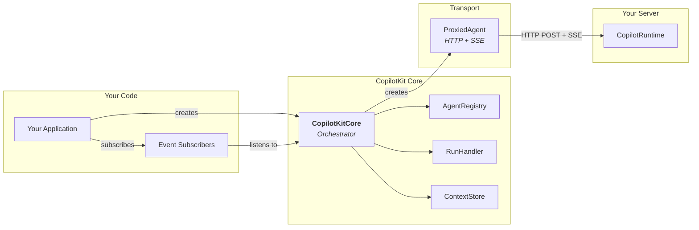
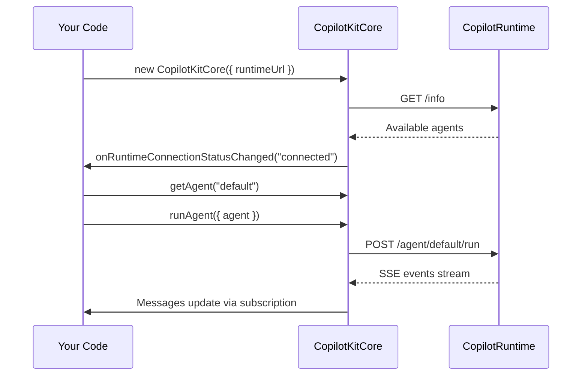
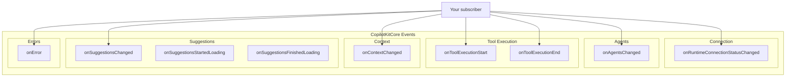
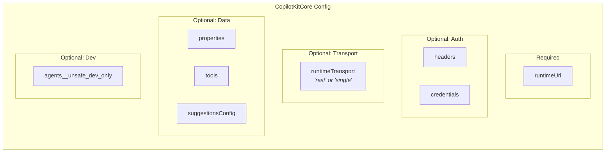
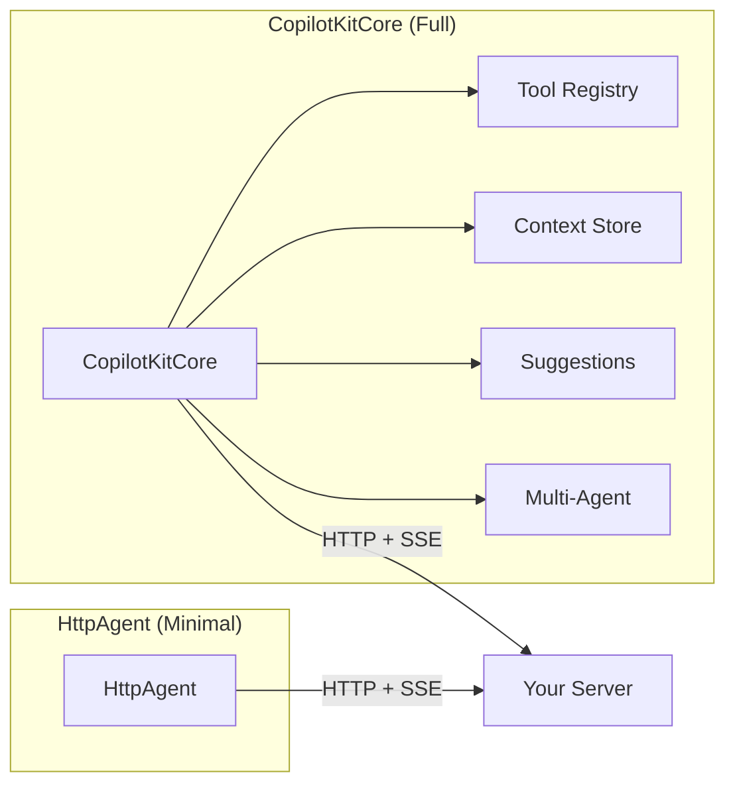

# Vanilla JavaScript Setup Guide

This guide shows how to use CopilotKit without React or Angular — using the core API directly. This works with any framework (Vue, Svelte, vanilla JS, Node.js, etc).

---

## What Talks to What



---

## Minimal Setup

### 1. Install

```bash
npm install @copilotkitnext/core
```

### 2. Create the core instance

```typescript
import { CopilotKitCore } from "@copilotkitnext/core";

const copilotKit = new CopilotKitCore({
  runtimeUrl: "http://localhost:3000/api/copilotkit",
});
```

### 3. Get an agent and send a message

```typescript
// Wait for runtime connection
const subscription = copilotKit.subscribe({
  onRuntimeConnectionStatusChanged: async ({ status }) => {
    if (status === "connected") {
      // Agents are now available
      const agent = copilotKit.getAgent("default");

      // Add a user message
      agent.addMessage({
        id: crypto.randomUUID(),
        role: "user",
        content: "Hello, what can you do?",
      });

      // Run the agent
      await copilotKit.runAgent({ agent });
    }
  },
});
```

That's it — `CopilotKitCore` handles connecting to the runtime, fetching agents, and managing the event lifecycle.



---

## Subscribing to Events

The core provides a rich subscription system — this is how you react to changes without a framework:

```typescript
const subscription = copilotKit.subscribe({
  // Connection lifecycle
  onRuntimeConnectionStatusChanged: ({ status }) => {
    // "disconnected" | "connecting" | "connected" | "error"
    updateConnectionUI(status);
  },

  // Agent availability
  onAgentsChanged: ({ agents }) => {
    console.log("Available agents:", Object.keys(agents));
    // agents is Record<string, AbstractAgent>
  },

  // Tool execution
  onToolExecutionStart: ({ toolName, args, agentId }) => {
    showToolSpinner(toolName);
  },
  onToolExecutionEnd: ({ toolName, result, error }) => {
    hideToolSpinner(toolName);
    if (error) showError(error);
  },

  // Context changes
  onContextChanged: ({ context }) => {
    console.log("Context updated:", context);
  },

  // Suggestions
  onSuggestionsChanged: ({ agentId, suggestions }) => {
    renderSuggestionChips(suggestions);
  },

  // Errors
  onError: ({ error, code, context }) => {
    // code: "AGENT_CONNECT_FAILED" | "AGENT_RUN_FAILED" |
    //       "TOOL_HANDLER_FAILED" | "TOOL_ARGUMENT_PARSE_FAILED" |
    //       "RUNTIME_INFO_FETCH_FAILED"
    console.error(`[${code}]`, error.message, context);
  },
});

// Clean up when done
subscription.unsubscribe();
```



---

## Subscribing to Agent Messages

In addition to core events, you can subscribe directly to an agent's events:

```typescript
const agent = copilotKit.getAgent("default");

const agentSub = agent.subscribe({
  // Messages changed (streaming text, new messages, etc.)
  onMessagesChanged: ({ messages }) => {
    renderChatMessages(messages);
  },

  // Agent state changed
  onStateChanged: ({ state }) => {
    updateStateDisplay(state);
  },

  // Run lifecycle
  onRunInitialized: () => {
    showTypingIndicator();
  },
  onRunFinalized: () => {
    hideTypingIndicator();
  },
  onRunFailed: ({ error }) => {
    showError(error);
  },

  // Granular event tracking
  onToolCallStartEvent: ({ event }) => {
    console.log("Tool call:", event.name);
  },
  onToolCallEndEvent: ({ toolCallArgs }) => {
    console.log("Tool args:", toolCallArgs);
  },
  onToolCallResultEvent: ({ event }) => {
    console.log("Tool result:", event.result);
  },
});

// Clean up
agentSub.unsubscribe();
```

---

## Registering Tools

```typescript
import { z } from "zod";

// Add a tool
copilotKit.addTool({
  name: "getWeather",
  description: "Get current weather for a location",
  parameters: z.object({
    city: z.string().describe("City name"),
    unit: z.enum(["celsius", "fahrenheit"]).default("celsius"),
  }),
  handler: async ({ city, unit }) => {
    const data = await fetch(`/api/weather?city=${city}&unit=${unit}`);
    return await data.text();
  },
  followUp: true, // Agent will continue after getting the result
});

// Remove a tool
copilotKit.removeTool("getWeather");
```

### Agent-Specific Tools

```typescript
// This tool is only available to the "research" agent
copilotKit.addTool({
  name: "searchPapers",
  description: "Search academic papers",
  agentId: "research", // Only this agent can call it
  parameters: z.object({ query: z.string() }),
  handler: async ({ query }) => {
    return await searchPapers(query);
  },
});
```

---

## Providing Context

```typescript
// Add context (returns an ID for later removal)
const contextId = copilotKit.addContext({
  description: "Current user session",
  value: JSON.stringify({
    userId: "user_123",
    role: "admin",
    currentPage: "/dashboard",
  }),
});

// Update context (remove + re-add)
copilotKit.removeContext(contextId);
const newContextId = copilotKit.addContext({
  description: "Current user session",
  value: JSON.stringify({
    userId: "user_123",
    role: "admin",
    currentPage: "/settings",
  }),
});

// Remove when no longer relevant
copilotKit.removeContext(newContextId);
```

---

## Constructor Options

```typescript
const copilotKit = new CopilotKitCore({
  // Required
  runtimeUrl: "http://localhost:3000/api/copilotkit",

  // Authentication
  headers: { Authorization: "Bearer my-token" },
  credentials: "include", // Forward cookies

  // Runtime transport mode
  runtimeTransport: "rest", // "rest" (default) or "single"

  // Custom properties forwarded to agents
  properties: {
    userId: "user_123",
    environment: "production",
  },

  // Initial tools
  tools: [
    {
      name: "myTool",
      parameters: z.object({ input: z.string() }),
      handler: async ({ input }) => `Result: ${input}`,
    },
  ],

  // Local agents (dev only — normally fetched from runtime)
  agents__unsafe_dev_only: {
    test: myLocalAgent,
  },
});
```



---

## Using HttpAgent Directly (No CopilotKit)

For the simplest possible setup, you can skip CopilotKit entirely and use AG-UI's `HttpAgent` directly:

```typescript
import { HttpAgent } from "@ag-ui/client";

const agent = new HttpAgent({
  agentId: "my-agent",
  url: "http://localhost:3000/api/copilotkit/agent/my-agent/run",
  headers: { Authorization: "Bearer token" },
});

// Subscribe to messages
agent.subscribe({
  onMessagesChanged: ({ messages }) => {
    console.log("Messages:", messages);
  },
});

// Send a message and run
agent.addMessage({
  id: crypto.randomUUID(),
  role: "user",
  content: "Hello!",
});

await agent.runAgent();
```

> **When to use this:** Only if you want zero abstraction and just need to talk to a single agent. You lose tools, context, suggestions, and multi-agent orchestration.



---

## Full Example: Simple Chat App (No Framework)

```typescript
import { CopilotKitCore } from "@copilotkitnext/core";
import { z } from "zod";

// DOM elements
const messagesDiv = document.getElementById("messages")!;
const input = document.getElementById("input") as HTMLInputElement;
const sendBtn = document.getElementById("send")!;
const statusSpan = document.getElementById("status")!;

// Initialize CopilotKit
const copilotKit = new CopilotKitCore({
  runtimeUrl: "/api/copilotkit",
});

let currentAgent: any = null;

// Subscribe to core events
copilotKit.subscribe({
  onRuntimeConnectionStatusChanged: ({ status }) => {
    statusSpan.textContent = status;
    if (status === "connected") {
      currentAgent = copilotKit.getAgent("default");
      setupAgentSubscription();
      input.disabled = false;
    }
  },
  onToolExecutionStart: ({ toolName }) => {
    appendMessage("system", `Running tool: ${toolName}...`);
  },
  onError: ({ error, code }) => {
    appendMessage("error", `[${code}] ${error.message}`);
  },
});

// Subscribe to agent messages
function setupAgentSubscription() {
  currentAgent.subscribe({
    onMessagesChanged: ({ messages }) => {
      messagesDiv.innerHTML = "";
      messages.forEach((msg) => appendMessage(msg.role, msg.content));
    },
  });
}

// Register a tool
copilotKit.addTool({
  name: "getCurrentTime",
  description: "Get the current date and time",
  parameters: z.object({}),
  handler: async () => new Date().toISOString(),
});

// Send message
async function sendMessage() {
  const text = input.value.trim();
  if (!text || !currentAgent) return;

  input.value = "";
  currentAgent.addMessage({
    id: crypto.randomUUID(),
    role: "user",
    content: text,
  });

  await copilotKit.runAgent({ agent: currentAgent });
}

sendBtn.addEventListener("click", sendMessage);
input.addEventListener("keydown", (e) => {
  if (e.key === "Enter") sendMessage();
});

// Helper
function appendMessage(role: string, content: string) {
  const div = document.createElement("div");
  div.className = `message ${role}`;
  div.textContent = `${role}: ${content}`;
  messagesDiv.appendChild(div);
}
```

```html
<!-- index.html -->
<div id="app">
  <div>Status: <span id="status">connecting...</span></div>
  <div id="messages"></div>
  <input id="input" disabled placeholder="Connecting..." />
  <button id="send">Send</button>
</div>
<script type="module" src="./main.ts"></script>
```
