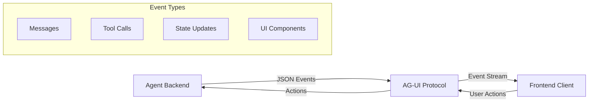

import { IntegrationsGrid } from "@/components/react/integrations";

## What is the AG-UI Protocol?

The AG-UI (Agent-User Interaction) Protocol is an open, lightweight standard that enables real-time communication between AI agents and frontend applications. It streams a unified sequence of JSON events over standard HTTP, Server-Sent Events (SSE), or WebSockets, maintaining perfect synchronization between agent behavior and user interface updates.

<video src="/images/coagents/agentic-chat-ui.mp4" className="rounded-lg shadow-xl" loop playsInline controls autoPlay muted />

Unlike traditional REST APIs that require custom integration for each agent framework, AG-UI provides a standardized event-based protocol that works consistently across different agent backends and frontend technologies.

<Callout title="Ready to Use AG-UI Protocol?">
AG-UI protocol support is built into many agent frameworks, enabling seamless integration with CopilotKit's React components.

**Choose your integration to see framework-specific AG-UI implementation details.** 
<IntegrationsGrid targetPage="ag-ui-protocol" suppressDirectToLLM />
</Callout>

## Key Features

### **Real-time Event Streaming**
Agents emit events as they occur, providing instant UI feedback without waiting for complete responses.

### **Standardized Event Types**
Consistent event schema across all frameworks including messages, tool calls, state updates, and lifecycle events.

### **Bidirectional Communication**
Frontend can send user actions back to agents, enabling interactive workflows and human-in-the-loop patterns.

### **Framework Agnostic**
Works with any agent framework (LangGraph, CrewAI, Mastra, etc.) and any frontend technology (React, Vue, Svelte).

### **State Synchronization**
Maintains shared mutable state between agents and UI through snapshots and incremental diffs.

### **Tool Orchestration**
Shows progress and results of agent tool calls, with support for human approval workflows.

## When to Use AG-UI Protocol

Consider AG-UI Protocol when you need:

- **Real-time agent feedback** in your user interface
- **Interactive agent workflows** with user input and approval
- **Consistent integration** across multiple agent frameworks
- **Transparent agent behavior** visible to users
- **Collaborative experiences** between humans and agents
- **Dynamic UI updates** based on agent state changes
- **Tool call visualization** and progress tracking
- **Multi-agent coordination** through a unified interface

### **Protocol Ecosystem**

AG-UI complements other agent protocols:

- **MCP (Model Context Protocol)**: Connects agents to tools and APIs
- **A2A (Agent-to-Agent)**: Manages communication between multiple agents  
- **AG-UI**: Bridges agents and user interfaces

Together, these protocols create a complete stack for building intelligent, interactive applications.

## Core Event Types

The AG-UI protocol defines several standard event types that agents can emit:

### **Lifecycle Events**
- `lifecycle.started` - Agent begins processing
- `lifecycle.completed` - Agent finishes task
- `lifecycle.error` - Error occurred during processing

### **Message Events**
- `text.delta` - Streaming text content (like chat messages)
- `text.complete` - Final text content

### **Tool Events**
- `tool.call.start` - Agent begins using a tool
- `tool.call.result` - Tool returns data
- `tool.call.error` - Tool execution failed

### **State Events**
- `state.snapshot` - Full state synchronization
- `state.delta` - Incremental state updates
- `state.patch` - Specific state modifications

### **UI Events**
- `ui.render` - Display custom UI components
- `ui.input` - Request user input
- `ui.action` - User interaction occurred

## How AG-UI Works

1. **Agent emits events** as it processes tasks and makes decisions
2. **Protocol streams events** to the frontend in real-time
3. **Frontend updates UI** based on received events
4. **User interactions** are sent back to the agent
5. **Agent responds** with new events, creating a continuous loop

## Benefits for Developers

### **Simplified Integration**
No need to build custom WebSocket handlers or parse agent-specific formats. AG-UI provides a unified interface.

### **Enhanced User Experience**
Users see agent progress in real-time, understand what's happening, and can provide input when needed.

### **Framework Flexibility**
Switch between agent frameworks without changing frontend code. AG-UI abstracts the differences.

### **Scalable Architecture**
Build complex multi-agent systems with consistent UI patterns and state management.

### **Reduced Development Time**
Focus on agent logic and user experience rather than building communication infrastructure. 