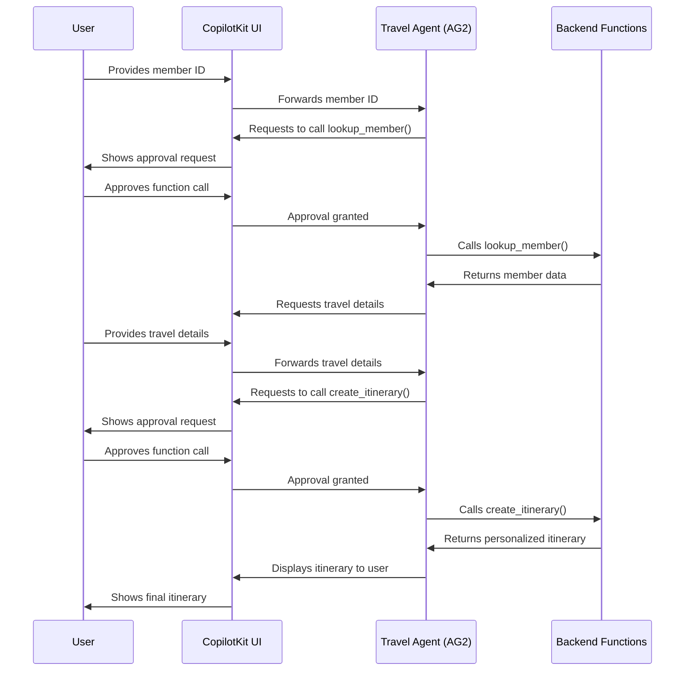

import RunAndConnectAgentSnippet from "@/snippets/coagents/run-and-connect-agent.mdx";
import InstallSDKSnippet from "@/snippets/install-sdk.mdx";

<video
  src="https://cdn.copilotkit.ai/docs/copilotkit/images/coagents/node-hitl.mp4"
  className="rounded-lg shadow-xl"
  loop
  playsInline
  controls
  autoPlay
  muted
/>

<Callout type="info">
The illustration above is from the [CoAgent Starter](https://github.com/CopilotKit/CopilotKit/tree/main/examples/coagents-starter), included here for demonstration purposes.
</Callout>

## What is Human-in-the-Loop?

Human-in-the-Loop (HITL) adds a layer of human oversight to your AI agents. It allows agents to request human approval before taking important actions, creating a perfect balance between AI efficiency and human judgment. For a deeper dive into HITL concepts, check out the [AG2 documentation](https://docs.ag2.ai/latest/docs/user-guide/basic-concepts/human-in-the-loop).

## Our Enhanced Travel Agent

In this guide, we'll enhance our travel agent from the [Quick Start](/ag2/quickstart/ag2) guide with HITL functionality. The best part? We only need to modify the AG2 backend, no changes to the CopilotKit frontend are required!

You can find the complete code for this example in the [AG2-CopilotKit starter](https://github.com/ag2ai/ag2-copilotkit-starter/blob/main/agent-py/hitl_workflow.py) repository.

**Our travel agent will:**

- Ask for a member ID
- Request human approval before accessing customer data
- Retrieve travel preferences
- Seek human approval again before generating an itinerary



## Implementation

Let's build our HITL-enabled travel planning system step by step:

### Step 1: Setup and Prerequisites

First, we need to set up our project environment:

- **Reuse the Quick Start project**: This guide builds directly on the [Quick Start](/ag2/quickstart/ag2) example. Begin by completing that setup if you haven't already.
- **No CopilotKit changes needed**: The HITL implementation only requires changes to the AG2 backend. Your existing CopilotKit frontend will automatically handle the approval UI without any modifications.

Let's start by importing the necessary libraries and setting up the basic structure. You can either create the `agent-py/hitl_workflow.py` file from scratch if you wish to follow along, or you can copy the code from the [AG2-CopilotKit starter](https://github.com/ag2ai/ag2-copilotkit-starter/blob/main/agent-py/hitl_workflow.py) repository.

```python title="agent-py/hitl_workflow.py"
import os
from typing import Any, Annotated

from autogen import ConversableAgent, LLMConfig, register_function
from fastapi import FastAPI

from fastagency import UI
from fastagency.adapters.awp import AWPAdapter
from fastagency.runtimes.ag2 import Workflow

# Configure LLM
llm_config = LLMConfig(
    model="gpt-4o-mini",
    api_key=os.getenv("OPENAI_API_KEY"),
    temperature=0.8,
)

wf = Workflow()

# Initial message to user
INITIAL_MESSAGE = """Hi there! 👋 I'm your personal Travel Guide, here to help you plan an unforgettable trip.

To get started, could you please share your membership ID? This will help me tailor recommendations based on your preferences and travel style.

(Hint: You can try using one of these IDs: P12345, P67890, S12345, S67890. And when the agent is asking your permission to execute the function, please say "continue" to proceed.)
"""
```

### Step 2: Create Functions Requiring Approval

In this step, we'll create functions that will require human approval before execution. These represent both sensitive operation like accessing customer data and non-sensitive operations like generating itineraries.

#### Database Simulation

First, let's create a mock customer database:

```python title="agent-py/hitl_workflow.py"
# Mock customer database
MEMBER_DATABASE = {
    "P12345": {
        "name": "Alex Johnson",
        "membership": "premium",
        "preferences": [
            "5-star hotels",
            "fine dining",
            "private tours",
            "exclusive experiences",
        ],
    },
    "P67890": {
        "name": "Taylor Williams",
        "membership": "premium",
        "preferences": [
            "boutique hotels",
            "local cuisine",
            "cultural experiences",
            "adventure activities",
        ],
    },
    "S12345": {
        "name": "Jordan Smith",
        "membership": "standard",
        "preferences": ["budget-friendly", "popular attractions"],
    },
    "S67890": {
        "name": "Casey Brown",
        "membership": "standard",
        "preferences": ["family-friendly", "group tours"],
    },
}
```

This mock database simulates what might be a real customer database in a production application. In a real application, this would likely be an API call to a secure database.

#### Member Lookup Function

Next, we'll create a function that requires human approval to access customer information:

```python title="agent-py/hitl_workflow.py"
# Function to look up member information
def lookup_member(
    member_id: Annotated[str, "User's membership ID"]
) -> dict[str, Any]:
    """Look up member details from the database"""
    # This function will require human approval before execution
    # because it accesses potentially sensitive customer information
    if member_id in MEMBER_DATABASE:
        return {
            "found": True,
            "name": MEMBER_DATABASE[member_id]["name"],
            "membership": MEMBER_DATABASE[member_id]["membership"],
            "preferences": MEMBER_DATABASE[member_id]["preferences"]
        }
    else:
        return {
            "found": False,
            "message": "Member ID not found in our system"
        }
```
This function accesses customer data based on a member ID. Here we are simulating a database lookup. In a real application, this would be a call to a secure database.

#### Itinerary Creation Function

We'll also create a function for generating travel itineraries, which will also require approval:

```python title="agent-py/hitl_workflow.py"
# Function to create personalized itinerary
def create_itinerary(
    destination: Annotated[str, "Travel destination (e.g., New York, Paris, Tokyo)"],
    days: Annotated[int, "Number of days for the trip"],
    membership_type: Annotated[str, "Type of membership (premium or standard)"],
    preferences: Annotated[list, "Traveler preferences (e.g., fine dining, cultural tours)"]
) -> dict[str, Any]:
    """Create a realistic, personalized travel itinerary based on member details."""
    # This function will require human approval before execution
    # because it's generating content that should be reviewed
    
    if not destination or days <= 0:
        return {"error": "Invalid destination or number of days."}

    itinerary = []
    for day in range(1, days + 1):
        day_plan = {
            "day": f"Day {day}",
            "morning": "",
            "afternoon": "",
            "evening": "",
        }

        if membership_type == "premium":
            day_plan["morning"] = f"Private tour or exclusive experience aligned with: {', '.join(preferences)}"
            day_plan["afternoon"] = "Relax at a luxury spa, explore high-end shopping districts, or enjoy curated local experiences."
            day_plan["evening"] = "Dine at a top-rated restaurant with a reservation made just for you."
        else:
            day_plan["morning"] = f"Join a small group tour covering key attractions related to: {', '.join(preferences)}"
            day_plan["afternoon"] = "Take a self-guided walk or visit a popular local spot recommended by travel experts."
            day_plan["evening"] = "Enjoy a casual dinner at a popular neighborhood restaurant."

        itinerary.append(day_plan)

    return {
        "destination": destination,
        "days": days,
        "itinerary": itinerary,
        "accommodation": "5-star hotel" if membership_type == "premium" else "3-star or boutique hotel",
        "transportation": "Private car service" if membership_type == "premium" else "Local transport and shared rides",
        "is_draft": True
    }
```

This function generates personalized itineraries based on user preferences.

### Step 3: Configure AG2 Agent with HITL

Now, we'll configure our AG2 agent to use Human-in-the-Loop functionality.

#### System Message

First, let's create a detailed system message that guides the travel agent's behavior:
```python title="agent-py/hitl_workflow.py"
SYSTEM_MESSAGE="""You are a professional travel agent who creates detailed, personalized day-by-day travel itineraries for any destination.

WORKFLOW:
1. Greet the customer warmly and ask for their member ID.
2. Use the `lookup_member` function to retrieve their profile information.
3. Address the customer by name and acknowledge their membership level (premium or standard).
4. Ask for their desired destination, specific cities (if applicable), travel start date, and trip duration.
    - If the customer mentions only a country (e.g., "USA" or "Croatia"), ask them which cities they'd like to visit.
    - If they're unsure, suggest 2–3 well-known cities in that country based on general travel knowledge.
5. Use the `create_itinerary` function to generate a personalized day-by-day itinerary that:
    - Aligns with their membership level (e.g., premium → luxury hotels, fine dining; standard → comfort & value).
    - Includes named hotels, restaurants, attractions, and activities based on typical travel knowledge for the selected cities.
    - Provides specific daily structure: morning, afternoon, evening.
    - Minimizes travel time by grouping activities geographically.
    - Feels locally authentic and realistic even though this is a demo (do not say "sample" or "example" in the response).
    - If the user provides no preferences, generate a balanced mix of culture, food, leisure, and exploration.
6. Present the itinerary with clear headers (e.g., Day 1, Day 2), using markdown-style formatting if supported.
7. Ask if the customer would like to modify any days, switch cities, or add/remove experiences.
8. Once finalized, confirm the itinerary and thank them for using the service.

Tone: Friendly, professional, and knowledgeable. You are a helpful concierge who wants the user to have an amazing experience.

Important: When a membership ID is not found in the system, politely inform the user that something may be wrong and ask them to double-check their ID."""
```

This system message instructs our travel agent how to behave and what steps to follow. Note that it references our functions that will require human approval.

#### Function Registration with HITL

Now comes the critical part, registering functions with Human-in-the-Loop approval:

```python title="agent-py/hitl_workflow.py"
@wf.register(name="hitl_workflow", description="A travel itinerary generator with human approval")
def hitl_workflow(ui: UI, params: dict[str, Any]) -> str:
    initial_message = ui.text_input(
        sender="Workflow",
        recipient="User",
        prompt=INITIAL_MESSAGE,
    )
    
    # Create the travel agent
    with llm_config:
        travel_agent = ConversableAgent(
                name="travel_agent",
                system_message=SYSTEM_MESSAGE
            )
        
    # Create the customer agent (human input)
    customer = ConversableAgent(
        name="customer",
        human_input_mode="ALWAYS",  # Always ask for human input
    )

    # Register the functions for the travel agent
    register_function(
        lookup_member,
        caller=travel_agent,  # The agent that can call this function
        executor=customer,    # The agent that must approve the call
        description="Look up member details from the database"
    )

    register_function(
        create_itinerary,
        caller=travel_agent,  # The agent that can call this function
        executor=customer,    # The agent that must approve the call
        description="Create a personalized travel itinerary based on member details"
    )

    # Start the conversation
    response = customer.run(
        travel_agent,
        message=initial_message,
        summary_method="reflection_with_llm"
    )

    return ui.process(response)

# Set up FastAPI with the AWP adapter
def without_customer_messages(message: Any) -> bool:
    return not (message.type == "text" and message.content.sender == "customer")


adapter = AWPAdapter(
    provider=wf, wf_name="hitl_workflow", filter=without_customer_messages
)
app = FastAPI()
app.include_router(adapter.router)
```

The key to HITL functionality is in the `register_function` calls:

  - `caller=travel_agent`: Specifies that the travel agent can call this function
  - `executor=customer`: Specifies that the customer (the human) must approve the function call before it can execute

**This creates our approval workflow:**

  - When the travel agent attempts to call a function
  - The request is routed to the customer agent
  - A human must approve the function call in the UI
  - Only after approval will the function actually execute


### Step 4: Launch Your Application

Now that we've built our HITL-enabled travel agent, let's launch it:

- Save the file as `hitl_workflow.py` in your agent-py directory
- Start the AG2 backend. From the root of your project, run:
```bash
cd agent-py
uvicorn hitl_workflow:app --port 8008 --reload
```
- In a separate terminal, start the CopilotKit frontend:
```bash
cd ui
pnpm run dev
```
- Visit [http://localhost:3000](http://localhost:3000) to interact with your HITL-enabled travel agent!

## Example Interaction flow

When you interact with your travel agent:

- The agent asks for your member ID
- When you provide it, the agent requests permission to look up your data
(You'll see an approval prompt in the UI, type **continue** in the chat box to approve the function call)
- After approval, the agent retrieves your data and asks for travel details
- When you provide travel details, the agent requests permission to create an itinerary
(Another approval prompt appears, type **continue** in the chat box to approve)
- After approval, the agent generates and displays your personalized itinerary

This approach ensures sensitive operations like accessing customer data and creating itineraries only happen with explicit human approval.

<Callout type="info">
Whenever the `travel_agent` wants to call a function, it will send a message in the chat window for approval, For example:

**AG2 wants to invoke tool: lookup_member**

**Replying as `customer`. Provide feedback to `travel_agent`. Answer continue to skip and use auto-reply, or type 'exit' to end the conversation:**


In such cases, you can type **continue** to approve the function call or **exit** to end the conversation.
</Callout>


## Conclusion

You've successfully enhanced your travel agent with Human-in-the-Loop functionality! By requiring human approval for sensitive operations, you've created a more secure and transparent AI application.

## Next Steps

To explore more advanced features, check out how to enable your AI agents to directly interact with your application's UI in our Frontend Actions guide.
