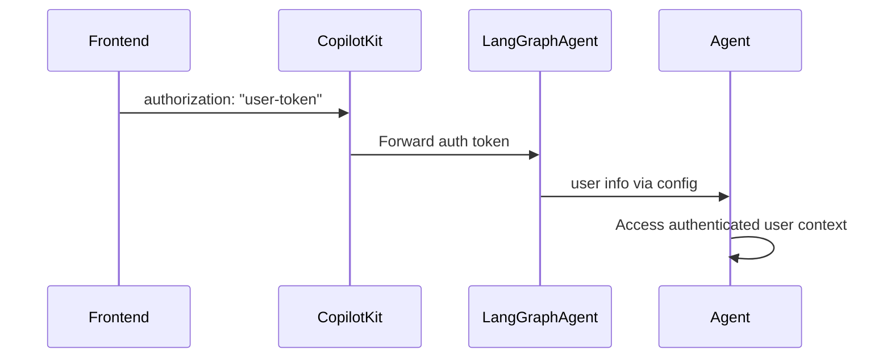

## Overview

CopilotKit supports user authentication for LangGraph agents in two deployment modes:

- **LangGraph Platform**: Uses built-in authentication with `@auth.authenticate` decorator
- **Self-hosted**: Uses dynamic agent configuration to pass authentication context

Both approaches enable your agents to access authenticated user context and implement proper authorization.

## How It Works



## Frontend Setup

Pass your authentication token via the `properties` prop:

```tsx
<CopilotKit
  runtimeUrl="/api/copilotkit"
  properties={{
    authorization: userToken, // Forwarded as Bearer token
  }}
>
  <YourApp />
</CopilotKit>
```

**Note**: For LangGraph Platform, the `authorization` property is forwarded as a Bearer token.

## LangGraph Platform Deployment

**For agents deployed to LangGraph Platform**, authentication works out of the box with the `@auth.authenticate` decorator.

### Setup Authentication Handler

```python
# auth.py in your LangGraph Platform deployment
from langgraph_sdk import Auth

auth = Auth()

@auth.authenticate
async def authenticate(authorization: str | None):
    if not authorization or not authorization.startswith("Bearer "):
        raise Auth.exceptions.HTTPException(status_code=401, detail="Unauthorized")

    token = authorization.replace("Bearer ", "")
    user_info = validate_your_token(token)  # Your validation logic

    return {
        "identity": user_info["user_id"],
        "role": user_info.get("role"),
        "permissions": user_info.get("permissions", [])
    }
```

### Access User in Agent

```python
async def my_agent_node(state: AgentState, config: RunnableConfig):
    # Access user from LangGraph Platform authentication
    user_info = config["configuration"]["langgraph_auth_user"]
    user_id = user_info["identity"]
    user_role = user_info.get("role")

    # Your agent logic with user context
    return state
```

For complete implementation details, see the [LangGraph Platform Authentication documentation](https://langchain-ai.github.io/langgraph/concepts/auth/#authentication).

## Self-hosted Deployment

**For self-hosted agents**, you need to manually configure authentication context through dynamic agent creation.

### Setup Dynamic Agent Configuration

```python
# demo.py - Configure agent with authentication context
from copilotkit import CopilotKitRemoteEndpoint, LangGraphAgent

sdk = CopilotKitRemoteEndpoint(
    agents=lambda context: [
        LangGraphAgent(
            name="sample_agent",
            description="Agent with authentication support",
            graph=graph,
            langgraph_config={
                "configurable": {
                    "copilotkit_auth": context["properties"].get("authorization")
                }
            }
        )
    ],
)
```

### Access User in Agent

```python
async def my_agent_node(state: AgentState, config: RunnableConfig):
    # Handle authentication for self-hosted mode
    auth_token = config["configurable"].get("copilotkit_auth")
    if auth_token:
        user_info = validate_your_token(auth_token)
        user_id = user_info["user_id"]
        user_role = user_info.get("role")
    else:
        user_id = "anonymous"
        user_role = None

    # Your agent logic with user context
    return state
```

## Universal Authentication Pattern

For agents that work in both environments, use this pattern:

```python
async def my_agent_node(state: AgentState, config: RunnableConfig):
    user_id = "anonymous"
    user_role = None

    # LangGraph Platform mode
    if "configuration" in config and "langgraph_auth_user" in config["configuration"]:
        user_info = config["configuration"]["langgraph_auth_user"]
        user_id = user_info["identity"]
        user_role = user_info.get("role")

    # Self-hosted mode
    elif "configurable" in config and "copilotkit_auth" in config["configurable"]:
        auth_token = config["configurable"]["copilotkit_auth"]
        if auth_token:
            user_info = validate_your_token(auth_token)
            user_id = user_info["user_id"]
            user_role = user_info.get("role")

    # Your agent logic with user context
    return state
```

## Security Notes

### LangGraph Platform

- **Token Validation**: Automatic validation via `@auth.authenticate` handler
- **Built-in Security**: LangGraph Platform handles token parsing and validation
- **User Scoping**: Use authorization handlers to scope resources to authenticated users

### Self-hosted

- **Manual Validation**: You must implement token validation in your agent logic
- **Context Passing**: Authentication context passed through agent configuration
- **Security Responsibility**: Ensure proper token validation and user scoping

### General Best Practices

- **Permission Checks**: Implement role-based access control in your agents
- **Token Security**: Use secure token generation and validation
- **User Scoping**: Always scope data access to authenticated users

For comprehensive authentication patterns, authorization handlers, and security best practices, refer to the [LangGraph Platform Authentication documentation](https://langchain-ai.github.io/langgraph/concepts/auth/#authentication).

## Troubleshooting

### Common Issues

**Token not reaching agent**:

- Ensure you're passing `authorization` in the `properties` prop
- For self-hosted: Verify dynamic agent configuration is set up correctly

**Invalid token format**:

- CopilotKit automatically adds the `Bearer ` prefix for LangGraph Platform
- For self-hosted: Handle token format in your validation logic

**User info not available**:

- **LangGraph Platform**: Verify your `@auth.authenticate` handler is properly configured
- **Self-hosted**: Check that `copilotkit_auth` is properly passed in `langgraph_config`

**Authentication works locally but not in production**:

- Ensure you're using the correct deployment mode (LangGraph Platform vs self-hosted)
- Verify environment-specific configuration differences

## Next Steps

- [Configure your LangGraph Platform deployment →](/coagents/quickstart/langgraph)
- [Learn about agent state management →](/coagents/shared-state)
- [Implement human-in-the-loop workflows →](/coagents/human-in-the-loop)