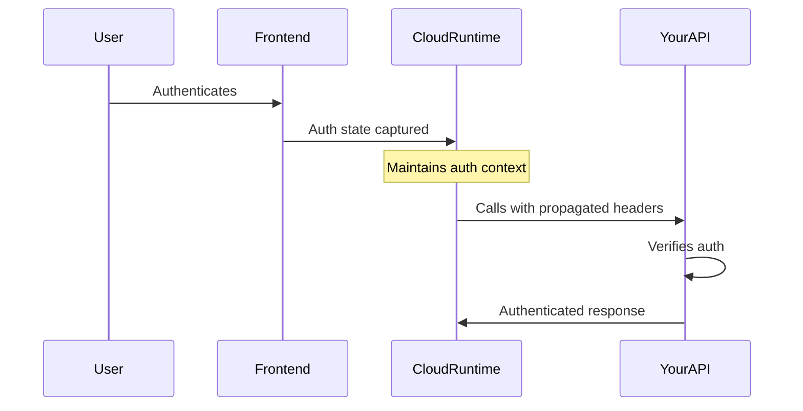

## Introduction

Copilot Cloud enables secure propagation of authentication state within AI conversations, allowing your copilot to interact with authenticated backend services and tools on behalf of the user.

This feature is only available with [Copilot Cloud](https://cloud.copilotkit.ai/).

## Overview

When building AI copilots that interact with user-specific data or services (like calendars, emails, or custom APIs), you need to ensure that:

1. The user is properly authenticated
2. The authentication state is securely propagated to backend tools
3. The copilot maintains proper authorization context

## How It Works

### Authentication Flow

1. Your frontend app configures authentication state using `authConfig_c`
2. When a user authenticates, their auth state (headers, metadata) is securely captured
3. Copilot Cloud Runtime maintains this auth context throughout the conversation
4. When the LLM or runloop needs to call your registered endpoints/tools:
   - All auth headers are automatically propagated
   - Your endpoints receive the same auth context
   - Tools can verify user identity and permissions

### Example Scenario



This means your backend tools and APIs:

- Receive the same authentication headers as your frontend
- Can verify user identity and permissions
- Maintain security context throughout the AI interaction
- Don't need additional auth handling specific to CopilotKit

## Frontend Implementation

### Configure Authentication State

```tsx
import { CopilotKit } from "@copilotkit/react-core";

interface AuthState {
  status: "authenticated" | "unauthenticated";
  authHeaders: Record<string, string>;
  userId?: string;
  metadata?: Record<string, any>;
}

// Your SignInComponent component
function SignInComponent({
  onSignInComplete,
}: {
  onSignInComplete: (authState: AuthState) => void;
}) {
  const handleAuth = async () => {
    // Your auth logic (e.g., OAuth, custom auth)
    const authState = {
      status: "authenticated",
      authHeaders: {
        Authorization: "Bearer your_token",
        // Add any other headers needed by your backend
      },
      userId: "user_123",
      metadata: {
        email: "user@example.com",
        // Any other user context needed by tools
      },
    };

    onAuthComplete(authState);
  };

  return <button onClick={handleAuth}>Authenticate</button>;
}

// Root configuration
export default function App() {
  return (
    <CopilotKit
      publicApiKey={process.env.COPILOTKIT_PUBLIC_API_KEY}
      authConfig_c={{
        SignInComponent,
      }}
    >
      {/* Your app */}
    </CopilotKit>
  );
}
```

## Backend Integration

Your backend endpoints will receive the authentication context automatically. Example of a tool endpoint:

```typescript
// Example backend endpoint
async function handleCalendarRequest(req, res) {
  // Auth headers from the frontend are automatically available
  const authHeader = req.headers.authorization;
  const userId = req.headers["x-user-id"];

  // Verify authentication as you normally would
  if (!isValidAuth(authHeader)) {
    return res.status(401).json({ error: "Unauthorized" });
  }

  // Proceed with authenticated operation
  const calendar = await getCalendarForUser(userId);
  return res.json(calendar);
}
```

## Best Practices

1. **Authentication Headers**

   - Include all necessary auth tokens
   - Add relevant user context
   - Consider token expiration
   - Handle refresh tokens if needed

2. **Backend Security**

   - Always verify auth headers
   - Implement proper validation
   - Use secure token verification
   - Handle expired tokens gracefully

3. **Error Handling**
   - Provide clear auth errors
   - Handle token refresh scenarios
   - Implement proper fallbacks
   - Give helpful user feedback
