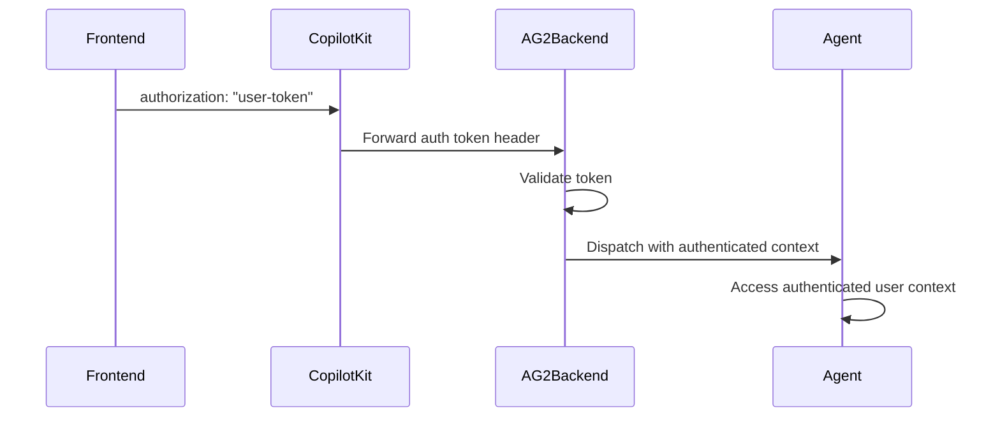

## Overview

CopilotKit supports user authentication for AG2 backends in two deployment modes:

- **LangGraph Platform equivalent**: managed runtime forwarding to your AG2 `/chat` endpoint
- **Self-hosted runtime**: your own CopilotKit runtime forwarding to your AG2 `/chat` endpoint

Both approaches let your AG2 backend access authenticated user context and enforce authorization.

This pattern enables your backend to:

- Validate user tokens before dispatching the agent
- Attach authenticated user context to agent state/tools
- Enforce authorization decisions server-side

<Callout type="info">
  CopilotKit consumes AG-UI protocol events streamed by AG2 over <code>/chat</code>. See the <a href="https://docs.ag2.ai/latest/docs/user-guide/ag-ui/" target="_blank">AG2 AG-UI integration docs</a>.
</Callout>

## How It Works



## Frontend Setup

Pass your authentication token via the `properties` prop:

```tsx
<CopilotKit
  runtimeUrl="/api/copilotkit"
  properties={{
    authorization: userToken, // forwarded to AG2 /chat
  }}
>
  <YourApp />
</CopilotKit>
```

**Note**: The `authorization` property is forwarded to your AG2 `/chat` endpoint as a request header.

## LangGraph Platform Deployment

**For managed deployments**, protect your AG2 `/chat` endpoint with token-header validation.

### Setup Authentication Handler

```python
from fastapi import FastAPI, Header, HTTPException
from fastapi.responses import StreamingResponse
from autogen import ConversableAgent, LLMConfig
from autogen.ag_ui import AGUIStream, RunAgentInput

agent = ConversableAgent(
    name="assistant",
    system_message="You are a helpful assistant.",
    llm_config=LLMConfig({"model": "gpt-4o-mini"}),
)

stream = AGUIStream(agent)
app = FastAPI()

def validate_your_token(token: str) -> dict:
    # Replace this with your own validation logic.
    if token != "valid-token":
        raise HTTPException(status_code=401, detail="Unauthorized")
    return {"user_id": "user_123", "role": "member"}

@app.post("/chat")
async def run_agent(
    message: RunAgentInput,
    accept: str | None = Header(None),
    authorization: str | None = Header(None),
):
    if not authorization:
        raise HTTPException(status_code=401, detail="Missing authorization header")

    token = authorization.replace("Bearer ", "")
    user_info = validate_your_token(token)

    # Use user_info to scope tools, state, and data access before dispatch.
    return StreamingResponse(
        stream.dispatch(message, accept=accept),
        media_type=accept or "text/event-stream",
    )
```

### Access User in Agent

Use validated user identity to scope tool calls and data access:

```python
from typing import Annotated
from autogen import ContextVariables

@agent.register_for_llm(description="Return account data for the authenticated user.")
def get_account_data(
    context: ContextVariables,
    account_id: Annotated[str, "The target account id"],
) -> dict:
    user = context.get("auth_user")
    if not user:
        return {"error": "unauthorized"}
    # Example check: ensure user can access this account
    if account_id not in user.get("allowed_accounts", []):
        return {"error": "forbidden"}
    return {"account_id": account_id, "owner": user["user_id"]}
```

## Self-hosted Deployment

**For self-hosted deployments**, use the same `/chat` header-validation pattern in your own FastAPI service.

### Setup Dynamic Agent Configuration

```python
from fastapi import FastAPI, Header, HTTPException
from fastapi.responses import StreamingResponse
from autogen import ConversableAgent, LLMConfig
from autogen.ag_ui import AGUIStream, RunAgentInput

agent = ConversableAgent(
    name="assistant",
    system_message="You are a helpful assistant.",
    llm_config=LLMConfig({"model": "gpt-4o-mini"}),
)

stream = AGUIStream(agent)
app = FastAPI()

@app.post("/chat")
async def run_agent(
    message: RunAgentInput,
    accept: str | None = Header(None),
    authorization: str | None = Header(None),
):
    if not authorization:
        raise HTTPException(status_code=401, detail="Unauthorized")
    # Validate token here, then dispatch
    return StreamingResponse(
        stream.dispatch(message, accept=accept),
        media_type=accept or "text/event-stream",
    )
```

### Access User in Agent

After token validation, persist user identity in request-scoped context and enforce access checks in AG2 tools/state reads.

## Universal Authentication Pattern

For backends that run in both managed and self-hosted modes, use this pattern:

```python
def extract_user_from_auth_header(authorization: str | None) -> dict | None:
    if not authorization:
        return None
    token = authorization.replace("Bearer ", "")
    return validate_your_token(token)
```

Then:

- Read `authorization` on `/chat`
- Validate token before `stream.dispatch(...)`
- Attach user context for tool/state authorization
- Deny unauthorized or out-of-scope access

## Security Notes

### LangGraph Platform

- **Token Validation**: Validate tokens on your AG2 `/chat` endpoint
- **User Scoping**: Scope data access by authenticated user identity

### Self-hosted

- **Manual Validation**: Implement and maintain your own validation logic
- **Header Forwarding**: Ensure your runtime forwards `authorization` to AG2

### General Best Practices

- **Permission Checks**: Enforce role-based checks in AG2 tools
- **Transport Security**: Serve `/chat` over HTTPS
- **Least Privilege**: Return only data needed for the current user/task

## Troubleshooting

### Common Issues

**Token not reaching backend**:

- Ensure you're passing `authorization` in `properties`
- Confirm your runtime forwards headers to AG2 `/chat`

**Invalid token format**:

- Handle both raw tokens and `Bearer <token>` formats consistently

**Unexpected anonymous access**:

- Verify `authorization` checks happen before calling `stream.dispatch(...)`

## Next Steps

- [Configure chat UI with AG2 backend ->](/ag2/agentic-chat-ui)
- [Learn about shared state ->](/ag2/shared-state)
- [Implement human-in-the-loop workflows ->](/ag2/human-in-the-loop)
