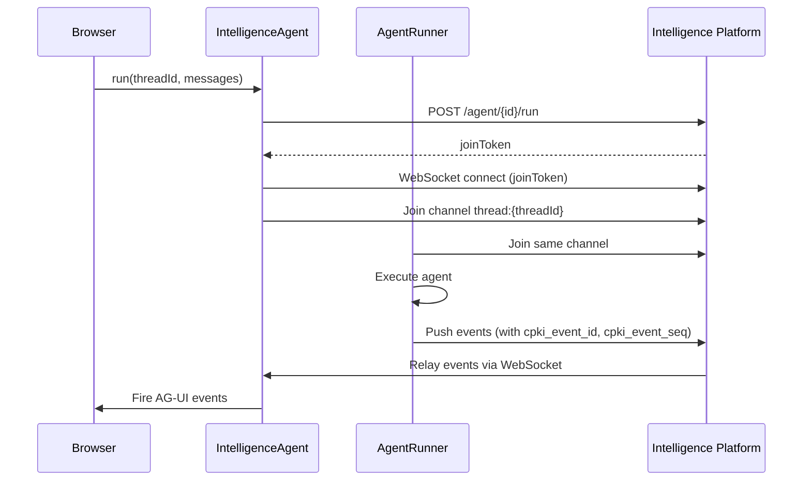

## What are threads?

A thread is a persistent, server-side container for a multi-turn conversation between a user and an agent. Unlike ephemeral chat sessions that disappear when the page reloads, threads store the full event history — every message, tool call, and state change — so conversations can be paused, resumed, and replayed across sessions and devices.

Threads are a platform-level concept, not tied to any specific agent framework. Whether your backend uses LangGraph, Mastra, CrewAI, or any other framework, threads work the same way.

## Key concepts

### Thread vs. Run

A **thread** is the durable container. A **run** is a single agent execution within that thread. One thread can have many runs — each time the user sends a message and the agent responds, that's a new run. The thread accumulates events across all its runs.

### The three layers

Thread functionality spans all three layers of the CopilotKit architecture:

| Layer | Component | Role |
|-------|-----------|------|
| **Frontend** | `useThreads` hook | Lists, renames, archives, and deletes threads. Subscribes to realtime metadata updates. |
| **Frontend** | `IntelligenceAgent` | Client-side AG-UI agent that connects to threads via WebSocket. Handles starting new runs and reconnecting to existing ones. |
| **Runtime** | `IntelligenceAgentRunner` | Server-side runner that executes agents and relays events through Phoenix channels. Stamps each event with sequence metadata. |
| **Platform** | Intelligence Platform | Stores threads, runs, and events durably. Provides WebSocket infrastructure and REST APIs. |

### Auto-naming

When a new thread is created and the first run completes, the runtime automatically generates a short name (2–5 words) using the LLM. This runs asynchronously — it doesn't block thread creation. The generated name is pushed to all clients via the `renamed` WebSocket event.

Auto-naming is enabled by default. Disable it with `generateThreadNames: false` on the runtime. Users can always override the generated name via `renameThread()`.

### Archive vs. delete

Threads support two removal operations with different semantics:

- **Archive** — a soft delete. The thread remains in the database with `archived: true`. It disappears from the default list but can be shown again with `includeArchived: true`. The platform also supports **unarchive** — the `unarchived` metadata event restores the thread to the active list.
- **Delete** — permanent and irreversible. The thread record is removed from the database entirely.

Neither operation has a built-in confirmation flow — your application should implement its own if needed.

### Event sequencing

Every event in a thread is stamped with two pieces of metadata:
- **`cpki_event_id`** — a unique identifier for the event
- **`cpki_event_seq`** — a monotonically increasing sequence number within the thread

These enable reliable replay. When a client reconnects to a thread, it sends its `lastSeenEventId`, and the platform responds with only the events that occurred after that point.

## How it works

### Starting a new conversation (run flow)

1. The client calls `run()` on the `IntelligenceAgent` with a thread ID and messages.
2. The agent sends a REST request to the runtime, which creates or retrieves the thread from the Intelligence Platform.
3. The platform returns a `joinToken` for WebSocket authentication.
4. Both the client agent and server runner join the same Phoenix channel (`thread:{threadId}`).
5. The runner executes the agent and pushes events to the channel.
6. The client receives events in realtime and fires them as AG-UI events.

### Resuming a conversation (connect flow)

When a user returns to an existing thread, the client needs to catch up on any events it missed:

1. The client calls `connect()` with the thread ID and its `lastSeenEventId`.
2. The platform checks whether the thread has a run in progress:
   - **Bootstrap mode** — no active run. The platform returns historical events only. The client replays them to reconstruct the conversation.
   - **Live mode** — a run is active. The platform returns historical events *plus* a join token. The client replays the history, then joins the WebSocket channel to receive live events.
3. In either case, the client seamlessly transitions from replayed history to live updates.

### Switching threads

When the `threadId` prop on `CopilotChat` changes, the component:

1. **Detaches** any active run on the current thread
2. **Clears** all messages and agent state
3. **Calls `connect()`** on the new thread, which fetches historical events and replays them
4. **Re-establishes** the WebSocket channel for live updates

The clear-then-replay approach means the UI briefly shows an empty chat before the history loads. This is by design — it prevents stale messages from the previous thread flashing in the new one.

**Race condition safety:** If a tool call completes during a thread switch, the result is discarded rather than inserted into the new thread's messages. The implementation tracks message identity across switches to prevent cross-thread contamination.

### Pessimistic updates

Thread mutations (`rename`, `archive`, `delete`) use a pessimistic update model. The client sends the HTTP request and waits for the server to confirm via a WebSocket event before updating the UI. This means:

- The thread list doesn't change until the server confirms the operation
- If the server rejects the mutation, the UI never shows an incorrect state
- The returned promise resolves only after server confirmation (or rejects on failure, with a 15-second timeout)

This is different from optimistic updates where the UI changes immediately and rolls back on failure. The pessimistic approach was chosen because thread operations are infrequent and correctness matters more than perceived speed.

### Realtime thread metadata

The `useThreads` hook maintains a separate WebSocket subscription for thread metadata changes. When any client creates, renames, archives, or deletes a thread, the update is broadcast to all connected clients via a Phoenix channel (`user_meta:{joinCode}`). This is how a thread created on one tab appears in the sidebar on another tab without polling.

Supported metadata operations: `created`, `renamed`, `archived`, `unarchived`, `updated`, `deleted`.

## Design decisions

### Why Phoenix WebSocket?

CopilotKit uses [Phoenix channels](https://hexdocs.pm/phoenix/channels.html) rather than raw WebSocket or SSE for thread communication. Phoenix provides:
- **Multiplexed channels** — one socket connection carries both the thread event stream and the metadata subscription
- **Built-in reconnection** with exponential backoff and jitter
- **Server-side channel state** — the platform can track which clients are connected to which threads

### Why event replay instead of message snapshots?

Threads store the raw event stream rather than a snapshot of the final message list. This enables:
- **Time travel** — reconstruct the conversation state at any point
- **Partial replay** — when reconnecting, only fetch events since `lastSeenEventId` rather than the entire history
- **Faithful reproduction** — streaming tokens, tool calls, and state changes replay exactly as they originally occurred

The trade-off is that replay is more complex than loading a message array, and the event log grows over time. The Intelligence Platform handles this by supporting cursor-based pagination for the event history.

### When threads are the wrong tool

- **Ephemeral interactions** — if your users don't need conversation history (e.g., a one-shot Q&A widget), threads add unnecessary complexity. Use a standard `CopilotChat` without a `threadId`.
- **Client-only state** — if you need local-only chat history without server persistence, manage messages in React state or localStorage instead.

## Next steps

- **Step-by-step guide:** [Threads](/threads) — set up thread management in your app
- **API reference:** [useThreads](/reference/v2/hooks/useThreads) — parameters, return values, types
- **Tutorial:** [Build a Multi-Conversation Chat App](/learn/tutorials/multi-conversation-chat) — end-to-end walkthrough building a chat app with thread history
