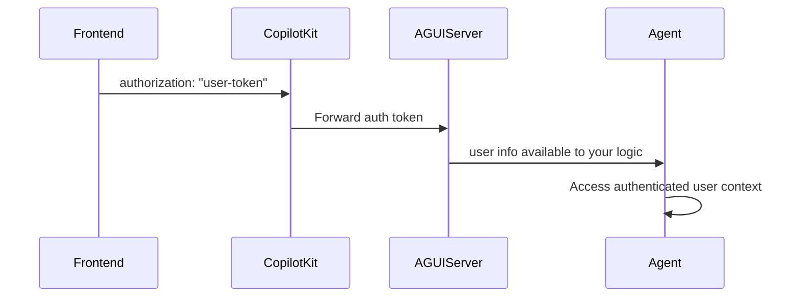

## Overview

CopilotKit supports forwarding user authentication to your Microsoft Agent Framework AG-UI server. The typical pattern is:

- **Frontend**: Pass an auth token via `<CopilotKit headers={{ Authorization: token }}>`.
- **Backend (ASP.NET Core)**: Validate the token (for example, using Microsoft Entra ID) and scope the request accordingly.

## How It Works



## Frontend setup

Pass your authentication token via the `headers` prop:

```tsx
<CopilotKit
  runtimeUrl="/api/copilotkit"
  headers={{
    Authorization: `Bearer ${userToken}`,
  }}
>
  <YourApp />
</CopilotKit>
```

The `Authorization` header is forwarded to your AG-UI server and can be validated in your ASP.NET Core middleware.

## ASP.NET Core AG-UI server

Validate the incoming token and scope requests in your AG-UI server using ASP.NET Core's built-in JWT bearer authentication. Below is an example that configures JWT bearer authentication following [Microsoft's recommended approach](https://learn.microsoft.com/en-us/aspnet/core/security/authentication/configure-jwt-bearer-authentication).

```csharp title="Program.cs"
using AGUI;
using Microsoft.Agents.AI;
using Microsoft.Agents.AI.AGUI;
using Microsoft.Agents.AI.Hosting.AGUI.AspNetCore;
using Microsoft.AspNetCore.Authentication.JwtBearer;
using Microsoft.AspNetCore.Authorization;
using Microsoft.Extensions.AI;
using OpenAI;

var builder = WebApplication.CreateBuilder(args);
builder.Services.AddHttpClient().AddLogging();

// Configure JWT Bearer authentication
builder.Services.AddAuthentication(JwtBearerDefaults.AuthenticationScheme)
    .AddJwtBearer(options =>
    {
        options.Authority = builder.Configuration["JwtAuthority"]; // e.g., "https://login.microsoftonline.com/{tenant-id}/v2.0"
        options.Audience = builder.Configuration["JwtAudience"]; // Your API audience/client ID
        options.TokenValidationParameters = new Microsoft.IdentityModel.Tokens.TokenValidationParameters
        {
            ValidateIssuer = true,
            ValidateAudience = true,
            ValidateLifetime = true,
            ValidateIssuerSigningKey = true
        };
    });

builder.Services.AddAuthorization();

var app = builder.Build();

app.UseAuthentication();
app.UseAuthorization();

string githubToken = builder.Configuration["GitHubToken"]!;

// Apply [Authorize] to the AG-UI endpoint
app.MapAGUIAgent("/", [Authorize] (RunAgentInput agentInput, HttpContext httpContext) =>
{
    // Access the authenticated user's identity
    // var userId = httpContext.User.FindFirst(ClaimTypes.NameIdentifier)?.Value;
    
    var openAI = new OpenAIClient(
        new System.ClientModel.ApiKeyCredential(githubToken),
        new OpenAIClientOptions { Endpoint = new Uri("https://models.inference.ai.azure.com") }
    );
    var chat = openAI.GetChatClient("gpt-4o-mini").AsIChatClient();
    var agent = new ChatClientAgent(chat, name: "AGUIAssistant", description: "A helpful assistant.");
    return new ChatClientAGUIAgent(agent);
});

await app.RunAsync();
```

### Configuration

Add the JWT settings to your `appsettings.json` or environment variables:

```json title="appsettings.json"
{
  "JwtAuthority": "https://login.microsoftonline.com/{your-tenant-id}/v2.0",
  "JwtAudience": "api://{your-client-id}"
}
```

## Security notes

### Server-side

- **Manual validation**: Implement token validation (for example, Microsoft Entra ID/JWT)
- **User scoping**: Scope data access and actions to the authenticated user
- **Header handling**: Expect `Authorization: Bearer <token>` and validate securely

### General Best Practices

- **Permission Checks**: Implement role-based access control in your agents
- **Token Security**: Use secure token generation and validation
- **User Scoping**: Always scope data access to authenticated users

For identity and access management guidance, see [Authentication for agents (preview)](https://learn.microsoft.com/en-us/power-platform/admin/security/identity-access-management#authentication-for-agents-preview) and the Microsoft Agent Framework docs.

## Troubleshooting

### Common Issues

**Token not reaching server**:

- Ensure you're passing `Authorization` in the `<CopilotKit>` `headers`
- Confirm your proxy/tunnel forwards headers

**Invalid token format**:

- Include the `Bearer ` prefix and validate the JWT or access token

**User info not available**:

- Verify your validation logic extracts and propagates user identity appropriately

**Authentication works locally but not in production**:

- Verify environment-specific configuration (headers, proxies, CORS)

## Next steps

- [Quickstart →](/microsoft-agent-framework/quickstart)
- [Shared state →](/microsoft-agent-framework/shared-state)
- [Human-in-the-loop →](/microsoft-agent-framework/human-in-the-loop)