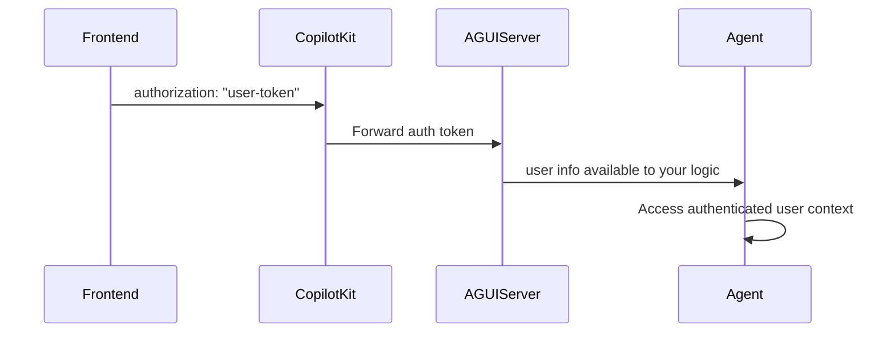

## Overview

CopilotKit supports forwarding user authentication to your Microsoft Agent Framework AG-UI server. The typical pattern is:

- **Frontend**: Pass an auth token via `<CopilotKit properties={{ authorization: token }}>`.
- **Backend (ASP.NET Core)**: Validate the token (for example, using Microsoft Entra ID) and scope the request accordingly.

## How It Works



## Frontend setup

Pass your authentication token via the `properties` prop:

```tsx
<CopilotKit
  runtimeUrl="/api/copilotkit"
  properties={{
    authorization: userToken, // Forwarded as Bearer token
  }}
>
  <YourApp />
</CopilotKit>
```

The `authorization` property is forwarded to your AG-UI server. If your server expects a Bearer token, include the `Bearer ` prefix when validating.
## ASP.NET Core AG-UI server

Validate the incoming token and scope requests in your AG-UI server. Below is a minimal example that reads the forwarded `authorization` value and performs custom validation before creating the agent.

```csharp title="Program.cs"
using Azure.AI.OpenAI;
using Azure.Identity;
using Microsoft.Agents.AI;
using Microsoft.Agents.AI.Hosting.AGUI.AspNetCore;

var builder = WebApplication.CreateBuilder(args);
builder.Services.AddHttpClient().AddLogging();
var app = builder.Build();

string endpoint = builder.Configuration["AZURE_OPENAI_ENDPOINT"]!;
string deployment = builder.Configuration["AZURE_OPENAI_DEPLOYMENT_NAME"]!;

app.MapAGUIAgent("/", (messages, tools, context, forwardedProps) =>
{
    var authHeader = forwardedProps?.GetValueOrDefault("authorization");
    if (string.IsNullOrEmpty(authHeader) || !authHeader.StartsWith("Bearer ", StringComparison.OrdinalIgnoreCase))
    {
        throw new UnauthorizedAccessException("Unauthorized");
    }

    var token = authHeader["Bearer ".Length..];
    var user = ValidateYourToken(token); // implement your validation here

    // Create and return the agent; use `user` to scope any downstream resources
    return new AzureOpenAIClient(new Uri(endpoint), new DefaultAzureCredential())
        .GetChatClient(deployment)
        .CreateAIAgent(name: "AGUIAssistant");
});

await app.RunAsync();

static UserInfo ValidateYourToken(string token)
{
    // TODO: Replace with Microsoft Entra ID / JWT validation
    return new UserInfo("user-id");
}

record UserInfo(string Id);
```

## Security notes

### Server-side

- **Manual validation**: Implement token validation (for example, Microsoft Entra ID/JWT)
- **User scoping**: Scope data access and actions to the authenticated user
- **Header handling**: Expect `Authorization: Bearer <token>` and validate securely

### General Best Practices

- **Permission Checks**: Implement role-based access control in your agents
- **Token Security**: Use secure token generation and validation
- **User Scoping**: Always scope data access to authenticated users

For identity and access management guidance, see [Authentication for agents (preview)](https://learn.microsoft.com/en-us/power-platform/admin/security/identity-access-management#authentication-for-agents-preview) and the Microsoft Agent Framework docs.

## Troubleshooting

### Common Issues

**Token not reaching server**:

- Ensure you're passing `authorization` in the `<CopilotKit>` `properties`
- Confirm your proxy/tunnel forwards headers

**Invalid token format**:

- Include the `Bearer ` prefix and validate the JWT or access token

**User info not available**:

- Verify your validation logic extracts and propagates user identity appropriately

**Authentication works locally but not in production**:

- Verify environment-specific configuration (headers, proxies, CORS)

## Next steps

- [Quickstart →](/microsoft-agent-framework/quickstart)
- [Shared state →](/microsoft-agent-framework/shared-state)
- [Human-in-the-loop →](/microsoft-agent-framework/human-in-the-loop)