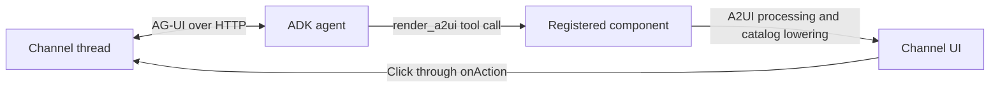

# Channels A2UI architecture

This example lets a Google ADK agent describe an interactive interface in A2UI
and deliver it through an ordinary registered Channels component. A2UI supplies
the declarative UI model; AG-UI carries the conversation and tool calls; Channels
owns message delivery, progress, and interaction routing. The integration requires
no changes to `packages/channels-core`.

## Architecture and ownership

The [Node runtime](channel/index.ts) hosts the managed Channel, connects it to
CopilotKit Intelligence, and verifies that the ADK agent is reachable before
accepting traffic. The [Channel registration](channel/create-market-channel.ts)
starts agent runs on mentions and gives each `HttpAgent` the Channel thread ID.

The reusable adapter lives in `@copilotkit/channels/a2ui`. Its
[component factory](../../packages/channels/src/a2ui/channel-component.ts) exposes
`render_a2ui` through the existing `components` registration API. The
[ADK agent](agent/main.py) receives that tool through `AGUIToolset`; a separate
search agent gathers the market information.

Demo choices belong to this example: the ADK prompts, search delegation,
acknowledgement behavior, and [MarketSnapshot catalog](channel/market-snapshot.ts).
`MarketSnapshot` defines a composed presentation for exactly three markets,
including sources, a timestamp, and an Acknowledge button.

## Integration approach

The supplied catalog pairs component property schemas with functions that render
portable Channel UI. Those schemas become the agent's tool contract. Adding a
component means supplying its schema and its rendering function; the integration
does not automatically support every A2UI component.

The agent calls `render_a2ui` with a surface ID, a complete flat component array,
and optional initial data. Validation requires unique component IDs and exactly
one `root`. The adapter constructs A2UI v0.9 surface, component, and data messages,
processes them with `MessageProcessor`, then
[lowers the surface](../../packages/channels/src/a2ui/lower-surface.ts) into
Channel UI primitives such as `Message`, `Header`, `Table`, and `Button`. Existing
Channels rendering and provider delivery take over from there.

A button click resolves its A2UI action and reaches `onAction` with the original
Channel interaction context. In this example, the callback runs a brief
acknowledgement on that same thread. The application owns what an action means;
the adapter preserves its context and propagates callback failures.

## Current limits and future challenges

- **Progressive rendering:** Only completed surfaces render. Channels supplies its
  normal thinking/tool progress while generation runs. Incremental surface updates
  will wait for support in the ordinary Channels component lifecycle.
- **Catalog evolution:** The adapter targets A2UI v0.9, and this demo uses a narrow
  catalog. Protocol or schema changes will need compatibility tests across tool
  generation, validation, data binding, and rendering.
- **Richer interactions:** Forms, editing, and multi-step interfaces will need
  explicit state and update semantics. Actions with side effects will also need
  authorization and duplicate-click handling beyond this acknowledgement demo.
- **Persistence and identity:** ADK currently uses in-memory services, a fixed demo
  user ID, and a one-hour session timeout. Multi-user deployment and restart
  recovery require durable state and deliberate user/thread mapping.
- **Platform differences:** Channel UI portability still depends on each provider's
  rendering capabilities and message limits. Richer catalogs will need provider
  tests and suitable fallbacks.
- **Model and search reliability:** Schemas validate structure, not the truth or
  freshness of prices and citations. Grounding is requested in prompts; production
  use needs validation of source data, timeout handling, and observable failures.
