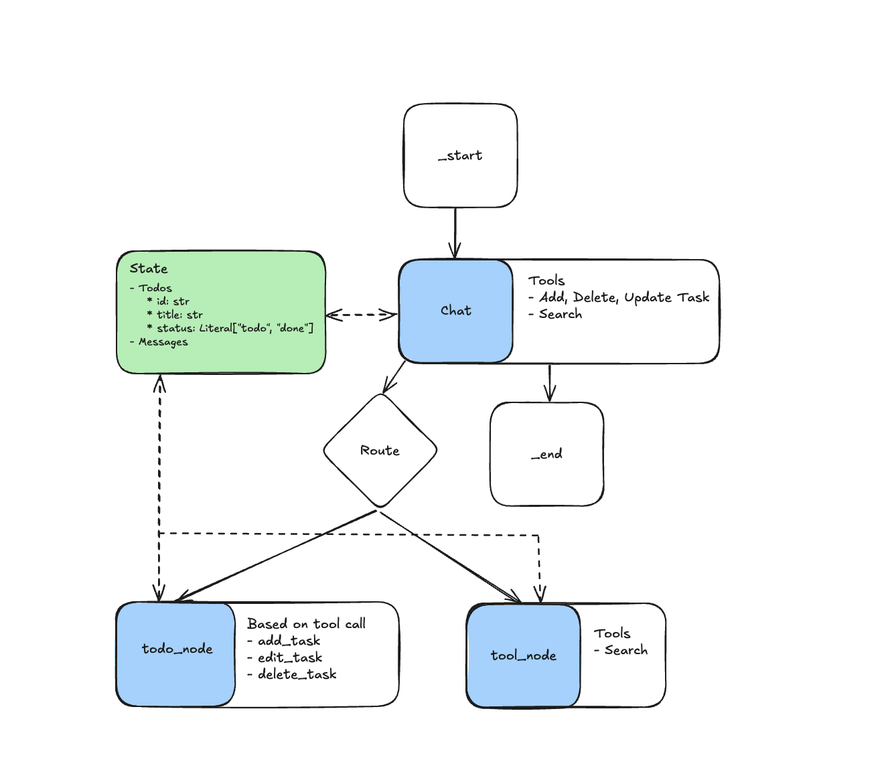

# Todo Manager

Todo Manageris responsible for managing Todos stored in its internal state with the capability of reaching out to the internet.

## Usage
This Agent is constructed using LangGraph and Python that is managed by Poetry. To get started you need to install its dependencies and start its server.

1. `poetry install`
2. `poetry run server`

> **Note:** The server is configured to run on port 8000. If you have any trouble, make sure you're using the same version of Python as specified in the `pyproject.toml` file.

