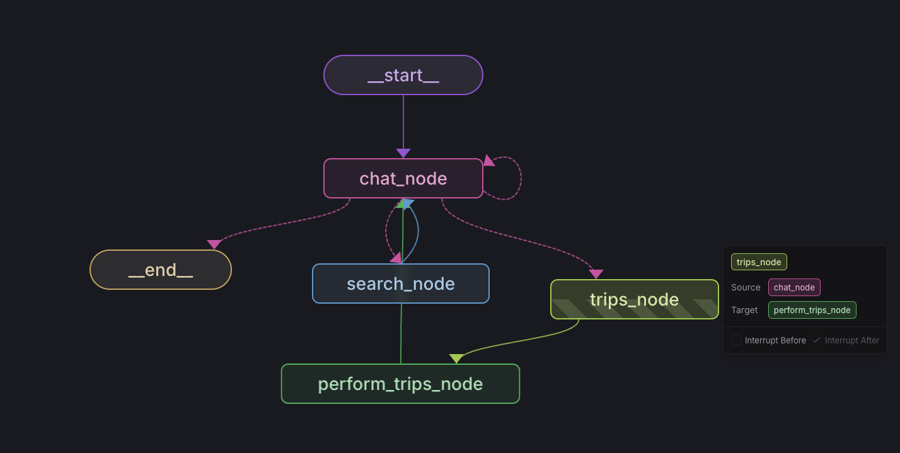

# Travel Planner

Travel Planner is responsible for managing trips stored in its internal state with the capability of reaching out to the internet using Google Maps.

## Usage
This Agent is constructed using LangGraph and Python that is managed by Poetry. To get started you need to install its dependencies and start its server.

**These instructions assume you are in the `coagents-travel/agent/` directory**

To start you'll need to create a `.env` file with the following:

```
OPENAI_API_KEY=...
GOOGLE_MAPS_API_KEY=...
```

From there you can install the dependencies and start the server:
```sh
poetry install
poetry run demo
```

The server is configured to run on port 8000. If you have any trouble, make sure you're using the same version of Python as specified in the `pyproject.toml` file.

## Agent Diagram

