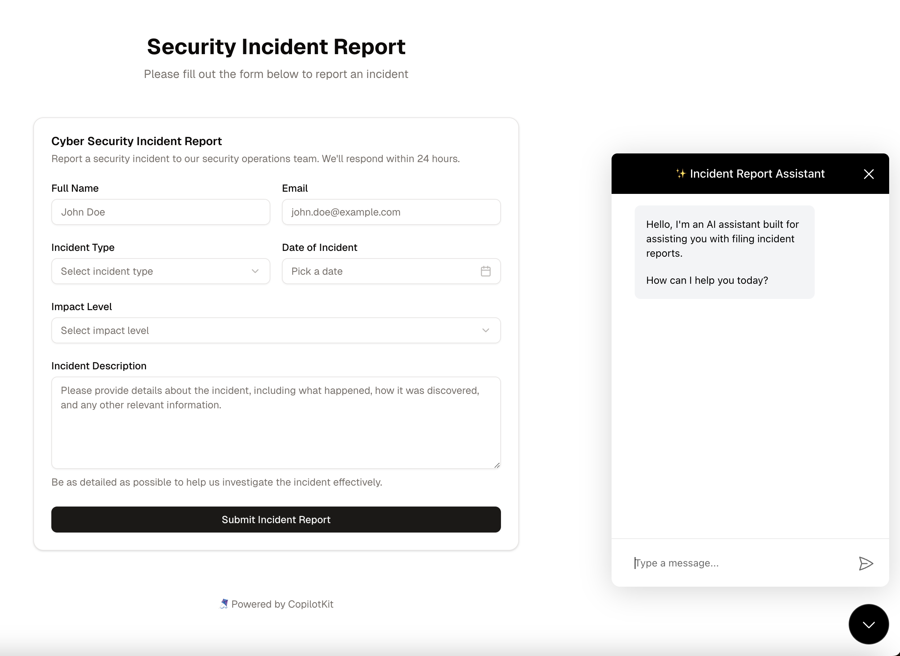

<div align="center">

# 🤖 Form-Filling Copilot: Security Incident Reports

  
  <p><em>Transform tedious form-filling into natural conversations. Your AI assistant asks the right questions, understands context, and completes forms for you—no more field-by-field drudgery.</em></p>
</div>

<div align="center">
  <a href="https://copilotkit.ai" target="_blank">
    
  </a>
  <a href="https://nextjs.org" target="_blank">
    
  </a>
  <a href="https://ui.shadcn.com/" target="_blank">
    
  </a>
</div>

## 🚀 Demo

This demo showcases how CopilotKit can revolutionize form interactions by creating AI assistants that:

- **Chat naturally** with users to gather information—no more staring at empty form fields
- **Intelligently populate** complex forms based on conversational context
- **Explain requirements** and provide guidance when users are unsure what to enter

The security incident report example demonstrates how even complex, technical forms can be completed through simple conversation, making reporting faster and more accurate.

## 🛠️ Getting Started

### Prerequisites

- Node.js 18+ 
- npm, yarn, or pnpm

### Installation

1. Clone the repository:
   ```bash
   git clone https://github.com/CopilotKit/CopilotKit.git
   cd CopilotKit/examples/copilot-form-filling
   ```

2. Install dependencies:

   ```bash
   npm install
   ```

   <details>
     <summary><b>Using other package managers</b></summary>
     
     ```bash
     # Using yarn
     yarn install
     
     # Using pnpm
     pnpm install
     ```
   </details>

3. Create a `.env.local` file in the project root and add your API keys:
   ```
   OPENAI_API_KEY=your_openai_api_key
   ```

4. Start the development server:

   ```bash
   npm run dev
   ```

   <details>
     <summary><b>Using other package managers</b></summary>
     
     ```bash
     # Using yarn
     yarn dev
     
     # Using pnpm
     pnpm dev
     ```
   </details>

5. Open [http://localhost:3000](http://localhost:3000) in your browser to see the application.

## 🧩 How It Works

This demo uses several key CopilotKit features:

```tsx
// 1. The CopilotKit provider wraps the application
<CopilotKitProvider>
  <SecurityIncidentForm />
  <CopilotPopup 
    instructions="You are an assistant that helps users fill out security incident reports."
  />
</CopilotKitProvider>

// 2. Form fields are made available to the AI
useCopilotReadable({
  description: "The security incident form fields and their current values",
  value: formState
});

// 3. The AI can update form fields
useCopilotAction({
  name: "updateFormField",
  description: "Update a field in the security incident form",
  parameters: [
    { name: "fieldName", type: "string", description: "The name of the field to update" },
    { name: "value", type: "string", description: "The new value for the field" }
  ],
  handler: ({ fieldName, value }) => {
    updateField(fieldName, value);
    return { success: true };
  }
});
```

## 📚 Learn More

Ready to build your own AI-powered form assistant? Check out these resources:

[CopilotKit Documentation](https://docs.copilotkit.ai) - Comprehensive guides and API references to help you build your own copilots.

[CopilotKit Cloud](https://cloud.copilotkit.ai/) - Deploy your copilots with our managed cloud solution for production-ready AI assistants.

## 🎉 License

This project is licensed under the MIT License. Take it, remix it, build something awesome with it! We'd love to see what you create. Have fun and happy coding!

---

<div align="center">
  <a href="https://copilotkit.ai">
    
  </a>
</div>
