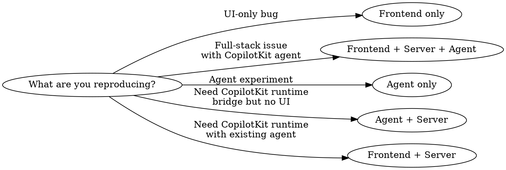

## Overview

Tickets are convention-discovered reproduction sandboxes. Each ticket can span up to 3 optional layers (frontend, server, agent). Files are auto-discovered by naming convention — no registration needed.

**Do NOT run any git commands.** Only create/edit ticket files. The user manages git themselves.

If the user doesn't initially provide a URL for the issue / ticket, **ask the user for it first** and then continue with the reproduction implementation.

**Be as extensive as necessary and as concise as possible, e.g. write a bare minimum reproduction implementation**. Sparsely use tailwind for styling and shadcn for drop-in components when reasonable. Make the code as human readable as possible, which means showcasing the essential and creating a minimum viable reproduction example.

## Reproducing Faithfully

Use the exact APIs, hooks, and components the issue author describes. Do not substitute alternatives, even if they seem equivalent or you believe the author "probably meant" something else.

- If they say `useAgent`, use `useAgent` — not `useCoAgent`.
- If they say `CopilotChat`, use `CopilotChat` — not `CopilotSidebar`.
- If they mention a specific version (v1, v2), reproduce against that version.

The goal is to replicate the author's experience, not to interpret it. If their description is ambiguous or names an API that doesn't exist, flag it and ask — don't silently swap in what you think they meant.

## When to Use

Which layers do I need?



## Quick Reference

| Layer    | Location                                       | Naming     | Key Export                             | Discovery                      |
| -------- | ---------------------------------------------- | ---------- | -------------------------------------- | ------------------------------ |
| Frontend | `app/client/src/tickets/tkt-<id>/index.tsx`    | kebab-case | `meta: TicketMeta` + default component | `import.meta.glob`             |
| Server   | `app/server/tickets/tkt-<id>/index.ts`         | kebab-case | `handler` (CopilotKit endpoint)        | `readdirSync` + dynamic import |
| Agent    | `agent/tickets/tkt_<id>/__init__.py`           | snake_case | `app` (FastAPI sub-app)                | `pathlib.iterdir`              |

## Key Contracts

- Server endpoint URL: `/api/tickets/tkt-<id>/copilot`
- Agent endpoint URL: `/tickets/tkt-<id>`
- Frontend `meta.refs[0]` must be a valid URL (used for sidebar path derivation)
- Agent name must match in server handler, Python agent name, and frontend components / hooks (default: `default`)
- Python directory name `tkt_<id>/` is auto-converted to hyphenated mount path `/tickets/tkt-<id>` (underscores become hyphens)

## CopilotKit Provider in Frontend Tickets

The ticket route (`app/client/src/routes/tickets/$.tsx`) renders ticket components **without** a `<CopilotKit>` provider. If your ticket uses any CopilotKit hooks (`useCoAgent`, `useCopilotAction`, `useCopilotReadable`, etc.) or UI components (`CopilotSidebar`, `CopilotChat`, etc.), you must:

1. Wrap the component's return in `<CopilotKit runtimeUrl="/api/tickets/tkt-<id>/copilot" agent="default">`
2. Move all hook calls into a **child component** rendered inside the provider (hooks cannot be called in the same component that renders the provider)

```tsx
export default function TktMyTicket() {
  return (
    <CopilotKit runtimeUrl="/api/tickets/tkt-my-ticket/copilot" agent="default">
      <TktMyTicketInner />
    </CopilotKit>
  );
}

function TktMyTicketInner() {
  // CopilotKit hooks go here — inside the provider
  useCopilotAction({ ... });
  const { state, run } = useCoAgent({ ... });
  return <div>...</div>;
}
```

## File Organization

Split ticket code into multiple files so each file has a single, obvious purpose. A reader should understand what a file does from its name alone, without opening it.

### Rules

1. **`index.tsx` is the shell** — it exports `meta`, renders the scenario picker / layout, and imports scenario components. No scenario logic lives here.
2. **One file per scenario / example** — if a ticket demonstrates multiple cases (e.g. "works with X, broken with Y"), each case gets its own file named descriptively: `scenario-<name>.tsx`.
3. **Shared helpers go in `lib.tsx`** — logging utilities, probe components, shared constants, and types used across scenarios.
4. **Each scenario file starts with a JSDoc block** explaining what it demonstrates, the component tree structure, and why the result is expected to pass or fail. This is the most important part — a reader should understand the scenario without reading the implementation.

### Example structure

```
tkt-my-issue/
  index.tsx                    ← meta + scenario picker (no logic)
  lib.tsx                      ← TAG, shared helpers, probe components
  scenario-works.tsx           ← "this works" baseline
  scenario-broken.tsx          ← "this is broken" reproduction
  scenario-workaround.tsx      ← workaround attempt (if relevant)
```

### Why

A 400-line single file with 4 scenarios, helpers, and layout is hard to scan. When each scenario is its own file with a clear name and a JSDoc header explaining the component tree, someone new to the ticket can understand the full picture by reading file names and headers — without tracing through implementation details.

### Exception

If the entire reproduction is a single scenario under ~80 lines, keep it in `index.tsx`. Don't split for the sake of splitting.

## Verbose Logging

Every ticket must include generous logging on **every layer** used. Reproductions are diagnostic tools — silent failures waste time. When something goes wrong, logs should make the cause obvious without requiring a debugger or code changes. 

You don't need to render the logs in the example page. When the nature of the issue justifies multiple examples on one page (for example "something works with X, but not with Y") make sure only one example runs at one point in time (e.g. no parallel execution). This is to make sure logs don't get mixed up and the engineer trying to debug the issue sees what is producing what logs.

### Frontend (TSX)

Use `console.log` / `console.warn` / `console.error` liberally:

- **Component lifecycle** — log on mount, unmount, and key re-renders with relevant state
- **Hook inputs & outputs** — log arguments passed to CopilotKit hooks and their return values (state, callbacks, errors)
- **User interactions** — log button clicks, form submissions, and any action that triggers CopilotKit behavior
- **Network/runtime events** — log before and after calls to the runtime, including request payloads and responses
- **Error boundaries** — wrap risky sections and log caught errors with full context

Prefix all logs with the ticket ID for easy filtering: `console.log("[tkt-<id>]", ...)`

### Server (TS)

Use `console.log` / `console.error`:

- **Request entry** — log incoming request method, URL, and relevant headers/body on handler entry
- **CopilotKit runtime setup** — log agent URL, agent name, and any config passed to the runtime
- **Proxied calls** — log outbound requests to the agent layer (URL, payload summary) and their responses (status, body summary)
- **Errors** — log full error objects (message + stack) on any catch

Prefix: `console.log("[tkt-<id> server]", ...)`

### Agent (Python)

Use Python's `logging` module at `DEBUG` level (or `print` if simpler for the reproduction):

- **Endpoint entry** — log incoming request path, method, and payload
- **Agent state transitions** — log state before and after each node/step in the graph
- **Tool calls** — log tool name, input arguments, and return values
- **LLM interactions** — log prompts sent and responses received (or at minimum their lengths/summaries)
- **Errors** — log exceptions with full tracebacks via `logging.exception()` or `traceback.format_exc()`

Prefix: `print(f"[tkt-<id> agent] ...")` or `logger = logging.getLogger("tkt-<id>")`

### Why This Matters

A reproduction without logging is a black box. The person investigating the ticket should be able to open the browser console + terminal and immediately see the full request/response flow across all layers without touching the code.

## Common Mistakes

- Using CopilotKit hooks without a `<CopilotKit>` provider wrapper (the ticket route does not provide one — see section above)
- Using underscores in TS/TSX directory names (should be kebab-case `tkt-<id>/`)
- Using hyphens in Python directory names (should be snake_case `tkt_<id>/`)
- Forgetting to export `meta` from frontend (component renders but doesn't appear in sidebar)
- Mismatched agent names between server handler and Python agent
- Invalid `meta.refs[0]` URL (breaks sidebar path derivation)
- Python directories starting with `_` are silently skipped by agent discovery (e.g. `_tkt_helper/` won't mount)
- `endpoint` inside server handler doesn't match the discovery path `/api/tickets/tkt-<id>/copilot`
- Putting ticket code in a flat file instead of the `tkt-<id>/index.{tsx,ts}` or `tkt_<id>/__init__.py` directory structure

## When Reproduction Stalls

If you attempted to replicate the issue and reasonable default assumptions didn't yield a successful reproduction, ask the user to go back to the issue author with targeted questions. Tailor questions to what's actually missing — don't send a generic checklist. Common gaps:

- **Trigger conditions** — exact user action, input data, or sequence that causes it
- **Environment specifics** — account type, plan/tier, data volume thresholds, feature flags
- **State dependencies** — does it require prior state (e.g. >50 team members, expired session, specific timezone)?
- **Frequency** — always, intermittent, or first-occurrence-only?
- **Error output** — exact error message, console logs, network response codes
- **Workarounds tried** — what did the author already rule out?

Frame questions around what you concretely need to unblock the reproduction, not what would be "nice to know."

## Reference

- `app/client/src/tickets/tkt-example/index.tsx`
- `app/server/tickets/tkt-example/index.ts`
- `agent/tickets/tkt_example/__init__.py`
