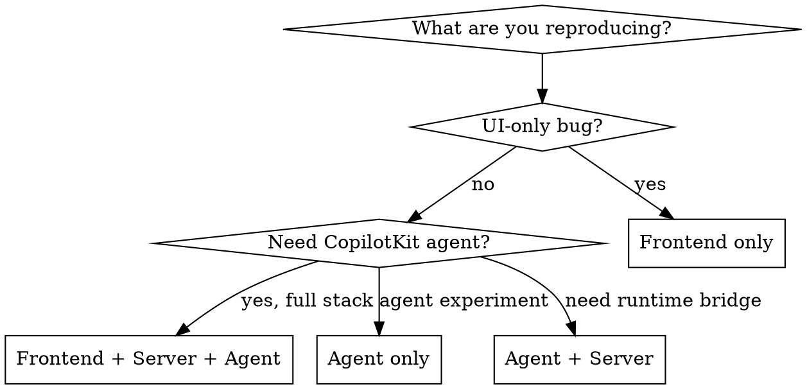

# `reproduce-issue` Skill Implementation Plan

> **For Claude:** REQUIRED SUB-SKILL: Use superpowers:executing-plans to implement this plan task-by-task.

**Goal:** Create a Claude Code skill that guides creating new ticket reproduction sandboxes across frontend, server, and agent layers.

**Architecture:** Single SKILL.md in `.claude/skills/reproduce-issue/` following the writing-skills TDD cycle: baseline test (RED), write skill (GREEN), close loopholes (REFACTOR).

**Tech Stack:** Markdown skill file with YAML frontmatter and dot flowchart.

---

### Task 1: Create skill directory

**Files:**

- Create: `.claude/skills/reproduce-issue/` (directory)

**Step 1: Create the directory**

```bash
mkdir -p .claude/skills/reproduce-issue
```

**Step 2: Commit**

```bash
git add .claude/skills/reproduce-issue/.gitkeep
git commit -m "chore: create reproduce-issue skill directory"
```

Note: If git won't track an empty dir, skip the commit — it'll be included with the SKILL.md in Task 3.

---

### Task 2: RED — Baseline test without the skill

**Purpose:** See how a fresh Claude agent handles "create a new ticket called tkt-foo" WITHOUT the skill. Document what it gets wrong.

**Step 1: Run baseline pressure scenario**

Dispatch a subagent with this prompt (NO skill loaded):

> You are working on the project at /Volumes/Projects/CLIENTS/CopilotKit/deep-agent. Create a new ticket called `tkt-foo` that reproduces a login timeout bug. The ticket needs a frontend component, server handler, and Python agent. Look at the existing `tkt-example` files for reference.

**Step 2: Document baseline behavior**

Record (in notes, not committed):

- Did it find all 3 example files?
- Did it get the naming right? (kebab for TS, snake for Python)
- Did it export `meta: TicketMeta` from the frontend?
- Did it export `handler` from the server file?
- Did it export `app` from the Python file?
- Did it get the URL contracts right? (`/api/tickets/tkt-foo/copilot`, `/tickets/tkt-foo`)
- Did it match agent names between server and Python?
- What did it get wrong or miss?

**Step 3: Clean up**

Delete any files the baseline agent created:

```bash
rm -f app/client/src/tickets/tkt-foo.tsx
rm -f app/server/tickets/tkt-foo.ts
rm -f agent/tickets/tkt_foo.py
git checkout -- .
```

---

### Task 3: GREEN — Write minimal SKILL.md

**Files:**

- Create: `.claude/skills/reproduce-issue/SKILL.md`

**Step 1: Write the skill**

Write SKILL.md addressing the specific failures observed in Task 2. The skill must include:

**Frontmatter:**

```yaml
---
name: reproduce-issue
description: Use when creating a new ticket reproduction sandbox — covers file naming, required exports, layer selection (frontend, server, agent), and discovery mechanics. Also use when asked to "add a ticket", "new tkt-*", or "scaffold a reproduction."
---
```

**Body sections:**

1. **Overview** — Tickets are convention-discovered reproduction sandboxes. Each ticket can span up to 3 optional layers. No registration needed — files are auto-discovered by naming convention.

2. **When to Use** — Decision flowchart in `dot` format:



3. **Quick Reference** — Table with layer, location, naming, key export, discovery mechanism (from the design doc).

4. **Key Contracts** — URL mapping, `meta.refs[0]` requirement, agent name matching.

5. **Common Mistakes** — Address specific failures from baseline test, plus:

   - Wrong filename case (kebab vs snake)
   - Missing `meta` export
   - Mismatched agent names
   - Invalid `refs[0]` URL

6. **Reference** — Point to existing example files:
   - `app/client/src/tickets/tkt-example.tsx`
   - `app/server/tickets/tkt-example.ts`
   - `agent/tickets/tkt_example.py`

**Step 2: Commit**

```bash
git add .claude/skills/reproduce-issue/SKILL.md
git commit -m "feat: add reproduce-issue skill"
```

---

### Task 4: GREEN — Verify skill works

**Step 1: Run same scenario WITH the skill**

Dispatch a subagent with this prompt (WITH the skill loaded via `@.claude/skills/reproduce-issue/SKILL.md`):

> You are working on the project at /Volumes/Projects/CLIENTS/CopilotKit/deep-agent. Create a new ticket called `tkt-bar` that reproduces a dashboard rendering bug. The ticket needs a frontend component, server handler, and Python agent.

**Step 2: Verify compliance**

Check the created files against every convention:

- [ ] Frontend at `app/client/src/tickets/tkt-bar.tsx` with `meta: TicketMeta` export + default component
- [ ] Server at `app/server/tickets/tkt-bar.ts` with `handler` export, correct endpoint URL
- [ ] Agent at `agent/tickets/tkt_bar.py` with `app` FastAPI export, correct agent name
- [ ] URL contracts correct
- [ ] Agent names match between server and Python

**Step 3: Compare to baseline**

Did the skill fix the specific failures from Task 2? If yes → proceed. If no → go back to Task 3 and strengthen the relevant section.

**Step 4: Clean up**

```bash
rm -f app/client/src/tickets/tkt-bar.tsx
rm -f app/server/tickets/tkt-bar.ts
rm -f agent/tickets/tkt_bar.py
git checkout -- .
```

---

### Task 5: REFACTOR — Close loopholes

**Step 1: Run edge-case scenarios**

Test with subagents:

a. "Create ticket `tkt-baz` with frontend only" — verify it doesn't create unnecessary server/agent files

b. "Create ticket `tkt-qux` with agent only" — verify it uses snake_case and doesn't create frontend/server files

c. "Create ticket `TKT-123`" — verify it handles the uppercase/format gracefully

**Step 2: Identify new failures**

Document any new rationalizations or mistakes.

**Step 3: Update SKILL.md**

Add explicit guidance for edge cases found. If discipline issues found, add to Common Mistakes section.

**Step 4: Re-test and commit**

```bash
git add .claude/skills/reproduce-issue/SKILL.md
git commit -m "refactor: close loopholes in reproduce-issue skill"
```

Clean up any test files created.

---

### Task 6: Final verification

**Step 1: Read the skill one more time**

Verify:

- [ ] Frontmatter name uses only letters/numbers/hyphens
- [ ] Description starts with "Use when..." and doesn't summarize workflow
- [ ] Description is under 500 characters
- [ ] Total frontmatter under 1024 characters
- [ ] No narrative storytelling
- [ ] Flowchart only for the non-obvious decision (which layers)
- [ ] Quick reference table present
- [ ] Common mistakes section present
- [ ] Keywords for searchability (ticket, tkt, reproduction, sandbox, scaffold)

**Step 2: Final commit if needed**

```bash
git add .claude/skills/reproduce-issue/SKILL.md
git commit -m "docs: finalize reproduce-issue skill"
```
