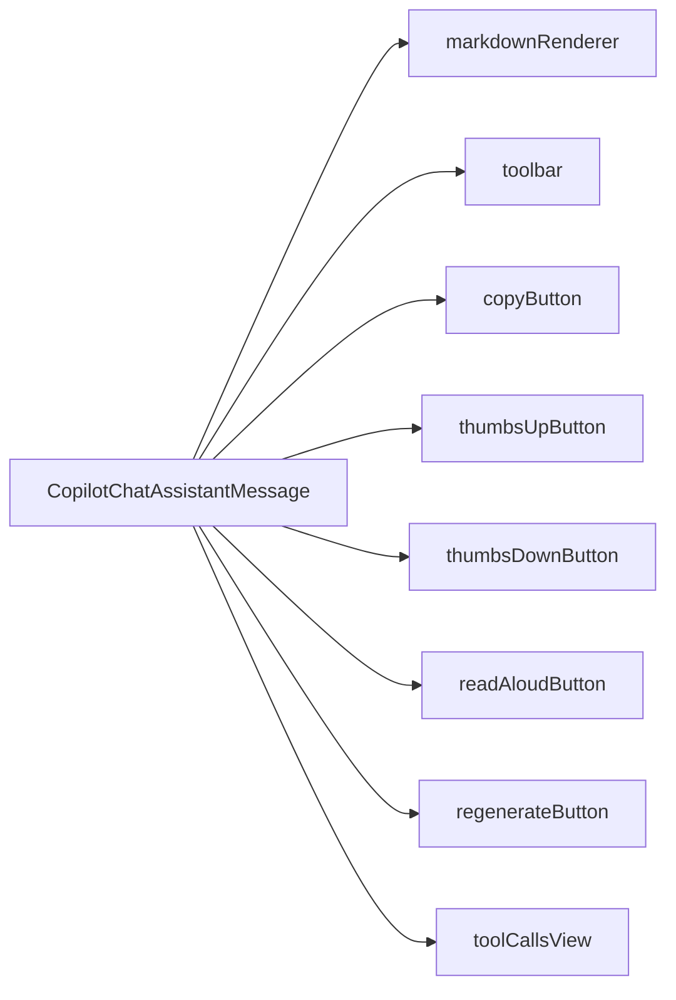

`CopilotChatAssistantMessage` is the default component used by [CopilotChatMessageView](/reference/copilot-chat-message-view) to render AI assistant responses. It handles markdown rendering, feedback collection, and tool call display.

## What is CopilotChatAssistantMessage?

The CopilotChatAssistantMessage component:

- Renders AI responses with full markdown support
- Provides a toolbar with copy, feedback, and action buttons
- Handles thumbs up/down feedback collection
- Supports text-to-speech (read aloud) functionality
- Displays tool call executions with visual feedback
- Built on the [slot system](/reference/slot-system) for deep customization

## Component Architecture

CopilotChatAssistantMessage provides slots for customizing each part of the message:



### Slot Descriptions

| Slot | Description |
|------|-------------|
| `markdownRenderer` | Renders the message content with markdown support |
| `toolbar` | Container for action buttons |
| `copyButton` | Button to copy message content |
| `thumbsUpButton` | Positive feedback button |
| `thumbsDownButton` | Negative feedback button |
| `readAloudButton` | Text-to-speech button |
| `regenerateButton` | Button to regenerate the response |
| `toolCallsView` | Renders tool call executions |

## Basic Usage

Customize assistant messages through the `messageView.assistantMessage` slot on [CopilotChat](/reference/copilot-chat):

```tsx
<CopilotChat
  messageView={{
    assistantMessage: {
      className: "bg-slate-50 rounded-xl p-4",
      onThumbsUp: (message) => trackFeedback(message.id, "positive"),
      onThumbsDown: (message) => trackFeedback(message.id, "negative"),
    },
  }}
/>
```

## Feedback Callbacks

CopilotChatAssistantMessage provides callbacks for user feedback:

```tsx
<CopilotChat
  messageView={{
    assistantMessage: {
      onThumbsUp: (message) => {
        analytics.track("positive_feedback", {
          messageId: message.id,
          content: message.content,
        });
      },
      onThumbsDown: (message) => {
        analytics.track("negative_feedback", {
          messageId: message.id,
          content: message.content,
        });
      },
      onRegenerate: (message) => {
        console.log("Regenerating:", message.id);
      },
      onReadAloud: (message) => {
        speechSynthesis.speak(new SpeechSynthesisUtterance(message.content));
      },
    },
  }}
/>
```

### Callback Props

| Callback | Signature | Description |
|----------|-----------|-------------|
| `onThumbsUp` | `(message: AssistantMessage) => void` | Called when user clicks thumbs up |
| `onThumbsDown` | `(message: AssistantMessage) => void` | Called when user clicks thumbs down |
| `onRegenerate` | `(message: AssistantMessage) => void` | Called when user requests regeneration |
| `onReadAloud` | `(message: AssistantMessage) => void` | Called when user clicks read aloud |

## Slot Customization

CopilotChatAssistantMessage uses the [slot system](/reference/slot-system). Each slot accepts four types of values:

1. **Tailwind class string** - Add or override CSS classes
2. **Props object** - Pass additional props to the default component
3. **Custom component** - Replace the component entirely
4. **Nested sub-slots** - Drill down to customize child components

### Toolbar Customization

Control visibility and styling of the toolbar:

```tsx
<CopilotChat
  messageView={{
    assistantMessage: {
      toolbar: "bg-gray-50 rounded-lg p-2",
    },
  }}
/>
```

To hide the entire toolbar:

```tsx
<CopilotChat
  messageView={{
    assistantMessage: {
      toolbarVisible: false,
    },
  }}
/>
```

### Individual Button Customization

Customize specific toolbar buttons:

```tsx
<CopilotChat
  messageView={{
    assistantMessage: {
      copyButton: "text-blue-500 hover:text-blue-700",
      thumbsUpButton: "text-green-500 hover:text-green-700",
      thumbsDownButton: "text-red-500 hover:text-red-700",
      readAloudButton: "text-purple-500 hover:text-purple-700",
      regenerateButton: "text-orange-500 hover:text-orange-700",
    },
  }}
/>
```

### Hiding Specific Buttons

Hide buttons by returning null:

```tsx
<CopilotChat
  messageView={{
    assistantMessage: {
      readAloudButton: () => null,
      regenerateButton: () => null,
    },
  }}
/>
```

Note: `thumbsUpButton` and `thumbsDownButton` only show when their respective callbacks (`onThumbsUp`, `onThumbsDown`) are provided.

### Markdown Renderer Customization

Customize how message content is rendered:

```tsx
<CopilotChat
  messageView={{
    assistantMessage: {
      markdownRenderer: {
        className: "prose prose-lg dark:prose-invert",
      },
    },
  }}
/>
```

### Tool Calls View Customization

Customize how tool executions are displayed:

```tsx
<CopilotChat
  messageView={{
    assistantMessage: {
      toolCallsView: "bg-gray-100 rounded-lg p-3",
    },
  }}
/>
```

## Replacing the Component

To completely replace the assistant message component:

```tsx
import { CopilotChatAssistantMessage } from "@copilotkitnext/react";

function CustomAssistantMessage({ message, isRunning, ...props }) {
  return (
    <div className="flex gap-3 items-start">
      <Avatar src="/ai-avatar.png" />
      <div className="flex-1">
        <CopilotChatAssistantMessage
          message={message}
          isRunning={isRunning}
          className="bg-white shadow-sm rounded-xl p-4"
          {...props}
        />
      </div>
    </div>
  );
}

<CopilotChat
  messageView={{
    assistantMessage: CustomAssistantMessage,
  }}
/>
```

### Using the Render Function

For full layout control, use the children render function:

```tsx
function CustomAssistantMessage(props) {
  return (
    <CopilotChatAssistantMessage {...props}>
      {({ markdownRenderer, toolbar, toolCallsView, message }) => (
        <div className="flex gap-4 p-4 bg-gradient-to-r from-blue-50 to-purple-50 rounded-xl">
          
          <div className="flex-1">
            <div className="text-sm text-gray-500 mb-1">AI Assistant</div>
            {markdownRenderer}
            {toolCallsView}
            <div className="mt-2 border-t pt-2">{toolbar}</div>
          </div>
        </div>
      )}
    </CopilotChatAssistantMessage>
  );
}

<CopilotChat
  messageView={{
    assistantMessage: CustomAssistantMessage,
  }}
/>
```

The render function receives:

| Property | Type | Description |
|----------|------|-------------|
| `markdownRenderer` | `ReactElement` | The rendered markdown content |
| `toolbar` | `ReactElement` | The action buttons toolbar |
| `toolCallsView` | `ReactElement` | Tool call display |
| `copyButton` | `ReactElement` | Copy button |
| `thumbsUpButton` | `ReactElement` | Thumbs up button |
| `thumbsDownButton` | `ReactElement` | Thumbs down button |
| `readAloudButton` | `ReactElement` | Read aloud button |
| `regenerateButton` | `ReactElement` | Regenerate button |
| `message` | `AssistantMessage` | The message data |
| `isRunning` | `boolean` | Whether AI is generating |
| `toolbarVisible` | `boolean` | Whether toolbar should show |

## Examples

### Analytics Integration

```tsx
<CopilotChat
  messageView={{
    assistantMessage: {
      onThumbsUp: (message) => {
        analytics.track("ai_feedback", {
          type: "positive",
          messageId: message.id,
          messageLength: message.content?.length,
          timestamp: new Date().toISOString(),
        });
      },
      onThumbsDown: (message) => {
        analytics.track("ai_feedback", {
          type: "negative",
          messageId: message.id,
          messageLength: message.content?.length,
          timestamp: new Date().toISOString(),
        });
      },
    },
  }}
/>
```

### Minimal Toolbar

Show only the copy button:

```tsx
<CopilotChat
  messageView={{
    assistantMessage: {
      thumbsUpButton: () => null,
      thumbsDownButton: () => null,
      readAloudButton: () => null,
      regenerateButton: () => null,
    },
  }}
/>
```

### Custom Styling

```tsx
<CopilotChat
  messageView={{
    assistantMessage: {
      className: "bg-white shadow-md rounded-2xl p-6 border border-gray-100",
      markdownRenderer: "prose prose-blue max-w-none",
      toolbar: "mt-4 pt-4 border-t border-gray-100",
    },
  }}
/>
```

## Related

- [CopilotChat](/reference/copilot-chat) - Parent component
- [CopilotChatMessageView](/reference/copilot-chat-message-view) - Message list component that uses assistant messages
- [Slot System](/reference/slot-system) - Deep dive into slot customization
