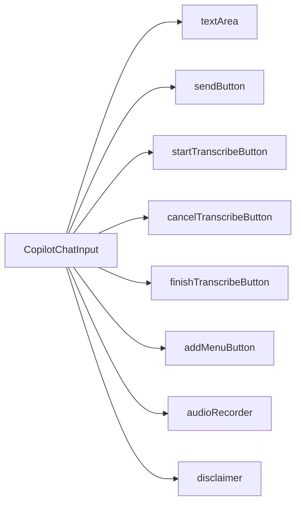

`CopilotChatInput` is the default input component used by [CopilotChat](/reference/copilot-chat). It provides a full-featured text input with support for voice transcription, slash commands, and customizable toolbar buttons.

## What is CopilotChatInput?

The CopilotChatInput component:

- Provides a rich text input with auto-expanding height
- Supports voice transcription via microphone button
- Includes a slash command menu for quick actions
- Shows a tools/add menu button for file uploads and custom actions
- Handles send and stop functionality during streaming
- Built on the [slot system](/reference/slot-system) for deep customization

## Component Architecture

CopilotChatInput provides slots for customizing each part of the input:



### Slot Descriptions

| Slot | Description |
|------|-------------|
| `textArea` | The main textarea input element |
| `sendButton` | Send message or stop generation button |
| `startTranscribeButton` | Button to start voice recording |
| `cancelTranscribeButton` | Button to cancel voice recording |
| `finishTranscribeButton` | Button to finish voice recording |
| `addMenuButton` | Plus button for file uploads and tools menu |
| `audioRecorder` | Voice recording visualization component |
| `disclaimer` | Disclaimer text shown below the input |

## Basic Usage

Customize the input through the `input` prop on [CopilotChat](/reference/copilot-chat):

```tsx
<CopilotChat
  input={{
    className: "border-2 border-blue-200 rounded-xl",
    sendButton: "bg-blue-500 hover:bg-blue-600",
  }}
/>
```

## Input Modes

CopilotChatInput operates in three modes:

| Mode | Description |
|------|-------------|
| `input` | Normal text input mode (default) |
| `transcribe` | Voice recording mode |
| `processing` | Shows loading spinner while transcribing |

The component automatically switches between modes based on user interaction with the transcription buttons.

## Slot Customization

CopilotChatInput uses the [slot system](/reference/slot-system). Each slot accepts four types of values:

1. **Tailwind class string** - Add or override CSS classes
2. **Props object** - Pass additional props to the default component
3. **Custom component** - Replace the component entirely
4. **Nested sub-slots** - Drill down to customize child components

### TextArea Customization

The `textArea` slot controls the main text input:

```tsx
<CopilotChat
  input={{
    textArea: {
      className: "text-lg font-medium",
      placeholder: "What's on your mind?",
    },
  }}
/>
```

### Send Button Customization

The `sendButton` slot controls the send/stop button:

```tsx
<CopilotChat
  input={{
    sendButton: "bg-green-500 hover:bg-green-600 text-white",
  }}
/>
```

Or with a custom component:

```tsx
function CustomSendButton({ onClick, disabled, children }) {
  return (
    <button
      onClick={onClick}
      disabled={disabled}
      className="px-4 py-2 bg-gradient-to-r from-blue-500 to-purple-500 text-white rounded-lg"
    >
      {children}
    </button>
  );
}

<CopilotChat
  input={{
    sendButton: CustomSendButton,
  }}
/>
```

### Transcription Buttons

Customize the voice transcription buttons:

```tsx
<CopilotChat
  input={{
    startTranscribeButton: "text-blue-500",
    cancelTranscribeButton: "text-red-500",
    finishTranscribeButton: "text-green-500",
  }}
/>
```

### Add Menu Button

The add menu button shows a dropdown with file upload and custom tool options:

```tsx
<CopilotChat
  input={{
    addMenuButton: "text-gray-500 hover:text-gray-700",
  }}
/>
```

### Disclaimer Customization

The `disclaimer` slot shows helper text below the input:

```tsx
<CopilotChat
  input={{
    disclaimer: "text-xs text-gray-400 italic",
  }}
/>
```

To hide the disclaimer entirely:

```tsx
<CopilotChat
  input={{
    disclaimer: () => null,
  }}
/>
```

## Replacing the Component

To completely replace the input with your own component:

```tsx
import { CopilotChatInput } from "@copilotkitnext/react";

function CustomInput({ onSubmitMessage, isRunning, onStop, ...props }) {
  return (
    <div className="custom-input-wrapper">
      <CopilotChatInput
        onSubmitMessage={onSubmitMessage}
        isRunning={isRunning}
        onStop={onStop}
        textArea="bg-gray-50"
        sendButton="bg-blue-600"
        {...props}
      />
    </div>
  );
}

<CopilotChat input={CustomInput} />
```

### Using the Render Function

For full control, use the children render function pattern:

```tsx
function CustomInput(props) {
  return (
    <CopilotChatInput {...props}>
      {({ textArea, sendButton, addMenuButton }) => (
        <div className="flex items-center gap-2 p-4 bg-gray-100 rounded-xl">
          {addMenuButton}
          <div className="flex-1">{textArea}</div>
          {sendButton}
        </div>
      )}
    </CopilotChatInput>
  );
}

<CopilotChat input={CustomInput} />
```

The render function receives:

| Property | Type | Description |
|----------|------|-------------|
| `textArea` | `ReactElement` | The bound textarea component |
| `sendButton` | `ReactElement` | The bound send/stop button |
| `startTranscribeButton` | `ReactElement` | Start recording button |
| `cancelTranscribeButton` | `ReactElement` | Cancel recording button |
| `finishTranscribeButton` | `ReactElement` | Finish recording button |
| `addMenuButton` | `ReactElement` | The tools menu button |
| `audioRecorder` | `ReactElement` | Voice recording visualization |
| `disclaimer` | `ReactElement` | The disclaimer text |
| `mode` | `'input' \| 'transcribe' \| 'processing'` | Current input mode |
| `isRunning` | `boolean` | Whether AI is generating |

## Keyboard Shortcuts

| Shortcut | Action |
|----------|--------|
| `Enter` | Send message (or stop if generating) |
| `Shift+Enter` | Insert newline |
| `/` | Open slash command menu |
| `Escape` | Close slash command menu |
| `↑/↓` | Navigate slash menu items |

## Examples

### Custom Styled Input

```tsx
<CopilotChat
  input={{
    className: "shadow-lg",
    textArea: "text-base placeholder:text-gray-400",
    sendButton: "bg-indigo-600 hover:bg-indigo-700",
    addMenuButton: "text-indigo-600",
  }}
/>
```

### Hiding the Disclaimer

```tsx
<CopilotChat
  input={{
    disclaimer: () => null,
  }}
/>
```

### Custom Disclaimer Text

Use labels to customize the disclaimer text:

```tsx
<CopilotChat
  labels={{
    chatDisclaimerText: "AI responses may contain errors. Always verify important information.",
  }}
/>
```

### Hide Transcription Button

```tsx
<CopilotChat
  input={{
    startTranscribeButton: () => null,
  }}
/>
```

## Related

- [CopilotChat](/reference/copilot-chat) - Parent component that uses CopilotChatInput
- [Slot System](/reference/slot-system) - Deep dive into slot customization
