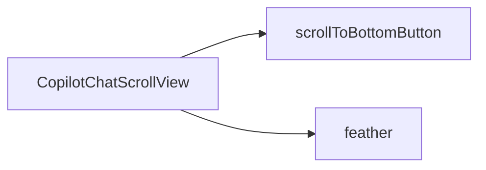

`CopilotChatScrollView` is the default scroll container used by [CopilotChat](/reference/copilot-chat). It handles auto-scrolling during message streaming, provides a scroll-to-bottom button, and displays a gradient fade (feather) overlay.

## What is CopilotChatScrollView?

The CopilotChatScrollView component:

- Provides a scrollable container for the message list
- Auto-scrolls to bottom during AI response streaming
- Shows a scroll-to-bottom button when scrolled up
- Includes a gradient "feather" overlay for visual polish
- Built on the [slot system](/reference/slot-system) for deep customization

## Component Architecture

CopilotChatScrollView provides slots for customizing its visual elements:



### Slot Descriptions

| Slot | Description |
|------|-------------|
| `scrollToBottomButton` | Button that appears when scrolled up from bottom |
| `feather` | Gradient fade overlay at the bottom of the scroll area |

## Basic Usage

Customize the scroll view through the `scrollView` prop on [CopilotChat](/reference/copilot-chat):

```tsx
<CopilotChat
  scrollView={{
    scrollToBottomButton: "bg-blue-500 hover:bg-blue-600",
  }}
/>
```

## Auto-Scroll Behavior

By default, CopilotChatScrollView automatically scrolls to the bottom when:

- New messages are added to the conversation
- The AI is streaming a response
- The user is already near the bottom of the scroll area

To disable auto-scroll:

```tsx
<CopilotChat autoScroll={false} />
```

When auto-scroll is disabled, users must manually scroll to see new messages. The scroll-to-bottom button will appear when new content is available below the viewport.

## Slot Customization

CopilotChatScrollView uses the [slot system](/reference/slot-system). Each slot accepts four types of values:

1. **Tailwind class string** - Add or override CSS classes
2. **Props object** - Pass additional props to the default component
3. **Custom component** - Replace the component entirely
4. **Nested sub-slots** - Drill down to customize child components

### Scroll-to-Bottom Button Customization

Style the scroll-to-bottom button:

```tsx
<CopilotChat
  scrollView={{
    scrollToBottomButton: "bg-blue-500 shadow-xl rounded-full",
  }}
/>
```

Or with a custom component:

```tsx
function CustomScrollButton({ onClick }) {
  return (
    <button
      onClick={onClick}
      className="px-4 py-2 bg-gradient-to-r from-blue-500 to-purple-500 text-white rounded-lg shadow-lg"
    >
      Jump to latest
    </button>
  );
}

<CopilotChat
  scrollView={{
    scrollToBottomButton: CustomScrollButton,
  }}
/>
```

### Feather (Gradient Overlay) Customization

The feather provides a gradient fade at the bottom of the scroll area:

```tsx
<CopilotChat
  scrollView={{
    feather: "from-blue-50 via-blue-50 to-transparent",
  }}
/>
```

To remove the feather entirely:

```tsx
<CopilotChat
  scrollView={{
    feather: () => null,
  }}
/>
```

## Replacing the Scroll View

To completely replace the scroll view with your own component:

```tsx
import { CopilotChatView } from "@copilotkitnext/react";

function CustomScrollView({ children, autoScroll, ...props }) {
  return (
    <CopilotChatView.ScrollView
      autoScroll={autoScroll}
      scrollToBottomButton="bg-indigo-600"
      feather="from-gray-50 via-gray-50 to-transparent"
      {...props}
    >
      {children}
    </CopilotChatView.ScrollView>
  );
}

<CopilotChat scrollView={CustomScrollView} />
```

## Examples

### Custom Scroll Button

```tsx
<CopilotChat
  scrollView={{
    scrollToBottomButton: {
      className: "bg-gradient-to-r from-pink-500 to-orange-500 text-white shadow-xl",
    },
  }}
/>
```

### Dark Mode Feather

```tsx
<CopilotChat
  scrollView={{
    feather: "from-gray-900 via-gray-900 to-transparent",
  }}
/>
```

### Removing Visual Elements

Remove both the scroll button and feather for a minimal look:

```tsx
<CopilotChat
  scrollView={{
    scrollToBottomButton: () => null,
    feather: () => null,
  }}
/>
```

### Custom Themed Scroll View

```tsx
<CopilotChat
  className="bg-slate-50"
  scrollView={{
    className: "bg-slate-50",
    scrollToBottomButton: "bg-slate-700 hover:bg-slate-800 text-white",
    feather: "from-slate-50 via-slate-50 to-transparent",
  }}
/>
```

## Related

- [CopilotChat](/reference/copilot-chat) - Parent component that uses CopilotChatScrollView
- [CopilotChatMessageView](/reference/copilot-chat-message-view) - Message list rendered inside the scroll view
- [Slot System](/reference/slot-system) - Deep dive into slot customization
