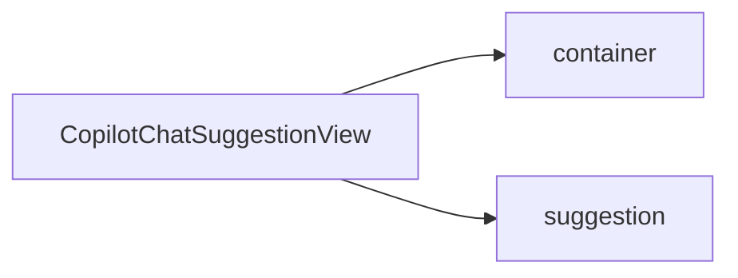

`CopilotChatSuggestionView` is the default component used by [CopilotChat](/reference/copilot-chat) to render clickable suggestion chips. These chips provide quick actions that users can click to send predefined messages.

## What is CopilotChatSuggestionView?

The CopilotChatSuggestionView component:

- Renders a list of clickable suggestion chips
- Supports loading states for individual suggestions
- Handles click events to trigger message sending
- Displays suggestions in a flexible wrapped layout
- Built on the [slot system](/reference/slot-system) for deep customization

## Component Architecture

CopilotChatSuggestionView provides slots for customizing the container and individual chips:



### Slot Descriptions

| Slot | Description |
|------|-------------|
| `container` | The outer container that holds all suggestion chips |
| `suggestion` | Individual suggestion chip (pill button) |

## Basic Usage

Customize suggestions through the `suggestionView` prop on [CopilotChat](/reference/copilot-chat):

```tsx
<CopilotChat
  suggestionView={{
    container: "gap-4",
    suggestion: "bg-blue-100 hover:bg-blue-200 text-blue-800",
  }}
/>
```

## How Suggestions Work

Suggestions are managed through the `useSuggestions` hook, which:

1. Receives suggestions from the AI agent
2. Displays them as clickable chips
3. Triggers message sending when clicked
4. Shows loading states during processing

You don't need to manage suggestions manually - CopilotChat handles this automatically.

## Slot Customization

CopilotChatSuggestionView uses the [slot system](/reference/slot-system). Each slot accepts four types of values:

1. **Tailwind class string** - Add or override CSS classes
2. **Props object** - Pass additional props to the default component
3. **Custom component** - Replace the component entirely
4. **Nested sub-slots** - Drill down to customize child components

### Container Customization

Style the suggestions container:

```tsx
<CopilotChat
  suggestionView={{
    container: "flex-wrap gap-2 justify-center",
  }}
/>
```

### Suggestion Chip Customization

Style individual suggestion chips:

```tsx
<CopilotChat
  suggestionView={{
    suggestion: "bg-gradient-to-r from-blue-500 to-purple-500 text-white px-4 py-2 rounded-full",
  }}
/>
```

Or with a props object:

```tsx
<CopilotChat
  suggestionView={{
    suggestion: {
      className: "bg-indigo-100 text-indigo-800 font-medium",
    },
  }}
/>
```

## Replacing the Component

To completely replace the suggestion view with your own component:

```tsx
import { CopilotChatSuggestionView } from "@copilotkitnext/react";

function CustomSuggestionView({ suggestions, onSelectSuggestion, ...props }) {
  return (
    <div className="custom-suggestions-wrapper">
      <CopilotChatSuggestionView
        suggestions={suggestions}
        onSelectSuggestion={onSelectSuggestion}
        container="gap-3"
        suggestion="bg-white shadow-md hover:shadow-lg rounded-xl px-4 py-2"
        {...props}
      />
    </div>
  );
}

<CopilotChat suggestionView={CustomSuggestionView} />
```

### Using the Render Function

For full layout control, use the children render function:

```tsx
function CustomSuggestionView(props) {
  return (
    <CopilotChatSuggestionView {...props}>
      {({ suggestions, onSelectSuggestion }) => (
        <div className="grid grid-cols-2 gap-2 p-4">
          {suggestions.map((suggestion, index) => (
            <button
              key={index}
              onClick={() => onSelectSuggestion(suggestion, index)}
              className="p-3 bg-white border rounded-lg hover:bg-gray-50 text-left"
            >
              {suggestion.title}
            </button>
          ))}
        </div>
      )}
    </CopilotChatSuggestionView>
  );
}

<CopilotChat suggestionView={CustomSuggestionView} />
```

The render function receives:

| Property | Type | Description |
|----------|------|-------------|
| `container` | `ReactElement` | The bound container element |
| `suggestion` | `ReactElement` | A sample bound suggestion chip |
| `suggestions` | `Suggestion[]` | Array of suggestion objects |
| `onSelectSuggestion` | `(suggestion, index) => void` | Callback when suggestion is clicked |
| `loadingIndexes` | `ReadonlyArray<number>` | Indexes of suggestions currently loading |

## Loading States

Individual suggestions can show loading states when clicked:

```tsx
// Suggestions automatically show loading states when:
// 1. The suggestion is clicked and processing
// 2. The suggestion has isLoading: true in its data
```

The loading state is indicated by a spinner or visual feedback on the chip.

## Examples

### Pill-Style Suggestions

```tsx
<CopilotChat
  suggestionView={{
    container: "flex flex-wrap gap-2",
    suggestion: "rounded-full bg-gray-100 hover:bg-gray-200 px-4 py-1.5 text-sm",
  }}
/>
```

### Card-Style Suggestions

```tsx
<CopilotChat
  suggestionView={{
    container: "grid grid-cols-2 gap-3",
    suggestion: "bg-white shadow-sm border rounded-xl p-3 hover:shadow-md text-left",
  }}
/>
```

### Colorful Gradient Chips

```tsx
<CopilotChat
  suggestionView={{
    suggestion: "bg-gradient-to-r from-pink-500 to-orange-500 text-white hover:from-pink-600 hover:to-orange-600",
  }}
/>
```

### Minimal Style

```tsx
<CopilotChat
  suggestionView={{
    container: "gap-1",
    suggestion: "text-blue-600 hover:text-blue-800 underline underline-offset-2 bg-transparent",
  }}
/>
```

### Centered Suggestions

```tsx
<CopilotChat
  suggestionView={{
    container: "flex justify-center flex-wrap gap-2",
    suggestion: "bg-blue-50 text-blue-700 hover:bg-blue-100 rounded-lg px-3 py-1.5",
  }}
/>
```

## Related

- [CopilotChat](/reference/copilot-chat) - Parent component that uses CopilotChatSuggestionView
- [CopilotChatWelcomeScreen](/reference/copilot-chat-welcome-screen) - Welcome screen that displays suggestions
- [Slot System](/reference/slot-system) - Deep dive into slot customization
