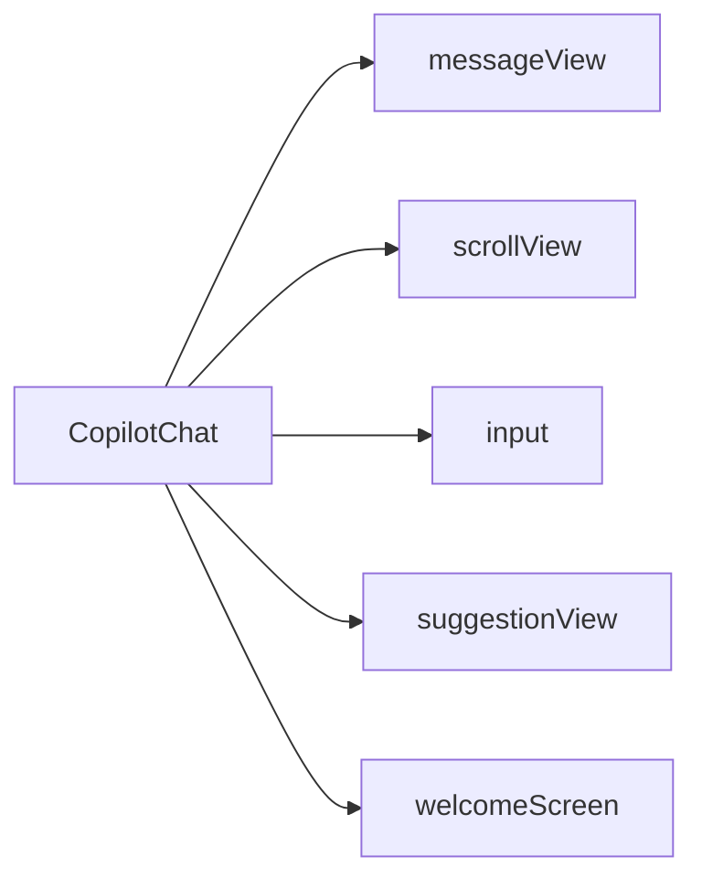

`CopilotChat` is a React component that provides a complete chat interface for interacting with AI agents. It handles
message display, user input, tool execution rendering, and agent communication automatically.

## What is CopilotChat?

The CopilotChat component:

- Provides a complete chat UI out of the box
- Manages conversation threads and message history
- Automatically connects to agents and handles message routing
- Renders tool executions with visual feedback
- Supports deep customization through the [slot system](/reference/slot-system)
- Handles auto-scrolling and responsive layouts
- Supports voice transcription for hands-free input

## Component Architecture

CopilotChat is built on a composable component hierarchy. Understanding this structure helps you customize exactly what you need.



### Slot Descriptions

| Slot | Description | Reference |
|------|-------------|-----------|
| `messageView` | Container for the message list (user and assistant messages) | [CopilotChatMessageView](/reference/copilot-chat-message-view) |
| `scrollView` | Scrollable container with auto-scroll behavior | [CopilotChatScrollView](/reference/copilot-chat-scroll-view) |
| `input` | Text input with toolbar, transcription support, and disclaimer | [CopilotChatInput](/reference/copilot-chat-input) |
| `suggestionView` | Clickable suggestion chips | [CopilotChatSuggestionView](/reference/copilot-chat-suggestion-view) |
| `welcomeScreen` | Initial screen before any messages | [CopilotChatWelcomeScreen](/reference/copilot-chat-welcome-screen) |

See [Slot Customization](#slot-customization) for details on how to customize these slots.

## Basic Usage

```tsx
import { CopilotChat, CopilotKitProvider } from "@copilotkitnext/react";

function App() {
  return (
    <CopilotKitProvider runtimeUrl="/api/copilotkit">
      <CopilotChat />
    </CopilotKitProvider>
  );
}
```

## Props

### agentId

`string` **(optional)**

The ID of the agent to connect to. Defaults to `"default"`.

```tsx
<CopilotChat agentId="assistant" />
```

### threadId

`string` **(optional)**

The conversation thread ID. If not provided, a new thread ID is automatically generated.

When you provide a `threadId`, CopilotChat automatically loads the conversation history for that thread, including any messages that are currently streaming. This enables seamless continuation of conversations across page reloads or component remounts.

```tsx
<CopilotChat threadId="thread-123" />
```

### labels

`Partial<CopilotChatLabels>` **(optional)**

Customize the text labels used throughout the chat interface.

```tsx
<CopilotChat
  labels={{
    chatInputPlaceholder: "Ask me anything...",
    chatDisclaimerText: "AI assistant - verify important info",
    welcomeMessage: "Hello! How can I help you today?",
  }}
/>
```

### autoScroll

`boolean` **(optional, default: true)**

Automatically scroll to the bottom when new messages appear.

```tsx
<CopilotChat autoScroll={false} />
```

### className

`string` **(optional)**

CSS class name for the root container.

```tsx
<CopilotChat className="h-screen bg-white" />
```

### isModalDefaultOpen

`boolean` **(optional)**

When using CopilotChat in modal mode, controls whether the modal is open by default.

```tsx
<CopilotChat isModalDefaultOpen={true} />
```

### chatView

`SlotValue<typeof CopilotChatView>` **(optional)**

Customize the main chat view component. See [Slot Customization](#slot-customization) for details.

## Slot Customization

CopilotChat uses a powerful [slot system](/reference/slot-system) that allows you to customize any part of the UI. Each slot accepts four types of values:

1. **Tailwind class string** - Add or override CSS classes
2. **Props object** - Pass additional props to the default component
3. **Custom component** - Replace the component entirely
4. **Nested sub-slots** - Drill down to customize child components

### Customizing Appearance with Tailwind Classes

The simplest way to customize appearance is with Tailwind class strings:

```tsx
<CopilotChat
  className="bg-gradient-to-b from-white to-gray-50 rounded-xl shadow-2xl"
  messageView="space-y-4"
  input="border-2 border-gray-200"
/>
```

### Customizing with Props

Pass a props object to modify component behavior while keeping the default implementation:

```tsx
<CopilotChat
  messageView={{ className: "custom-message-view" }}
  input={{ placeholder: "Ask a question..." }}
  scrollView="custom-scroll-view"
/>
```

### Nested Slot Customization

You can drill down into nested components through props objects:

```tsx
<CopilotChat
  messageView={{
    assistantMessage: {
      onThumbsUp: () => console.log("thumbsUp"),
      onThumbsDown: () => console.log("thumbsDown"),
    },
  }}
/>
```

### Custom Components

For full control, replace components entirely:

```tsx
import { CopilotChatView } from "@copilotkitnext/react";

function CustomChatView(props) {
  return (
    <div className="custom-chat-layout">
      <CopilotChatView
        {...props}
        messageView="custom-message-from-wrapper"
        input="custom-input-from-wrapper"
      />
    </div>
  );
}

<CopilotChat chatView={CustomChatView} />
```

## Message View Customization

The `messageView` slot controls how messages are rendered:

```tsx
<CopilotChat
  messageView={{
    // Style the message container
    className: "space-y-4 p-4",

    // Customize assistant messages
    assistantMessage: {
      className: "bg-blue-50 rounded-lg",
      onThumbsUp: (message) => trackFeedback(message.id, "positive"),
      onThumbsDown: (message) => trackFeedback(message.id, "negative"),
    },

    // Customize user messages
    userMessage: "bg-gray-100 rounded-lg",

    // Customize the typing cursor
    cursor: "bg-blue-500",
  }}
/>
```

### Assistant Message Customization

Customize how assistant messages appear and behave:

```tsx
<CopilotChat
  messageView={{
    assistantMessage: {
      className: "bg-slate-50 border border-slate-200 rounded-xl p-4",
      onThumbsUp: (message) => sendFeedback(message.id, "positive"),
      onThumbsDown: (message) => sendFeedback(message.id, "negative"),
      onRegenerate: (message) => regenerateResponse(message.id),
    },
  }}
/>
```

For full details on assistant message slots and customization options, see [CopilotChatAssistantMessage](/reference/copilot-chat-assistant-message).

### User Message Customization

Customize how user messages appear:

```tsx
<CopilotChat
  messageView={{
    userMessage: "bg-blue-500 text-white rounded-2xl px-4 py-2",
  }}
/>
```

You can also pass a props object or a custom component:

```tsx
<CopilotChat
  messageView={{
    userMessage: {
      className: "bg-primary text-primary-foreground",
      "data-testid": "user-message",
    },
  }}
/>
```

## Input Customization

The `input` slot controls the text input and its toolbar:

```tsx
<CopilotChat
  input={{
    className: "border-2 border-primary rounded-xl",
    placeholder: "Type your message...",

    // Customize individual buttons
    sendButton: "bg-blue-500 hover:bg-blue-600",
  }}
/>
```

For full details on input slots and customization options, see [CopilotChatInput](/reference/copilot-chat-input).

## Suggestions

CopilotChat automatically manages suggestion chips through the `useSuggestions` hook. Suggestions are generated by the agent and displayed as clickable chips that users can select to quickly send messages.

You can customize suggestions through the `suggestionView` slot, which has two sub-slots:

```tsx
<CopilotChat
  suggestionView={{
    // Customize the container that holds all chips
    container: "gap-4",
    // Customize individual suggestion chips
    suggestion: "bg-blue-100 hover:bg-blue-200 rounded-full",
  }}
/>
```

## Voice Transcription

CopilotChat supports voice input through transcription. To enable it, configure your CopilotKitProvider with transcription settings:

```tsx
<CopilotKitProvider
  runtimeUrl="/api/copilotkit"
  transcribeAudioUrl="/api/transcribe"
>
  <CopilotChat />
</CopilotKitProvider>
```

Once enabled, a microphone button appears in the input toolbar. Users can record audio which is transcribed and inserted into the message input.

## Welcome Screen Customization

The welcome screen is displayed before any messages are sent. You can customize it in several ways:

### Custom Welcome Message

The simplest customization is changing the welcome message text:

```tsx
<CopilotChat
  labels={{
    welcomeMessage: "Hello! I'm your AI assistant. How can I help you today?",
  }}
/>
```

### Custom Welcome Screen Component

For full control, replace the entire welcome screen:

```tsx
function CustomWelcomeScreen() {
  return (
    <div className="flex flex-col items-center justify-center h-full p-8">
      
      <h2 className="text-2xl font-bold mb-2">Welcome to AI Assistant</h2>
      <p className="text-muted-foreground text-center">
        Ask me anything about your data, documents, or tasks.
      </p>
    </div>
  );
}

<CopilotChat welcomeScreen={CustomWelcomeScreen} />
```

## Auto-scrolling Behavior

CopilotChat automatically scrolls to the bottom when:

- New messages are added
- The user is already near the bottom
- `autoScroll` prop is true (default)

The scroll-to-bottom button appears when the user scrolls up and new content is available.

```tsx
// Disable auto-scroll
<CopilotChat autoScroll={false} />

// Customize the scroll button
<CopilotChat scrollView={{ scrollToBottomButton: "bg-blue-500 rounded-full shadow-lg" }} />
```

## Complete Example

Here's a fully customized CopilotChat implementation:

```tsx
import {
  CopilotChat,
  CopilotKitProvider
} from "@copilotkitnext/react";

function App() {
  const handleFeedback = (messageId: string, type: "positive" | "negative") => {
    analytics.track("message_feedback", { messageId, type });
  };

  return (
    <CopilotKitProvider runtimeUrl="/api/copilotkit">
      <div className="h-screen">
        <CopilotChat
          agentId="my-assistant"
          className="h-full"
          labels={{
            chatInputPlaceholder: "Ask me anything...",
            chatDisclaimerText: "AI responses may not be accurate.",
            welcomeMessage: "Hello! I'm here to help.",
          }}
          messageView={{
            assistantMessage: {
              onThumbsUp: (msg) => handleFeedback(msg.id, "positive"),
              onThumbsDown: (msg) => handleFeedback(msg.id, "negative"),
            },
          }}
          input={{
            className: "border-2 border-gray-200 rounded-xl",
            disclaimer: "text-xs text-gray-400",
          }}
        />
      </div>
    </CopilotKitProvider>
  );
}
```

## Related

### Slot Components
- [CopilotChatMessageView](/reference/copilot-chat-message-view) - Message list customization
- [CopilotChatScrollView](/reference/copilot-chat-scroll-view) - Scroll container customization
- [CopilotChatInput](/reference/copilot-chat-input) - Input component customization
- [CopilotChatSuggestionView](/reference/copilot-chat-suggestion-view) - Suggestion chips customization
- [CopilotChatWelcomeScreen](/reference/copilot-chat-welcome-screen) - Welcome screen customization
- [CopilotChatAssistantMessage](/reference/copilot-chat-assistant-message) - Assistant message customization

### Other Components
- [CopilotSidebar](/reference/copilot-sidebar) - Slide-in sidebar chat interface
- [CopilotPopup](/reference/copilot-popup) - Floating popup chat dialog

### Guides & Concepts
- [Slot System](/reference/slot-system) - Deep dive into slot customization

### Providers & Hooks
- [CopilotKitProvider](/reference/copilotkit-provider) - Provider configuration
- [useAgent](/reference/use-agent) - Hook for programmatic agent control
- [useFrontendTool](/reference/use-frontend-tool) - Adding custom tools to the chat
