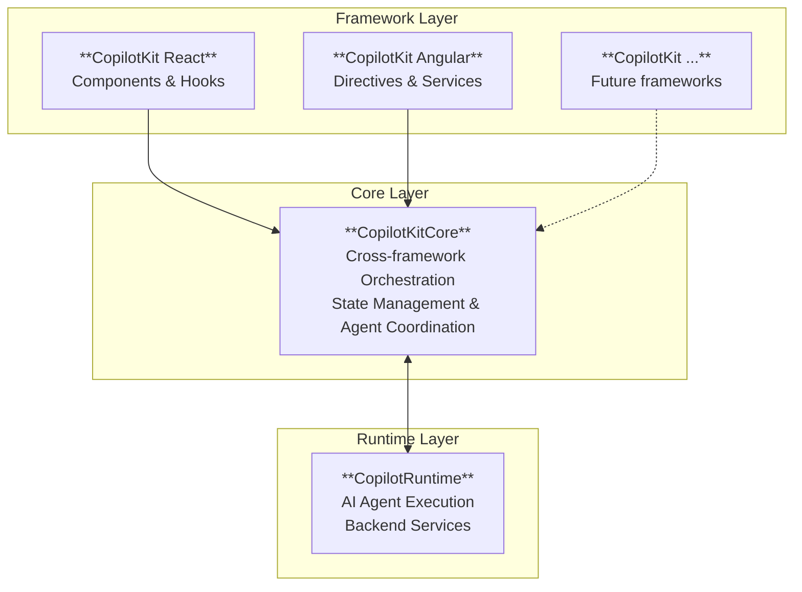

`CopilotKitCore` is the client-side cross-framework orchestration layer that coordinates communication between your
application's UI, agents abd the remote Copilot runtime.

## Architecture Overview



## What does CopilotKitCore do?

CopilotKitCore solves several complex challenges in building AI-powered applications:

1. **Agent Orchestration**: Handles the entire lifecycle of running AI agents, from starting the agent and executing
   tools, to providing tool results, handling follow-ups and handling streaming updates to the UI.
2. **Runtime Connection**: Manages connecting to and synchronizing with the remote `CopilotRuntime`.
3. **State Synchronization**: Maintains consistent state across your application, ensuring all components have access to
   the latest agents, tools, and context
4. **Framework Independence**: Works with any frontend framework, providing a consistent API whether you're using React,
   Angular, Vue, or vanilla JavaScript

At its heart, CopilotKitCore maintains the authoritative state for these critical elements:

- **Agents**: Both local and remote AI agents that power your application's intelligence
- **Context**: Additional information that agents can use to make more informed decisions
- **Frontend Tools**: Functions that agents can call to interact with your UI
- **Properties and Headers**: Application-specific data forwarded to agents as additional properties or HTTP headers
- **Runtime Metadata**: Connection status, versioning, and configuration details

## Creating a CopilotKitCore Instance

<Info>
  In most applications, you don’t need to create a `CopilotKitCore` instance yourself—CopilotKit initializes and manages
  it behind the scenes.
</Info>

Instantiate `CopilotKitCore` to initialize the client that manages runtime connections, agents, and tools.

```typescript
new CopilotKitCore(config?: CopilotKitCoreConfig)
````

#### Parameters

```typescript
interface CopilotKitCoreConfig {
  runtimeUrl?: string; // The endpoint where your CopilotRuntime server is hosted
  headers?: Record<string, string>; // Custom HTTP headers to include with every request
  properties?: Record<string, unknown>; // Application-specific data forwarded to agents as context
  agents__unsafe_dev_only?: Record<string, AbstractAgent>; // Local agents for development only - production requires CopilotRuntime
  tools?: FrontendTool<any>[]; // Frontend functions that agents can invoke
}
```

Configuration details:

- `runtimeUrl`: When provided, CopilotKitCore will automatically connect and discover available remote agents.
- `headers`: Headers to include with every request.
- `properties`: Properties forwarded to agents as `forwardedProps`.
- `tools`: Frontend tools that agents can invoke.
- `agents__unsafe_dev_only`: **Development only** - This property is intended solely for rapid prototyping during
  development. Production deployments require the security, reliability, and performance guarantees that only the
  CopilotRuntime can provide. The key becomes the agent's identifier.

## Core Properties

Once initialized, CopilotKitCore exposes several properties that provide insight into its current state:

### Runtime Configuration

- `runtimeUrl`: `string | undefined` The current runtime endpoint. Changing this property triggers a connection attempt
  to the new runtime. Setting it to `undefined` gracefully disconnects from the current runtime.

- `runtimeVersion`: `string | undefined` The version of the connected runtime, helpful for compatibility checks and
  debugging.

- `runtimeConnectionStatus`: `CopilotKitCoreRuntimeConnectionStatus` Tracks the current connection state, allowing you
  to respond to connection changes in your UI.

### State Management

- `headers`: `Readonly<Record<string, string>>` The current request headers sent with every request.

- `properties`: `Readonly<Record<string, unknown>>` The application properties being forwarded to agents.

- `agents`: `Readonly<Record<string, AbstractAgent>>` A combined view of all available agents, merging local development
  agents with those discovered from the runtime.

- `tools`: `Readonly<FrontendTool<any>[]>` The list of registered frontend tools available to agents.

- `context`: `Readonly<Record<string, Context>>` Contextual information that agents can use to make more informed
  decisions.

## Understanding Runtime Connections

When you provide a `runtimeUrl`, CopilotKitCore initiates a connection to your CopilotRuntime server. Here's what
happens behind the scenes:

1. CopilotKitCore sends a GET request to `{runtimeUrl}/info`
2. The runtime responds with available agents and metadata
3. For each remote agent, `CopilotKitCore` creates a `ProxiedCopilotRuntimeAgent` instance
4. These remote agents are merged with your local agents
5. Subscribers are notified of the connection status and agent availability

### Runtime Connection States

The connection to your runtime can be in one of four states:

- `Disconnected`: No runtime URL is configured, or the connection was intentionally closed
- `Connecting`: Actively attempting to establish a connection with the runtime
- `Connected`: Successfully connected and remote agents are available
- `Error`: The connection attempt failed, but CopilotKitCore will continue with local agents only

## Event Subscription System

CopilotKitCore implements a robust event system that allows you to react to state changes and agent activities:

### subscribe()

Registers a subscriber to receive events. Returns a subscription object with an `unsubscribe()` method, keeping
unsubscription localized to the subscription object.

```typescript
subscribe(subscriber: CopilotKitCoreSubscriber): { unsubscribe(): void }
```

## Subscribing to Events

The event subscription system allows you to build reactive UIs that respond to CopilotKitCore's state changes. Each
event provides both the CopilotKitCore instance and relevant data:

### onRuntimeConnectionStatusChanged()

Notified whenever the connection to the runtime changes state. Use this to show connection indicators in your UI.

```typescript
onRuntimeConnectionStatusChanged?: (event: {
  copilotkit: CopilotKitCore;
  status: CopilotKitCoreRuntimeConnectionStatus;
}) => void | Promise<void>
```

### onToolExecutionStart()

Fired when an agent begins executing a tool. Useful for showing loading states or activity indicators.

```typescript
onToolExecutionStart?: (event: {
  copilotkit: CopilotKitCore;
  toolCallId: string;
  agentId: string;
  toolName: string;
  args: unknown;
}) => void | Promise<void>
```

### onToolExecutionEnd()

Fired when tool execution completes, whether successfully or with an error. Use this to update your UI based on the
results.

```typescript
onToolExecutionEnd?: (event: {
  copilotkit: CopilotKitCore;
  toolCallId: string;
  agentId: string;
  toolName: string;
  result: string;
  error?: string;
}) => void | Promise<void>
```

### onAgentsChanged()

Notified when agents are added, removed, or updated. This includes both local changes and runtime discovery.

```typescript
onAgentsChanged?: (event: {
  copilotkit: CopilotKitCore;
  agents: Readonly<Record<string, AbstractAgent>>;
}) => void | Promise<void>
```

### onContextChanged()

Fired when context items are added or removed. Use this to keep UI elements in sync with available context.

```typescript
onContextChanged?: (event: {
  copilotkit: CopilotKitCore;
  context: Readonly<Record<string, Context>>;
}) => void | Promise<void>
```

### onPropertiesChanged()

Notified when application properties are updated. Useful for debugging or showing current configuration.

```typescript
onPropertiesChanged?: (event: {
  copilotkit: CopilotKitCore;
  properties: Readonly<Record<string, unknown>>;
}) => void | Promise<void>
```

### onHeadersChanged()

Fired when HTTP headers are modified. Important for tracking authentication state changes.

```typescript
onHeadersChanged?: (event: {
  copilotkit: CopilotKitCore;
  headers: Readonly<Record<string, string>>;
}) => void | Promise<void>
```

### onError()

The central error handler for all CopilotKitCore operations. Every error includes a code and contextual information to
help with debugging.

```typescript
onError?: (event: {
  copilotkit: CopilotKitCore;
  error: Error;
  code: CopilotKitCoreErrorCode;
  context: Record<string, any>;
}) => void | Promise<void>
```

## Error Handling

CopilotKitCore provides detailed error information through typed error codes, making it easier to handle different
failure scenarios appropriately:

### Understanding Error Codes

Each error is categorized with a specific code that indicates what went wrong:

- `RUNTIME_INFO_FETCH_FAILED`: The attempt to fetch runtime information failed. This might indicate network issues or an
  incorrect runtime URL.

- `AGENT_CONNECT_FAILED`: Failed to establish a connection with an agent. Check that the agent is properly configured.

- `AGENT_RUN_FAILED`: The agent execution failed. This could be due to invalid messages or agent-side errors.

- `AGENT_RUN_FAILED_EVENT`: The agent reported a failure through its event stream.

- `AGENT_RUN_ERROR_EVENT`: The agent emitted an error event during execution.

- `TOOL_ARGUMENT_PARSE_FAILED`: The arguments provided to a tool couldn't be parsed. This usually indicates a mismatch
  between expected and actual parameters.

- `TOOL_HANDLER_FAILED`: A tool's handler function threw an error during execution.

## Running Agents

CopilotKitCore provides two primary methods for executing agents: `runAgent` for immediate execution with message
handling, and `connectAgent` for establishing live connections to existing agent sessions.

### runAgent()

Executes an agent and intelligently handles the complete request-response cycle, including automatic tool execution and
follow-up runs.

The execution flow:

1. Sends initial messages (if provided) to the agent
2. Agent processes the request and may request tool calls
3. CopilotKitCore automatically executes any requested frontend tools
4. Tool results are added back to the message history
5. If tools were executed and have `followUp` enabled (default), the agent is automatically re-run with the tool results
6. This cycle continues until the agent completes without requesting more tools

Key behaviors:

- **Automatic Tool Execution**: When an agent requests a tool call, CopilotKitCore finds the matching tool, executes it,
  and adds the result to the conversation
- **Smart Follow-ups**: After executing tools, it automatically re-runs the agent so it can process the tool results and
  continue its work
- **Error Recovery**: Tool execution errors are captured and returned to the agent, allowing it to handle failures
  gracefully
- **Wildcard Tools**: Supports a special "\*" tool that can handle any undefined tool request

```typescript
runAgent(params: CopilotKitCoreRunAgentParams): Promise<RunAgentResult>
```

#### Parameters

```typescript
interface CopilotKitCoreRunAgentParams {
  agent: AbstractAgent; // The agent to execute
}
```

### connectAgent()

Establishes a live connection with an agent, restoring any existing conversation history and subscribing to real-time
events. This method is particularly useful when:

- Reconnecting to an agent that's already running (displays new events as they occur)
- Restoring conversation history after a page refresh
- Setting up an agent that will receive updates from background processes

The connection process:

1. Provides the agent with current properties and available tools
2. Sets up error event subscribers for proper error handling
3. Restores any existing message history
4. Returns immediately without triggering a new agent run

```typescript
connectAgent(params: CopilotKitCoreConnectAgentParams): Promise<RunAgentResult>
```

#### Parameters

```typescript
interface CopilotKitCoreConnectAgentParams {
  agent: AbstractAgent; // The agent to connect
  agentId?: string; // Override the agent's default identifier
}
```

### getAgent()

Retrieves an agent by its identifier. Returns `undefined` if the agent doesn't exist or if the runtime is still
connecting.

```typescript
getAgent(id: string): AbstractAgent | undefined
```

## Managing Context

Context provides agents with additional information about the current state of your application:

### addContext()

Adds contextual information that agents can reference. Returns a unique identifier for later removal.

```typescript
addContext(context: Context): string
```

#### Parameters

```typescript
interface Context {
  description: string; // A human-readable description of what this context represents
  value: any; // The actual context data
}
```

### removeContext()

Removes previously added context using its identifier.

```typescript
removeContext(id: string): void
```

## Managing Tools

Tools are functions that agents can call to interact with your application:

### addTool()

Registers a new frontend tool. If a tool with the same name and agent scope already exists, the registration is skipped
to prevent duplicates.

```typescript
addTool<T>(tool: FrontendTool<T>): void
```

### removeTool()

Removes a tool from the registry. You can remove tools globally or for specific agents:

- When `agentId` is provided, removes the tool only for that agent
- When `agentId` is omitted, removes only global tools with the matching name

```typescript
removeTool(id: string, agentId?: string): void
```

### getTool()

Retrieves a tool by name, with intelligent fallback behavior:

- If an agent-specific tool isn't found, it falls back to global tools

```typescript
getTool(params: CopilotKitCoreGetToolParams): FrontendTool<any> | undefined
```

#### Parameters

```typescript
interface CopilotKitCoreGetToolParams {
  toolName: string; // The tool's name
  agentId?: string; // Look for agent-specific tools first
}
```

### setTools()

Replaces all tools at once. Useful for completely reconfiguring available tools.

```typescript
setTools(tools: FrontendTool<any>[]): void
```

## Tool Execution Lifecycle

Understanding how CopilotKitCore handles tool execution is crucial for building responsive AI applications. Here's the
complete lifecycle:

### 1. Tool Request

When an agent needs to interact with your application, it returns a tool call request with:

- Tool name
- Structured arguments (JSON)
- Unique call ID for tracking

### 2. Tool Resolution

CopilotKitCore uses a two-tier resolution strategy:

- First checks for agent-specific tools (scoped to that particular agent)
- Falls back to global tools available to all agents
- Special wildcard tool (`*`) can handle any unmatched tool requests

### 3. Execution & Error Handling

The tool handler is invoked with parsed arguments:

- Successful results are stringified and added to the conversation
- Errors are caught and returned to the agent for graceful handling
- Subscribers are notified of start and completion events

### 4. Automatic Follow-up

By default, after tool execution completes:

- The tool result is inserted into the message history
- The agent is automatically re-run to process the results
- This continues until no more tools are requested
- You can disable follow-up by setting `followUp: false` on specific tools

## Working with Configuration

These methods allow you to dynamically update CopilotKitCore's configuration after initialization:

### setRuntimeUrl()

Changes the runtime endpoint and manages the connection lifecycle. This is useful when switching between different
environments or disconnecting from the runtime entirely.

```typescript
setRuntimeUrl(runtimeUrl: string | undefined): void
```

### setHeaders()

Replaces all HTTP headers. Subscribers are notified so they can react to authentication changes or other header updates.

```typescript
setHeaders(headers: Record<string, string>): void
```

### setProperties()

Updates the properties forwarded to agents. Use this when your application state changes in ways that might affect agent
behavior.

```typescript
setProperties(properties: Record<string, unknown>): void
```

## Managing Local Agents

<Warning>
  In production applications, agents must be managed through the CopilotRuntime, which provides proper isolation,
  monitoring, and scalability. The local agent methods below are marked `__unsafe_dev_only` as they're intended solely
  for rapid prototyping during development. Production deployments require the security and performance guarantees that
  only the CopilotRuntime can provide.
</Warning>

Agents are the AI-powered components that process requests and generate responses. CopilotKitCore provides several
methods to manage them locally during development:

### setAgents\_\_unsafe_dev_only()

Replaces all local development agents while preserving remote agents from the runtime.

```typescript
setAgents__unsafe_dev_only(agents: Record<string, AbstractAgent>): void
```

### addAgent\_\_unsafe_dev_only()

Adds a single agent for development testing.

```typescript
addAgent__unsafe_dev_only(params: CopilotKitCoreAddAgentParams): void
```

#### Parameters

```typescript
interface CopilotKitCoreAddAgentParams {
  id: string; // A unique identifier for the agent
  agent: AbstractAgent; // The agent instance to add
}
```

### removeAgent\_\_unsafe_dev_only()

Removes a local development agent by its identifier. Remote agents from the runtime cannot be removed this way.

```typescript
removeAgent__unsafe_dev_only(id: string): void
```
