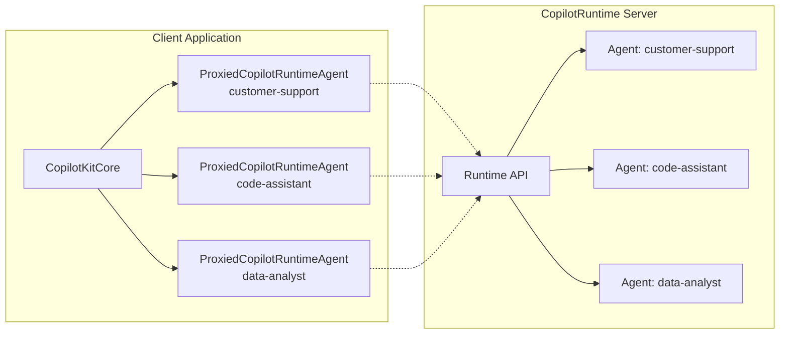

`ProxiedCopilotRuntimeAgent` is a specialized HTTP agent that acts as a proxy between your client application and remote
agents hosted on the `CopilotRuntime` server. It extends the base `HttpAgent` class to provide seamless communication
with runtime-hosted agents.

## Architecture Overview



## What is ProxiedCopilotRuntimeAgent?

When `CopilotKitCore` connects to a `CopilotRuntime` server, it discovers available remote agents. For each remote
agent, it creates a `ProxiedCopilotRuntimeAgent` instance that handles all communication with that specific agent
through the runtime's API endpoints.

Key characteristics:

- **Remote Agent Communication**: Handles communication with the remote agent through the runtime's API endpoints
- **Header and Property Forwarding**: Inherits and forwards authentication headers and properties from `CopilotKitCore`
- **Connection and History Management**: Handles loading history and reconnecting to existing live agent sessions

## How does it work?

`CopilotKitCore` automatically creates `ProxiedCopilotRuntimeAgent` instances during runtime discovery:

1. `CopilotKitCore` fetches `/info` from the runtime
2. The runtime responds with available agents
3. For each agent, `CopilotKitCore` creates a `ProxiedCopilotRuntimeAgent`
4. These agents are merged with any local agents
5. The agents become available through `copilotKit.getAgent()`

## Creating a ProxiedCopilotRuntimeAgent

<Note>
  In typical usage, you don't create `ProxiedCopilotRuntimeAgent` instances directly. `CopilotKitCore` automatically
  creates them when discovering agents from the runtime.
</Note>

```typescript
import { ProxiedCopilotRuntimeAgent } from "@copilotkitnext/core";

const agent = new ProxiedCopilotRuntimeAgent({
  runtimeUrl: "https://your-runtime.example.com",
  agentId: "my-agent",
  headers: {
    Authorization: "Bearer your-token",
  },
});
```
