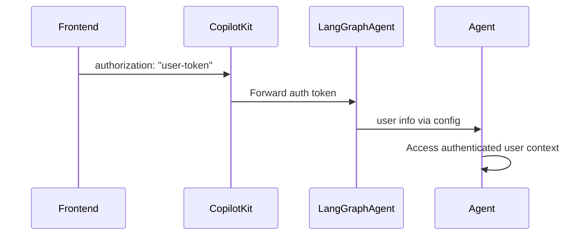

## Overview

CopilotKit supports user authentication for LangGraph agents in two deployment modes:

- **LangGraph Platform**: Uses built-in authentication with `@auth.authenticate` decorator
- **Self-hosted**: Uses dynamic agent configuration to pass authentication context

Both approaches enable your agents to access authenticated user context and implement proper authorization.

## How It Works



## Frontend Setup

Pass your authentication token via the `properties` prop:

```tsx
<CopilotKit
  runtimeUrl="/api/copilotkit"
  properties={{
    authorization: userToken, // Forwarded as Bearer token
  }}
>
  <YourApp />
</CopilotKit>
```

**Note**: For LangGraph Platform, the `authorization` property is forwarded as a Bearer token.

## LangGraph Platform Deployment

**For agents deployed to LangGraph Platform**, authentication works out of the box with the `@auth.authenticate` decorator.

### Setup Authentication Handler

```python
# auth.py in your LangGraph Platform deployment
from langgraph_sdk import Auth

auth = Auth()

@auth.authenticate
async def authenticate(authorization: str | None):
    if not authorization or not authorization.startswith("Bearer "):
        raise Auth.exceptions.HTTPException(status_code=401, detail="Unauthorized")

    token = authorization.replace("Bearer ", "")
    user_info = validate_your_token(token)  # Your validation logic

    return {
        "identity": user_info["user_id"],
        "role": user_info.get("role"),
        "permissions": user_info.get("permissions", [])
    }
```

### Access User in Agent

```python
from langchain_core.runnables import RunnableConfig

async def my_agent_node(state: AgentState, config: RunnableConfig):
    # Access user from LangGraph Platform authentication
    user_info = config["configuration"]["langgraph_auth_user"]
    user_id = user_info["identity"]
    user_role = user_info.get("role")

    # Your agent logic with user context
    return state
```

For complete implementation details, see the [LangGraph Platform Authentication documentation](https://docs.langchain.com/langsmith/auth#authentication).

## Self-hosted Deployment

**For self-hosted agents**, the recommended approach is to use `useAgentContext` from the v2 API. This pattern works seamlessly with LangGraph 0.6.0+ and the `CopilotKitMiddleware`.

### Setup with CopilotKitMiddleware (Recommended)

Use the `CopilotKitMiddleware` which automatically handles context forwarding:

```python
# agent.py - Agent with CopilotKitMiddleware
from langgraph.prebuilt import create_agent
from langchain_openai import ChatOpenAI
from copilotkit import CopilotKitMiddleware

graph = create_agent(
    model=ChatOpenAI(model="gpt-4"),
    tools=[],
    middleware=[CopilotKitMiddleware()],
)
```

### Frontend: Publish Auth Context

```tsx
import { useAgentContext } from "@copilotkit/react-core/v2";

function YourApp() {
  const authToken = getUserAuthToken(); // Your auth logic
  
  useAgentContext({
    description: "User authentication context",
    value: {
      authToken: authToken,
      userId: getCurrentUserId(),
    },
  });
  
  return (...);
}
```

### Access User in Agent

```python
from langchain_core.runnables import RunnableConfig

async def my_agent_node(state: AgentState, config: RunnableConfig):
    # Access context with LangGraph 0.6.0+ compatibility
    context = config.get("context", {}) or config.get("configurable", {})
    
    auth_token = context.get("authToken")
    user_id = context.get("userId", "anonymous")
    
    if auth_token:
        user_info = validate_your_token(auth_token)
        user_role = user_info.get("role")
    else:
        user_role = None

    # Your agent logic with user context
    return state
```

<Callout type="tip" title="Why this pattern?">
  The `CopilotKitMiddleware` automatically reads context from both `config["context"]` (LangGraph 0.6.0+) and `config["configurable"]` (older versions), providing seamless compatibility across LangGraph versions.
</Callout>

## Universal Authentication Pattern

For agents that work in both LangGraph Platform and self-hosted environments, use this pattern:

```python
from langchain_core.runnables import RunnableConfig

async def my_agent_node(state: AgentState, config: RunnableConfig):
    user_id = "anonymous"
    user_role = None

    # LangGraph Platform mode
    if "configuration" in config and "langgraph_auth_user" in config["configuration"]:
        user_info = config["configuration"]["langgraph_auth_user"]
        user_id = user_info["identity"]
        user_role = user_info.get("role")

    # Self-hosted mode with CopilotKitMiddleware
    else:
        # Check both context (LangGraph 0.6.0+) and configurable (fallback)
        context = config.get("context", {}) or config.get("configurable", {})
        auth_token = context.get("authToken")
        
        if auth_token:
            user_info = validate_your_token(auth_token)
            user_id = user_info["user_id"]
            user_role = user_info.get("role")

    # Your agent logic with user context
    return state
```

## Security Notes

### LangGraph Platform

- **Token Validation**: Automatic validation via `@auth.authenticate` handler
- **Built-in Security**: LangGraph Platform handles token parsing and validation
- **User Scoping**: Use authorization handlers to scope resources to authenticated users

### Self-hosted

- **Manual Validation**: You must implement token validation in your agent logic
- **Context Passing**: Authentication context passed through agent configuration
- **Security Responsibility**: Ensure proper token validation and user scoping

### General Best Practices

- **Permission Checks**: Implement role-based access control in your agents
- **Token Security**: Use secure token generation and validation
- **User Scoping**: Always scope data access to authenticated users

For comprehensive authentication patterns, authorization handlers, and security best practices, refer to the [LangGraph Platform Authentication documentation](https://docs.langchain.com/langsmith/auth#authentication).

## Troubleshooting

### Common Issues

**Token not reaching agent**:

- Ensure you're passing `authorization` in the `properties` prop
- For self-hosted: Verify dynamic agent configuration is set up correctly

**Invalid token format**:

- CopilotKit automatically adds the `Bearer ` prefix for LangGraph Platform
- For self-hosted: Handle token format in your validation logic

**User info not available**:

- **LangGraph Platform**: Verify your `@auth.authenticate` handler is properly configured
- **Self-hosted**: Check that `copilotkit_auth` is properly passed in `langgraph_config`

**Authentication works locally but not in production**:

- Ensure you're using the correct deployment mode (LangGraph Platform vs self-hosted)
- Verify environment-specific configuration differences

## Next Steps

- [Configure your LangGraph Platform deployment →](/langgraph/quickstart)
- [Learn about agent state management →](/langgraph/shared-state)
- [Implement human-in-the-loop workflows →](/langgraph/human-in-the-loop)