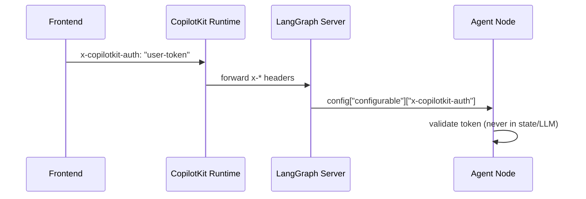

## Overview

CopilotKit supports user authentication for LangGraph agents in two deployment modes:

- **LangGraph Platform**: Uses built-in authentication with `@auth.authenticate` decorator
- **Self-hosted**: Uses custom `x-*` HTTP headers forwarded through the CopilotKit runtime into `config["configurable"]`

**Both approaches keep auth tokens out of the LLM's context window.**  This is what distinguishes them from the `useAgentContext` / App Context channel, which is intentionally model-visible and therefore unsuitable for secrets.


```mermaid
sequenceDiagram
    participant Frontend
    participant CopilotKit Runtime
    participant LangGraph Server
    participant Agent Node

    Frontend->>CopilotKit Runtime: x-copilotkit-auth: "user-token"
    CopilotKit Runtime->>LangGraph Server: forward x-* headers
    LangGraph Server->>Agent Node: config["configurable"]["x-copilotkit-auth"]
    Agent Node->>Agent Node: validate token (never in state/LLM)
```

<Callout type="warning" title="useAgentContext is NOT for auth tokens">
  **`useAgentContext` is the model-visible channel.**  Every value published via
  `useAgentContext` is serialized into a `SystemMessage` sent to the LLM on every
  turn — it appears in LLM provider logs and the LLM can reference it in responses.

  For auth tokens, API keys, and other secrets use one of the approaches below
  (LangGraph Platform built-in auth or `x-*` configurable headers).  Reserve
  `useAgentContext` for non-secret preferences and metadata the LLM is meant to see.
</Callout>

## LangGraph Platform Deployment

**For agents deployed to LangGraph Platform**, authentication works out of the box with the `@auth.authenticate` decorator.

### Setup Authentication Handler

```python
# auth.py in your LangGraph Platform deployment
from langgraph_sdk import Auth

auth = Auth()

@auth.authenticate
async def authenticate(authorization: str | None):
    if not authorization or not authorization.startswith("Bearer "):
        raise Auth.exceptions.HTTPException(status_code=401, detail="Unauthorized")

    token = authorization.replace("Bearer ", "")
    user_info = validate_your_token(token)  # Your validation logic

    return {
        "identity": user_info["user_id"],
        "role": user_info.get("role"),
        "permissions": user_info.get("permissions", [])
    }
```

### Access User in Agent

```python
from langchain_core.runnables import RunnableConfig

async def my_agent_node(state: AgentState, config: RunnableConfig):
    # Access user from LangGraph Platform authentication
    user_info = config["configurable"]["langgraph_auth_user"]
    user_id = user_info["identity"]
    user_role = user_info.get("role")

    # Your agent logic with user context
    return state
```

For complete implementation details, see the [LangGraph Platform Authentication documentation](https://docs.langchain.com/langsmith/auth#authentication).

## Self-hosted Deployment

**For self-hosted agents**, send auth credentials as a custom `x-*` HTTP header.
The CopilotKit runtime forwards eligible `x-*` headers to the LangGraph server,
which places them in `config["configurable"]` — a channel that is **never**
serialized into state or the LLM prompt.

### Why `x-*` headers and not `useAgentContext`?

| Channel | Visible to LLM? | Suitable for secrets? |
|---|---|---|
| `useAgentContext` → `state["copilotkit"]["context"]` | **Yes** — injected as a system message | ❌ No |
| `x-*` header → `config["configurable"]` | **No** — never touches state or prompt | ✅ Yes |

### Step 1 — Configure the LangGraph server to admit the header

In your `langgraph.json`, allow `x-*` headers to be forwarded into `config["configurable"]`:

```json title="langgraph.json"
{
  "http": {
    "configurable_headers": {
      "include": ["x-*"]
    }
  }
}
```

This tells the langgraph-api server to copy any inbound `x-*` HTTP headers into
`config["configurable"]` before the graph runs.

### Step 2 — Send the header from the frontend

Pass the token as a custom request header from your React app:

```tsx title="app/page.tsx"
import { CopilotKit } from "@copilotkit/react-core";

export default function Page() {
  const userToken = getAuthToken(); // your auth logic

  return (
    <CopilotKit
      runtimeUrl="/api/copilotkit"
      headers={{
        "x-copilotkit-auth": userToken,
      }}
    >
      <YourApp />
    </CopilotKit>
  );
}
```

### Step 3 — Read the token in your graph node

The token arrives in `config["configurable"]` — read it directly in any graph node:

```python title="agent.py"
from typing import Any
from langchain_core.runnables import RunnableConfig

async def authenticated_node(state: dict[str, Any], config: RunnableConfig) -> dict[str, Any]:
    # Read the auth token from the non-model-visible configurable channel.
    token = (config.get("configurable") or {}).get("x-copilotkit-auth")

    if not token:
        raise PermissionError("No auth token provided")

    # Validate and use the token — it is never in state or the LLM prompt.
    user_info = validate_token(token)  # your validation logic

    # Store only non-sensitive user identity in state if needed.
    return {"user_id": user_info["user_id"]}
```

<Callout type="tip" title="Token stays in config, not in state">
  The `x-copilotkit-auth` value lives in `config["configurable"]` and is **never**
  copied into LangGraph state.  `CopilotKitMiddleware` only serializes
  `state["copilotkit"]["context"]` into the system message — `config["configurable"]`
  is completely invisible to the LLM.
</Callout>

### How the forwarding chain works

1. The CopilotKit v2 runtime receives the inbound `x-copilotkit-auth` request header.
2. `mergeForwardableHeaders` in the runtime attaches eligible `x-*` headers to the outgoing `LangGraphAgent` call.
3. Because `langgraph.json` sets `configurable_headers.include: ["x-*"]`, the langgraph-api server maps those headers into `config["configurable"]`.
4. Your graph node receives `config: RunnableConfig` with `config["configurable"]["x-copilotkit-auth"]` populated.
5. The same path works on every subsequent turn of the same thread — no token reset between runs.

## Universal Pattern (Platform + Self-hosted)

For agents that need to work in both environments:

```python
from typing import Any, Optional
from langchain_core.runnables import RunnableConfig

async def my_agent_node(state: dict[str, Any], config: RunnableConfig) -> dict[str, Any]:
    configurable = config.get("configurable") or {}
    user_id: Optional[str] = None
    user_role: Optional[str] = None

    # LangGraph Platform mode — built-in auth handler populates this key.
    if "langgraph_auth_user" in configurable:
        user_info = configurable["langgraph_auth_user"]
        user_id = user_info["identity"]
        user_role = user_info.get("role")

    # Self-hosted mode — custom x-* header forwarded by CopilotKit runtime.
    elif "x-copilotkit-auth" in configurable:
        token = configurable["x-copilotkit-auth"]
        user_info = validate_token(token)   # your validation logic
        user_id = user_info["user_id"]
        user_role = user_info.get("role")

    if not user_id:
        raise PermissionError("Authentication required")

    # user_id and user_role are safe to put in state.
    # The raw token never touches state or the LLM prompt.
    return {"user_id": user_id, "user_role": user_role}
```

## Security Notes

### What NOT to do

```python
# ❌ WRONG — auth tokens in useAgentContext are sent to the LLM
useAgentContext({
    description: "auth context",
    value: { authToken: userToken },  # token visible in LLM logs!
})

# ❌ WRONG — same problem: state["copilotkit"]["context"] is model-visible
state = {
    "copilotkit": {
        "context": [{"value": {"authToken": token}}]  # visible to LLM!
    }
}
```

### What to do instead

- Use `x-copilotkit-auth` (or any `x-*` header) forwarded through the CopilotKit runtime into `config["configurable"]` — as shown above.
- For LangGraph Platform, use the `@auth.authenticate` handler.
- For service-to-service calls, use environment variables baked into the agent server — they never cross the HTTP boundary.

### General Best Practices

- **Validate tokens server-side**: the graph node is the right place to validate; never trust frontend-supplied tokens without server-side verification.
- **Minimal state exposure**: store only the user identity (not the raw token) in state when you need it across nodes.
- **Token Security**: use short-lived tokens and refresh them at the frontend before they expire.

## Troubleshooting

### Token not reaching the agent

- Confirm `langgraph.json` has `"configurable_headers": {"include": ["x-*"]}`.
- Confirm the CopilotKit runtime `forwardHeadersPolicy` is not explicitly blocking `x-copilotkit-auth`.
- Confirm the frontend is passing the header via `<CopilotKit headers={{...}}>`.

### `config["configurable"]` is empty or missing the key

- The langgraph-api server only populates `config["configurable"]` from HTTP headers when running inside a real server context (`langgraph up` / `langgraph dev`).  In unit tests, pass the config directly: `graph.invoke({}, config={"configurable": {"x-copilotkit-auth": "..."}})`.

### Token null on second run

- This was bug FAC-121 (LangGraph 0.6+ configurable API change).  Ensure you are not using the deprecated `forwardedProps.config.configurable` pattern from v1.  The `x-*` header path documented here works correctly across repeated runs in LangGraph 0.6+.

## Next Steps

- [Configure LangGraph Platform deployment →](/langgraph/quickstart)
- [Learn about agent state management →](/langgraph/shared-state)
- [Implement human-in-the-loop workflows →](/langgraph/human-in-the-loop)
