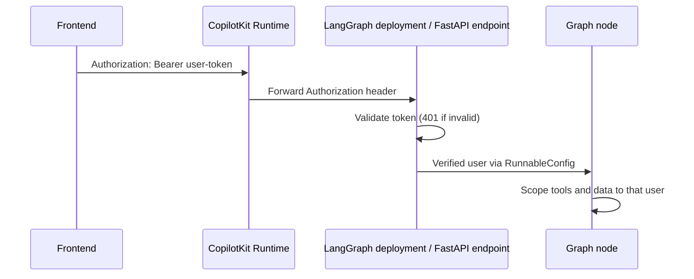

## Overview

CopilotKit supports user authentication for LangGraph agents in two deployment modes:

- **LangGraph Platform** (and `langgraph dev`): the server runs your `@auth.authenticate` handler on every request
- **Self-hosted** (FastAPI + AG-UI): your endpoint validates the request and injects the resolved user into the run config

In both cases the frontend sends the same thing — an `Authorization` header — and the runtime forwards it to the agent.

## How It Works


```mermaid
sequenceDiagram
    participant Frontend
    participant Runtime as CopilotKit Runtime
    participant Backend as LangGraph deployment / FastAPI endpoint
    participant Agent as Graph node

    Frontend->>Runtime: Authorization: Bearer user-token
    Runtime->>Backend: Forward Authorization header
    Backend->>Backend: Validate token (401 if invalid)
    Backend->>Agent: Verified user via RunnableConfig
    Agent->>Agent: Scope tools and data to that user
```

## Frontend Setup

Pass your authentication token via the `headers` prop:

```tsx
<CopilotKit
  runtimeUrl="/api/copilotkit"
  headers={{
    Authorization: `Bearer ${userToken}`,
  }}
>
  <YourApp />
</CopilotKit>
```

The runtime forwards `Authorization` (and any custom `x-*` headers) onto the outgoing agent call. Headers the server explicitly configured on the agent win on collision, so a service-to-service credential can never be overridden from the browser.

**Note**: `properties` is not an auth channel. The runtime delivers `properties` to the agent as AG-UI `forwardedProps` — run payload data — and never converts them into a Bearer header.

## LangGraph Platform Deployment

**For agents deployed to LangGraph Platform** (or served by `langgraph dev`), authentication works out of the box with the `@auth.authenticate` decorator. The forwarded header arrives as the handler's `authorization` argument.

### Setup Authentication Handler

```python
# auth.py in your LangGraph Platform deployment
from langgraph_sdk import Auth

auth = Auth()

@auth.authenticate
async def authenticate(authorization: str | None):
    if not authorization or not authorization.startswith("Bearer "):
        raise Auth.exceptions.HTTPException(status_code=401, detail="Unauthorized")

    token = authorization.replace("Bearer ", "")
    user_info = validate_your_token(token)  # Your validation logic

    return {
        "identity": user_info["user_id"],
        "role": user_info.get("role"),
        "permissions": user_info.get("permissions", [])
    }
```

### Access User in Agent

```python
from langchain_core.runnables import RunnableConfig

async def my_agent_node(state: AgentState, config: RunnableConfig):
    # Access user from LangGraph Platform authentication
    user_info = config["configurable"]["langgraph_auth_user"]
    user_id = user_info["identity"]
    user_role = user_info.get("role")

    # Your agent logic with user context
    return state
```

For complete implementation details, see the [LangGraph Platform Authentication documentation](https://docs.langchain.com/langsmith/auth#authentication).

## Self-hosted Deployment

**For self-hosted agents** (uvicorn + `ag-ui-langgraph`), you own validation. Do it at the endpoint that serves the AG-UI stream: `add_langgraph_fastapi_endpoint` takes one pre-built agent and offers no per-request hook, so replace it with the equivalent route of your own. A FastAPI dependency verifies the forwarded `Authorization` header, and the resolved user is baked into a per-request agent's `config`.

### Serve the AG-UI endpoint yourself

```python title="main.py"
from typing import Optional

from ag_ui.core.types import RunAgentInput
from ag_ui.encoder import EventEncoder
from copilotkit import LangGraphAGUIAgent
from fastapi import Depends, FastAPI, Header, HTTPException, Request
from fastapi.responses import StreamingResponse

from src.agent import graph

app = FastAPI()

def current_user(authorization: Optional[str] = Header(default=None)) -> dict:
    if not authorization or not authorization.startswith("Bearer "):
        raise HTTPException(status_code=401, detail="Missing bearer token")
    return validate_your_token(authorization.removeprefix("Bearer ").strip())  # your validation

@app.post("/")
async def run_agent(
    input_data: RunAgentInput,
    request: Request,
    user: dict = Depends(current_user),
):
    encoder = EventEncoder(accept=request.headers.get("accept"))

    # One agent per request: the verified identity rides on this run only, and
    # each request gets its own isolated streaming state.
    agent = LangGraphAGUIAgent(
        name="sample_agent",
        description="Agent with authentication support",
        graph=graph,
        config={"configurable": {"auth_user": user}},
    )

    async def event_generator():
        async for event in agent.run(input_data):
            yield encoder.encode(event)

    return StreamingResponse(event_generator(), media_type=encoder.get_content_type())
```

If your nodes don't need the identity and you only want unauthenticated traffic rejected, you can keep `add_langgraph_fastapi_endpoint` and hang the dependency off the app instead: `FastAPI(dependencies=[Depends(current_user)])`. The 401 gate applies, but no user context reaches the run config.

### Access User in Agent

```python
from langchain_core.runnables import RunnableConfig

async def my_agent_node(state: AgentState, config: RunnableConfig):
    # Already validated by the endpoint — no raw token in the graph
    user = config["configurable"]["auth_user"]
    user_id = user["user_id"]
    user_role = user.get("role")

    # Your agent logic with user context
    return state
```

<Callout type="warning" title="`CopilotKitRemoteEndpoint` no longer works here">
Guides written for CopilotKit v1 wrapped the graph in `CopilotKitRemoteEndpoint(agents=lambda context: [...])`. That path is retired: `copilotkit` no longer exports `LangGraphAgent` (`ImportError`), and the current `LangGraphAGUIAgent` exposes `run()` rather than the `execute()` that `CopilotKitRemoteEndpoint` calls — giving `AgentExecutionException: 'LangGraphAGUIAgent' object has no attribute 'execute'`. Use the endpoint above instead, and see [Migrate to AG-UI](/langgraph/troubleshooting/migrate-to-agui) for the rest of the move.
</Callout>

## Universal Authentication Pattern

For agents that run in both environments, read whichever key the environment populated:

```python
from langchain_core.runnables import RunnableConfig

async def my_agent_node(state: AgentState, config: RunnableConfig):
    configurable = config.get("configurable", {})
    user_id = "anonymous"
    user_role = None

    # LangGraph Platform / langgraph dev
    if "langgraph_auth_user" in configurable:
        user_info = configurable["langgraph_auth_user"]
        user_id = user_info["identity"]
        user_role = user_info.get("role")

    # Self-hosted (injected by your AG-UI endpoint)
    elif "auth_user" in configurable:
        user_info = configurable["auth_user"]
        user_id = user_info["user_id"]
        user_role = user_info.get("role")

    # Your agent logic with user context
    return state
```

## Security Notes

### LangGraph Platform

- **Token Validation**: Automatic validation via `@auth.authenticate` handler
- **Built-in Security**: LangGraph Platform handles token parsing and validation
- **User Scoping**: Use authorization handlers to scope resources to authenticated users

### Self-hosted

- **Manual Validation**: You must validate the token at your AG-UI endpoint, before the graph runs
- **Context Passing**: Pass the resolved user — not the raw token — through the run config
- **Security Responsibility**: Ensure proper token validation and user scoping

### General Best Practices

- **Permission Checks**: Implement role-based access control in your agents
- **Token Security**: Use secure token generation and validation
- **User Scoping**: Always scope data access to authenticated users

For comprehensive authentication patterns, authorization handlers, and security best practices, refer to the [LangGraph Platform Authentication documentation](https://docs.langchain.com/langsmith/auth#authentication).

## Troubleshooting

### Common Issues

**Token not reaching agent**:

- Ensure you're passing `Authorization` in the `headers` prop, not in `properties`
- Check that the agent isn't already configured with its own `Authorization` header — server-configured headers win on collision
- If you set a custom `forwardHeaders` policy on the runtime, confirm `authorization` is still allowed by it

**Invalid token format**:

- Include the `Bearer ` prefix yourself in the `headers` value; nothing adds it for you
- Strip the prefix before validating (`authorization.removeprefix("Bearer ").strip()`)

**User info not available**:

- **LangGraph Platform**: Verify your `@auth.authenticate` handler is properly configured, and read the user from `config["configurable"]["langgraph_auth_user"]`
- **Self-hosted**: Check that your endpoint builds the agent with `config={"configurable": {...}}` per request — a shared agent built at import time carries no request identity

**`AgentExecutionException: 'LangGraphAGUIAgent' object has no attribute 'execute'`**:

- You're on the retired `CopilotKitRemoteEndpoint` path. Serve the AG-UI endpoint directly, as shown above.

**Authentication works locally but not in production**:

- Ensure you're using the correct deployment mode (LangGraph Platform vs self-hosted)
- Verify environment-specific configuration differences

## Next Steps

- [Configure your LangGraph Platform deployment →](/langgraph/quickstart)
- [Learn about agent state management →](/langgraph/shared-state)
- [Implement human-in-the-loop workflows →](/langgraph/human-in-the-loop)