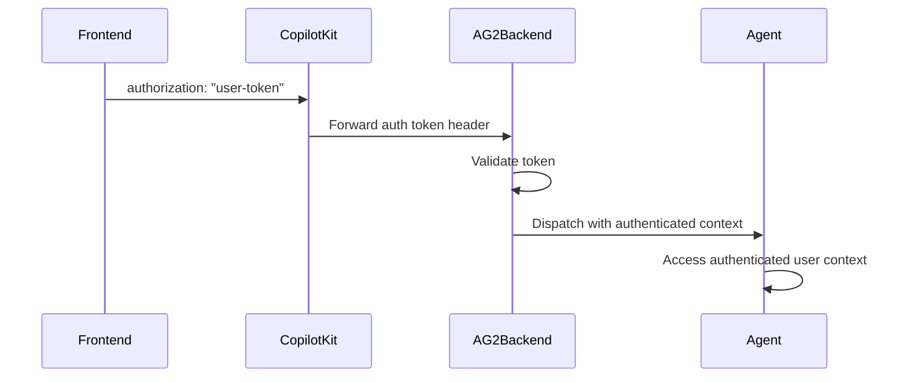

# AG2 Integration

CopilotKit implementation guide for AG2.

## Guidance
### AG-UI
- Route: `/ag2/ag-ui`
- Source: `docs/content/docs/integrations/ag2/ag-ui.mdx`
- Description: The AG-UI protocol connects your frontend to your AI agents via event-based Server-Sent Events (SSE).

CopilotKit is built on the [AG-UI protocol](https://ag-ui.com) — a lightweight, event-based standard that defines how AI agents communicate with user-facing applications over Server-Sent Events (SSE).

Everything in CopilotKit — messages, state updates, tool calls, and more — flows through AG-UI events. Understanding this layer helps you debug, extend, and build on top of CopilotKit more effectively.

## Accessing Your Agent with `useAgent`

The `useAgent` hook is your primary interface to the AG-UI agent powering your copilot. It returns an [`AbstractAgent`](https://github.com/ag-ui-protocol/ag-ui/blob/main/typescript/packages/client/src/agents/abstract-agent.ts) from the AG-UI client library — the same base type that all AG-UI agents implement.

```tsx
import { useAgent } from "@copilotkit/react-core";

function MyComponent() {
  const { agent } = useAgent();

  // agent.messages - conversation history
  // agent.state - current agent state
  // agent.isRunning - whether the agent is currently running
}
```

If you have multiple agents, pass the `agentId` to select one:

```tsx
const { agent } = useAgent({ agentId: "research-agent" });
```

The returned `agent` is a standard AG-UI `AbstractAgent`. You can subscribe to its events, read its state, and interact with it using the same interface defined by the [AG-UI specification](https://docs.ag-ui.com).

### Subscribing to AG-UI Events

Every agent exposes a `subscribe` method that lets you listen for specific AG-UI events as they stream in. Each callback receives the event and the current agent state:

```tsx
import { useAgent } from "@copilotkit/react-core";
import { useEffect } from "react";

function MyComponent() {
  const { agent } = useAgent();

  useEffect(() => {
    const subscription = agent.subscribe({
      // Called on every event
      onEvent({ event, agent }) {
        console.log("Event:", event.type, event);
      },

      // Text message streaming
      onTextMessageContentEvent({ event, textMessageBuffer, agent }) {
        console.log("Streaming text:", textMessageBuffer);
      },

      // Tool calls
      onToolCallEndEvent({ event, toolCallName, toolCallArgs, agent }) {
        console.log("Tool called:", toolCallName, toolCallArgs);
      },

      // State updates
      onStateSnapshotEvent({ event, agent }) {
        console.log("State snapshot:", agent.state);
      },

      // High-level lifecycle
      onMessagesChanged({ agent }) {
        console.log("Messages updated:", agent.messages);
      },
      onStateChanged({ agent }) {
        console.log("State changed:", agent.state);
      },
    });

    return () => subscription.unsubscribe();
  }, [agent]);
}
```

The full list of subscribable events maps directly to the [AG-UI event types](https://docs.ag-ui.com/concepts/events):

| Event | Callback | Description |
| --- | --- | --- |
| Run lifecycle | `onRunStartedEvent`, `onRunFinishedEvent`, `onRunErrorEvent` | Agent run start, completion, and errors |
| Steps | `onStepStartedEvent`, `onStepFinishedEvent` | Individual step boundaries within a run |
| Text messages | `onTextMessageStartEvent`, `onTextMessageContentEvent`, `onTextMessageEndEvent` | Streaming text content from the agent |
| Tool calls | `onToolCallStartEvent`, `onToolCallArgsEvent`, `onToolCallEndEvent`, `onToolCallResultEvent` | Tool invocation lifecycle |
| State | `onStateSnapshotEvent`, `onStateDeltaEvent` | Full state snapshots and incremental deltas |
| Messages | `onMessagesSnapshotEvent` | Full message list snapshots |
| Custom | `onCustomEvent`, `onRawEvent` | Custom and raw events for extensibility |
| High-level | `onMessagesChanged`, `onStateChanged` | Aggregate notifications after any message or state mutation |

## The Proxy Pattern

When you use CopilotKit with a runtime, your frontend never talks directly to your agent. Instead, CopilotKit creates a **proxy agent** on the frontend that forwards requests through the Copilot Runtime.

On startup, CopilotKit calls the runtime's `/info` endpoint to discover which agents are available. Each agent is wrapped in a `ProxiedCopilotRuntimeAgent` — a thin client that extends AG-UI's [`HttpAgent`](https://github.com/ag-ui-protocol/ag-ui/blob/main/typescript/packages/client/src/agents/http-agent.ts). From your component's perspective, this proxy behaves identically to a local AG-UI agent: same `AbstractAgent` interface, same subscribe API, same properties. But under the hood, every `run` call is an HTTP request to your server, and every response is an SSE stream of AG-UI events flowing back.

```tsx title="What your component sees"
const { agent } = useAgent(); // Returns an AbstractAgent
agent.messages;               // Read messages
agent.state;                  // Read state
agent.subscribe({ ... });     // Subscribe to events
```

```tsx title="What actually happens"
// useAgent() → AgentRegistry checks /info → wraps each agent in ProxiedCopilotRuntimeAgent
// agent.runAgent() → HTTP POST to runtime → runtime routes to your agent → SSE stream back
```

This indirection is what enables the runtime to provide authentication, middleware, agent routing, and ecosystem features like [threads](/premium/threads) and [observability](/premium/observability) — without changing how you interact with agents on the frontend.

## How Agents Slot into the Runtime

On the server side, the `CopilotRuntime` accepts a map of AG-UI `AbstractAgent` instances. Each agent framework provides its own implementation, but they all extend the same base type:

```ts title="app/api/copilotkit/route.ts"
import { CopilotRuntime, copilotRuntimeNextJSAppRouterEndpoint } from "@copilotkit/runtime";
import { HttpAgent } from "@ag-ui/client";

const runtime = new CopilotRuntime({
  agents: {
    "my-agent": new HttpAgent({
      url: "https://my-agent-server.example.com",
    }),
  },
});

export const POST = async (req: NextRequest) => {
  const { handleRequest } = copilotRuntimeNextJSAppRouterEndpoint({
    runtime,
    endpoint: "/api/copilotkit",
  });
  return handleRequest(req);
};
```

When a request comes in:

1. The runtime resolves the target agent by ID
2. It clones the agent (for thread safety) and sets messages, state, and thread context from the request
3. The `AgentRunner` executes the agent, which produces a stream of AG-UI `BaseEvent`s
4. Events are encoded as SSE and streamed back to the frontend proxy

Because every agent is an `AbstractAgent`, you can register any AG-UI-compatible agent — whether it's an `HttpAgent` pointing at a remote server, a framework-specific adapter, or a custom implementation — and the runtime handles routing, middleware, and delivery uniformly.

### Authentication
- Route: `/ag2/auth`
- Source: `docs/content/docs/integrations/ag2/auth.mdx`
- Description: Secure your AG2 backend with user authentication on /chat

## Overview

CopilotKit supports user authentication for AG2 backends in two deployment modes:

- **LangGraph Platform equivalent**: managed runtime forwarding to your AG2 `/chat` endpoint
- **Self-hosted runtime**: your own CopilotKit runtime forwarding to your AG2 `/chat` endpoint

Both approaches let your AG2 backend access authenticated user context and enforce authorization.

This pattern enables your backend to:

- Validate user tokens before dispatching the agent
- Attach authenticated user context to agent state/tools
- Enforce authorization decisions server-side

  CopilotKit consumes AG-UI protocol events streamed by AG2 over /chat. See the AG2 AG-UI integration docs.

## How It Works



## Frontend Setup

Pass your authentication token via the `properties` prop:

```tsx
<CopilotKit
  runtimeUrl="/api/copilotkit"
  properties={{
    authorization: userToken, // forwarded to AG2 /chat
  }}
>
  <YourApp />
</CopilotKit>
```

**Note**: The `authorization` property is forwarded to your AG2 `/chat` endpoint as a request header.

## LangGraph Platform Deployment

**For managed deployments**, protect your AG2 `/chat` endpoint with token-header validation.

### Setup Authentication Handler

```python
from fastapi import FastAPI, Header, HTTPException
from fastapi.responses import StreamingResponse
from autogen import ConversableAgent, LLMConfig
from autogen.ag_ui import AGUIStream, RunAgentInput

agent = ConversableAgent(
    name="assistant",
    system_message="You are a helpful assistant.",
    llm_config=LLMConfig({"model": "gpt-5.2-mini"}),
)

stream = AGUIStream(agent)
app = FastAPI()

def validate_your_token(token: str) -> dict:
    # Replace this with your own validation logic.
    if token != "valid-token":
        raise HTTPException(status_code=401, detail="Unauthorized")
    return {"user_id": "user_123", "role": "member"}

@app.post("/chat")
async def run_agent(
    message: RunAgentInput,
    accept: str | None = Header(None),
    authorization: str | None = Header(None),
):
    if not authorization:
        raise HTTPException(status_code=401, detail="Missing authorization header")

    token = authorization.replace("Bearer ", "")
    user_info = validate_your_token(token)

    # Use user_info to scope tools, state, and data access before dispatch.
    return StreamingResponse(
        stream.dispatch(message, accept=accept),
        media_type=accept or "text/event-stream",
    )
```

### Access User in Agent

Use validated user identity to scope tool calls and data access:

```python
from typing import Annotated
from autogen import ContextVariables

@agent.register_for_llm(description="Return account data for the authenticated user.")
def get_account_data(
    context: ContextVariables,
    account_id: Annotated[str, "The target account id"],
) -> dict:
    user = context.get("auth_user")
    if not user:
        return {"error": "unauthorized"}
    # Example check: ensure user can access this account
    if account_id not in user.get("allowed_accounts", []):
        return {"error": "forbidden"}
    return {"account_id": account_id, "owner": user["user_id"]}
```

## Self-hosted Deployment

**For self-hosted deployments**, use the same `/chat` header-validation pattern in your own FastAPI service.

### Setup Dynamic Agent Configuration

```python
from fastapi import FastAPI, Header, HTTPException
from fastapi.responses import StreamingResponse
from autogen import ConversableAgent, LLMConfig
from autogen.ag_ui import AGUIStream, RunAgentInput

agent = ConversableAgent(
    name="assistant",
    system_message="You are a helpful assistant.",
    llm_config=LLMConfig({"model": "gpt-5.2-mini"}),
)

stream = AGUIStream(agent)
app = FastAPI()

@app.post("/chat")
async def run_agent(
    message: RunAgentInput,
    accept: str | None = Header(None),
    authorization: str | None = Header(None),
):
    if not authorization:
        raise HTTPException(status_code=401, detail="Unauthorized")
    # Validate token here, then dispatch
    return StreamingResponse(
        stream.dispatch(message, accept=accept),
        media_type=accept or "text/event-stream",
    )
```

### Access User in Agent

After token validation, persist user identity in request-scoped context and enforce access checks in AG2 tools/state reads.

## Universal Authentication Pattern

For backends that run in both managed and self-hosted modes, use this pattern:

```python
def extract_user_from_auth_header(authorization: str | None) -> dict | None:
    if not authorization:
        return None
    token = authorization.replace("Bearer ", "")
    return validate_your_token(token)
```

Then:

- Read `authorization` on `/chat`
- Validate token before `stream.dispatch(...)`
- Attach user context for tool/state authorization
- Deny unauthorized or out-of-scope access

## Security Notes

### LangGraph Platform

- **Token Validation**: Validate tokens on your AG2 `/chat` endpoint
- **User Scoping**: Scope data access by authenticated user identity

### Self-hosted

- **Manual Validation**: Implement and maintain your own validation logic
- **Header Forwarding**: Ensure your runtime forwards `authorization` to AG2

### General Best Practices

- **Permission Checks**: Enforce role-based checks in AG2 tools
- **Transport Security**: Serve `/chat` over HTTPS
- **Least Privilege**: Return only data needed for the current user/task

## Troubleshooting

### Common Issues

**Token not reaching backend**:

- Ensure you're passing `authorization` in `properties`
- Confirm your runtime forwards headers to AG2 `/chat`

**Invalid token format**:

- Handle both raw tokens and `Bearer ` formats consistently

**Unexpected anonymous access**:

- Verify `authorization` checks happen before calling `stream.dispatch(...)`

## Next Steps

- [Configure chat UI with AG2 backend ->](/ag2/prebuilt-components)
- [Learn about shared state ->](/ag2/shared-state)
- [Implement human-in-the-loop workflows ->](/ag2/human-in-the-loop)

### Coding Agents
- Route: `/ag2/coding-agents`
- Source: `docs/content/docs/integrations/ag2/coding-agents.mdx`
- Description: Use our MCP server to connect your AG2 agents to CopilotKit.

## Overview
The CopilotKit MCP server equips AI coding agents with deep knowledge about CopilotKit's APIs, patterns, and best practices. When connected to your
development environment, it enables AI assistants to:
- Provide expert guidance
- Generate accurate code
- Give your AI agents a user interface
- Help you implement CopilotKit features correctly

Powered by 🪄 [Tadata](https://tadata.com) - The platform for instantly building and hosting MCP servers.

## GitHub Copilot

[GitHub Copilot](https://github.com/features/copilot) is Microsoft's AI pair programmer integrated into VS Code and other editors. It supports MCP to extend its capabilities with external tools and services.

    ### Enable MCP Support in VS Code
    1. Open VS Code Settings (`Cmd+,` on Mac or `Ctrl+,` on Windows/Linux)
    2. Search for "MCP" in the settings search bar
    3. Enable the `chat.mcp.enabled` setting
    ### Add MCP Server to GitHub Copilot
    You can configure MCP servers for GitHub Copilot in several ways:

        Create a `.vscode/mcp.json` file in your project root:
```json
        {
          "servers": {
            "CopilotKit MCP": {
              "url": "https://mcp.copilotkit.ai/sse"
            }
          }
        }
```
        Add to your VS Code `settings.json`:
```json
        {
          "mcp": {
            "servers": {
              "CopilotKit MCP": {
                "url": "https://mcp.copilotkit.ai/sse"
              }
            }
          }
        }
```
        1. Open the Command Palette (`Cmd+Shift+P` or `Ctrl+Shift+P`)
        2. Type "MCP: Add Server" and select the command
        3. Choose "HTTP (sse)" as the server type
        4. Enter the server URL: `https://mcp.copilotkit.ai/sse`
        5. Provide a name for the server: `CopilotKit MCP`
    ### Using MCP Tools with GitHub Copilot
    1. Open Copilot Chat in VS Code (click the Copilot icon in the activity bar)
    2. Switch to Agent mode from the chat dropdown menu
    3. Click the Tools (🔧) button to view available MCP tools
    4. Your CopilotKit MCP tools will be listed and can be used automatically

    GitHub Copilot will intelligently use the MCP tools when relevant to your queries. You can also reference tools directly using `#` followed by the tool name.
    ### Managing MCP Servers
    Use the "MCP: List Servers" command to view and manage your configured servers:

    - Start/Stop/Restart servers
    - View server logs for debugging
    - Browse available tools and resources

## Other

For MCP-compatible applications not listed above, use these universal integration patterns. MCP (Model Context Protocol) is an open standard that allows AI applications to connect with external tools and data sources.

### Connection Methods

Most MCP-compatible applications support one or both of these connection methods:

    For web-based or remote integrations:
```
    https://mcp.copilotkit.ai/sse
```
    For local command-line integrations:
```json
    {
      "command": "npx",
      "args": ["mcp-remote", "https://mcp.copilotkit.ai"]
    }
```

### Integration Steps

1. **Find MCP Settings** - Look for "MCP," "Model Context Protocol," or "Tools" in your application settings
2. **Add Server** - Use the SSE URL: `https://mcp.copilotkit.ai/sse`
3. **Test Connection** - Restart your application and verify the server appears in available tools

### Common Configuration Patterns

    Many applications use a configuration file (locations vary by app):
```json
    {
      "servers": {
        "CopilotKit MCP": {
          "url": "https://mcp.copilotkit.ai/sse"
        }
      }
    }
```
    Some apps integrate MCP into their main settings:
```json
    {
      "mcp": {
        "enabled": true,
        "servers": {
          "CopilotKit MCP": {
            "url": "https://mcp.copilotkit.ai/sse"
          }
        }
      }
    }
```

### Copilot Runtime
- Route: `/ag2/copilot-runtime`
- Source: `docs/content/docs/integrations/ag2/copilot-runtime.mdx`
- Description: The Copilot Runtime is the backend that connects your frontend to your AI agents, providing authentication, middleware, routing, and more.

The Copilot Runtime is the backend layer that connects your frontend application to your AI agents. It's set up during the [quickstart](/quickstart) and is the recommended way to use CopilotKit.

## Setting Up the Runtime

The runtime is a lightweight server endpoint that you add to your backend. Here's a minimal example using Next.js:

```ts title="app/api/copilotkit/route.ts"
import {
  CopilotRuntime,
  ExperimentalEmptyAdapter,
  copilotRuntimeNextJSAppRouterEndpoint,
} from "@copilotkit/runtime";
import { NextRequest } from "next/server";

const serviceAdapter = new ExperimentalEmptyAdapter();

const runtime = new CopilotRuntime({
  agents: {
    // your agents go here
  },
});

export const POST = async (req: NextRequest) => {
  const { handleRequest } = copilotRuntimeNextJSAppRouterEndpoint({
    runtime,
    serviceAdapter,
    endpoint: "/api/copilotkit",
  });

  return handleRequest(req);
};
```

Then point your frontend at the endpoint:

```tsx
<CopilotKit runtimeUrl="/api/copilotkit">
  <YourApp />
</CopilotKit>
```

For setup with other backend frameworks (Express, NestJS, Node.js HTTP), see the [quickstart](/quickstart).

## The Default Agent

If you register an agent with the name `"default"`, CopilotKit's prebuilt UI components will use it automatically without any additional configuration on the frontend. This is useful when you have one primary agent and don't want to specify an `agentId` everywhere.

```ts title="app/api/copilotkit/route.ts"
const runtime = new CopilotRuntime({
  agents: {
    // This agent will be used automatically by CopilotPopup, CopilotSidebar, etc.
    "default": new HttpAgent({ url: "https://my-agent.example.com" }),
  },
});
```

When you register multiple agents, the `"default"` agent is what powers the chat unless a specific agent is selected. Other agents can still be used by passing their `agentId` to `useAgent` or the prebuilt components.

## What the Runtime Provides

### Authentication and Security

The runtime runs on your server, which means agent communication stays server-side. This gives you a trusted environment to enforce authentication, validate requests, and keep API keys secure. When you use the runtime, safe defaults are put in place so your agent endpoints are not exposed to unauthenticated access.

### AG-UI Middleware

The [AG-UI protocol](/ag-ui-protocol) supports a middleware layer (`agent.use`) for logging, guardrails, request transformation, and more. Because the runtime runs server-side, this middleware executes in a trusted environment where it cannot be tampered with by the client.

### Agent Routing

When you register multiple agents with the runtime, it handles discovery and routing automatically. Your frontend doesn't need to know the details of where each agent lives or how to reach it.

### Premium Features

Features like [threads](/premium/threads), [observability](/premium/observability), and the [inspector](/premium/inspector) are provided through the runtime. These give you conversation persistence, monitoring, and debugging capabilities out of the box.

## What If I Want to Connect to My AG-UI Agent Directly?

CopilotKit is built on the [AG-UI protocol](/ag-ui-protocol), which is an open standard. If you want to connect your frontend directly to an AG-UI-compatible agent without the runtime, you can do so by passing agent instances directly to the `CopilotKit` provider:

```tsx
import { HttpAgent } from "@ag-ui/client";

const myAgent = new HttpAgent({
  url: "https://my-agent.example.com",
});

<CopilotKit agents__unsafe_dev_only={{ "my-agent": myAgent }}>
  <YourApp />
</CopilotKit>
```

Direct agent connections are intended for development and prototyping. This approach is not recommended for production unless you are confident in your setup, and is not officially supported by CopilotKit. If you run into issues with a direct connection, you will need to troubleshoot on your own.

There are important things to understand before going this route:

1. **Authentication is your responsibility.** When you use the Copilot Runtime, safe defaults are put in place so that your agent endpoints are not exposed to unauthenticated access. When you connect directly, it is entirely up to you to secure your agent endpoint and manage authentication.

2. **Many ecosystem features won't work.** The AG-UI protocol supports a middleware layer designed to run on the backend. Many features in the CopilotKit ecosystem depend on this server-side middleware. Without the runtime, these features — including [threads](/premium/threads), [observability](/premium/observability), and other capabilities — will not be available.

### Comparison

| | With Runtime | Direct Connection |
|---|---|---|
| **Authentication** | Safe defaults provided | You manage it |
| **AG-UI Middleware** | Runs server-side | Not available |
| **Agent Routing** | Automatic | Manual |
| **Ecosystem Features** | Full support | Limited |
| **CopilotKit Support** | Supported | Not supported |
| **Setup** | Requires a backend endpoint | Frontend-only |

### Fully Headless UI
- Route: `/ag2/custom-look-and-feel/headless-ui`
- Source: `docs/content/docs/integrations/ag2/custom-look-and-feel/headless-ui.mdx`
- Description: Fully customize your Copilot's UI from the ground up using headless UI

```bash
    npx copilotkit@latest create
```
```bash
    open README.md
```
```tsx title="src/app/layout.tsx"
    <CopilotKit
      publicLicenseKey="your-free-public-license-key"
    >
      {children}
    </CopilotKit>
```
```tsx title="src/app/page.tsx"
    "use client";
    import { useState } from "react";
    import { useCopilotChatHeadless_c } from "@copilotkit/react-core/v2"; // [!code highlight]

    export default function Home() {
      const { messages, sendMessage, isLoading } = useCopilotChatHeadless_c(); // [!code highlight]
      const [input, setInput] = useState("");

      const handleSend = () => {
        if (input.trim()) {
          // [!code highlight:5]
          sendMessage({
            id: Date.now().toString(),
            role: "user",
            content: input,
          });
          setInput("");
        }
      };

      return (
        <div>
          <h1>My Headless Chat</h1>

          {/* Messages */}
          <div>
            {/* [!code highlight:6] */}
            {messages.map((message) => (
              <div key={message.id}>
                <strong>{message.role === "user" ? "You" : "Assistant"}:</strong>
                <p>{message.content}</p>
              </div>
            ))}

            {/* [!code highlight:1] */}
            {isLoading && <p>Assistant is typing...</p>}
          </div>

          {/* Input */}
          <div>
            <input
              type="text"
              value={input}
              onChange={(e) => setInput(e.target.value)}
              // [!code highlight:1]
              onKeyDown={(e) => e.key === "Enter" && handleSend()}
              placeholder="Type your message here..."
            />
            {/* [!code highlight:1] */}
            <button onClick={handleSend} disabled={isLoading}>
              Send
            </button>
          </div>
        </div>
      );
    }
```
```tsx title="src/app/components/chat.tsx"
import { useFrontendTool } from "@copilotkit/react-core/v2";

export const Chat = () => {
  // ...

  // Define an action that will show a custom component
  useFrontendTool({
    name: "showCustomComponent",
    // Handle the tool on the frontend
    // [!code highlight:3]
    handler: () => {
      return "Foo, Bar, Baz";
    },
    // Render a custom component for the underlying data
    // [!code highlight:13]
    render: ({ result, args, status}) => {
      return <div style={{
        backgroundColor: "red",
        padding: "10px",
        borderRadius: "5px",
      }}>
        <p>Custom component</p>
        <p>Result: {result}</p>
        <p>Args: {JSON.stringify(args)}</p>
        <p>Status: {status}</p>
      </div>;
    }
  });

  // ...

  return <div>
    {messages.map((message) => (
      <p key={message.id}>
        {message.role === "user" ? "User: " : "Assistant: "}
        {message.content}
        {/* Render the generative UI if it exists */}
        {/* [!code highlight:1] */}
        {message.role === "assistant" && message.generativeUI?.()}
      </p>
    ))}
  </div>
};
```
```tsx title="src/app/components/chat.tsx"
export const Chat = () => {
  // ...

  return <div>
    {messages.map((message) => (
      <p key={message.id}>
        {/* Render the tool calls if they exist */}
        {/* [!code highlight:5] */}
        {message.role === "assistant" && message.toolCalls?.map((toolCall) => (
          <p key={toolCall.id}>
            {toolCall.function.name}: {toolCall.function.arguments}
          </p>
        ))}
      </p>
    ))}
  </div>
};
```
```tsx title="src/app/components/chat.tsx"
import { useCopilotChatHeadless_c, useCopilotChatSuggestions } from "@copilotkit/react-core/v2"; // [!code highlight]

export const Chat = () => {
  // Specify what suggestions should be generated
  // [!code highlight:5]
  useCopilotChatSuggestions({
    instructions:
      "Suggest 5 interesting activities for programmers to do on their next vacation",
    maxSuggestions: 5,
  });

  // Grab relevant state from the headless hook
  const { suggestions, generateSuggestions, sendMessage } = useCopilotChatHeadless_c(); // [!code highlight]

  // Generate suggestions when the component mounts
  useEffect(() => {
    generateSuggestions(); // [!code highlight]
  }, []);

  // ...

  // [!code word:suggestion]
  return <div>
    {suggestions.map((suggestion, index) => (
      <button
        key={index}
        onClick={() => sendMessage({
          id: "123",
          role: "user",
          content: suggestion.message
        })}
      >
        {suggestion.title}
      </button>
    ))}
  </div>
};
```
```tsx title="src/app/components/chat.tsx"
import { useCopilotChatHeadless_c } from "@copilotkit/react-core/v2";

export const Chat = () => {
  // Grab relevant state from the headless hook
  // [!code highlight:1]
  const { suggestions, setSuggestions } = useCopilotChatHeadless_c();

  // Set the suggestions when the component mounts
  // [!code highlight:6]
  useEffect(() => {
    setSuggestions([
      { title: "Suggestion 1", message: "The actual message for suggestion 1" },
      { title: "Suggestion 2", message: "The actual message for suggestion 2" },
    ]);
  }, []);

  // Change the suggestions on function call
  const changeSuggestions = () => {
    // [!code highlight:4]
    setSuggestions([
      { title: "Foo", message: "Bar" },
      { title: "Baz", message: "Bat" },
    ]);
  };

  // [!code word:suggestion]
  return (
    <div>
      {/* Change on button click */}
      <button onClick={changeSuggestions}>Change suggestions</button>

      {/* Render */}
      {suggestions.map((suggestion, index) => (
        <button
          key={index}
          onClick={() => sendMessage({
            id: "123",
            role: "user",
            content: suggestion.message
          })}
        >
          {suggestion.title}
        </button>
      ))}
    </div>
  );
};
```
```tsx title="src/app/components/chat.tsx"
import { useFrontendTool, useCopilotChatHeadless_c } from "@copilotkit/react-core/v2";

export const Chat = () => {
  const { messages, sendMessage } = useCopilotChatHeadless_c();

  // Define an action that will wait for the user to enter their name
  useFrontendTool({
    name: "getName",
    renderAndWaitForResponse: ({ respond, args, status}) => {
      if (status === "complete") {
        return <div>
          <p>Name retrieved...</p>
        </div>;
      }

      return <div>
        <input
          type="text"
          value={args.name || ""}
          onChange={(e) => respond?.(e.target.value)}
          placeholder="Enter your name"
        />
        {/* Respond with the name */}
        {/* [!code highlight:1] */}
        <button onClick={() => respond?.(args.name)}>Submit</button>
      </div>;
    }
  });

  return (
    {messages.map((message) => (
      <p key={message.id}>
        {message.role === "user" ? "User: " : "Assistant: "}
        {message.content}
        {/* [!code highlight:2] */}
        {/* This will render the tool-based HITL if it exists */}
        {message.role === "assistant" && message.generativeUI?.()}
      </p>
    ))}
  )
};
```

### Slots
- Route: `/ag2/custom-look-and-feel/slots`
- Source: `docs/content/docs/integrations/ag2/custom-look-and-feel/slots.mdx`
- Description: Customize any part of the chat UI by overriding individual sub-components via slots.

## What is this?

Every CopilotKit chat component is built from composable **slots** — named sub-components that you can override individually. The slot system gives you three levels of customization without needing to rebuild the entire UI:

1. **Tailwind classes** — pass a string to add/override CSS classes
2. **Props override** — pass an object to override specific props on the default component
3. **Custom component** — pass your own React component to fully replace a slot

Slots are recursive — you can drill into nested sub-components at any depth.

## Tailwind Classes

The simplest way to customize a slot. Pass a Tailwind class string and it will be merged with the default component's classes.

```tsx title="page.tsx"
import { CopilotChat } from "@copilotkit/react-core/v2";

export function Chat() {
  return (
    <CopilotChat
      // [!code highlight:2]
      messageView="bg-gray-50 dark:bg-gray-900 p-4"
      input="border-2 border-blue-400 rounded-xl"
    />
  );
}
```

## Props Override

Pass an object to override specific props on the default component. This is useful for adding `className`, event handlers, data attributes, or any other prop the default component accepts.

```tsx title="page.tsx"
<CopilotChat
  // [!code highlight:4]
  messageView={{
    className: "my-custom-messages",
    "data-testid": "message-view",
  }}
  input={{ autoFocus: true }}
/>
```

## Custom Components

For full control, pass your own React component. It receives all the same props as the default component.

```tsx title="page.tsx"
import { CopilotChat } from "@copilotkit/react-core/v2";

// [!code highlight:8]
const CustomMessageView = ({ messages, isRunning }) => (
  <div className="space-y-4 p-6">
    {messages?.map((msg) => (
      <div key={msg.id} className={msg.role === "user" ? "text-right" : "text-left"}>
        {msg.content}
      </div>
    ))}
    {isRunning && <div className="animate-pulse">Thinking...</div>}
  </div>
);

export function Chat() {
  return (
    // [!code highlight:1]
    <CopilotChat messageView={CustomMessageView} />
  );
}
```

## Nested Slots (Drill-Down)

Slots are recursive. You can customize sub-components at any depth by nesting objects.

### Two levels deep

Override the assistant message's toolbar within the message view:

```tsx title="page.tsx"
<CopilotChat
  // [!code highlight:7]
  messageView={{
    assistantMessage: {
      toolbar: CustomToolbar,
      copyButton: CustomCopyButton,
    },
    userMessage: CustomUserMessage,
  }}
/>
```

### Three levels deep

Override a specific button inside the assistant message toolbar:

```tsx title="page.tsx"
<CopilotChat
  messageView={{
    // [!code highlight:5]
    assistantMessage: {
      copyButton: ({ onClick }) => (
        <button onClick={onClick}>Copy</button>
      ),
    },
  }}
/>
```

### Input sub-slots

```tsx title="page.tsx"
<CopilotChat
  input={{
    // [!code highlight:2]
    textArea: CustomTextArea,
    sendButton: CustomSendButton,
  }}
/>
```

### Scroll view sub-slots

```tsx title="page.tsx"
<CopilotChat
  scrollView={{
    // [!code highlight:2]
    feather: CustomFeather,
    scrollToBottomButton: CustomScrollButton,
  }}
/>
```

### Suggestion view sub-slots

```tsx title="page.tsx"
<CopilotChat
  suggestionView={{
    // [!code highlight:2]
    suggestion: CustomSuggestionPill,
    container: CustomSuggestionContainer,
  }}
/>
```

## Children Render Function

For complete layout control, use the `children` render function pattern. This gives you pre-built slot elements that you can arrange however you want.

```tsx title="page.tsx"
import { CopilotChat } from "@copilotkit/react-core/v2";

export function Chat() {
  return (
    <CopilotChat>
      {/* [!code highlight:8] */}
      {({ messageView, input, scrollView, suggestionView }) => (
        <div className="flex flex-col h-full">
          <header className="p-4 border-b font-semibold">My Agent</header>
          {scrollView}
          <div className="border-t p-4">{input}</div>
        </div>
      )}
    </CopilotChat>
  );
}
```

## Labels

Customize any text string in the UI via the `labels` prop. This does not use the slot system — it's a separate convenience prop on `CopilotChat`, `CopilotSidebar`, and `CopilotPopup`.

```tsx title="page.tsx"
<CopilotChat
  // [!code highlight:5]
  labels={{
    chatInputPlaceholder: "Ask your agent anything...",
    welcomeMessageText: "How can I help you today?",
    chatDisclaimerText: "AI responses may be inaccurate.",
  }}
/>
```

## Available Slots

### `CopilotChat` / `CopilotSidebar` / `CopilotPopup`

These are the root-level slot props available on all chat components:

| Slot | Description |
|------|-------------|
| `messageView` | The message list container. |
| `scrollView` | The scroll container with auto-scroll behavior. |
| `input` | The text input area with send/transcribe controls. |
| `suggestionView` | The suggestion pills shown below messages. |
| `welcomeScreen` | The initial empty-state screen (pass `false` to disable). |

`CopilotSidebar` and `CopilotPopup` also have:

| Slot | Description |
|------|-------------|
| `header` | The modal header bar. |
| `toggleButton` | The open/close toggle button. |

### `messageView` sub-slots

Available via `messageView={{ ... }}`:

| Slot | Description |
|------|-------------|
| `assistantMessage` | Renders assistant responses. Has its own sub-slots (see below). |
| `userMessage` | Renders user messages. Has its own sub-slots (see below). |
| `reasoningMessage` | Renders model reasoning/thinking steps. Has its own sub-slots (see below). |
| `cursor` | The streaming cursor indicator shown while the agent is responding. |

### `assistantMessage` sub-slots

Available via `messageView={{ assistantMessage: { ... } }}`:

| Slot | Description |
|------|-------------|
| `markdownRenderer` | The markdown rendering component. |
| `toolbar` | The action toolbar below messages. |
| `copyButton` | Copy message button. |
| `thumbsUpButton` | Thumbs up feedback button. |
| `thumbsDownButton` | Thumbs down feedback button. |
| `readAloudButton` | Read aloud button. |
| `regenerateButton` | Regenerate response button. |
| `toolCallsView` | Tool call visualization. |

### `userMessage` sub-slots

Available via `messageView={{ userMessage: { ... } }}`:

| Slot | Description |
|------|-------------|
| `messageRenderer` | The text rendering component for user messages. |
| `toolbar` | The action toolbar on hover. |
| `copyButton` | Copy message button. |
| `editButton` | Edit message button. |
| `branchNavigation` | Navigation between message branches (after editing). |

### `reasoningMessage` sub-slots

Available via `messageView={{ reasoningMessage: { ... } }}`:

| Slot | Description |
|------|-------------|
| `header` | The collapsible header (click to expand/collapse). |
| `contentView` | The reasoning content area. |
| `toggle` | The expand/collapse toggle wrapper. |

### `input` sub-slots

Available via `input={{ ... }}`:

| Slot | Description |
|------|-------------|
| `textArea` | The text input element. |
| `sendButton` | The send/submit button. |
| `addMenuButton` | The attachment/tools menu button. |
| `startTranscribeButton` | Button to start voice transcription. |
| `cancelTranscribeButton` | Button to cancel transcription. |
| `finishTranscribeButton` | Button to finish transcription. |
| `audioRecorder` | The audio recorder component. |
| `disclaimer` | The disclaimer text below the input. |

### `scrollView` sub-slots

Available via `scrollView={{ ... }}`:

| Slot | Description |
|------|-------------|
| `feather` | The gradient overlay at the bottom of the scroll area. |
| `scrollToBottomButton` | The button that appears when scrolled up. |

### `suggestionView` sub-slots

Available via `suggestionView={{ ... }}`:

| Slot | Description |
|------|-------------|
| `suggestion` | Individual suggestion pill/button. |
| `container` | The container wrapping all suggestion pills. |

### `welcomeScreen` sub-slots

Available via `welcomeScreen={{ ... }}`:

| Slot | Description |
|------|-------------|
| `welcomeMessage` | The welcome text shown on the empty state. |

### `header` sub-slots (Sidebar/Popup only)

Available via `header={{ ... }}`:

| Slot | Description |
|------|-------------|
| `titleContent` | The title text in the header. |
| `closeButton` | The close/minimize button. |

### `toggleButton` sub-slots (Sidebar/Popup only)

Available via `toggleButton={{ ... }}`:

| Slot | Description |
|------|-------------|
| `openIcon` | Icon shown when the chat is closed. |
| `closeIcon` | Icon shown when the chat is open. |

### Frontend Tools
- Route: `/ag2/frontend-tools`
- Source: `docs/content/docs/integrations/ag2/frontend-tools.mdx`
- Description: Create frontend actions and use them within your agent.

This video shows the result of `npx copilotkit@latest init` with the [implementation](#implementation) section applied to it.

## What is this?

Frontend actions are powerful tools that allow your AI agents to directly interact with and update your application's user interface. Think of them as bridges that connect your agent's decision-making capabilities with your frontend's interactive elements.

  CopilotKit consumes AG-UI protocol events streamed by AG2 over /chat. See the AG2 AG-UI integration docs.

## When should I use this?

Frontend actions are essential when you want to create truly interactive AI applications where your agent needs to:

- Dynamically update UI elements
- Trigger frontend animations or transitions
- Show alerts or notifications
- Modify application state
- Handle user interactions programmatically

Without frontend actions, agents are limited to just processing and returning data. By implementing frontend actions, you can create rich, interactive experiences where your agent actively drives the user interface.

## Implementation

        ### Setup CopilotKit

        To use frontend actions, you'll need to setup CopilotKit first. For the sake of brevity, we won't cover it here.

        Check out our [getting started guide](/ag2/quickstart) and come back here when you're setup.

        ### Create a frontend action

        First, you'll need to create a frontend action using the [useFrontendTool](/reference/v1/hooks/useFrontendTool) hook. Here's a simple one to get you started
        that says hello to the user.

```tsx title="page.tsx"
        import { useFrontendTool } from "@copilotkit/react-core/v2" // [!code highlight]

        export function Page() {
          // ...

          // [!code highlight:16]
          useFrontendTool({
            name: "sayHello",
            description: "Say hello to the user",
            available: "remote", // optional, makes it so the action is *only* available to the AG2 backend over AG-UI
            parameters: [
              {
                name: "name",
                type: "string",
                description: "The name of the user to say hello to",
                required: true,
              },
            ],
            handler: async ({ name }) => {
              alert(`Hello, ${name}!`);
              return `Said hello to ${name}!`;
            },
          });

          // ...
        }
```
        ###  Modify your agent
        Now, we'll need to modify the agent to access these frontend actions. Open your AG2 backend file and continue from there.
        ### Setup your AG2 backend over AG-UI

        AG2 can call frontend actions through AG-UI tool events with a standard `/chat` endpoint:

```python title="agent.py"
                from fastapi import FastAPI, Header
                from fastapi.responses import StreamingResponse
                from autogen import ConversableAgent, LLMConfig
                from autogen.ag_ui import AGUIStream, RunAgentInput

                agent = ConversableAgent(
                    name="assistant",
                    system_message="You are a helpful assistant.",
                    llm_config=LLMConfig({"model": "gpt-5.2-mini"}),
                )

                stream = AGUIStream(agent)
                app = FastAPI()

                @app.post("/chat")
                async def run_agent(
                    message: RunAgentInput,
                    accept: str | None = Header(None),
                ):
                    return StreamingResponse(
                        stream.dispatch(message, accept=accept),
                        media_type=accept or "text/event-stream",
                    )
```

        That's it. Your AG2 backend can now receive frontend action tool definitions emitted by CopilotKit through AG-UI.
        ### Give it a try
        You've now given your agent the ability to directly call any CopilotActions you've defined. These actions will be available as tools to the agent where they can be used as needed.

### State Rendering
- Route: `/ag2/generative-ui/state-rendering`
- Source: `docs/content/docs/integrations/ag2/generative-ui/state-rendering.mdx`
- Description: Render the state of your agent with custom UI components.

## What is this?

AG2 agents can maintain state across a session through `ContextVariables`. CopilotKit can render this state in your application with custom UI components, which we call **Agentic Generative UI**.

  CopilotKit consumes AG-UI protocol events streamed by AG2 over /chat. See the AG2 AG-UI integration docs.

## When should I use this?

Rendering the state of your agent in the UI is useful when you want to provide the user with feedback about the overall state of a session. A great example of this
is a situation where a user and an agent are working together to solve a problem. The agent can store a draft in its state which is then rendered in the UI.

## Implementation

    ### Run and connect your agent
    Start your AG2 backend with AG-UI streaming enabled on `/chat`.
    ### Set up your agent with state

    Create your AG2 agent with `ContextVariables` and emit `StateSnapshotEvent` updates:

```python title="agent.py"
    from typing import Annotated

    from ag_ui.core import EventType, StateSnapshotEvent
    from fastapi import FastAPI, Header
    from fastapi.responses import StreamingResponse
    from pydantic import BaseModel, Field
    from autogen import ContextVariables, ConversableAgent, LLMConfig
    from autogen.ag_ui import AGUIStream, RunAgentInput

    class Search(BaseModel):
        query: str
        done: bool

    class AgentState(BaseModel):
        searches: list[Search] = Field(default_factory=list)

    def read_state(context: ContextVariables) -> AgentState:
        raw_state = context.get("agent_state", {"searches": []})
        return AgentState.model_validate(raw_state)

    def write_state(context: ContextVariables, state: AgentState) -> StateSnapshotEvent:
        snapshot = state.model_dump()
        context["agent_state"] = snapshot
        return StateSnapshotEvent(type=EventType.STATE_SNAPSHOT, snapshot=snapshot)

    agent = ConversableAgent(
        name="assistant",
        system_message=(
            "You are a helpful assistant for storing searches. "
            "Use `add_search` once per query, then call `run_searches`."
        ),
        llm_config=LLMConfig({"model": "gpt-5.2-mini"}),
    )

    @agent.register_for_llm(description="Add a search to the state.")
    def add_search(
        context: ContextVariables,
        new_query: Annotated[str, "The query to add to state"],
    ) -> StateSnapshotEvent:
        state = read_state(context)
        state.searches.append(Search(query=new_query, done=False))
        return write_state(context, state)

    @agent.register_for_llm(description="Run the queued searches and mark them done.")
    def run_searches(context: ContextVariables) -> StateSnapshotEvent:
        state = read_state(context)
        for search in state.searches:
            search.done = True
        return write_state(context, state)

    agent.register_for_execution(name="add_search")(add_search)
    agent.register_for_execution(name="run_searches")(run_searches)

    stream = AGUIStream(agent)
    app = FastAPI()

    @app.post("/chat")
    async def run_agent(
        message: RunAgentInput,
        accept: str | None = Header(None),
    ):
        return StreamingResponse(
            stream.dispatch(message, accept=accept),
            media_type=accept or "text/event-stream",
        )
```

    ### Render state of the agent in the chat
    Now we can utilize `useAgent` with a `render` function to render the state of our agent **in the chat**.

```tsx title="app/page.tsx"
    // ...
    import { useAgent } from "@copilotkit/react-core/v2";
    // ...

    // Define the state of the agent, should match the state streamed by your AG2 backend.
    type AgentState = {
      searches: {
        query: string;
        done: boolean;
      }[];
    };

    function YourMainContent() {
      // ...

      // [!code highlight:13]
      // styles omitted for brevity
      useAgent<AgentState>({
        name: "my_agent", // MUST match the agent name in CopilotRuntime
        render: ({ agentState }) => (
          <div>
            {agentState.searches?.map((search, index) => (
              <div key={index}>
                {search.done ? "✅" : "❌"} {search.query}{search.done ? "" : "..."}
              </div>
            ))}
          </div>
        ),
      });

      // ...

      return <div>...</div>;
    }
```

      The `name` parameter must exactly match the agent name you defined in your CopilotRuntime configuration (e.g., `my_agent` from the quickstart).

    ### Render state outside of the chat
    You can also render the state of your agent **outside of the chat**. This is useful when you want to render the state of your agent anywhere
    other than the chat.

```tsx title="app/page.tsx"
    import { useAgent } from "@copilotkit/react-core/v2"; // [!code highlight]
    // ...

    // Define the state of the agent, should match the state streamed by your AG2 backend.
    type AgentState = {
      searches: {
        query: string;
        done: boolean;
      }[];
    };

    function YourMainContent() {
      // ...

      // [!code highlight:3]
      const { agent } = useAgent<AgentState>({
        agentId: "my_agent", // MUST match the agent name in CopilotRuntime
      })

      // ...

      return (
        <div>
          {/* ... */}
          <div className="flex flex-col gap-2 mt-4">
            {/* [!code highlight:5] */}
            {agent.state.searches?.map((search, index) => (
              <div key={index} className="flex flex-row">
                {search.done ? "✅" : "❌"} {search.query}
              </div>
            ))}
          </div>
        </div>
      )
    }
```

      The `agentId` parameter must exactly match the agent name you defined in your CopilotRuntime configuration (e.g., `my_agent` from the quickstart).

    ### Give it a try

    You've now created a component that will render the agent's state in the chat.

### Tool Rendering
- Route: `/ag2/generative-ui/tool-rendering`
- Source: `docs/content/docs/integrations/ag2/generative-ui/tool-rendering.mdx`
- Description: Render your agent's tool calls with custom UI components.

## What is this?

Tools are a way for the LLM to call predefined, typically, deterministic functions. CopilotKit allows you to render these tools in the UI
as a custom component, which we call **Generative UI**.

  CopilotKit consumes AG-UI protocol events streamed by AG2 over /chat. See the AG2 AG-UI integration docs.

## When should I use this?

Rendering tools in the UI is useful when you want to provide the user with feedback about what your agent is doing, specifically
when your agent is calling tools. CopilotKit allows you to fully customize how these tools are rendered in the chat.

## Implementation

### Run and connect your agent
Start your AG2 backend with a `/chat` endpoint and connect CopilotKit to that endpoint.
### Give your agent a tool to call

```python title="agent.py"
        from typing import Annotated

        from fastapi import FastAPI, Header
        from fastapi.responses import StreamingResponse
        from autogen import ConversableAgent, LLMConfig
        from autogen.ag_ui import AGUIStream, RunAgentInput

        agent = ConversableAgent(
            name="assistant",
            system_message="You are a helpful assistant.",
            llm_config=LLMConfig({"model": "gpt-5.2-mini"}),
        )

        @agent.register_for_llm(
            description="Get the weather for a given location. Ensure location is fully spelled out."
        )
        def get_weather(location: Annotated[str, "Fully spelled out location"]) -> str:
            return f"The weather in {location} is sunny."

        # Register the same function for execution on this backend process.
        agent.register_for_execution(name="get_weather")(get_weather)

        stream = AGUIStream(agent)
        app = FastAPI()

        @app.post("/chat")
        async def run_agent(
            message: RunAgentInput,
            accept: str | None = Header(None),
        ):
            return StreamingResponse(
                stream.dispatch(message, accept=accept),
                media_type=accept or "text/event-stream",
            )
```

### Render the tool call in your frontend
At this point, your agent will be able to call the `get_weather` tool. Now
we just need to add a `useRenderToolCall` hook to render the tool call in
the UI.

  In order to render a tool call in the UI, the name of the action must match the name of the tool.

```tsx title="app/page.tsx"
import { useRenderToolCall } from "@copilotkit/react-core/v2"; // [!code highlight]
// ...

const YourMainContent = () => {
  // ...
  // [!code highlight:12]
  useRenderToolCall({
    name: "get_weather",
    render: ({status, args}) => {
      return (
        <p className="text-gray-500 mt-2">
          {status !== "complete" && "Calling weather API..."}
          {status === "complete" && `Called the weather API for ${args.location}.`}
        </p>
      );
    },
  });
  // ...
}
```

### Give it a try!

Try asking the agent to get the weather for a location. You should see the custom UI component that we added
render the tool call and display the arguments that were passed to the tool.

## Default Tool Rendering

`useDefaultTool` provides a catch-all renderer for **any tool** that doesn't have a specific `useRenderToolCall` defined. This is useful for:

- Displaying all tool calls during development
- Rendering MCP (Model Context Protocol) tools
- Providing a generic fallback UI for unexpected tools

```tsx title="app/page.tsx"
import { useDefaultTool } from "@copilotkit/react-core/v2"; // [!code highlight]
// ...

const YourMainContent = () => {
  // ...
  // [!code highlight:15]
  useDefaultTool({
    render: ({ name, args, status, result }) => {
      return (
        <div style={{ color: "black" }}>
          <span>
            {status === "complete" ? "✓" : "⏳"}
            {name}
          </span>
          {status === "complete" && result && (
            <pre>{JSON.stringify(result, null, 2)}</pre>
          )}
        </div>
      );
    },
  });
  // ...
}
```

  Unlike `useRenderToolCall`, which targets a specific tool by name, `useDefaultTool` catches **all** tools that don't have a dedicated renderer.

  In v2, use [`useDefaultRenderTool`](/reference/v2/hooks/useDefaultRenderTool) for wildcard fallback rendering, and [`useRenderTool`](/reference/v2/hooks/useRenderTool) for named or wildcard renderer registration.

### Display-only
- Route: `/ag2/generative-ui/your-components/display-only`
- Source: `docs/content/docs/integrations/ag2/generative-ui/your-components/display-only.mdx`
- Description: Register React components that your agent can render in the chat.

## What is this?

`useComponent` lets you register a React component as a tool your agent can invoke. When the agent calls the tool, CopilotKit renders your component directly in the chat with the tool's arguments as props.

This is the simplest form of Generative UI — your agent decides when to show a component, and CopilotKit renders it. No handler logic, no user interaction required.

## When should I use this?

Use `useComponent` when you want to:
- Display rich UI (cards, charts, tables) inline in the chat
- Show structured data from agent responses
- Render previews, status indicators, or visual feedback
- Let the agent present information beyond plain text

For components that need user interaction, see the Interactive or Interrupt-based guides.

## Register a component

Use the `useComponent` hook to register a React component. The agent will be able to call it by name, and CopilotKit will render it with the tool arguments as props.

```tsx title="app/page.tsx"
import { useComponent } from "@copilotkit/react-core/v2"; // [!code highlight]
import { z } from "zod";

const weatherSchema = z.object({
  city: z.string().describe("City name"),
  temperature: z.number().describe("Temperature in Fahrenheit"),
  condition: z.string().describe("Weather condition"),
});

function WeatherCard({ city, temperature, condition }: z.infer<typeof weatherSchema>) {
  return (
    <div className="rounded-lg border p-4">
      <h3 className="font-semibold">{city}</h3>
      <p className="text-2xl">{temperature}°F</p>
      <p className="text-sm text-gray-500">{condition}</p>
    </div>
  );
}

function YourMainContent() {
  // [!code highlight:9]
  useComponent({
    name: "showWeather",
    description: "Display a weather card for a city.",
    parameters: weatherSchema,
    render: WeatherCard,
  });

  return <div>{/* ... */}</div>;
}
```

## Without parameters

For simple components that don't need typed parameters:

```tsx
useComponent({
  name: "showGreeting",
  render: ({ message }: { message: string }) => (
    <div className="rounded border p-3 bg-blue-50">
      <p>{message}</p>
    </div>
  ),
});
```

## Scoping to an agent

In multi-agent setups, scope a component to a specific agent:

```tsx
useComponent({
  name: "renderProfile",
  parameters: z.object({ userId: z.string() }),
  render: ProfileCard,
  agentId: "support-agent",
});
```

### Interactive
- Route: `/ag2/generative-ui/your-components/interactive`
- Source: `docs/content/docs/integrations/ag2/generative-ui/your-components/interactive.mdx`
- Description: Create components that your agent can use to interact with the user.

```tsx title="page.tsx"
import { useHumanInTheLoop } from "@copilotkit/react-core/v2" // [!code highlight]
import { z } from "zod";

export function Page() {
  // ...

  // [!code highlight:20]
  useHumanInTheLoop({
    name: "humanApprovedCommand",
    description: "Ask human for approval to run a command.",
    parameters: z.object({
      command: z.string().describe("The command to run"),
    }),
    render: ({ args, respond, status }) => {
      if (status !== "executing") return <></>;
      return (
        <div>
          <pre>{args.command}</pre>
          {/* [!code highlight:2] */}
          <button onClick={() => respond?.(`Command is APPROVED`)}>Approve</button>
          <button onClick={() => respond?.(`Command is DENIED`)}>Deny</button>
        </div>
      );
    },
  });

  // ...
}
```

### Human-in-the-Loop
- Route: `/ag2/human-in-the-loop`
- Source: `docs/content/docs/integrations/ag2/human-in-the-loop.mdx`
- Description: Create frontend tools and use them within your AG2 agent for human-in-the-loop interactions.

This video shows the result of `npx copilotkit@latest init` with the [implementation](#implementation) section applied to it.

## What is this?

Frontend tools enable you to define client-side functions that your AG2 agent can invoke, with execution happening entirely in the user's browser. When your agent calls a frontend tool,
the logic runs on the client side, giving you direct access to the frontend environment.

This can be utilized to let [your agent control the UI](/ag2/frontend-tools), [generative UI](/ag2/frontend-tools), or for Human-in-the-loop interactions.

In this guide, we cover the use of frontend tools for Human-in-the-loop.

  CopilotKit consumes AG-UI protocol events streamed by AG2 over /chat. See the AG2 AG-UI integration docs.

## When should I use this?

Use frontend tools when you need your agent to interact with client-side primitives such as:
- Reading or modifying React component state
- Accessing browser APIs like localStorage, sessionStorage, or cookies
- Triggering UI updates or animations
- Interacting with third-party frontend libraries
- Performing actions that require the user's immediate browser context

## Implementation

      ### Run and connect your agent

      Start your AG2 backend on a `/chat` endpoint and connect your frontend to it with CopilotKit.

        ### Create a frontend human-in-the-loop tool

        Frontend tools can be leveraged in a variety of ways. One of those ways is to have a human-in-the-loop flow where the response
        of the tool is gated by a user's decision.

        In this example we will simulate an "approval" flow for executing a command. First, use the `useHumanInTheLoop` hook to create a tool that
        prompts the user for approval.

```tsx title="page.tsx"
        import { useHumanInTheLoop } from "@copilotkit/react-core/v2" // [!code highlight]

        export function Page() {
          // ...

          useHumanInTheLoop({
            name: "offerOptions",
            description: "Give the user a choice between two options and have them select one.",
            parameters: [
              {
                name: "option_1",
                type: "string",
                description: "The first option",
                required: true,
              },
              {
                name: "option_2",
                type: "string",
                description: "The second option",
                required: true,
              },
            ],
            render: ({ args, respond }) => {
              if (!respond) return <></>;
              return (
                <div>
                  {/* [!code highlight:2] */}
                  <button onClick={() => respond(`${args.option_1} was selected`)}>{args.option_1}</button>
                  <button onClick={() => respond(`${args.option_2} was selected`)}>{args.option_2}</button>
                </div>
              );
            },
          });

          // ...
        }
```
        ###  Set up your AG2 backend

        The frontend tool emits AG-UI tool events. AG2 can consume those events, then persist the user decision to shared state:

```python title="agent.py"
        from typing import Annotated

        from ag_ui.core import EventType, StateSnapshotEvent
        from fastapi import FastAPI, Header
        from fastapi.responses import StreamingResponse
        from autogen import ContextVariables, ConversableAgent, LLMConfig
        from autogen.ag_ui import AGUIStream, RunAgentInput

        agent = ConversableAgent(
            name="assistant",
            system_message=(
                "When you need the user to choose, call the frontend tool `offerOptions`. "
                "After it returns, call `store_user_choice` with the selected value."
            ),
            llm_config=LLMConfig({"model": "gpt-5.2-mini"}),
        )

        @agent.register_for_llm(description="Store the latest user choice in shared state.")
        def store_user_choice(
            context: ContextVariables,
            choice: Annotated[str, "The option selected by the user"],
        ) -> StateSnapshotEvent:
            snapshot = {"hitl": {"latest_choice": choice}}
            context["hitl"] = snapshot["hitl"]
            return StateSnapshotEvent(type=EventType.STATE_SNAPSHOT, snapshot=snapshot)

        agent.register_for_execution(name="store_user_choice")(store_user_choice)

        stream = AGUIStream(agent)
        app = FastAPI()

        @app.post("/chat")
        async def run_agent(
            message: RunAgentInput,
            accept: str | None = Header(None),
        ):
            return StreamingResponse(
                stream.dispatch(message, accept=accept),
                media_type=accept or "text/event-stream",
            )
```

        The frontend tools are automatically populated by CopilotKit through the AG-UI protocol and are available to your AG2 backend.
        ### Try it out

        You've now given your agent the ability to show the user two options and have them select one. The agent will then be aware of the user's choice and can use it in subsequent steps.

```
        Can you show me two good options for a restaurant name?
```

### Introduction
- Route: `/ag2`
- Source: `docs/content/docs/integrations/ag2/index.mdx`
- Description: Bring your AG2 agents to your users with CopilotKit via AG-UI.

CopilotKit consumes AG-UI protocol events streamed by AG2 over /chat. See the AG2 AG-UI integration docs.

### Inspector
- Route: `/ag2/inspector`
- Source: `docs/content/docs/integrations/ag2/inspector.mdx`
- Description: Inspector for debugging actions, readables, agent status, messages, and context.

## What it shows

The CopilotKit Inspector is a built-in debugging tool that overlays on your app, giving you full visibility into what's happening between your frontend and your agents in real time.

| Feature | Description |
| --- | --- |
| **AG-UI Events** | View the raw AG-UI event stream between your frontend and agent in real time. |
| **Available Agents** | See which agents are connected and available to your app. |
| **Agent State** | Inspect your agent's current state as it updates. |
| **Frontend Tools** | See what tools you've defined on the frontend and their parameter schemas. |
| **Context** | View the context you've provided to the agent, including readables and document context. |

## Disabling the Inspector

The Inspector is enabled by default. To disable it, set `enableInspector` to `false`:

```tsx
<CopilotKit
  publicLicenseKey={process.env.NEXT_PUBLIC_COPILOTKIT_LICENSE_KEY}
  enableInspector={false}
>
  {children}
</CopilotKit>
```

No matter what, **the inspector automatically disables when you create a production build.**

### Prebuilt Components
- Route: `/ag2/prebuilt-components`
- Source: `docs/content/docs/integrations/ag2/prebuilt-components.mdx`
- Description: Drop-in chat components for your AG2 agent.

```tsx title="layout.tsx"
import "@copilotkit/react-ui/v2/styles.css";
```
```tsx title="page.tsx"
// [!code word:CopilotChat]
import { CopilotChat } from "@copilotkit/react-core/v2";

export function YourComponent() {
  return (
    <CopilotChat
      labels={{
        modalHeaderTitle: "Your Assistant",
        welcomeMessageText: "Hi! How can I assist you today?",
      }}
    />
  );
}
```
```tsx title="page.tsx"
// [!code word:CopilotSidebar]
import { CopilotSidebar } from "@copilotkit/react-core/v2";

export function YourApp() {
  return (
    <CopilotSidebar
      defaultOpen={true}
      labels={{
        modalHeaderTitle: "Sidebar Assistant",
        welcomeMessageText: "How can I help you today?",
      }}
    >
      <YourMainContent />
    </CopilotSidebar>
  );
}
```
```tsx title="page.tsx"
// [!code word:CopilotPopup]
import { CopilotPopup } from "@copilotkit/react-core/v2";

export function YourApp() {
  return (
    <>
      <YourMainContent />
      <CopilotPopup
        labels={{
          modalHeaderTitle: "Popup Assistant",
          welcomeMessageText: "Need any help?",
        }}
      />
    </>
  );
}
```
```tsx title="page.tsx"
<CopilotChat
  // Style slots with Tailwind classes
  input={{
    textArea: "text-lg",
    sendButton: "bg-blue-600 hover:bg-blue-700",
  }}
  // Customize nested message slots
  messageView={{
    assistantMessage: {
      className: "bg-gray-50 rounded-xl p-4",
      toolbar: "border-t mt-2",
    },
    userMessage: "bg-blue-100 rounded-xl",
  }}
  // Hide elements by returning null
  scrollView={{
    feather: () => null,
  }}
/>
```

### Fully Headless UI
- Route: `/ag2/premium/headless-ui`
- Source: `docs/content/docs/integrations/ag2/premium/headless-ui.mdx`
- Description: Fully customize your Copilot's UI from the ground up using headless UI

```bash
    npx copilotkit@latest create
```
```bash
    open README.md
```
```tsx title="src/app/layout.tsx"
    <CopilotKit
      publicLicenseKey="your-free-public-license-key"
    >
      {children}
    </CopilotKit>
```
```tsx title="src/app/page.tsx"
    "use client";
    import { useState } from "react";
    import { useCopilotChatHeadless_c } from "@copilotkit/react-core/v2"; // [!code highlight]

    export default function Home() {
      const { messages, sendMessage, isLoading } = useCopilotChatHeadless_c(); // [!code highlight]
      const [input, setInput] = useState("");

      const handleSend = () => {
        if (input.trim()) {
          // [!code highlight:5]
          sendMessage({
            id: Date.now().toString(),
            role: "user",
            content: input,
          });
          setInput("");
        }
      };

      return (
        <div>
          <h1>My Headless Chat</h1>

          {/* Messages */}
          <div>
            {/* [!code highlight:6] */}
            {messages.map((message) => (
              <div key={message.id}>
                <strong>{message.role === "user" ? "You" : "Assistant"}:</strong>
                <p>{message.content}</p>
              </div>
            ))}

            {/* [!code highlight:1] */}
            {isLoading && <p>Assistant is typing...</p>}
          </div>

          {/* Input */}
          <div>
            <input
              type="text"
              value={input}
              onChange={(e) => setInput(e.target.value)}
              // [!code highlight:1]
              onKeyDown={(e) => e.key === "Enter" && handleSend()}
              placeholder="Type your message here..."
            />
            {/* [!code highlight:1] */}
            <button onClick={handleSend} disabled={isLoading}>
              Send
            </button>
          </div>
        </div>
      );
    }
```
```tsx title="src/app/components/chat.tsx"
import { useFrontendTool } from "@copilotkit/react-core/v2";

export const Chat = () => {
  // ...

  // Define an action that will show a custom component
  useFrontendTool({
    name: "showCustomComponent",
    // Handle the tool on the frontend
    // [!code highlight:3]
    handler: () => {
      return "Foo, Bar, Baz";
    },
    // Render a custom component for the underlying data
    // [!code highlight:13]
    render: ({ result, args, status}) => {
      return <div style={{
        backgroundColor: "red",
        padding: "10px",
        borderRadius: "5px",
      }}>
        <p>Custom component</p>
        <p>Result: {result}</p>
        <p>Args: {JSON.stringify(args)}</p>
        <p>Status: {status}</p>
      </div>;
    }
  });

  // ...

  return <div>
    {messages.map((message) => (
      <p key={message.id}>
        {message.role === "user" ? "User: " : "Assistant: "}
        {message.content}
        {/* Render the generative UI if it exists */}
        {/* [!code highlight:1] */}
        {message.role === "assistant" && message.generativeUI?.()}
      </p>
    ))}
  </div>
};
```
```tsx title="src/app/components/chat.tsx"
export const Chat = () => {
  // ...

  return <div>
    {messages.map((message) => (
      <p key={message.id}>
        {/* Render the tool calls if they exist */}
        {/* [!code highlight:5] */}
        {message.role === "assistant" && message.toolCalls?.map((toolCall) => (
          <p key={toolCall.id}>
            {toolCall.function.name}: {toolCall.function.arguments}
          </p>
        ))}
      </p>
    ))}
  </div>
};
```
```tsx title="src/app/components/chat.tsx"
import { useCopilotChatHeadless_c, useCopilotChatSuggestions } from "@copilotkit/react-core/v2"; // [!code highlight]

export const Chat = () => {
  // Specify what suggestions should be generated
  // [!code highlight:5]
  useCopilotChatSuggestions({
    instructions:
      "Suggest 5 interesting activities for programmers to do on their next vacation",
    maxSuggestions: 5,
  });

  // Grab relevant state from the headless hook
  const { suggestions, generateSuggestions, sendMessage } = useCopilotChatHeadless_c(); // [!code highlight]

  // Generate suggestions when the component mounts
  useEffect(() => {
    generateSuggestions(); // [!code highlight]
  }, []);

  // ...

  // [!code word:suggestion]
  return <div>
    {suggestions.map((suggestion, index) => (
      <button
        key={index}
        onClick={() => sendMessage({
          id: "123",
          role: "user",
          content: suggestion.message
        })}
      >
        {suggestion.title}
      </button>
    ))}
  </div>
};
```
```tsx title="src/app/components/chat.tsx"
import { useCopilotChatHeadless_c } from "@copilotkit/react-core/v2";

export const Chat = () => {
  // Grab relevant state from the headless hook
  // [!code highlight:1]
  const { suggestions, setSuggestions } = useCopilotChatHeadless_c();

  // Set the suggestions when the component mounts
  // [!code highlight:6]
  useEffect(() => {
    setSuggestions([
      { title: "Suggestion 1", message: "The actual message for suggestion 1" },
      { title: "Suggestion 2", message: "The actual message for suggestion 2" },
    ]);
  }, []);

  // Change the suggestions on function call
  const changeSuggestions = () => {
    // [!code highlight:4]
    setSuggestions([
      { title: "Foo", message: "Bar" },
      { title: "Baz", message: "Bat" },
    ]);
  };

  // [!code word:suggestion]
  return (
    <div>
      {/* Change on button click */}
      <button onClick={changeSuggestions}>Change suggestions</button>

      {/* Render */}
      {suggestions.map((suggestion, index) => (
        <button
          key={index}
          onClick={() => sendMessage({
            id: "123",
            role: "user",
            content: suggestion.message
          })}
        >
          {suggestion.title}
        </button>
      ))}
    </div>
  );
};
```
```tsx title="src/app/components/chat.tsx"
import { useFrontendTool, useCopilotChatHeadless_c } from "@copilotkit/react-core/v2";

export const Chat = () => {
  const { messages, sendMessage } = useCopilotChatHeadless_c();

  // Define an action that will wait for the user to enter their name
  useFrontendTool({
    name: "getName",
    renderAndWaitForResponse: ({ respond, args, status}) => {
      if (status === "complete") {
        return <div>
          <p>Name retrieved...</p>
        </div>;
      }

      return <div>
        <input
          type="text"
          value={args.name || ""}
          onChange={(e) => respond?.(e.target.value)}
          placeholder="Enter your name"
        />
        {/* Respond with the name */}
        {/* [!code highlight:1] */}
        <button onClick={() => respond?.(args.name)}>Submit</button>
      </div>;
    }
  });

  return (
    {messages.map((message) => (
      <p key={message.id}>
        {message.role === "user" ? "User: " : "Assistant: "}
        {message.content}
        {/* [!code highlight:2] */}
        {/* This will render the tool-based HITL if it exists */}
        {message.role === "assistant" && message.generativeUI?.()}
      </p>
    ))}
  )
};
```

### Observability
- Route: `/ag2/premium/observability`
- Source: `docs/content/docs/integrations/ag2/premium/observability.mdx`
- Description: Monitor your CopilotKit application with comprehensive observability hooks. Understand user interactions, chat events, and system errors.

Monitor CopilotKit with first‑class observability hooks that emit structured signals for chat events, user interactions, and runtime errors. Send these signals straight to your existing stack, including Sentry, Datadog, New Relic, and OpenTelemetry, or route them to your analytics pipeline. The hooks expose stable schemas and IDs so you can join agent events with app telemetry, trace sessions end to end, and alert on failures in real time. Works with Copilot Cloud via `publicApiKey`, or self‑hosted via `publicLicenseKey`.
## Quick Start

  All observability hooks require a `publicLicenseKey` or `publicAPIkey` - Get yours free at
  [https://cloud.copilotkit.ai](https://cloud.copilotkit.ai)

### Chat Observability Hooks

Track user interactions and chat events with comprehensive observability hooks:

```tsx
import { CopilotChat } from "@copilotkit/react-core/v2";
import { CopilotKit } from "@copilotkit/react-core/v2";

export default function App() {
  return (
    <CopilotKit
      publicApiKey="ck_pub_your_key" // [!code highlight] - Use publicApiKey for Copilot Cloud
      // OR
      publicLicenseKey="ck_pub_your_key" // [!code highlight] - Use publicLicenseKey for self-hosted
    >
      <CopilotChat
        observabilityHooks={{
          // [!code highlight]
          onMessageSent: (message) => {
            // [!code highlight]
            console.log("Message sent:", message);
            analytics.track("chat_message_sent", { message });
          }, // [!code highlight]
          onChatExpanded: () => {
            // [!code highlight]
            console.log("Chat opened");
            analytics.track("chat_expanded");
          }, // [!code highlight]
          onChatMinimized: () => {
            // [!code highlight]
            console.log("Chat closed");
            analytics.track("chat_minimized");
          }, // [!code highlight]
          onFeedbackGiven: (messageId, type) => {
            // [!code highlight]
            console.log("Feedback:", type, messageId);
            analytics.track("chat_feedback", { messageId, type });
          }, // [!code highlight]
        }} // [!code highlight]
      />
    </CopilotKit>
  );
}
```

### Error Observability

Monitor system errors and performance with error observability hooks:

```tsx
import { CopilotKit } from "@copilotkit/react-core/v2";

export default function App() {
  return (
    <CopilotKit
      publicApiKey="ck_pub_your_key" // [!code highlight] - Use publicApiKey for Copilot Cloud
      // OR
      publicLicenseKey="ck_pub_your_key" // [!code highlight] - Use publicLicenseKey for self-hosted
      onError={(errorEvent) => {
        // [!code highlight]
        // Send errors to monitoring service
        console.error("CopilotKit Error:", errorEvent);

        // Example: Send to analytics
        analytics.track("copilotkit_error", {
          type: errorEvent.type,
          source: errorEvent.context.source,
          timestamp: errorEvent.timestamp,
        });
      }} // [!code highlight]
      showDevConsole={false} // Hide dev console in production
    >
      {/* Your app */}
    </CopilotKit>
  );
}
```

## Observability Features

### CopilotChat Observability Hooks

Track user interactions, chat behavior and errors with comprehensive observability hooks (requires a `publicLicenseKey` if self-hosted or `publicAPIkey` if using CopilotCloud):

```tsx
import { CopilotChat } from "@copilotkit/react-core/v2";

<CopilotChat
  observabilityHooks={{
    onMessageSent: (message) => {
      console.log("Message sent:", message);
      // Track message analytics
      analytics.track("chat_message_sent", { message });
    },
    onChatExpanded: () => {
      console.log("Chat opened");
      // Track engagement
      analytics.track("chat_expanded");
    },
    onChatMinimized: () => {
      console.log("Chat closed");
      // Track user behavior
      analytics.track("chat_minimized");
    },
    onMessageRegenerated: (messageId) => {
      console.log("Message regenerated:", messageId);
      // Track regeneration requests
      analytics.track("chat_message_regenerated", { messageId });
    },
    onMessageCopied: (content) => {
      console.log("Message copied:", content);
      // Track content sharing
      analytics.track("chat_message_copied", { contentLength: content.length });
    },
    onFeedbackGiven: (messageId, type) => {
      console.log("Feedback given:", messageId, type);
      // Track user feedback
      analytics.track("chat_feedback_given", { messageId, type });
    },
    onChatStarted: () => {
      console.log("Chat generation started");
      // Track when AI starts responding
      analytics.track("chat_generation_started");
    },
    onChatStopped: () => {
      console.log("Chat generation stopped");
      // Track when AI stops responding
      analytics.track("chat_generation_stopped");
    },
    onError: (errorEvent) => {
      console.log("Error occurred", errorEvent);
      // Log error
      analytics.track("error_event", errorEvent);
    },
  }}
/>;
```

**Available Observability Hooks:**

- `onMessageSent(message)` - User sends a message
- `onChatExpanded()` - Chat is opened/expanded
- `onChatMinimized()` - Chat is closed/minimized
- `onMessageRegenerated(messageId)` - Message is regenerated
- `onMessageCopied(content)` - Message is copied
- `onFeedbackGiven(messageId, type)` - Thumbs up/down feedback given
- `onChatStarted()` - Chat generation starts
- `onChatStopped()` - Chat generation stops
- `onError(errorEvent)` - Error events and system monitoring

**Requirements:**

- ✅ Requires a `publicLicenseKey` (when self-hosting) or `publicApiKey` from [Copilot Cloud](https://cloud.copilotkit.ai)
- ✅ Works with `CopilotChat`, `CopilotPopup`, `CopilotSidebar`, and all pre-built components

  **Important:** Observability hooks will **not trigger** without a valid
  key. This is a security feature to ensure observability hooks only
  work in authorized applications.

## Error Event Structure

The `onError` handler receives detailed error events with rich context:

```typescript
interface CopilotErrorEvent {
  type:
    | "error"
    | "request"
    | "response"
    | "agent_state"
    | "action"
    | "message"
    | "performance";
  timestamp: number;
  context: {
    source: "ui" | "runtime" | "agent";
    request?: {
      operation: string;
      method?: string;
      url?: string;
      startTime: number;
    };
    response?: {
      endTime: number;
      latency: number;
    };
    agent?: {
      name: string;
      nodeName?: string;
    };
    messages?: {
      input: any[];
      messageCount: number;
    };
    technical?: {
      environment: string;
      stackTrace?: string;
    };
  };
  error?: any; // Present for error events
}
```

## Common Observability Patterns

### Chat Event Tracking

```tsx
<CopilotChat
  observabilityHooks={{
    onMessageSent: (message) => {
      // Track message analytics
      analytics.track("chat_message_sent", {
        messageLength: message.length,
        timestamp: Date.now(),
        userId: getCurrentUserId(),
      });
    },
    onChatExpanded: () => {
      // Track user engagement
      analytics.track("chat_expanded", {
        timestamp: Date.now(),
        userId: getCurrentUserId(),
      });
    },
    onFeedbackGiven: (messageId, type) => {
      // Track feedback for AI improvement
      analytics.track("chat_feedback", {
        messageId,
        feedbackType: type,
        timestamp: Date.now(),
      });
    },
  }}
/>
```

### Combined Event and Error Tracking

```tsx
<CopilotKit
  publicApiKey="ck_pub_your_key" // [!code highlight] - Use publicApiKey for Copilot Cloud
  // OR
  publicLicenseKey="ck_pub_your_key" // [!code highlight] - Use publicLicenseKey for self-hosted
  onError={(errorEvent) => {
    // Error observability
    if (errorEvent.type === "error") {
      console.error("CopilotKit Error:", errorEvent);
      analytics.track("copilotkit_error", {
        error: errorEvent.error?.message,
        context: errorEvent.context,
      });
    }
  }}
>
  <CopilotChat
    observabilityHooks={{
      onMessageSent: (message) => {
        // Event tracking
        analytics.track("chat_message_sent", { message });
      },
      onChatExpanded: () => {
        analytics.track("chat_expanded");
      },
    }}
  />
</CopilotKit>
```

## Error Observability Patterns

### Basic Error Logging

```tsx
<CopilotKit
  publicApiKey="ck_pub_your_key" // [!code highlight] - Use publicApiKey for Copilot Cloud
  // OR
  publicLicenseKey="ck_pub_your_key" // [!code highlight] - Use publicLicenseKey for self-hosted
  onError={(errorEvent) => {
    console.error("[CopilotKit Error]", {
      type: errorEvent.type,
      timestamp: new Date(errorEvent.timestamp).toISOString(),
      context: errorEvent.context,
      error: errorEvent.error,
    });
  }}
>
  {/* Your app */}
</CopilotKit>
```

### Integration with Monitoring Services

```tsx
// Example with Sentry
import * as Sentry from "@sentry/react";

<CopilotKit
  publicApiKey="ck_pub_your_key" // [!code highlight] - Use publicApiKey for Copilot Cloud
  // OR
  publicLicenseKey="ck_pub_your_key" // [!code highlight] - Use publicLicenseKey for self-hosted
  onError={(errorEvent) => {
    if (errorEvent.type === "error") {
      Sentry.captureException(errorEvent.error, {
        tags: {
          source: errorEvent.context.source,
          operation: errorEvent.context.request?.operation,
        },
        extra: {
          context: errorEvent.context,
          timestamp: errorEvent.timestamp,
        },
      });
    }
  }}
>
  {/* Your app */}
</CopilotKit>;
```

### Custom Error Analytics

```tsx
<CopilotKit
  publicApiKey="ck_pub_your_key" // [!code highlight] - Use publicApiKey for Copilot Cloud
  // OR
  publicLicenseKey="ck_pub_your_key" // [!code highlight] - Use publicLicenseKey for self-hosted
  onError={(errorEvent) => {
    // Track different error types
    analytics.track("copilotkit_event", {
      event_type: errorEvent.type,
      source: errorEvent.context.source,
      agent_name: errorEvent.context.agent?.name,
      latency: errorEvent.context.response?.latency,
      error_message: errorEvent.error?.message,
      timestamp: errorEvent.timestamp,
    });
  }}
>
  {/* Your app */}
</CopilotKit>
```

## Development vs Production Setup

### Development Environment

```tsx
<CopilotKit
  runtimeUrl="http://localhost:3000/api/copilotkit"
  publicLicenseKey={process.env.NEXT_PUBLIC_COPILOTKIT_LICENSE_KEY} // Self-hosted
  // OR
  publicApiKey={process.env.NEXT_PUBLIC_COPILOTKIT_API_KEY} // Using Copilot Cloud
  showDevConsole={true} // Show visual errors
  onError={(errorEvent) => {
    // Simple console logging for development
    console.log("CopilotKit Event:", errorEvent);
  }}
>
  <CopilotChat
    observabilityHooks={{
      onMessageSent: (message) => {
        console.log("Message sent:", message);
      },
      onChatExpanded: () => {
        console.log("Chat expanded");
      },
    }}
  />
</CopilotKit>
```

### Production Environment

```tsx
<CopilotKit
  runtimeUrl="https://your-app.com/api/copilotkit"
  publicLicenseKey={process.env.NEXT_PUBLIC_COPILOTKIT_LICENSE_KEY} // [!code highlight]
  // OR
  publicApiKey={process.env.NEXT_PUBLIC_COPILOTKIT_API_KEY} // [!code highlight]
  showDevConsole={false} // Hide from users
  onError={(errorEvent) => {
    // Production error observability
    if (errorEvent.type === "error") {
      // Log critical errors
      logger.error("CopilotKit Error", {
        error: errorEvent.error,
        context: errorEvent.context,
        timestamp: errorEvent.timestamp,
      });

      // Send to monitoring service
      monitoring.captureError(errorEvent.error, {
        extra: errorEvent.context,
      });
    }
  }}
>
  <CopilotChat
    observabilityHooks={{
      onMessageSent: (message) => {
        // Track production analytics
        analytics.track("chat_message_sent", {
          messageLength: message.length,
          userId: getCurrentUserId(),
        });
      },
      onChatExpanded: () => {
        analytics.track("chat_expanded");
      },
      onFeedbackGiven: (messageId, type) => {
        // Track feedback for AI improvement
        analytics.track("chat_feedback", { messageId, type });
      },
    }}
  />
</CopilotKit>
```

## Getting Started with CopilotKit Premium

To use observability hooks (event hooks and error observability), you'll need a CopilotKit Premium account:

1. **Sign up for free** at [https://cloud.copilotkit.ai](https://cloud.copilotkit.ai)
2. **Get your public license key (for self-hosting), or public API key** from the dashboard
3. **Add it to your environment variables**:
```bash
   NEXT_PUBLIC_COPILOTKIT_LICENSE_KEY=ck_pub_your_key_here
   # OR
   NEXT_PUBLIC_COPILOTKIT_API_KEY=ck_pub_your_key_here
```
4. **Use it in your CopilotKit provider**:
```tsx
   <CopilotKit 
      publicLicenseKey={process.env.NEXT_PUBLIC_COPILOTKIT_LICENSE_KEY}
      // OR
      publicApiKey={process.env.NEXT_PUBLIC_COPILOTKIT_API_KEY}
      >
     <CopilotChat
       observabilityHooks={{
         onMessageSent: (message) => console.log("Message:", message),
         onChatExpanded: () => console.log("Chat opened"),
       }}
     />
   </CopilotKit>
```

  CopilotKit Premium is free to get started and provides production-ready
  infrastructure for your AI copilots, including comprehensive observability
  capabilities for tracking user behavior and monitoring system health.

### CopilotKit Premium
- Route: `/ag2/premium/overview`
- Source: `docs/content/docs/integrations/ag2/premium/overview.mdx`
- Description: Premium features for CopilotKit.

## What is CopilotKit Premium?
CopilotKit Premium plans deliver:
- A commercial license for premium extensions to the open source CopilotKit framework (self-hosted or using Copilot Cloud)
- Access to the Copilot Cloud hosted service.

CopilotKit Premium is designed for teams building production-grade, agent-powered applications with CopilotKit.
Premium extension features — such as Fully Headless UI and debugging tools — can be used in both self-hosted and cloud-hosted deployments.

The Developer tier of CopilotKit Premium is always free.

## Premium Plans
- Developer – Free forever, includes early-stage access and limited cloud usage
- Pro – For growing teams building in production
- Enterprise – For organizations with advanced scalability, security, and support needs
## Early Access
Certain features—like the Headless UI—will initially be available only to Premium subscribers before becoming part of the open-source core as the framework matures.
All CopilotKit Premium subscribers get early access to new features, tooling, and integrations as they are released.

## Current Premium Features
- [Fully Headless Chat UI](headless-ui) - Early Access
- [Observability Hooks](observability)
- [Copilot Cloud](https://cloud.copilotkit.ai)

## FAQs

### How do I get access to premium features?

#### Option 1:  Use Copilot Cloud!
All CopilotKit Premium features are included in Copilot Cloud.

#### Option 2:  Self-host with a license key.
Access to premium features requires a public license key. To get yours, follow the steps below.

    #### Sign up

    Create a *free* account on [Copilot Cloud](https://cloud.copilotkit.ai).

    This does not require a credit card or use of Copilot Cloud.
    #### Get your public license key

    Once you've signed up, you'll be able to get your public license key from the left nav.
    #### Use the public license key

    Once you've signed up, you'll be able to use the public license key in your CopilotKit instance.

```tsx title="layout.tsx"
    <CopilotKit publicLicenseKey="your-public-license-key" />
```

### Can I still self-host with a public license key?

Yes, you can still self-host with a public license key. It is only required if you want to use premium features,
for access to Copilot Cloud a public API key is utilized.

### What is the difference between a public license key and a public API key?

A public API key is a key that you use to connect your app to Copilot Cloud. Public license keys are used to access premium features
and do not require a connection to Copilot Cloud.

### Programmatic Control
- Route: `/ag2/programmatic-control`
- Source: `docs/content/docs/integrations/ag2/programmatic-control.mdx`
- Description: Chat with an agent using CopilotKit's UI components.

### Import the hook

    First, import `useAgent` from the v2 package:

```tsx title="page.tsx"
    import { useAgent } from "@copilotkit/react-core/v2"; // [!code highlight]
```

    ### Access your agent

    Call the hook to get a reference to your agent:

```tsx title="page.tsx"
    export function AgentInfo() {
      const { agent } = useAgent(); // [!code highlight]

      return (
        <div>
          {/* [!code highlight:4] */}
          <p>Agent ID: {agent.id}</p>
          <p>Thread ID: {agent.threadId}</p>
          <p>Status: {agent.isRunning ? "Running" : "Idle"}</p>
          <p>Messages: {agent.messages.length}</p>
        </div>
      );
    }
```

    The hook will throw an error if no agent is configured, so you can safely use `agent` without null checks.

    ### Display messages

    Access the agent's conversation history:

```tsx title="page.tsx"
    export function MessageList() {
      const { agent } = useAgent();

      return (
        <div>
          {/* [!code highlight:6] */}
          {agent.messages.map((msg) => (
            <div key={msg.id}>
              <strong>{msg.role}:</strong>
              <span>{msg.content}</span>
            </div>
          ))}
        </div>
      );
    }
```

    ### Show running status

    Add a loading indicator when the agent is processing:

```tsx title="page.tsx"
    export function AgentStatus() {
      const { agent } = useAgent();

      return (
        <div>
          {/* [!code highlight:8] */}
          {agent.isRunning ? (
            <div>
              <div className="spinner" />
              <span>Agent is processing...</span>
            </div>
          ) : (
            <span>Ready</span>
          )}
        </div>
      );
    }
```

    ### Run the agent

    Use `copilotkit.runAgent()` to trigger your agent programmatically:

```tsx title="page.tsx"
    import { useAgent } from "@copilotkit/react-core/v2";
    import { useCopilotKit } from "@copilotkit/react-core/v2";
    import { randomUUID } from "@copilotkit/shared/v2";

    export function RunAgent() {
      const { agent } = useAgent();
      // [!code highlight:1]
      const { copilotkit } = useCopilotKit();

      const handleRun = async () => {
        agent.addMessage({
          id: randomUUID(),
          role: "user",
          content: "Hello, agent!",
        });

        // [!code highlight:1]
        await copilotkit.runAgent({ agent });
      };

      return <button onClick={handleRun}>Send</button>;
    }
```

    `copilotkit.runAgent()` orchestrates the full agent lifecycle — executing frontend tools, handling follow-up runs, and streaming results. This is the same method `` uses internally.

## Working with State

Agents expose their state through the `agent.state` property. This state is shared between your application and the agent - both can read and modify it.

### Reading State

Access your agent's current state:

```tsx title="page.tsx"
export function StateDisplay() {
  const { agent } = useAgent();

  return (
    <div>
      <h3>Agent State</h3>
      {/* [!code highlight:1] */}
      <pre>{JSON.stringify(agent.state, null, 2)}</pre>

      {/* Access specific properties */}
      {/* [!code highlight:2] */}
      {agent.state.user_name && <p>User: {agent.state.user_name}</p>}
      {agent.state.preferences && <p>Preferences: {JSON.stringify(agent.state.preferences)}</p>}
    </div>
  );
}
```

Your component automatically re-renders when the agent's state changes.

### Updating State

Update state that your agent can access:

```tsx title="page.tsx"
export function ThemeSelector() {
  const { agent } = useAgent();

  const updateTheme = (theme: string) => {
    // [!code highlight:4]
    agent.setState({
      ...agent.state,
      user_theme: theme,
    });
  };

  return (
    <div>
      {/* [!code highlight:2] */}
      <button onClick={() => updateTheme("dark")}>Dark Mode</button>
      <button onClick={() => updateTheme("light")}>Light Mode</button>
      <p>Current: {agent.state.user_theme || "default"}</p>
    </div>
  );
}
```

State updates are immediately available to your agent in its next execution.

## Subscribing to Agent Events

You can subscribe to agent events using the `subscribe()` method. This is useful for logging, monitoring, or responding to specific agent behaviors.

### Basic Event Subscription

```tsx title="page.tsx"
import { useEffect } from "react";
import { useAgent } from "@copilotkit/react-core/v2";
import type { AgentSubscriber } from "@ag-ui/client";

export function EventLogger() {
  const { agent } = useAgent();

  useEffect(() => {
    // [!code highlight:15]
    const subscriber: AgentSubscriber = {
      onCustomEvent: ({ event }) => {
        console.log("Custom event:", event.name, event.value);
      },
      onRunStartedEvent: () => {
        console.log("Agent started running");
      },
      onRunFinalized: () => {
        console.log("Agent finished running");
      },
      onStateChanged: (state) => {
        console.log("State changed:", state);
      },
    };

    // [!code highlight:2]
    const { unsubscribe } = agent.subscribe(subscriber);
    return () => unsubscribe();
  }, []);

  return null;
}
```

### Available Events

The `AgentSubscriber` interface provides:

- **`onCustomEvent`** - Custom events emitted by the agent
- **`onRunStartedEvent`** - Agent starts executing
- **`onRunFinalized`** - Agent completes execution
- **`onStateChanged`** - Agent's state changes
- **`onMessagesChanged`** - Messages are added or modified

## Rendering Tool Calls

You can customize how agent tool calls are displayed in your UI. First, define your tool renderers:

```tsx title="components/weather-tool.tsx"
import { defineToolCallRenderer } from "@copilotkit/react-core/v2";

// [!code highlight:6]
export const weatherToolRender = defineToolCallRenderer({
  name: "get_weather",
  render: ({ args, status }) => {
    return <WeatherCard location={args.location} status={status} />;
  },
});

function WeatherCard({ location, status }: { location?: string; status: string }) {
  return (
    <div className="rounded-lg border p-6 shadow-sm">
      <h3 className="text-xl font-semibold">Weather in {location}</h3>
      <div className="mt-4">
        <span className="text-5xl font-light">70°F</span>
      </div>
      {status === "executing" && <div className="spinner">Loading...</div>}
    </div>
  );
}
```

Register your tool renderers with CopilotKit:

```tsx title="layout.tsx"
import { CopilotKit } from "@copilotkit/react-core";
import { weatherToolRender } from "./components/weather-tool";

export default function RootLayout({ children }) {
  return (
    <CopilotKit
      runtimeUrl="/api/copilotkit"
      {/* [!code highlight:1] */}
      renderToolCalls={[weatherToolRender]}
    >
      {children}
    </CopilotKit>
  );
}
```

Then use `useRenderToolCall` to render tool calls from agent messages:

```tsx title="components/message-list.tsx"
import { useAgent, useRenderToolCall } from "@copilotkit/react-core/v2";

export function MessageList() {
  const { agent } = useAgent();
  const renderToolCall = useRenderToolCall();

  return (
    <div className="messages">
      {agent.messages.map((message) => (
        <div key={message.id}>
          {/* Display message content */}
          {message.content && <p>{message.content}</p>}

          {/* Render tool calls if present */}
          {/* [!code highlight:9] */}
          {message.role === "assistant" && message.toolCalls?.map((toolCall) => {
            const toolMessage = agent.messages.find(
              (m) => m.role === "tool" && m.toolCallId === toolCall.id
            );
            return (
              <div key={toolCall.id}>
                {renderToolCall({ toolCall, toolMessage })}
              </div>
            );
          })}
        </div>
      ))}
    </div>
  );
}
```

## Building a Complete Dashboard

Here's a full example combining all concepts into an interactive agent dashboard:

```tsx title="page.tsx"
"use client";

import { useAgent } from "@copilotkit/react-core/v2";

export default function AgentDashboard() {
  const { agent } = useAgent();

  return (
    <div className="p-8 max-w-4xl mx-auto space-y-6">
      {/* Status */}
      <div className="p-6 bg-white rounded-lg shadow">
        <h2 className="text-xl font-bold mb-4">Agent Status</h2>
        <div className="space-y-2">
          {/* [!code highlight:6] */}
          <div className="flex items-center gap-2">
            <div className={`w-3 h-3 rounded-full ${
              agent.isRunning ? "bg-yellow-500 animate-pulse" : "bg-green-500"
            }`} />
            <span>{agent.isRunning ? "Running" : "Idle"}</span>
          </div>
          <div>Thread: {agent.threadId}</div>
          <div>Messages: {agent.messages.length}</div>
        </div>
      </div>

      {/* State */}
      <div className="p-6 bg-white rounded-lg shadow">
        <h2 className="text-xl font-bold mb-4">Agent State</h2>
        {/* [!code highlight:3] */}
        <pre className="bg-gray-50 p-4 rounded text-sm overflow-auto">
          {JSON.stringify(agent.state, null, 2)}
        </pre>
      </div>

      {/* Messages */}
      <div className="p-6 bg-white rounded-lg shadow">
        <h2 className="text-xl font-bold mb-4">Conversation</h2>
        <div className="space-y-3">
          {/* [!code highlight:11] */}
          {agent.messages.map((msg) => (
            <div
              key={msg.id}
              className={`p-3 rounded-lg ${
                msg.role === "user" ? "bg-blue-50 ml-8" : "bg-gray-50 mr-8"
              }`}
            >
              <div className="font-semibold text-sm mb-1">
                {msg.role === "user" ? "You" : "Agent"}
              </div>
              <div>{msg.content}</div>
            </div>
          ))}
        </div>
      </div>
    </div>
  );
}
```

## Running the Agent Programmatically

Use `copilotkit.runAgent()` to trigger your agent from any component — no chat UI required. This is the same method CopilotKit's built-in `` uses internally.

```tsx title="page.tsx"
import { useAgent } from "@copilotkit/react-core/v2";
import { useCopilotKit } from "@copilotkit/react-core/v2";
import { randomUUID } from "@copilotkit/shared/v2";

export function AgentTrigger() {
  const { agent } = useAgent();
  // [!code highlight:1]
  const { copilotkit } = useCopilotKit();

  const handleRun = async () => {
    // Add a user message to the agent's conversation
    agent.addMessage({
      id: randomUUID(),
      role: "user",
      content: "Summarize the latest sales data",
    });

    // [!code highlight:2]
    // Run the agent — handles tool execution, follow-ups, and streaming
    await copilotkit.runAgent({ agent });
  };

  return <button onClick={handleRun}>Run Agent</button>;
}
```

### `copilotkit.runAgent()` vs `agent.runAgent()`

Both methods trigger the agent, but they operate at different levels:

- **`copilotkit.runAgent({ agent })`** — The recommended approach. Orchestrates the full agent lifecycle: executes frontend tools, handles follow-up runs when tools request them, and manages errors through the subscriber system.
- **`agent.runAgent()`** — Low-level method on the agent instance. Sends the request to the runtime but does **not** execute frontend tools or handle follow-ups. Use this only when you need direct control over the agent execution (e.g., resuming from an interrupt with `forwardedProps`).

### Stopping a Run

You can stop a running agent using `copilotkit.stopAgent()`:

```tsx title="page.tsx"
const handleStop = () => {
  copilotkit.stopAgent({ agent });
};
```

### Quickstart
- Route: `/ag2/quickstart`
- Source: `docs/content/docs/integrations/ag2/quickstart.mdx`
- Description: Turn your AG2 Agents into an agent-native application in 5 minutes.

## Introduction

This quickstart guide shows how to build a **Weather Agent** using AG2 and CopilotKit. In just minutes, you'll have a working application where users can ask for real-time weather conditions in any city worldwide — powered by AG2's `AGUIStream` over the AG-UI protocol and rendered with CopilotKit's chat UI.

  CopilotKit consumes AG-UI protocol events streamed by AG2 over /chat. See the AG2 AG-UI integration docs.

## AG2 Bootstrap Template

If you prefer a generated starter instead of cloning the repo, use the CopilotKit bootstrap template and select **AG2** during setup. This wires up an AG2 backend over AG-UI and a ready-to-run frontend.

```bash
npx copilotkit@latest init
```

Follow the prompts to pick AG2 and the features you want, then run the install/start commands it prints.

## Prerequisites

Before you begin, you'll need the following:

- **Python 3.10–3.13** for running the AG2 backend
- uv (for Python dependency management)
- Node.js 18.18.0 or newer (specifically: ^18.18.0 || ^19.8.0 || >= 20.0.0)
- pnpm (for frontend package management)
- OpenAI API key

## Getting started

        ### Clone the AG2 Samples Repository

```bash
        git clone https://github.com/ag2ai/ag2-samples.git
        cd ag2-samples
```
        ### Set Up the AG2 Backend

        #### Install the dependencies:

```bash
        uv sync
```

        #### Set your `OPENAI_API_KEY`:

```sh
        export OPENAI_API_KEY="your_openai_api_key"
```

        #### Launch the AG2 weather agent:

```bash
        uv run python weather.py
```
        The backend server will start at http://localhost:8000 and serve the agent at `/weather`.
        ### Set Up the CopilotKit UI

        The last step is to use CopilotKit's UI components to render the chat interaction with your agent.

        In a new terminal:

```bash
        cd ui
        pnpm install
        pnpm dev
```

        The frontend application will start at http://localhost:3000.
        ### 🎉 Talk to your agent!

        Congrats! You've successfully integrated an AG2 Agent chatbot into your application. Try asking a few questions:

```
        What's the weather in London?
```

```
        Weather in Tokyo
```

```
        What's the weather here?
```

            Asking "What's the weather here?" will use your browser's location if you allow it. If location access is denied, the agent will ask you for a city name instead.

---

## What's next?

You've now got a Weather Agent running with CopilotKit! This demonstrates how quickly you can build practical AI applications by combining AG2's `AGUIStream` with CopilotKit's user interface components.

### Readables
- Route: `/ag2/readables`
- Source: `docs/content/docs/integrations/ag2/readables.mdx`
- Description: Share app specific context with your agent.

One of the most common use cases for CopilotKit is to register app state and context using `useCopilotReadable`.
This way, you can notify CopilotKit of what is going in your app in real time.
Some examples might be: the current user, the current page, etc.

This context can then be shared with your AG2 backend.

## Implementation
    Check out the [Frontend Data documentation](https://docs.copilotkit.ai/direct-to-llm/guides/connect-your-data/frontend) to understand what this is and how to use it.

  CopilotKit consumes AG-UI protocol events streamed by AG2 over /chat. See the AG2 AG-UI integration docs.

                ### Add the data to the Copilot

                The [`useCopilotReadable` hook](/reference/v1/hooks/useCopilotReadable) is used to add data as context to the Copilot.

```tsx title="YourComponent.tsx" showLineNumbers {1, 7-10}
                "use client" // only necessary if you are using Next.js with the App Router. // [!code highlight]
                import { useCopilotReadable } from "@copilotkit/react-core/v2"; // [!code highlight]
                import { useState } from 'react';

                export function YourComponent() {
                  // Create colleagues state with some sample data
                  const [colleagues, setColleagues] = useState([
                    { id: 1, name: "John Doe", role: "Developer" },
                    { id: 2, name: "Jane Smith", role: "Designer" },
                    { id: 3, name: "Bob Wilson", role: "Product Manager" }
                  ]);

                  // Define Copilot readable state
                  // [!code highlight:4]
                  useCopilotReadable({
                    description: "The current user's colleagues",
                    value: colleagues,
                  });
                  return (
                    // Your custom UI component
                    <>...</>
                  );
                }
```

                ### Set up your agent state
                In AG2, readables arrive as AG-UI context data. Use `ContextVariables` to access that data.

```python title="agent.py"
                        from autogen import ContextVariables

                        def get_readable(context: ContextVariables, description: str):
                            copilot = context.get("copilotkit", {})
                            context_items = copilot.get("context", [])
                            return next(
                                (item.get("value") for item in context_items if item.get("description") == description),
                                None,
                            )
```

                ### Consume the data in your AG2 backend
                Your AG2 tools and prompts can consume readable context directly from `ContextVariables`.

```python title="agent.py"
                        from fastapi import FastAPI, Header
                        from fastapi.responses import StreamingResponse
                        from autogen import ContextVariables, ConversableAgent, LLMConfig
                        from autogen.ag_ui import AGUIStream, RunAgentInput

                        def get_readable(context: ContextVariables, description: str):
                            copilot = context.get("copilotkit", {})
                            context_items = copilot.get("context", [])
                            return next(
                                (item.get("value") for item in context_items if item.get("description") == description),
                                [],
                            )

                        agent = ConversableAgent(
                            name="assistant",
                            system_message=(
                                "You are a helpful assistant that can help emailing colleagues. "
                                "Call `get_colleagues` before suggesting recipients."
                            ),
                            llm_config=LLMConfig({"model": "gpt-5.2-mini"}),
                        )

                        @agent.register_for_llm(description="Return the current user's colleagues from CopilotKit readables.")
                        def get_colleagues(context: ContextVariables) -> list[dict]:
                            return get_readable(context, "The current user's colleagues") or []

                        agent.register_for_execution(name="get_colleagues")(get_colleagues)

                        stream = AGUIStream(agent)
                        app = FastAPI()

                        @app.post("/chat")
                        async def run_agent(
                            message: RunAgentInput,
                            accept: str | None = Header(None),
                        ):
                            return StreamingResponse(
                                stream.dispatch(message, accept=accept),
                                media_type=accept or "text/event-stream",
                            )
```

                ### Give it a try
                Ask your agent a question about the context. It should be able to answer.
                ### Add the data to the Copilot

                The [`useCopilotReadable` hook](/reference/v1/hooks/useCopilotReadable) is used to add data as context to the Copilot.

```tsx title="YourComponent.tsx" showLineNumbers {1, 7-10}
                "use client" // only necessary if you are using Next.js with the App Router. // [!code highlight]
                import { useCopilotReadable } from "@copilotkit/react-core/v2"; // [!code highlight]
                import { useState } from 'react';

                export function YourComponent() {
                  // Create colleagues state with some sample data
                  const [colleagues, setColleagues] = useState([
                    { id: 1, name: "John Doe", role: "Developer" },
                    { id: 2, name: "Jane Smith", role: "Designer" },
                    { id: 3, name: "Bob Wilson", role: "Product Manager" }
                  ]);

                  // Define Copilot readable state
                  // [!code highlight:4]
                  useCopilotReadable({
                    description: "The current user's colleagues",
                    value: colleagues,
                  });
                  return (
                    // Your custom UI component
                    <>...</>
                  );
                }
```

                ### Consume the data in your AG2 backend
                For a minimal backend, parse context directly inside a registered AG2 tool and expose it through AG-UI.

```python title="agent.py"
                        from fastapi import FastAPI, Header
                        from fastapi.responses import StreamingResponse
                        from autogen import ContextVariables, ConversableAgent, LLMConfig
                        from autogen.ag_ui import AGUIStream, RunAgentInput

                        agent = ConversableAgent(
                            name="assistant",
                            system_message="You are a helpful assistant.",
                            llm_config=LLMConfig({"model": "gpt-5.2-mini"}),
                        )

                        @agent.register_for_llm(description="Read colleagues from CopilotKit readable context.")
                        def list_colleagues(context: ContextVariables) -> list[dict]:
                            copilot = context.get("copilotkit", {})
                            context_items = copilot.get("context", [])
                            entry = next(
                                (item for item in context_items if item.get("description") == "The current user's colleagues"),
                                None,
                            )
                            return entry.get("value", []) if entry else []

                        agent.register_for_execution(name="list_colleagues")(list_colleagues)

                        stream = AGUIStream(agent)
                        app = FastAPI()

                        @app.post("/chat")
                        async def run_agent(
                            message: RunAgentInput,
                            accept: str | None = Header(None),
                        ):
                            return StreamingResponse(
                                stream.dispatch(message, accept=accept),
                                media_type=accept or "text/event-stream",
                            )
```

                ### Give it a try
                Ask your agent a question about the context. It should be able to answer.

### Shared State
- Route: `/ag2/shared-state`
- Source: `docs/content/docs/integrations/ag2/shared-state/index.mdx`
- Description: Create a two-way connection between your UI and AG2 agent state.

## What is shared state?

CoAgents maintain a shared state that seamlessly connects your UI with the agent's execution. This shared state system allows you to:

- Display the agent's current progress and intermediate results
- Update the agent's state through UI interactions
- React to state changes in real-time across your application

The foundation of this system is built on AG2 `ContextVariables` and AG-UI `StateSnapshotEvent`.

  CopilotKit consumes AG-UI protocol events streamed by AG2 over /chat. See the AG2 AG-UI integration docs.

## When should I use this?

State streaming is perfect when you want to facilitate collaboration between your agent and the user. Any state that your AG2 backend
emits in snapshot events will be automatically shared by the UI. Similarly, any state that the user updates in the UI will be automatically reflected.

This allows for a consistent experience where both the agent and the user are on the same page.

### Reading agent state
- Route: `/ag2/shared-state/read`
- Source: `docs/content/docs/integrations/ag2/shared-state/read.mdx`
- Description: Read the realtime agent state in your native application.

This video shows the result of `npx copilotkit@latest init` with the [implementation](#implementation) section applied to it.

## What is this?

You can easily use the realtime agent state not only in the chat UI, but also in the native application UX.

  CopilotKit consumes AG-UI protocol events streamed by AG2 over /chat. See the AG2 AG-UI integration docs.

## When should I use this?

You can use this when you want to provide the user with feedback about your agent's state. As your agent's
state updates, you can reflect these updates natively in your application.

## Implementation

    ### Run and connect your agent
    Start your AG2 backend and connect your CopilotKit frontend to the AG-UI `/chat` endpoint.
    ### Define the Agent State

    Create your AG2 backend with `ContextVariables` and emit `StateSnapshotEvent` whenever the state changes:

```python title="agent.py"
    from typing import Annotated

    from ag_ui.core import EventType, StateSnapshotEvent
    from fastapi import FastAPI, Header
    from fastapi.responses import StreamingResponse
    from autogen import ContextVariables, ConversableAgent, LLMConfig
    from autogen.ag_ui import AGUIStream, RunAgentInput

    def read_state(context: ContextVariables) -> dict:
        return context.get("agent_state", {"language": "english"})

    def write_state(context: ContextVariables, state: dict) -> StateSnapshotEvent:
        context["agent_state"] = state
        return StateSnapshotEvent(type=EventType.STATE_SNAPSHOT, snapshot=state)

    agent = ConversableAgent(
        name="assistant",
        system_message=(
            "You are a helpful assistant for tracking language. "
            "Always respond in the current language."
        ),
        llm_config=LLMConfig({"model": "gpt-5.2-mini"}),
    )

    @agent.register_for_llm(description="Update the language in shared state.")
    def set_language(
        context: ContextVariables,
        language: Annotated[str, "language such as english or spanish"],
    ) -> StateSnapshotEvent:
        return write_state(context, {"language": language.lower()})

    agent.register_for_execution(name="set_language")(set_language)

    stream = AGUIStream(agent)
    app = FastAPI()

    @app.post("/chat")
    async def run_agent(
        message: RunAgentInput,
        accept: str | None = Header(None),
    ):
        return StreamingResponse(
            stream.dispatch(message, accept=accept),
            media_type=accept or "text/event-stream",
        )
```

    ### Use the `useAgent` Hook
    With your agent connected and running all that is left is to call the [useAgent](/reference/v1/hooks/useAgent) hook, pass the agent's ID, and
    optionally provide an initial state.

```tsx title="ui/app/page.tsx"
    import { useAgent } from "@copilotkit/react-core/v2"; // [!code highlight]

    // Define the agent state type, should match the actual state of your agent
    type AgentState = {
      language: "english" | "spanish";
    }

    function YourMainContent() {
      // [!code highlight:4]
      const { agent } = useAgent<AgentState>({
        agentId: "my_agent", // MUST match the agent name in CopilotRuntime
        initialState: { language: "english" }  // optionally provide an initial state
      });

      // ...

      return (
        // style excluded for brevity
        <div>
          <h1>Your main content</h1>
          {/* [!code highlight:1] */}
          <p>Language: {agent.state.language}</p>
        </div>
      );
    }
```

      The `agentId` parameter must exactly match the agent name you defined in your CopilotRuntime configuration (e.g., `my_agent` from the quickstart).

      The `agent.state` in `useAgent` is reactive and will automatically update when the agent's state changes.

    ### Give it a try
    As the agent state updates, your `state` variable will automatically update with it. In this case, you'll see the
    language set to "english" as that's the initial state we set.

## Rendering agent state in the chat

You can also render the agent's state in the chat UI. This is useful for informing the user about the agent's state in a
more in-context way. To do this, you can use the `useAgent` hook with a `render` function.

```tsx title="ui/app/page.tsx"
import { useAgent } from "@copilotkit/react-core/v2"; // [!code highlight]

// Define the agent state type, should match the actual state of your agent
type AgentState = {
  language: "english" | "spanish";
};

function YourMainContent() {
  // ...
  // [!code highlight:7]
  useAgent<AgentState>({
    name: "my_agent", // MUST match the agent name in CopilotRuntime
    render: ({ agentState }) => {
      if (!agentState.language) return null;
      return <div>Language: {agentState.language}</div>;
    },
  });
  // ...
}
```

  The `name` parameter must exactly match the agent name you defined in your CopilotRuntime configuration (e.g., `my_agent` from the quickstart).

  The `agentState` in `useAgent` is reactive and will automatically
  update when the agent's state changes.

## Intermediately Stream and Render Agent State

By default, AG2 state updates are visible to CopilotKit whenever your backend emits `StateSnapshotEvent`.
For smoother long-running workflows, emit additional intermediate snapshots from your backend tools.

### Writing agent state
- Route: `/ag2/shared-state/write`
- Source: `docs/content/docs/integrations/ag2/shared-state/write.mdx`
- Description: Write to agent's state from your application.

This video shows the result of `npx copilotkit@latest init` with the [implementation](#implementation) section applied to it.

## What is this?

This guide shows you how to write to your agent's state from your application.

  CopilotKit consumes AG-UI protocol events streamed by AG2 over /chat. See the AG2 AG-UI integration docs.

## When should I use this?

You can use this when you want to keep your interface and backend agent state synchronized. CopilotKit lets you update state from the UI, while AG2 consumes that state in subsequent turns.

## Implementation

    ### Run and connect your agent
    Start your AG2 backend and connect your CopilotKit frontend to the AG-UI `/chat` endpoint.
    ### Define the Agent State

    Create your AG2 backend with `ContextVariables` and emit `StateSnapshotEvent` whenever state changes:

```python title="agent.py"
    from typing import Annotated

    from ag_ui.core import EventType, StateSnapshotEvent
    from fastapi import FastAPI, Header
    from fastapi.responses import StreamingResponse
    from autogen import ContextVariables, ConversableAgent, LLMConfig
    from autogen.ag_ui import AGUIStream, RunAgentInput

    def read_state(context: ContextVariables) -> dict:
        return context.get("agent_state", {"language": "english"})

    def write_state(context: ContextVariables, state: dict) -> StateSnapshotEvent:
        context["agent_state"] = state
        return StateSnapshotEvent(type=EventType.STATE_SNAPSHOT, snapshot=state)

    agent = ConversableAgent(
        name="assistant",
        system_message=(
            "You are a helpful assistant for tracking language. "
            "Always respond in the current language."
        ),
        llm_config=LLMConfig({"model": "gpt-5.2-mini"}),
    )

    @agent.register_for_llm(description="Update the language in shared state.")
    def set_language(
        context: ContextVariables,
        language: Annotated[str, "language such as english or spanish"],
    ) -> StateSnapshotEvent:
        return write_state(context, {"language": language.lower()})

    agent.register_for_execution(name="set_language")(set_language)

    stream = AGUIStream(agent)
    app = FastAPI()

    @app.post("/chat")
    async def run_agent(
        message: RunAgentInput,
        accept: str | None = Header(None),
    ):
        return StreamingResponse(
            stream.dispatch(message, accept=accept),
            media_type=accept or "text/event-stream",
        )
```

    ### Call `setState` function from the `useAgent` hook
    `useAgent` returns an `agent` object with a `setState` function that you can use to update the agent state. Calling this
    will update the agent state and trigger a rerender of anything that depends on the agent state.

```tsx title="ui/app/page.tsx"
    import { useAgent } from "@copilotkit/react-core/v2"; // [!code highlight]

    // Define the agent state type, should match the actual state of your agent
    type AgentState = {
      language: "english" | "spanish";
    }

    // Example usage in a pseudo React component
    function YourMainContent() {
      const { agent } = useAgent<AgentState>({ // [!code highlight]
        agentId: "my_agent", // MUST match the agent name in CopilotRuntime
        initialState: { language: "english" }  // optionally provide an initial state
      });

      // ...

      const toggleLanguage = () => {
        agent.setState({ language: agent.state.language === "english" ? "spanish" : "english" }); // [!code highlight]
      };

      // ...

      return (
        // style excluded for brevity
        <div>
          <h1>Your main content</h1>
          {/* [!code highlight:2] */}
          <p>Language: {agent.state.language}</p>
          <button onClick={toggleLanguage}>Toggle Language</button>
        </div>
      );
    }
```

      The `agentId` parameter must exactly match the agent name you defined in your CopilotRuntime configuration (e.g., `my_agent` from the quickstart).

    ### Give it a try
    You can now use `agent.setState` to update the agent state and `agent.state` to read it. Try toggling the language button
    and talking to your agent. You'll see the language change to match the agent's state.

## Advanced Usage

### Re-run the agent with a hint about what's changed

The new agent state will be used next time the agent runs.
If you want to re-run it manually, use the `run` method on the `agent` object returned by the `useAgent` hook.

The agent will be re-run, and it will get not only the latest updated state, but also a **hint** that can depend on the data delta between the previous and the current state.

```tsx title="ui/app/page.tsx"
import { useAgent } from "@copilotkit/react-core/v2";
import { TextMessage, MessageRole } from "@copilotkit/runtime-client-gql";  // [!code highlight]

// ...

function YourMainContent() {
  // [!code word:run:1]
  const { agent } = useAgent<AgentState>({
    agentId: "my_agent", // MUST match the agent name in CopilotRuntime
    initialState: { language: "english" }  // optionally provide an initial state
  });

  // setup to be called when some event in the app occurs
  const toggleLanguage = () => {
    const newLanguage = agent.state.language === "english" ? "spanish" : "english";
    agent.setState({ language: newLanguage });

    // re-run the agent and provide a hint about what's changed
    // [!code highlight:6]
    agent.run(({ previousState, currentState }) => {
      return new TextMessage({
        role: MessageRole.User,
        content: `the language has been updated to ${currentState.language}`,
      });
    });
  };

  return (
    // ...
  );
}
```

### Intermediately Stream and Render Agent State

By default, AG2 state updates are visible to CopilotKit whenever your backend emits `StateSnapshotEvent`.
For smoother long-running workflows, emit additional intermediate snapshots from your backend tools.

### Common Copilot Issues
- Route: `/ag2/troubleshooting/common-issues`
- Source: `docs/content/docs/integrations/ag2/troubleshooting/common-issues.mdx`
- Description: Common issues you may encounter when using Copilots.

Welcome to the CopilotKit Troubleshooting Guide! Here, you can find answers to common issues

    Have an issue not listed here? Open a ticket on [GitHub](https://github.com/CopilotKit/CopilotKit/issues) or reach out on [Discord](https://discord.com/invite/6dffbvGU3D)
    and we'll be happy to help.

    We also highly encourage any open source contributors that want to add their own troubleshooting issues to [Github as a pull request](https://github.com/CopilotKit/CopilotKit/blob/main/CONTRIBUTING.md).

## I am getting network errors / API not found error

If you're encountering network or API errors, here's how to troubleshoot:

        Verify your endpoint configuration in your CopilotKit setup:

```tsx
        <CopilotKit
          runtimeUrl="/api/copilotkit"
        >
          {/* Your app */}
        </CopilotKit>
```

        or, if using CopilotCloud
```tsx
        <CopilotKit
            publicApiKey="<your-copilot-cloud-public-api-key>"
        >
            {/* Your app */}
        </CopilotKit>
```

        Common issues:
        - Missing leading slash in endpoint path
        - Incorrect path relative to your app's base URL, or, if using absolute paths, incorrect full URL
        - Typos in the endpoint path
        - If using CopilotCloud, make sure to omit the `runtimeUrl` property and provide a valid API key
        If you're running locally and getting connection errors, try using `127.0.0.1` instead of `localhost`:

```bash
        # If this doesn't work:
        http://localhost:3000/api/copilotkit

        # Try this instead:
        http://127.0.0.1:3000/api/copilotkit
```

        This is often due to local DNS resolution issues in `/etc/hosts` or network configuration.
        Make sure your backend server is:
        - Running on the expected port
        - Accessible from your frontend
        - Not blocked by CORS or firewalls

        Check the [quickstart](/quickstart) to see how to set it up

## I am getting "CopilotKit's Remote Endpoint" not found error

If you're getting a "CopilotKit's Remote Endpoint not found" error, it usually means the server serving `/info` endpoint isn't accessible. Here's how to fix it:

        Refer to [Remote Python Endpoint](/guides/backend-actions/remote-backend-endpoint) to see how to set it up
        The `/info` endpoint should return agent or action information. Test it directly:

```bash
        curl -v -d '{}' http://localhost:8000/copilotkit/info
```
        The response looks something like this:
```bash
        * Host localhost:8000 was resolved.
        * IPv6: ::1
        * IPv4: 127.0.0.1
        *   Trying [::1]:8000...
        * connect to ::1 port 8000 from ::1 port 55049 failed: Connection refused
        *   Trying 127.0.0.1:8000...
        * Connected to localhost (127.0.0.1) port 8000
        > POST /copilotkit/info HTTP/1.1
        > Host: localhost:8000
        > User-Agent: curl/8.7.1
        > Accept: */*
        > Content-Length: 2
        > Content-Type: application/x-www-form-urlencoded
        >
        * upload completely sent off: 2 bytes
        < HTTP/1.1 200 OK
        < date: Thu, 16 Jan 2025 17:45:05 GMT
        < server: uvicorn
        < content-length: 214
        < content-type: application/json
        <
        * Connection #0 to host localhost left intact
        {"actions":[],"agents":[{"name":"my_agent","description":"A helpful agent.","type":"langgraph"},],"sdkVersion":"0.1.32"}%
```

        As you can see, it's a JSON response with your registered agents and actions, as well as the `200 OK` HTTP response status.
        If you see a different response, check your FastAPI logs for errors.

## Connection issues with tunnel creation

If you notice the tunnel creation process spinning indefinitely, your router or ISP might be blocking the connection to CopilotKit's tunnel service.

        To verify connectivity to the tunnel service, try these commands:

```bash
        ping tunnels.devcopilotkit.com
        curl -I https://tunnels.devcopilotkit.com
        telnet tunnels.devcopilotkit.com 443
```

        If these fail, your router's security features or ISP might be blocking the connection. Common solutions:
        - Check router security settings
        - Contact your ISP to verify if they're blocking the connection
        - Try a different network to confirm the issue

### Error Debugging & Observability
- Route: `/ag2/troubleshooting/error-debugging`
- Source: `docs/content/docs/integrations/ag2/troubleshooting/error-debugging.mdx`
- Description: Learn how to debug errors in CopilotKit with dev console and set up error observability for monitoring services.

# How to Debug Errors

CopilotKit provides visual error display for local development and debugging. This feature is completely free and requires no API keys.

## Quick Setup

```tsx
import { CopilotKit } from "@copilotkit/react-core";

export default function App() {
  return (
    <CopilotKit
      runtimeUrl="<your-runtime-url>"
      showDevConsole={true} // [!code highlight]
    >
      {/* Your app */}
    </CopilotKit>
  );
}
```

  Avoid showing the dev console in production as it exposes internal error details to end users.

## When to Use Development Debugging

- **Local development** - See errors immediately in your UI
- **Quick debugging** - No setup required, works out of the box
- **Testing** - Verify error handling during development

## Troubleshooting

### Development Debugging Issues

- **Dev console not showing:**
  - Confirm `showDevConsole={true}`
  - Check for JavaScript errors in the browser console
  - Ensure no CSS is hiding the error banner

### Migrate to 1.10.X
- Route: `/ag2/troubleshooting/migrate-to-1.10.X`
- Source: `docs/content/docs/integrations/ag2/troubleshooting/migrate-to-1.10.X.mdx`
- Description: Migration guide for CopilotKit 1.10.X

## Overview

CopilotKit 1.10.X introduces a new headless UI system and simplified message formats. Most existing code will continue to work, but you may need to update custom message handling.

**What you need to know:**
- Message format has changed from classes to plain objects
- New headless UI hook available for advanced use cases
- Backwards compatibility maintained for most features

## Key Improvements & Changes

### Enhanced Message Format

Messages now use plain objects instead of classes for better performance and simpler handling.

#### Before
```tsx
const message = new TextMessage({
  role: MessageRole.Assistant,
  content: "Hello, how are you?",
})
```

#### After
```tsx
const message = { 
  role: "assistant", 
  content: "Hello, how are you?" 
}
```

### Simplified Message Type Checking

Message type checking has been streamlined for better developer experience. Instead of using the previous
`isTextMessage` or adjacent methods, you can now check the `role` property of the message.

#### Before
```tsx
if (message.isTextMessage()) {
  if (message.role === "assistant") {
    console.log(message.content)
  }
  if (message.role === "user") {
    console.log(message.content)
  }
}

if (message.isImageMessage()) {
  console.log(message.image)
}

if (message.isActionExecutionMessage()) {
  console.log(message.toolCalls)
}

// etc...
```

#### After
```tsx
if (message.role === "assistant") {
  console.log(
    message.content,
    message.toolCalls,
    message.image,
  )
}

if (message.role === "user") {
  console.log(
    message.content,
    message.image,
  )
}
```

### Custom Assistant Messages
Previously, you had to use the `subComponent` property to render custom assistant messages. Now you can use the `generativeUI` property instead.

**Important!** Both will continue to work.

#### Before

```tsx
import { AssistantMessageProps } from "@copilotkit/react-core/v2";

export const AssistantMessage = (props: AssistantMessageProps) => {
  const { message, subComponent } = props;

  return (
    <div style={{ marginBottom: "0.5rem" }}>{subComponent}</div>
  );
};
```

#### After

```tsx
import { AssistantMessageProps } from "@copilotkit/react-core/v2";

export const AssistantMessage = (props: AssistantMessageProps) => {
  const { message } = props;

  return (
    <div style={{ marginBottom: "0.5rem" }}>{message.generativeUI}</div>
  );
};
```

#### Backwards Compatibility

- Custom sub-components remain fully supported
- Both `subComponent` (legacy) and `generativeUI` (new) properties work
- Existing `useCopilotChat` code continues to function

## New Features

### Advanced Headless UI Hook

New `useCopilotChatHeadless_c` hook provides complete control over chat UI:

**Features:**
- Complete control over chat UI rendering
- Built-in generative UI support
- Advanced suggestions management
- Interrupt handling for human-in-the-loop workflows

An example of how you might use the new Headless UI hook:

```tsx
const { messages, suggestions, interrupt } = useCopilotChatHeadless_c();

return (
  <div>
    {suggestions.map((suggestion) => (
      <div key={suggestion.id}>{suggestion.title}</div>
    ))}

    {interrupt}

    {messages.map((message) => {
      switch (message.role) {
        case "assistant":
          if (message.generativeUI) return message.generativeUI
          return <div key={message.id}>{message.content}</div>
        case "user":
          return <div key={message.id}>{message.content}</div>
      }
    })}
  </div>
)
```

[Read more about the new headless UI hook and get started](/premium/headless-ui).

## What about `useCopilotChat`?

With the introduction of the new headless UI hook, we are starting the deprecation of `useCopilotChat`. While it will remain supported for several months in maintenance mode, all new headless UI features will be added to `useCopilotChatHeadless_c`.

We recommend migrating to the new hook for new projects. However, please feel free to continue using `useCopilotChat` until you are ready to migrate.

### When to Migrate

**Continue using `useCopilotChat` if:**
- Your current implementation works well
- You don't need advanced headless features
- You prefer gradual migration

**Migrate to `useCopilotChatHeadless_c` if:**
- Starting a new project
- Building new headless UI implementations
- Need generative UI capabilities
- Want access to advanced suggestions and interrupts
- Building fully custom chat experiences

### Migrate to 1.8.2
- Route: `/ag2/troubleshooting/migrate-to-1.8.2`
- Source: `docs/content/docs/integrations/ag2/troubleshooting/migrate-to-1.8.2.mdx`
- Description: Migration guide for CopilotKit 1.8.2

## What's changed?

### New Look and Feel

CopilotKit 1.8.2 introduces a new default look and feel. This includes new use of theming variables, new components, and generally a fresh look.

**Click the button in the bottom right to see the new look and feel in action!**

### Thumbs Up/Down Handlers

The chat components now have `onThumbsUp` and `onThumbsDown` handlers. Specifying these will add icons to each message
on hover allowing the user to provide feedback.

```tsx
<CopilotChat 
  onThumbsUp={(message) => console.log(message)} 
  onThumbsDown={(message) => console.log(message)}     
/>
```

This was previously achievable in our framework, but we're making it first class now! You can use this to help fine-tune your model through CopilotKit
or just generally track user feedback.

### ResponseButton prop removed

The `ResponseButton` prop has been removed. This was a prop that was used to customize the button that appears after a response was generated
in the chat.

In its place, we now place buttons below each message for:
- Thumbs up
- Thumbs down
- Copy
- Regenerate

The behvior, icons and styling for each of these buttons can be customized. Checkout our [look and feel guides](/custom-look-and-feel) for more details.

### Out-of-the-box dark mode support

CopilotKit now has out-of-the-box dark mode support. This is controlled by the `.dark` class (Tailwind) as well as the
`color-scheme` CSS selector.

If you would like to make a custom theme, you can do so by checking out the [custom look and feel](/custom-look-and-feel) guides.

### Migrate to V2
- Route: `/ag2/troubleshooting/migrate-to-v2`
- Source: `docs/content/docs/integrations/ag2/troubleshooting/migrate-to-v2.mdx`
- Description: Migration guide for upgrading to CopilotKit V2 frontend packages

## Overview

CopilotKit V2 consolidates the frontend into a single package. Both hooks and UI components are now exported from `@copilotkit/react-core/v2`. Your backend does not need any changes.

**What's changing:**

| Before | After |
|--------|-------|
| `@copilotkit/react-core` | `@copilotkit/react-core/v2` |
| `@copilotkit/react-ui` | `@copilotkit/react-core/v2` |
| `@copilotkit/react-ui/styles.css` | `@copilotkit/react-core/v2/styles.css` |

**What's NOT changing:**
- Backend packages (`@copilotkit/runtime`, etc.) — no changes needed
- Your `CopilotRuntime` configuration — stays the same
- Agent definitions and backend setup — stays the same

## Migration Steps

### Update `@copilotkit/react-core` imports

Replace imports from `@copilotkit/react-core` with `@copilotkit/react-core/v2`.

#### Before
```tsx
import { CopilotKit } from "@copilotkit/react-core";
import { useCopilotReadable, useCopilotAction } from "@copilotkit/react-core";
```

#### After
```tsx
import { CopilotKitProvider } from "@copilotkit/react-core/v2";
import { useAgent } from "@copilotkit/react-core/v2";
```

### Replace `@copilotkit/react-ui` imports

UI components like `CopilotChat`, `CopilotSidebar`, and `CopilotPopup` are now exported from `@copilotkit/react-core/v2`.

#### Before
```tsx
import { CopilotPopup } from "@copilotkit/react-ui";
import { CopilotSidebar } from "@copilotkit/react-ui";
import { CopilotChat } from "@copilotkit/react-ui";
```

#### After
```tsx
import { CopilotPopup } from "@copilotkit/react-core/v2";
import { CopilotSidebar } from "@copilotkit/react-core/v2";
import { CopilotChat } from "@copilotkit/react-core/v2";
```

### Update your styles import

#### Before
```tsx
import "@copilotkit/react-ui/styles.css";
```

#### After
```tsx
import "@copilotkit/react-core/v2/styles.css";
```

### Upgrade `@ag-ui/client` (if using directly)

If you import from `@ag-ui/client` directly, upgrade to the latest version:

```bash
npm install @ag-ui/client@latest
```

Note: If you only use CopilotKit's React packages, `@ag-ui/client` types are already re-exported from `@copilotkit/react-core/v2` and you don't need a separate install.

## Full Example

### Before

```tsx
import { CopilotKit } from "@copilotkit/react-core";
import { CopilotPopup } from "@copilotkit/react-ui";
import "@copilotkit/react-ui/styles.css";

export function App() {
  return (
    <CopilotKit runtimeUrl="/api/copilotkit">
      <YourApp />
      <CopilotPopup />
    </CopilotKit>
  );
}
```

### After

```tsx
import { CopilotKitProvider, CopilotPopup } from "@copilotkit/react-core/v2";
import "@copilotkit/react-core/v2/styles.css";

export function App() {
  return (
    <CopilotKitProvider runtimeUrl="/api/copilotkit">
      <YourApp />
      <CopilotPopup />
    </CopilotKitProvider>
  );
}
```
