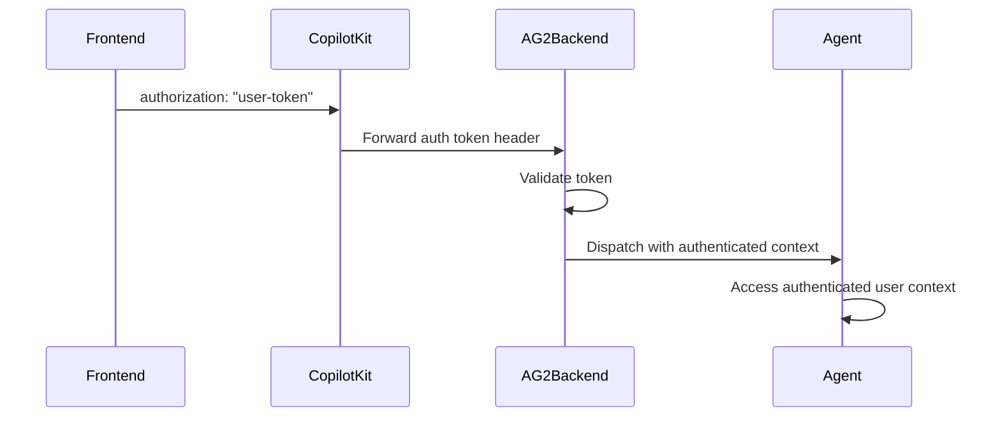

# AG2 Integration

CopilotKit implementation guide for AG2.

> For shared CopilotKit concepts (runtime setup, prebuilt components, troubleshooting, etc.), see the topic guides. This file focuses on framework-specific implementation details.

## Guidance
### Authentication
- Route: `/ag2/auth`
- Source: `docs/content/docs/integrations/ag2/auth.mdx`
- Description: Secure your AG2 backend with user authentication on /chat

## Overview

CopilotKit supports user authentication for AG2 backends in two deployment modes:

- **LangGraph Platform equivalent**: managed runtime forwarding to your AG2 `/chat` endpoint
- **Self-hosted runtime**: your own CopilotKit runtime forwarding to your AG2 `/chat` endpoint

Both approaches let your AG2 backend access authenticated user context and enforce authorization.

This pattern enables your backend to:

- Validate user tokens before dispatching the agent
- Attach authenticated user context to agent state/tools
- Enforce authorization decisions server-side

  CopilotKit consumes AG-UI protocol events streamed by AG2 over /chat. See the AG2 AG-UI integration docs.

## How It Works



## Frontend Setup

Pass your authentication token via the `properties` prop:

```tsx
<CopilotKit
  runtimeUrl="/api/copilotkit"
  properties={{
    authorization: userToken, // forwarded to AG2 /chat
  }}
>
  <YourApp />
</CopilotKit>
```

**Note**: The `authorization` property is forwarded to your AG2 `/chat` endpoint as a request header.

## LangGraph Platform Deployment

**For managed deployments**, protect your AG2 `/chat` endpoint with token-header validation.

### Setup Authentication Handler

```python
from fastapi import FastAPI, Header, HTTPException
from fastapi.responses import StreamingResponse
from autogen import ConversableAgent, LLMConfig
from autogen.ag_ui import AGUIStream, RunAgentInput

agent = ConversableAgent(
    name="assistant",
    system_message="You are a helpful assistant.",
    llm_config=LLMConfig({"model": "gpt-5.2-mini"}),
)

stream = AGUIStream(agent)
app = FastAPI()

def validate_your_token(token: str) -> dict:
    # Replace this with your own validation logic.
    if token != "valid-token":
        raise HTTPException(status_code=401, detail="Unauthorized")
    return {"user_id": "user_123", "role": "member"}

@app.post("/chat")
async def run_agent(
    message: RunAgentInput,
    accept: str | None = Header(None),
    authorization: str | None = Header(None),
):
    if not authorization:
        raise HTTPException(status_code=401, detail="Missing authorization header")

    token = authorization.replace("Bearer ", "")
    user_info = validate_your_token(token)

    # Use user_info to scope tools, state, and data access before dispatch.
    return StreamingResponse(
        stream.dispatch(message, accept=accept),
        media_type=accept or "text/event-stream",
    )
```

### Access User in Agent

Use validated user identity to scope tool calls and data access:

```python
from typing import Annotated
from autogen import ContextVariables

@agent.register_for_llm(description="Return account data for the authenticated user.")
def get_account_data(
    context: ContextVariables,
    account_id: Annotated[str, "The target account id"],
) -> dict:
    user = context.get("auth_user")
    if not user:
        return {"error": "unauthorized"}
    # Example check: ensure user can access this account
    if account_id not in user.get("allowed_accounts", []):
        return {"error": "forbidden"}
    return {"account_id": account_id, "owner": user["user_id"]}
```

## Self-hosted Deployment

**For self-hosted deployments**, use the same `/chat` header-validation pattern in your own FastAPI service.

### Setup Dynamic Agent Configuration

```python
from fastapi import FastAPI, Header, HTTPException
from fastapi.responses import StreamingResponse
from autogen import ConversableAgent, LLMConfig
from autogen.ag_ui import AGUIStream, RunAgentInput

agent = ConversableAgent(
    name="assistant",
    system_message="You are a helpful assistant.",
    llm_config=LLMConfig({"model": "gpt-5.2-mini"}),
)

stream = AGUIStream(agent)
app = FastAPI()

@app.post("/chat")
async def run_agent(
    message: RunAgentInput,
    accept: str | None = Header(None),
    authorization: str | None = Header(None),
):
    if not authorization:
        raise HTTPException(status_code=401, detail="Unauthorized")
    # Validate token here, then dispatch
    return StreamingResponse(
        stream.dispatch(message, accept=accept),
        media_type=accept or "text/event-stream",
    )
```

### Access User in Agent

After token validation, persist user identity in request-scoped context and enforce access checks in AG2 tools/state reads.

## Universal Authentication Pattern

For backends that run in both managed and self-hosted modes, use this pattern:

```python
def extract_user_from_auth_header(authorization: str | None) -> dict | None:
    if not authorization:
        return None
    token = authorization.replace("Bearer ", "")
    return validate_your_token(token)
```

Then:

- Read `authorization` on `/chat`
- Validate token before `stream.dispatch(...)`
- Attach user context for tool/state authorization
- Deny unauthorized or out-of-scope access

## Security Notes

### LangGraph Platform

- **Token Validation**: Validate tokens on your AG2 `/chat` endpoint
- **User Scoping**: Scope data access by authenticated user identity

### Self-hosted

- **Manual Validation**: Implement and maintain your own validation logic
- **Header Forwarding**: Ensure your runtime forwards `authorization` to AG2

### General Best Practices

- **Permission Checks**: Enforce role-based checks in AG2 tools
- **Transport Security**: Serve `/chat` over HTTPS
- **Least Privilege**: Return only data needed for the current user/task

## Troubleshooting

### Common Issues

**Token not reaching backend**:

- Ensure you're passing `authorization` in `properties`
- Confirm your runtime forwards headers to AG2 `/chat`

**Invalid token format**:

- Handle both raw tokens and `Bearer ` formats consistently

**Unexpected anonymous access**:

- Verify `authorization` checks happen before calling `stream.dispatch(...)`

## Next Steps

- [Configure chat UI with AG2 backend ->](/ag2/prebuilt-components)
- [Learn about shared state ->](/ag2/shared-state)
- [Implement human-in-the-loop workflows ->](/ag2/human-in-the-loop)

### Frontend Tools
- Route: `/ag2/frontend-tools`
- Source: `docs/content/docs/integrations/ag2/frontend-tools.mdx`
- Description: Create frontend actions and use them within your agent.

This video shows the result of `npx copilotkit@latest init` with the [implementation](#implementation) section applied to it.

## What is this?

Frontend actions are powerful tools that allow your AI agents to directly interact with and update your application's user interface. Think of them as bridges that connect your agent's decision-making capabilities with your frontend's interactive elements.

  CopilotKit consumes AG-UI protocol events streamed by AG2 over /chat. See the AG2 AG-UI integration docs.

## When should I use this?

Frontend actions are essential when you want to create truly interactive AI applications where your agent needs to:

- Dynamically update UI elements
- Trigger frontend animations or transitions
- Show alerts or notifications
- Modify application state
- Handle user interactions programmatically

Without frontend actions, agents are limited to just processing and returning data. By implementing frontend actions, you can create rich, interactive experiences where your agent actively drives the user interface.

## Implementation

        ### Setup CopilotKit

        To use frontend actions, you'll need to setup CopilotKit first. For the sake of brevity, we won't cover it here.

        Check out our [getting started guide](/ag2/quickstart) and come back here when you're setup.

        ### Create a frontend action

        First, you'll need to create a frontend action using the `useFrontendTool` hook. Here's a simple one to get you started
        that says hello to the user.

```tsx title="page.tsx"
        import { z } from "zod";
        import { useFrontendTool } from "@copilotkit/react-core/v2" // [!code highlight]

        export function Page() {
          // ...

          // [!code highlight:13]
          useFrontendTool({
            name: "sayHello",
            description: "Say hello to the user",
            available: "remote", // optional, makes it so the action is *only* available to the AG2 backend over AG-UI
            parameters: z.object({
              name: z.string().describe("The name of the user to say hello to"),
            }),
            handler: async ({ name }) => {
              alert(`Hello, ${name}!`);
              return `Said hello to ${name}!`;
            },
          });

          // ...
        }
```
        ###  Modify your agent
        Now, we'll need to modify the agent to access these frontend actions. Open your AG2 backend file and continue from there.
        ### Setup your AG2 backend over AG-UI

        AG2 can call frontend actions through AG-UI tool events with a standard `/chat` endpoint:

```python title="agent.py"
                from fastapi import FastAPI, Header
                from fastapi.responses import StreamingResponse
                from autogen import ConversableAgent, LLMConfig
                from autogen.ag_ui import AGUIStream, RunAgentInput

                agent = ConversableAgent(
                    name="assistant",
                    system_message="You are a helpful assistant.",
                    llm_config=LLMConfig({"model": "gpt-5.2-mini"}),
                )

                stream = AGUIStream(agent)
                app = FastAPI()

                @app.post("/chat")
                async def run_agent(
                    message: RunAgentInput,
                    accept: str | None = Header(None),
                ):
                    return StreamingResponse(
                        stream.dispatch(message, accept=accept),
                        media_type=accept or "text/event-stream",
                    )
```

        That's it. Your AG2 backend can now receive frontend action tool definitions emitted by CopilotKit through AG-UI.
        ### Give it a try
        You've now given your agent the ability to directly call any CopilotActions you've defined. These actions will be available as tools to the agent where they can be used as needed.

### State Rendering
- Route: `/ag2/generative-ui/state-rendering`
- Source: `docs/content/docs/integrations/ag2/generative-ui/state-rendering.mdx`
- Description: Render the state of your agent with custom UI components.

## What is this?

AG2 agents can maintain state across a session through `ContextVariables`. CopilotKit can render this state in your application with custom UI components, which we call **Agentic Generative UI**.

  CopilotKit consumes AG-UI protocol events streamed by AG2 over /chat. See the AG2 AG-UI integration docs.

## When should I use this?

Rendering the state of your agent in the UI is useful when you want to provide the user with feedback about the overall state of a session. A great example of this
is a situation where a user and an agent are working together to solve a problem. The agent can store a draft in its state which is then rendered in the UI.

## Implementation

    ### Run and connect your agent
    Start your AG2 backend with AG-UI streaming enabled on `/chat`.
    ### Set up your agent with state

    Create your AG2 agent with `ContextVariables` and emit `StateSnapshotEvent` updates:

```python title="agent.py"
    from typing import Annotated

    from ag_ui.core import EventType, StateSnapshotEvent
    from fastapi import FastAPI, Header
    from fastapi.responses import StreamingResponse
    from pydantic import BaseModel, Field
    from autogen import ContextVariables, ConversableAgent, LLMConfig
    from autogen.ag_ui import AGUIStream, RunAgentInput

    class Search(BaseModel):
        query: str
        done: bool

    class AgentState(BaseModel):
        searches: list[Search] = Field(default_factory=list)

    def read_state(context: ContextVariables) -> AgentState:
        raw_state = context.get("agent_state", {"searches": []})
        return AgentState.model_validate(raw_state)

    def write_state(context: ContextVariables, state: AgentState) -> StateSnapshotEvent:
        snapshot = state.model_dump()
        context["agent_state"] = snapshot
        return StateSnapshotEvent(type=EventType.STATE_SNAPSHOT, snapshot=snapshot)

    agent = ConversableAgent(
        name="assistant",
        system_message=(
            "You are a helpful assistant for storing searches. "
            "Use `add_search` once per query, then call `run_searches`."
        ),
        llm_config=LLMConfig({"model": "gpt-5.2-mini"}),
    )

    @agent.register_for_llm(description="Add a search to the state.")
    def add_search(
        context: ContextVariables,
        new_query: Annotated[str, "The query to add to state"],
    ) -> StateSnapshotEvent:
        state = read_state(context)
        state.searches.append(Search(query=new_query, done=False))
        return write_state(context, state)

    @agent.register_for_llm(description="Run the queued searches and mark them done.")
    def run_searches(context: ContextVariables) -> StateSnapshotEvent:
        state = read_state(context)
        for search in state.searches:
            search.done = True
        return write_state(context, state)

    agent.register_for_execution(name="add_search")(add_search)
    agent.register_for_execution(name="run_searches")(run_searches)

    stream = AGUIStream(agent)
    app = FastAPI()

    @app.post("/chat")
    async def run_agent(
        message: RunAgentInput,
        accept: str | None = Header(None),
    ):
        return StreamingResponse(
            stream.dispatch(message, accept=accept),
            media_type=accept or "text/event-stream",
        )
```

    ### Render state of the agent in the chat
    Now we can utilize `useAgent` with a `render` function to render the state of our agent **in the chat**.

```tsx title="app/page.tsx"
    // ...
    import { useAgent } from "@copilotkit/react-core/v2";
    // ...

    // Define the state of the agent, should match the state streamed by your AG2 backend.
    type AgentState = {
      searches: {
        query: string;
        done: boolean;
      }[];
    };

    function YourMainContent() {
      // ...

      // [!code highlight:13]
      // styles omitted for brevity
      useAgent({
        name: "my_agent", // MUST match the agent name in CopilotRuntime
        render: ({ state }) => (
          <div>
            {state.searches?.map((search, index) => (
              <div key={index}>
                {search.done ? "✅" : "❌"} {search.query}{search.done ? "" : "..."}
              </div>
            ))}
          </div>
        ),
      });

      // ...

      return <div>...</div>;
    }
```

      The `name` parameter must exactly match the agent name you defined in your CopilotRuntime configuration (e.g., `my_agent` from the quickstart).

    ### Render state outside of the chat
    You can also render the state of your agent **outside of the chat**. This is useful when you want to render the state of your agent anywhere
    other than the chat.

```tsx title="app/page.tsx"
    import { useAgent } from "@copilotkit/react-core/v2"; // [!code highlight]
    // ...

    // Define the state of the agent, should match the state streamed by your AG2 backend.
    type AgentState = {
      searches: {
        query: string;
        done: boolean;
      }[];
    };

    function YourMainContent() {
      // ...

      // [!code highlight:3]
      const { agent } = useAgent({
        agentId: "my_agent", // MUST match the agent name in CopilotRuntime
      })

      // ...

      return (
        <div>
          {/* ... */}
          <div className="flex flex-col gap-2 mt-4">
            {/* [!code highlight:5] */}
            {agent.state.searches?.map((search, index) => (
              <div key={index} className="flex flex-row">
                {search.done ? "✅" : "❌"} {search.query}
              </div>
            ))}
          </div>
        </div>
      )
    }
```

      The `agentId` parameter must exactly match the agent name you defined in your CopilotRuntime configuration (e.g., `my_agent` from the quickstart).

    ### Give it a try

    You've now created a component that will render the agent's state in the chat.

### Tool Rendering
- Route: `/ag2/generative-ui/tool-rendering`
- Source: `docs/content/docs/integrations/ag2/generative-ui/tool-rendering.mdx`
- Description: Render your agent's tool calls with custom UI components.

## What is this?

Tools are a way for the LLM to call predefined, typically, deterministic functions. CopilotKit allows you to render these tools in the UI
as a custom component, which we call **Generative UI**.

  CopilotKit consumes AG-UI protocol events streamed by AG2 over /chat. See the AG2 AG-UI integration docs.

## When should I use this?

Rendering tools in the UI is useful when you want to provide the user with feedback about what your agent is doing, specifically
when your agent is calling tools. CopilotKit allows you to fully customize how these tools are rendered in the chat.

## Implementation

### Run and connect your agent
Start your AG2 backend with a `/chat` endpoint and connect CopilotKit to that endpoint.
### Give your agent a tool to call

```python title="agent.py"
        from typing import Annotated

        from fastapi import FastAPI, Header
        from fastapi.responses import StreamingResponse
        from autogen import ConversableAgent, LLMConfig
        from autogen.ag_ui import AGUIStream, RunAgentInput

        agent = ConversableAgent(
            name="assistant",
            system_message="You are a helpful assistant.",
            llm_config=LLMConfig({"model": "gpt-5.2-mini"}),
        )

        @agent.register_for_llm(
            description="Get the weather for a given location. Ensure location is fully spelled out."
        )
        def get_weather(location: Annotated[str, "Fully spelled out location"]) -> str:
            return f"The weather in {location} is sunny."

        # Register the same function for execution on this backend process.
        agent.register_for_execution(name="get_weather")(get_weather)

        stream = AGUIStream(agent)
        app = FastAPI()

        @app.post("/chat")
        async def run_agent(
            message: RunAgentInput,
            accept: str | None = Header(None),
        ):
            return StreamingResponse(
                stream.dispatch(message, accept=accept),
                media_type=accept or "text/event-stream",
            )
```

### Render the tool call in your frontend
At this point, your agent will be able to call the `get_weather` tool. Now
we just need to add a `useRenderTool` hook to render the tool call in
the UI.

  In order to render a tool call in the UI, the name of the action must match the name of the tool.

```tsx title="app/page.tsx"
import { useRenderTool } from "@copilotkit/react-core/v2"; // [!code highlight]
// ...

const YourMainContent = () => {
  // ...
  // [!code highlight:12]
  useRenderTool({
    name: "get_weather",
    render: ({status, args}) => {
      return (
        <p className="text-gray-500 mt-2">
          {status !== "complete" && "Calling weather API..."}
          {status === "complete" && `Called the weather API for ${args.location}.`}
        </p>
      );
    },
  });
  // ...
}
```

### Give it a try!

Try asking the agent to get the weather for a location. You should see the custom UI component that we added
render the tool call and display the arguments that were passed to the tool.

## Default Tool Rendering

`useDefaultRenderTool` provides a catch-all renderer for **any tool** that doesn't have a specific `useRenderToolCall` defined. This is useful for:

- Displaying all tool calls during development
- Rendering MCP (Model Context Protocol) tools
- Providing a generic fallback UI for unexpected tools

```tsx title="app/page.tsx"
import { useDefaultRenderTool } from "@copilotkit/react-core/v2"; // [!code highlight]
// ...

const YourMainContent = () => {
  // ...
  // [!code highlight:15]
  useDefaultRenderTool({
    render: ({ name, args, status, result }) => {
      return (
        <div style={{ color: "black" }}>
          <span>
            {status === "complete" ? "✓" : "⏳"}
            {name}
          </span>
          {status === "complete" && result && (
            <pre>{JSON.stringify(result, null, 2)}</pre>
          )}
        </div>
      );
    },
  });
  // ...
}
```

  Unlike `useRenderToolCall`, which targets a specific tool by name, `useDefaultRenderTool` catches **all** tools that don't have a dedicated renderer.

  In v2, use [`useDefaultRenderTool`](/reference/v2/hooks/useDefaultRenderTool) for wildcard fallback rendering, and [`useRenderTool`](/reference/v2/hooks/useRenderTool) for named or wildcard renderer registration.

### Human-in-the-Loop
- Route: `/ag2/human-in-the-loop`
- Source: `docs/content/docs/integrations/ag2/human-in-the-loop.mdx`
- Description: Create frontend tools and use them within your AG2 agent for human-in-the-loop interactions.

This video shows the result of `npx copilotkit@latest init` with the [implementation](#implementation) section applied to it.

## What is this?

Frontend tools enable you to define client-side functions that your AG2 agent can invoke, with execution happening entirely in the user's browser. When your agent calls a frontend tool,
the logic runs on the client side, giving you direct access to the frontend environment.

This can be utilized to let [your agent control the UI](/ag2/frontend-tools), [generative UI](/ag2/frontend-tools), or for Human-in-the-loop interactions.

In this guide, we cover the use of frontend tools for Human-in-the-loop.

  CopilotKit consumes AG-UI protocol events streamed by AG2 over /chat. See the AG2 AG-UI integration docs.

## When should I use this?

Use frontend tools when you need your agent to interact with client-side primitives such as:
- Reading or modifying React component state
- Accessing browser APIs like localStorage, sessionStorage, or cookies
- Triggering UI updates or animations
- Interacting with third-party frontend libraries
- Performing actions that require the user's immediate browser context

## Implementation

      ### Run and connect your agent

      Start your AG2 backend on a `/chat` endpoint and connect your frontend to it with CopilotKit.

        ### Create a frontend human-in-the-loop tool

        Frontend tools can be leveraged in a variety of ways. One of those ways is to have a human-in-the-loop flow where the response
        of the tool is gated by a user's decision.

        In this example we will simulate an "approval" flow for executing a command. First, use the `useHumanInTheLoop` hook to create a tool that
        prompts the user for approval.

```tsx title="page.tsx"
        import { useHumanInTheLoop } from "@copilotkit/react-core/v2" // [!code highlight]

        export function Page() {
          // ...

          useHumanInTheLoop({
            name: "offerOptions",
            description: "Give the user a choice between two options and have them select one.",
            parameters: [
              {
                name: "option_1",
                type: "string",
                description: "The first option",
                required: true,
              },
              {
                name: "option_2",
                type: "string",
                description: "The second option",
                required: true,
              },
            ],
            render: ({ args, respond }) => {
              if (!respond) return <></>;
              return (
                <div>
                  {/* [!code highlight:2] */}
                  <button onClick={() => respond(`${args.option_1} was selected`)}>{args.option_1}</button>
                  <button onClick={() => respond(`${args.option_2} was selected`)}>{args.option_2}</button>
                </div>
              );
            },
          });

          // ...
        }
```
        ###  Set up your AG2 backend

        The frontend tool emits AG-UI tool events. AG2 can consume those events, then persist the user decision to shared state:

```python title="agent.py"
        from typing import Annotated

        from ag_ui.core import EventType, StateSnapshotEvent
        from fastapi import FastAPI, Header
        from fastapi.responses import StreamingResponse
        from autogen import ContextVariables, ConversableAgent, LLMConfig
        from autogen.ag_ui import AGUIStream, RunAgentInput

        agent = ConversableAgent(
            name="assistant",
            system_message=(
                "When you need the user to choose, call the frontend tool `offerOptions`. "
                "After it returns, call `store_user_choice` with the selected value."
            ),
            llm_config=LLMConfig({"model": "gpt-5.2-mini"}),
        )

        @agent.register_for_llm(description="Store the latest user choice in shared state.")
        def store_user_choice(
            context: ContextVariables,
            choice: Annotated[str, "The option selected by the user"],
        ) -> StateSnapshotEvent:
            snapshot = {"hitl": {"latest_choice": choice}}
            context["hitl"] = snapshot["hitl"]
            return StateSnapshotEvent(type=EventType.STATE_SNAPSHOT, snapshot=snapshot)

        agent.register_for_execution(name="store_user_choice")(store_user_choice)

        stream = AGUIStream(agent)
        app = FastAPI()

        @app.post("/chat")
        async def run_agent(
            message: RunAgentInput,
            accept: str | None = Header(None),
        ):
            return StreamingResponse(
                stream.dispatch(message, accept=accept),
                media_type=accept or "text/event-stream",
            )
```

        The frontend tools are automatically populated by CopilotKit through the AG-UI protocol and are available to your AG2 backend.
        ### Try it out

        You've now given your agent the ability to show the user two options and have them select one. The agent will then be aware of the user's choice and can use it in subsequent steps.

```
        Can you show me two good options for a restaurant name?
```

### Introduction
- Route: `/ag2`
- Source: `docs/content/docs/integrations/ag2/index.mdx`
- Description: Bring your AG2 agents to your users with CopilotKit via AG-UI.

CopilotKit consumes AG-UI protocol events streamed by AG2 over /chat. See the AG2 AG-UI integration docs.

### Quickstart
- Route: `/ag2/quickstart`
- Source: `docs/content/docs/integrations/ag2/quickstart.mdx`
- Description: Turn your AG2 Agents into an agent-native application in 5 minutes.

## Introduction

This quickstart guide shows how to build a **Weather Agent** using AG2 and CopilotKit. In just minutes, you'll have a working application where users can ask for real-time weather conditions in any city worldwide — powered by AG2's `AGUIStream` over the AG-UI protocol and rendered with CopilotKit's chat UI.

  CopilotKit consumes AG-UI protocol events streamed by AG2 over /chat. See the AG2 AG-UI integration docs.

## AG2 Bootstrap Template

If you prefer a generated starter instead of cloning the repo, use the CopilotKit bootstrap template and select **AG2** during setup. This wires up an AG2 backend over AG-UI and a ready-to-run frontend.

```bash
npx copilotkit@latest init
```

Follow the prompts to pick AG2 and the features you want, then run the install/start commands it prints.

## Prerequisites

Before you begin, you'll need the following:

- **Python 3.10–3.13** for running the AG2 backend
- uv (for Python dependency management)
- Node.js 18.18.0 or newer (specifically: ^18.18.0 || ^19.8.0 || >= 20.0.0)
- pnpm (for frontend package management)
- OpenAI API key

## Getting started

        ### Clone the AG2 Samples Repository

```bash
        git clone https://github.com/ag2ai/ag2-samples.git
        cd ag2-samples
```
        ### Set Up the AG2 Backend

        #### Install the dependencies:

```bash
        uv sync
```

        #### Set your `OPENAI_API_KEY`:

```sh
        export OPENAI_API_KEY="your_openai_api_key"
```

        #### Launch the AG2 weather agent:

```bash
        uv run python weather.py
```
        The backend server will start at http://localhost:8000 and serve the agent at `/weather`.
        ### Set Up the CopilotKit UI

        The last step is to use CopilotKit's UI components to render the chat interaction with your agent.

        In a new terminal:

```bash
        cd ui
        pnpm install
        pnpm dev
```

        The frontend application will start at http://localhost:3000.
        ### 🎉 Talk to your agent!

        Congrats! You've successfully integrated an AG2 Agent chatbot into your application. Try asking a few questions:

```
        What's the weather in London?
```

```
        Weather in Tokyo
```

```
        What's the weather here?
```

            Asking "What's the weather here?" will use your browser's location if you allow it. If location access is denied, the agent will ask you for a city name instead.

---

## What's next?

You've now got a Weather Agent running with CopilotKit! This demonstrates how quickly you can build practical AI applications by combining AG2's `AGUIStream` with CopilotKit's user interface components.

### Readables
- Route: `/ag2/readables`
- Source: `docs/content/docs/integrations/ag2/readables.mdx`
- Description: Share app specific context with your agent.

One of the most common use cases for CopilotKit is to register app state and context using `useAgentContext`.
This way, you can notify CopilotKit of what is going in your app in real time.
Some examples might be: the current user, the current page, etc.

This context can then be shared with your AG2 backend.

## Implementation
    Check out the [Frontend Data documentation](https://docs.copilotkit.ai/direct-to-llm/guides/connect-your-data/frontend) to understand what this is and how to use it.

  CopilotKit consumes AG-UI protocol events streamed by AG2 over /chat. See the AG2 AG-UI integration docs.

                ### Add the data to the Copilot

                The ``useAgentContext` hook` is used to add data as context to the Copilot.

```tsx title="YourComponent.tsx" showLineNumbers {1, 7-10}
                "use client" // only necessary if you are using Next.js with the App Router. // [!code highlight]
                import { useAgentContext } from "@copilotkit/react-core/v2"; // [!code highlight]
                import { useState } from 'react';

                export function YourComponent() {
                  // Create colleagues state with some sample data
                  const [colleagues, setColleagues] = useState([
                    { id: 1, name: "John Doe", role: "Developer" },
                    { id: 2, name: "Jane Smith", role: "Designer" },
                    { id: 3, name: "Bob Wilson", role: "Product Manager" }
                  ]);

                  // Define Copilot readable state
                  // [!code highlight:4]
                  useAgentContext({
                    description: "The current user's colleagues",
                    value: colleagues,
                  });
                  return (
                    // Your custom UI component
                    <>...</>
                  );
                }
```

                ### Set up your agent state
                In AG2, readables arrive as AG-UI context data. Use `ContextVariables` to access that data.

```python title="agent.py"
                        from autogen import ContextVariables

                        def get_readable(context: ContextVariables, description: str):
                            copilot = context.get("copilotkit", {})
                            context_items = copilot.get("context", [])
                            return next(
                                (item.get("value") for item in context_items if item.get("description") == description),
                                None,
                            )
```

                ### Consume the data in your AG2 backend
                Your AG2 tools and prompts can consume readable context directly from `ContextVariables`.

```python title="agent.py"
                        from fastapi import FastAPI, Header
                        from fastapi.responses import StreamingResponse
                        from autogen import ContextVariables, ConversableAgent, LLMConfig
                        from autogen.ag_ui import AGUIStream, RunAgentInput

                        def get_readable(context: ContextVariables, description: str):
                            copilot = context.get("copilotkit", {})
                            context_items = copilot.get("context", [])
                            return next(
                                (item.get("value") for item in context_items if item.get("description") == description),
                                [],
                            )

                        agent = ConversableAgent(
                            name="assistant",
                            system_message=(
                                "You are a helpful assistant that can help emailing colleagues. "
                                "Call `get_colleagues` before suggesting recipients."
                            ),
                            llm_config=LLMConfig({"model": "gpt-5.2-mini"}),
                        )

                        @agent.register_for_llm(description="Return the current user's colleagues from CopilotKit readables.")
                        def get_colleagues(context: ContextVariables) -> list[dict]:
                            return get_readable(context, "The current user's colleagues") or []

                        agent.register_for_execution(name="get_colleagues")(get_colleagues)

                        stream = AGUIStream(agent)
                        app = FastAPI()

                        @app.post("/chat")
                        async def run_agent(
                            message: RunAgentInput,
                            accept: str | None = Header(None),
                        ):
                            return StreamingResponse(
                                stream.dispatch(message, accept=accept),
                                media_type=accept or "text/event-stream",
                            )
```

                ### Give it a try
                Ask your agent a question about the context. It should be able to answer.
                ### Add the data to the Copilot

                The ``useAgentContext` hook` is used to add data as context to the Copilot.

```tsx title="YourComponent.tsx" showLineNumbers {1, 7-10}
                "use client" // only necessary if you are using Next.js with the App Router. // [!code highlight]
                import { useAgentContext } from "@copilotkit/react-core/v2"; // [!code highlight]
                import { useState } from 'react';

                export function YourComponent() {
                  // Create colleagues state with some sample data
                  const [colleagues, setColleagues] = useState([
                    { id: 1, name: "John Doe", role: "Developer" },
                    { id: 2, name: "Jane Smith", role: "Designer" },
                    { id: 3, name: "Bob Wilson", role: "Product Manager" }
                  ]);

                  // Define Copilot readable state
                  // [!code highlight:4]
                  useAgentContext({
                    description: "The current user's colleagues",
                    value: colleagues,
                  });
                  return (
                    // Your custom UI component
                    <>...</>
                  );
                }
```

                ### Consume the data in your AG2 backend
                For a minimal backend, parse context directly inside a registered AG2 tool and expose it through AG-UI.

```python title="agent.py"
                        from fastapi import FastAPI, Header
                        from fastapi.responses import StreamingResponse
                        from autogen import ContextVariables, ConversableAgent, LLMConfig
                        from autogen.ag_ui import AGUIStream, RunAgentInput

                        agent = ConversableAgent(
                            name="assistant",
                            system_message="You are a helpful assistant.",
                            llm_config=LLMConfig({"model": "gpt-5.2-mini"}),
                        )

                        @agent.register_for_llm(description="Read colleagues from CopilotKit readable context.")
                        def list_colleagues(context: ContextVariables) -> list[dict]:
                            copilot = context.get("copilotkit", {})
                            context_items = copilot.get("context", [])
                            entry = next(
                                (item for item in context_items if item.get("description") == "The current user's colleagues"),
                                None,
                            )
                            return entry.get("value", []) if entry else []

                        agent.register_for_execution(name="list_colleagues")(list_colleagues)

                        stream = AGUIStream(agent)
                        app = FastAPI()

                        @app.post("/chat")
                        async def run_agent(
                            message: RunAgentInput,
                            accept: str | None = Header(None),
                        ):
                            return StreamingResponse(
                                stream.dispatch(message, accept=accept),
                                media_type=accept or "text/event-stream",
                            )
```

                ### Give it a try
                Ask your agent a question about the context. It should be able to answer.

### Shared State
- Route: `/ag2/shared-state`
- Source: `docs/content/docs/integrations/ag2/shared-state/index.mdx`
- Description: Create a two-way connection between your UI and AG2 agent state.

## What is shared state?

CoAgents maintain a shared state that seamlessly connects your UI with the agent's execution. This shared state system allows you to:

- Display the agent's current progress and intermediate results
- Update the agent's state through UI interactions
- React to state changes in real-time across your application

The foundation of this system is built on AG2 `ContextVariables` and AG-UI `StateSnapshotEvent`.

  CopilotKit consumes AG-UI protocol events streamed by AG2 over /chat. See the AG2 AG-UI integration docs.

## When should I use this?

State streaming is perfect when you want to facilitate collaboration between your agent and the user. Any state that your AG2 backend
emits in snapshot events will be automatically shared by the UI. Similarly, any state that the user updates in the UI will be automatically reflected.

This allows for a consistent experience where both the agent and the user are on the same page.

### Reading agent state
- Route: `/ag2/shared-state/read`
- Source: `docs/content/docs/integrations/ag2/shared-state/read.mdx`
- Description: Read the realtime agent state in your native application.

This video shows the result of `npx copilotkit@latest init` with the [implementation](#implementation) section applied to it.

## What is this?

You can easily use the realtime agent state not only in the chat UI, but also in the native application UX.

  CopilotKit consumes AG-UI protocol events streamed by AG2 over /chat. See the AG2 AG-UI integration docs.

## When should I use this?

You can use this when you want to provide the user with feedback about your agent's state. As your agent's
state updates, you can reflect these updates natively in your application.

## Implementation

    ### Run and connect your agent
    Start your AG2 backend and connect your CopilotKit frontend to the AG-UI `/chat` endpoint.
    ### Define the Agent State

    Create your AG2 backend with `ContextVariables` and emit `StateSnapshotEvent` whenever the state changes:

```python title="agent.py"
    from typing import Annotated

    from ag_ui.core import EventType, StateSnapshotEvent
    from fastapi import FastAPI, Header
    from fastapi.responses import StreamingResponse
    from autogen import ContextVariables, ConversableAgent, LLMConfig
    from autogen.ag_ui import AGUIStream, RunAgentInput

    def read_state(context: ContextVariables) -> dict:
        return context.get("agent_state", {"language": "english"})

    def write_state(context: ContextVariables, state: dict) -> StateSnapshotEvent:
        context["agent_state"] = state
        return StateSnapshotEvent(type=EventType.STATE_SNAPSHOT, snapshot=state)

    agent = ConversableAgent(
        name="assistant",
        system_message=(
            "You are a helpful assistant for tracking language. "
            "Always respond in the current language."
        ),
        llm_config=LLMConfig({"model": "gpt-5.2-mini"}),
    )

    @agent.register_for_llm(description="Update the language in shared state.")
    def set_language(
        context: ContextVariables,
        language: Annotated[str, "language such as english or spanish"],
    ) -> StateSnapshotEvent:
        return write_state(context, {"language": language.lower()})

    agent.register_for_execution(name="set_language")(set_language)

    stream = AGUIStream(agent)
    app = FastAPI()

    @app.post("/chat")
    async def run_agent(
        message: RunAgentInput,
        accept: str | None = Header(None),
    ):
        return StreamingResponse(
            stream.dispatch(message, accept=accept),
            media_type=accept or "text/event-stream",
        )
```

    ### Use the `useAgent` Hook
    With your agent connected and running all that is left is to call the `useAgent` hook, pass the agent's ID, and
    optionally provide an initial state.

```tsx title="ui/app/page.tsx"
    import { useAgent } from "@copilotkit/react-core/v2"; // [!code highlight]

    // Define the agent state type, should match the actual state of your agent
    type AgentState = {
      language: "english" | "spanish";
    }

    function YourMainContent() {
      // [!code highlight:4]
      const { agent } = useAgent({
        agentId: "my_agent", // MUST match the agent name in CopilotRuntime
        initialState: { language: "english" }  // optionally provide an initial state
      });

      // ...

      return (
        // style excluded for brevity
        <div>
          <h1>Your main content</h1>
          {/* [!code highlight:1] */}
          <p>Language: {agent.state.language}</p>
        </div>
      );
    }
```

      The `agentId` parameter must exactly match the agent name you defined in your CopilotRuntime configuration (e.g., `my_agent` from the quickstart).

      The `agent.state` in `useAgent` is reactive and will automatically update when the agent's state changes.

    ### Give it a try
    As the agent state updates, your `state` variable will automatically update with it. In this case, you'll see the
    language set to "english" as that's the initial state we set.

## Rendering agent state in the chat

You can also render the agent's state in the chat UI. This is useful for informing the user about the agent's state in a
more in-context way. To do this, you can use the `useAgent` hook with a `render` function.

```tsx title="ui/app/page.tsx"
import { useAgent } from "@copilotkit/react-core/v2"; // [!code highlight]

// Define the agent state type, should match the actual state of your agent
type AgentState = {
  language: "english" | "spanish";
};

function YourMainContent() {
  // ...
  // [!code highlight:7]
  useAgent({
    name: "my_agent", // MUST match the agent name in CopilotRuntime
    render: ({ state }) => {
      if (!state.language) return null;
      return <div>Language: {state.language}</div>;
    },
  });
  // ...
}
```

  The `name` parameter must exactly match the agent name you defined in your CopilotRuntime configuration (e.g., `my_agent` from the quickstart).

  The `agent.state` in `useAgent` is reactive and will automatically
  update when the agent's state changes.

## Intermediately Stream and Render Agent State

By default, AG2 state updates are visible to CopilotKit whenever your backend emits `StateSnapshotEvent`.
For smoother long-running workflows, emit additional intermediate snapshots from your backend tools.

### Writing agent state
- Route: `/ag2/shared-state/write`
- Source: `docs/content/docs/integrations/ag2/shared-state/write.mdx`
- Description: Write to agent's state from your application.

This video shows the result of `npx copilotkit@latest init` with the [implementation](#implementation) section applied to it.

## What is this?

This guide shows you how to write to your agent's state from your application.

  CopilotKit consumes AG-UI protocol events streamed by AG2 over /chat. See the AG2 AG-UI integration docs.

## When should I use this?

You can use this when you want to keep your interface and backend agent state synchronized. CopilotKit lets you update state from the UI, while AG2 consumes that state in subsequent turns.

## Implementation

    ### Run and connect your agent
    Start your AG2 backend and connect your CopilotKit frontend to the AG-UI `/chat` endpoint.
    ### Define the Agent State

    Create your AG2 backend with `ContextVariables` and emit `StateSnapshotEvent` whenever state changes:

```python title="agent.py"
    from typing import Annotated

    from ag_ui.core import EventType, StateSnapshotEvent
    from fastapi import FastAPI, Header
    from fastapi.responses import StreamingResponse
    from autogen import ContextVariables, ConversableAgent, LLMConfig
    from autogen.ag_ui import AGUIStream, RunAgentInput

    def read_state(context: ContextVariables) -> dict:
        return context.get("agent_state", {"language": "english"})

    def write_state(context: ContextVariables, state: dict) -> StateSnapshotEvent:
        context["agent_state"] = state
        return StateSnapshotEvent(type=EventType.STATE_SNAPSHOT, snapshot=state)

    agent = ConversableAgent(
        name="assistant",
        system_message=(
            "You are a helpful assistant for tracking language. "
            "Always respond in the current language."
        ),
        llm_config=LLMConfig({"model": "gpt-5.2-mini"}),
    )

    @agent.register_for_llm(description="Update the language in shared state.")
    def set_language(
        context: ContextVariables,
        language: Annotated[str, "language such as english or spanish"],
    ) -> StateSnapshotEvent:
        return write_state(context, {"language": language.lower()})

    agent.register_for_execution(name="set_language")(set_language)

    stream = AGUIStream(agent)
    app = FastAPI()

    @app.post("/chat")
    async def run_agent(
        message: RunAgentInput,
        accept: str | None = Header(None),
    ):
        return StreamingResponse(
            stream.dispatch(message, accept=accept),
            media_type=accept or "text/event-stream",
        )
```

    ### Call `setState` function from the `useAgent` hook
    `useAgent` returns an `agent` object with a `setState` function that you can use to update the agent state. Calling this
    will update the agent state and trigger a rerender of anything that depends on the agent state.

```tsx title="ui/app/page.tsx"
    import { useAgent } from "@copilotkit/react-core/v2"; // [!code highlight]

    // Define the agent state type, should match the actual state of your agent
    type AgentState = {
      language: "english" | "spanish";
    }

    // Example usage in a pseudo React component
    function YourMainContent() {
      const { agent } = useAgent({ // [!code highlight]
        agentId: "my_agent", // MUST match the agent name in CopilotRuntime
        initialState: { language: "english" }  // optionally provide an initial state
      });

      // ...

      const toggleLanguage = () => {
        agent.setState({ language: agent.state.language === "english" ? "spanish" : "english" }); // [!code highlight]
      };

      // ...

      return (
        // style excluded for brevity
        <div>
          <h1>Your main content</h1>
          {/* [!code highlight:2] */}
          <p>Language: {agent.state.language}</p>
          <button onClick={toggleLanguage}>Toggle Language</button>
        </div>
      );
    }
```

      The `agentId` parameter must exactly match the agent name you defined in your CopilotRuntime configuration (e.g., `my_agent` from the quickstart).

    ### Give it a try
    You can now use `agent.setState` to update the agent state and `agent.state` to read it. Try toggling the language button
    and talking to your agent. You'll see the language change to match the agent's state.

## Advanced Usage

### Re-run the agent with a hint about what's changed

The new agent state will be used next time the agent runs.
If you want to re-run it manually, use the `run` method on the `agent` object returned by the `useAgent` hook.

The agent will be re-run, and it will get not only the latest updated state, but also a **hint** that can depend on the data delta between the previous and the current state.

```tsx title="ui/app/page.tsx"
import { useAgent } from "@copilotkit/react-core/v2";
import { TextMessage, MessageRole } from "@copilotkit/runtime-client-gql";  // [!code highlight]

// ...

function YourMainContent() {
  // [!code word:run:1]
  const { agent } = useAgent({
    agentId: "my_agent", // MUST match the agent name in CopilotRuntime
    initialState: { language: "english" }  // optionally provide an initial state
  });

  // setup to be called when some event in the app occurs
  const toggleLanguage = () => {
    const newLanguage = agent.state.language === "english" ? "spanish" : "english";
    agent.setState({ language: newLanguage });

    // re-run the agent and provide a hint about what's changed
    // [!code highlight:6]
    agent.run(({ previousState, currentState }) => {
      return new TextMessage({
        role: MessageRole.User,
        content: `the language has been updated to ${currentState.language}`,
      });
    });
  };

  return (
    // ...
  );
}
```

### Intermediately Stream and Render Agent State

By default, AG2 state updates are visible to CopilotKit whenever your backend emits `StateSnapshotEvent`.
For smoother long-running workflows, emit additional intermediate snapshots from your backend tools.
