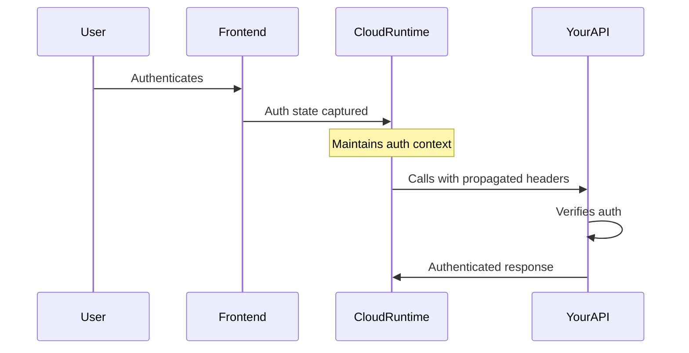

# Direct to LLM Integration

CopilotKit implementation guide for Direct to LLM.

## Guidance
### Authenticated Actions
- Route: `/direct-to-llm/guides/authenticated-actions`
- Source: `docs/content/docs/integrations/direct-to-llm/guides/authenticated-actions.mdx`

## Introduction

Copilot Cloud enables secure propagation of authentication state within AI conversations, allowing your copilot to interact with authenticated backend services and tools on behalf of the user.

This feature is only available with [Copilot Cloud](https://cloud.copilotkit.ai/).

## Overview

When building AI copilots that interact with user-specific data or services (like calendars, emails, or custom APIs), you need to ensure that:

1. The user is properly authenticated
2. The authentication state is securely propagated to backend tools
3. The copilot maintains proper authorization context

## How It Works

### Authentication Flow

1. Your frontend app configures authentication state using `authConfig_c`
2. When a user authenticates, their auth state (headers, metadata) is securely captured
3. Copilot Cloud Runtime maintains this auth context throughout the conversation
4. When the LLM or runloop needs to call your registered endpoints/tools:
   - All auth headers are automatically propagated
   - Your endpoints receive the same auth context
   - Tools can verify user identity and permissions

### Example Scenario



This means your backend tools and APIs:

- Receive the same authentication headers as your frontend
- Can verify user identity and permissions
- Maintain security context throughout the AI interaction
- Don't need additional auth handling specific to CopilotKit

## Frontend Implementation

### Configure Authentication State

```tsx
import { CopilotKit } from "@copilotkit/react-core";

interface AuthState {
  status: "authenticated" | "unauthenticated";
  authHeaders: Record<string, string>;
  userId?: string;
  metadata?: Record<string, any>;
}

// Your SignInComponent component
function SignInComponent({
  onSignInComplete,
}: {
  onSignInComplete: (authState: AuthState) => void;
}) {
  const handleAuth = async () => {
    // Your auth logic (e.g., OAuth, custom auth)
    const authState = {
      status: "authenticated",
      authHeaders: {
        Authorization: "Bearer your_token",
        // Add any other headers needed by your backend
      },
      userId: "user_123",
      metadata: {
        email: "user@example.com",
        // Any other user context needed by tools
      },
    };

    onAuthComplete(authState);
  };

  return <button onClick={handleAuth}>Authenticate</button>;
}

// Root configuration
export default function App() {
  return (
    <CopilotKit
      publicApiKey={process.env.COPILOTKIT_PUBLIC_API_KEY}
      authConfig_c={{
        SignInComponent,
      }}
    >
      {/* Your app */}
    </CopilotKit>
  );
}
```

## Backend Integration

Your backend endpoints will receive the authentication context automatically. Example of a tool endpoint:

```typescript
// Example backend endpoint
async function handleCalendarRequest(req, res) {
  // Auth headers from the frontend are automatically available
  const authHeader = req.headers.authorization;
  const userId = req.headers["x-user-id"];

  // Verify authentication as you normally would
  if (!isValidAuth(authHeader)) {
    return res.status(401).json({ error: "Unauthorized" });
  }

  // Proceed with authenticated operation
  const calendar = await getCalendarForUser(userId);
  return res.json(calendar);
}
```

## Best Practices

1. **Authentication Headers**

   - Include all necessary auth tokens
   - Add relevant user context
   - Consider token expiration
   - Handle refresh tokens if needed

2. **Backend Security**

   - Always verify auth headers
   - Implement proper validation
   - Use secure token verification
   - Handle expired tokens gracefully

3. **Error Handling**
   - Provide clear auth errors
   - Handle token refresh scenarios
   - Implement proper fallbacks
   - Give helpful user feedback

### LangChain.js
- Route: `/direct-to-llm/guides/backend-actions/langchain-js-backend-actions`
- Source: `docs/content/docs/integrations/direct-to-llm/guides/backend-actions/langchain-js-backend-actions.mdx`
- Description: Integrate LangChain JS chains as backend actions in your CopilotKit application.

### Find your CopilotRuntime

The starting point for this section is the `CopilotRuntime` you set up during quickstart (the CopilotKit backend endpoint).
For a refresher, see [Self-Hosting](/guides/self-hosting) (or alternatively, revisit the [quickstart](/quickstart)).

**First, find your `CopilotRuntime` instance in your code.** You can simply search your codebase for `CopilotRuntime`.

If you followed the quickstart, it'll be where you set up the `/api/copilotkit` endpoint.

### Integrate LangChain JS actions with CopilotRuntime

CopilotKit allows actions to return not only values but also LangChain streams. This means you can call LangChain chains directly and return their streams as part of your backend actions. Here's how to implement LangChain JS backend actions:

**Note** that `actions` is not merely an array of actions, but an array **generator**.
This generator takes `properties` and `url` as input.

This means you can **customize which backend actions are made available** according to the current frontend URL, as well as custom properties you can pass from the frontend.

```tsx title="/api/copilotkit/route.ts"
import { ChatOpenAI } from "@langchain/openai";
import { ChatPromptTemplate } from "@langchain/core/prompts";

const runtime = new CopilotRuntime({
  // ... existing configuration
  actions: ({properties, url}) => {
    // Note that actions returns not an array, but an array **generator**.
    // You can use the input parameters to the actions generator to expose different backend actions to the Copilot at different times: 
    // `url` is the current URL on the frontend application.
    // `properties` contains custom properties you can pass from the frontend application.

    return [
      {
        name: "generateJokeForTopic",
        description: "Generates a joke for a given topic.",
        parameters: [
          {
            name: "topic",
            type: "string",
            description: "The topic to generate a joke about.",
            required: true,
          },
        ],
        handler: async ({topic}: {topic: string}) => {
          const prompt = ChatPromptTemplate.fromMessages([
            [
              "system",
              "You are a witty comedian. Generate a short, funny joke about the given topic. But make it sound like a pirate joke!",
            ],
            ["user", "Topic: {topic}"],
          ]);
          const chain = prompt.pipe(new ChatOpenAI());
          // [!code highlight:3]
          return chain.stream({ // return directly chain.stream
            topic: topic,
          });
        },
      },
    ]
  }
});

// ... rest of your route definition
```

### Test your implementation

After adding the LangChain JS action, test it by asking the copilot to generate a joke about a specific topic. Observe how it uses the LangChain components to generate and stream the response.

### Remote Endpoint (LangGraph Platform)
- Route: `/direct-to-llm/guides/backend-actions/langgraph-platform-endpoint`
- Source: `docs/content/docs/integrations/direct-to-llm/guides/backend-actions/langgraph-platform-endpoint.mdx`
- Description: Connect your CopilotKit application to an agent deployed on LangGraph Platform.

This guide assumes you've created a LangGraph agent, and have a
  `langgraph.json` file set up. If you need a quick introduction, check out
  [this brief example from the LangGraph
  docs](https://docs.langchain.com/oss/python/langgraph/overview) or follow one of our demos.
## Deploy a Graph to LangGraph Platform

    ### Deploy your agent

    First, you need to host your agent so that CopilotKit can access it.

    For local development, you can use the [LangGraph CLI](https://docs.langchain.com/langsmith/cli) to start a development server and LangGraph studio session.

      You will need a [LangSmith account](https://smith.langchain.com) to use this method.

      **Python agents only**: If you encounter a "No checkpointer set" error, prefix your command with `LANGGRAPH_API=true`:

```bash
      LANGGRAPH_API=true langgraph dev --host localhost --port 8000
```

      This tells your agent to run without a custom checkpointer, relying on LangGraph's built-in state management instead.

```bash
    # For Python 3.11 or above
    langgraph dev --host localhost --port 8000
```

```bash
    # For TypeScript with Node 18 or above
    npx @langchain/langgraph-cli dev --host localhost --port 8000
```

    After starting the LangGraph server, the deployment URL will be `http://localhost:8000`.

            If you cannot run the `langgraph dev` command, or encounter any issues with it, try this one instead:
            `uvx --refresh --from "langgraph-cli[inmem]" --with-editable . --python 3.12 langgraph dev`
          Python agents automatically detect their runtime environment, but sometimes need explicit guidance:

          - **With `langgraph dev`**: Set `LANGGRAPH_API=true` to disable custom checkpointer
          - **With local FastAPI**: Don't set this flag; uses MemorySaver automatically
          - **JavaScript agents**: Not affected by this issue

      This method is currently only supported for Python LangGraph agents.

    1. Add a `.env` file to contain your LangSmith API key.

```plaintext title=".env"
    LANGSMITH_API_KEY=your_langsmith_api_key
```

    2. Next, use CopilotKit's FastAPI integration to serve your LangGraph agent.

```python title="server.py"
    import os
    from fastapi import FastAPI
    import uvicorn
    from copilotkit import LangGraphAGUIAgent # [!code highlight]
    from ag_ui_langgraph import add_langgraph_fastapi_endpoint # [!code highlight]
    from sample_agent.agent import graph # the coagents-starter path, replace this if its different # [!code highlight]

    from dotenv import load_dotenv
    load_dotenv()

    app = FastAPI()
    # [!code highlight:9]
    add_langgraph_fastapi_endpoint(
      app=app,
      agent=LangGraphAGUIAgent(
        name="sample_agent", # the name of your agent defined in langgraph.json
        description="Describe your agent here, will be used for multi-agent orchestration",
        graph=graph, # the graph object from your langgraph import
      ),
      path="/your-agent-path", # the endpoint you'd like to serve your agent on
    )

    # add new route for health check
    @app.get("/health")
    def health():
        """Health check."""
        return {"status": "ok"}

    def main():
        """Run the uvicorn server."""
        port = int(os.getenv("PORT", "8000"))
        uvicorn.run(
            "sample_agent.demo:app", # the path to your FastAPI file, replace this if its different
            host="0.0.0.0",
            port=port,
            reload=True,
        )

```

    For production, you can deploy to LangGraph Platform by following the official [LangGraph Platform deployment guide](https://docs.langchain.com/langsmith/cloud).

    Come back with that URL and a LangSmith API key before proceeding.

      A successful deployment will yield an API URL (often referred to here as "deployment URL").
      In LangGraph Platform, it will look like this: `https://{project-identifiers}.langgraph.app`.

    ### Set up your Copilot Runtime

            If you followed the [Copilot Cloud Quickstart](/direct-to-llm/guides/quickstart) and opted to use CopilotCloud,
            you only need to add your LangGraph Platform deployment URL and LangSmith API key to your CopilotCloud.

                    Copilot Cloud hooks into your CopilotKit provider, so you'll need to set it up first if you haven't already.

The [``](/reference/v1/components/CopilotKit) provider must wrap the Copilot-aware parts of your application.
For most use-cases, it's appropriate to wrap the `CopilotKit` provider around the entire app, e.g. in your `layout.tsx`

  Note that you can add the `` provider anywhere in your application. In fact, you can have multiple `` providers per app if you want independent copilots.

```tsx title="layout.tsx" showLineNumbers
import "./globals.css";

import { ReactNode } from "react";
import { CopilotKit } from "@copilotkit/react-core"; // [!code highlight]

export default function RootLayout({ children }: { children: ReactNode }) {
    return (
      <html lang="en">
        <body>
          {/* Use the public api key you got from Copilot Cloud  */}
          {/* [!code highlight:3] */}
          <CopilotKit publicApiKey="<your-copilot-cloud-public-api-key>">
            {children}
          </CopilotKit>
        </body>
      </html>
    );
}
```

To connect to LangGraph agents through Copilot Cloud, we leverage a concept called "Remote Endpoints"
which allow CopilotKit runtime to connect to various backends.

Navigate to cloud.copilotkit.ai and follow the video!

You'll need a LangSmith API key which you can get with [this guide](https://docs.smith.langchain.com/administration/how_to_guides/organization_management/create_account_api_key#create-an-api-key) on LangSmith's website.

    If you're using a local deployment from LangGraph Studio, you'll need to open a tunnel to your LangGraph Studio deployment URL.

```bash
    npx copilotkit@latest dev --port <port_number>
```

🎉 You should now see your LangGraph agent in the list of available agents in CopilotKit!
                    ### Find your CopilotRuntime

The starting point for this section is the `CopilotRuntime` you set up during quickstart (the CopilotKit backend endpoint).
For a refresher, see [Self-Hosting](/guides/self-hosting) (or alternatively, revisit the [quickstart](/quickstart)).

**First, find your `CopilotRuntime` instance in your code.** You can simply search your codebase for `CopilotRuntime`.

If you followed the quickstart, it'll be where you set up the `/api/copilotkit` endpoint.

                    Update the `CopilotRuntime` config to include the `agents` property:

```tsx
                    import {
                        CopilotRuntime,
                        LangGraphAgent  // [!code highlight]
                        // ...
                    } from "@copilotkit/runtime";

                    const runtime = new CopilotRuntime({
                        // ...existing configuration
                        // [!code highlight:8]
                        agents: {
                            // New agent entry per agent you wish to use
                            'my-agent': new LangGraphAgent({
                                deploymentUrl: '<your-api-url>',
                                graphId: '<my-agent>',
                                langsmithApiKey: '<your-langsmith-api-key>' // Optional
                            }),
                        },
                    });
```

        ### Test Your Implementation

        The graph and interactions can viewed in [LangGraph Studio](https://smith.langchain.com/studio) and any logs should be available on [LangSmith](https://smith.langchain.com)

---

## Authentication

For production deployments, you'll want to implement proper authentication to ensure users can only access their own data and threads. CopilotKit supports passing user authentication tokens to your LangGraph Platform agents.

  Learn how to implement secure authentication with your LangGraph agents using the code examples below.

### Quick Example

Pass authentication tokens through the `properties` prop:

```tsx
<CopilotKit
  runtimeUrl="/api/copilotkit"
  properties={{
    authorization: userToken, // Gets forwarded to LangGraph Platform
  }}
>
  <YourApp />
</CopilotKit>
```

Your LangGraph agent can then access the authentication context:

```python
def authenticate_user(state, config):
    auth_header = config.get("configurable", {}).get("authorization")
    user_info = validate_jwt_token(auth_header)
    # Use user_info to control access and permissions
    return state
```

---

## Troubleshooting

A few things to try if you are running into trouble:

1. Make sure that you listed your agents according to the graphs mentioned in the `langgraph.json` file
2. Make sure the agent names are the same between the agent Python implementation, the `langgraph.json` file and the remote endpoint declaration
3. Make sure the LangGraph Platform deployment has all environment variables listed as you need them to be, according to your agent implementation
4. **Authentication issues**: If you're having trouble with authentication, check that you're passing the `authorization` token in the `properties` prop and that your agent is properly validating it. See the authentication guide (see code examples above) for details.

### LangServe actions
- Route: `/direct-to-llm/guides/backend-actions/langserve-backend-actions`
- Source: `docs/content/docs/integrations/direct-to-llm/guides/backend-actions/langserve-backend-actions.mdx`
- Description: Connect your CopilotKit application to LangChain chains hosted as separate services using LangServe.

### Find your CopilotRuntime

The starting point for this section is the `CopilotRuntime` you set up during quickstart (the CopilotKit backend endpoint).
For a refresher, see [Self-Hosting](/guides/self-hosting) (or alternatively, revisit the [quickstart](/quickstart)).

**First, find your `CopilotRuntime` instance in your code.** You can simply search your codebase for `CopilotRuntime`.

If you followed the quickstart, it'll be where you set up the `/api/copilotkit` endpoint.

### Modify CopilotRuntime to include LangServe integration

Once you've located your `CopilotRuntime`, you can add LangServe integration by returning an array of LangServe function sources in the `langserve` property.

**Note that the input and output types of the chain will be automatically fetched from LangServe -- no need to specify them manually!**

Here's how to implement LangServe integration:

```tsx title="/api/copilotkit/route.ts"
const runtime = new CopilotRuntime({
  // ... existing configuration
  // [!code highlight:7]
  langserve: [
    {
      chainUrl: "http://my-langserve.chain",
      name: "performResearch",
      description: "Performs research on a given topic.",
    },
  ],
});

// ... rest of your route definition
```

### Test your implementation

After adding the LangServe integration, test it by asking the copilot to perform research on a topic. Observe how it connects to the external LangServe chain and returns the results.

### Remote Endpoint (Python)
- Route: `/direct-to-llm/guides/backend-actions/remote-backend-endpoint`
- Source: `docs/content/docs/integrations/direct-to-llm/guides/backend-actions/remote-backend-endpoint.mdx`
- Description: Connect your CopilotKit application to a remote backend endpoint, allowing integration with Python-based services or other non-Node.js backends.

## Stand up a FastAPI server using the CopilotKit Python SDK

### Install CopilotKit Python SDK and Dependencies

To integrate a Python backend with your CopilotKit application, set up your project and install the necessary dependencies by choosing your dependency management solution below.

    #### Initialize a New Poetry Project

    Run the following command to create and initialize a new Poetry project:

```bash
    poetry new My-CopilotKit-Remote-Endpoint
```

    Follow the prompts to set up your `pyproject.toml`.

    #### Install Dependencies

    After initializing the project, install the dependencies:

```bash
    poetry add copilotkit fastapi uvicorn
    # or including support for crewai
    poetry add copilotkit[crewai] fastapi uvicorn
```

    #### Set Up a Virtual Environment (optional)

    Create and activate a virtual environment using `venv`:

```bash
    python3 -m venv venv
    source venv/bin/activate
```

    #### Install Dependencies

    With the virtual environment activated, install the dependencies:

```bash
    pip install copilotkit fastapi uvicorn --extra-index-url https://copilotkit.gateway.scarf.sh/simple/
    # or including support for crewai
    pip install copilotkit[crewai] fastapi uvicorn --extra-index-url https://copilotkit.gateway.scarf.sh/simple/
```

    #### Create a New Conda Environment

    Create and activate a new Conda environment:

```bash
    conda create -n your_env_name python=3.8
    conda activate your_env_name
```

    #### Install Dependencies

    With the Conda environment activated, install the dependencies:

```bash
    conda install copilotkit fastapi uvicorn -c copilotkit-channel
    # or including support for crewai
    conda install copilotkit[crewai] fastapi uvicorn -c copilotkit-channel
```

**Dependencies:**

- **copilotkit**: The CopilotKit Python SDK.
- **fastapi**: A modern, fast (high-performance) web framework for building APIs with Python.
- **uvicorn**: A lightning-fast ASGI server for Python.

### Set Up a FastAPI Server

Create a new Python file `/my_copilotkit_remote_endpoint/server.py` and set up a FastAPI server:

```python title="/my_copilotkit_remote_endpoint/server.py"
from fastapi import FastAPI

app = FastAPI()
```

### Define Your Backend Actions

Import the CopilotKit SDK and define your backend actions. For example:

```python title="/my_copilotkit_remote_endpoint/server.py"
from fastapi import FastAPI
from copilotkit.integrations.fastapi import add_fastapi_endpoint
from copilotkit import CopilotKitRemoteEndpoint, Action as CopilotAction

app = FastAPI()

# Define your backend action
async def fetch_name_for_user_id(userId: str):
    # Replace with your database logic
    return {"name": "User_" + userId}

# this is a dummy action for demonstration purposes
action = CopilotAction(
    name="fetchNameForUserId",
    description="Fetches user name from the database for a given ID.",
    parameters=[
        {
            "name": "userId",
            "type": "string",
            "description": "The ID of the user to fetch data for.",
            "required": True,
        }
    ],
    handler=fetch_name_for_user_id
)

# Initialize the CopilotKit SDK
sdk = CopilotKitRemoteEndpoint(actions=[action]) # [!code highlight]

# Add the CopilotKit endpoint to your FastAPI app
add_fastapi_endpoint(app, sdk, "/copilotkit_remote") # [!code highlight]

def main():
    """Run the uvicorn server."""
    import uvicorn
    uvicorn.run("server:app", host="0.0.0.0", port=8000, reload=True)

if __name__ == "__main__":
    main()
```

### Run Your FastAPI Server

Since we've added the entry point in `server.py`, you can run your FastAPI server directly by executing the script:

```bash
        poetry run python3 server.py
```
```bash
        python3 server.py
```
```bash
        python3 server.py
```

**Note:** Ensure that you're in the same directory as `server.py` when running this command.

## Connect your app to the remote endpoint

Now that you've set up your FastAPI server with the backend actions, integrate it into your CopilotKit application by modifying your `CopilotRuntime` configuration.

To connect a FastAPI server to Copilot Cloud, we leverage a concept called "Remote Endpoints"
which allow CopilotKit runtime to connect to various backends.

To get started, navigate to Copilot Cloud.

Just skip the tunnel setup and use your hosted FastAPI server address instead.

```sh
npx copilotkit@latest dev --port <port_number>
```

You should now see your CopilotKit runtime in the list of available agents in CopilotKit!
                ### Find your CopilotRuntime

The starting point for this section is the `CopilotRuntime` you set up during quickstart (the CopilotKit backend endpoint).
For a refresher, see [Self-Hosting](/guides/self-hosting) (or alternatively, revisit the [quickstart](/quickstart)).

**First, find your `CopilotRuntime` instance in your code.** You can simply search your codebase for `CopilotRuntime`.

If you followed the quickstart, it'll be where you set up the `/api/copilotkit` endpoint.

                Update the `CopilotRuntime` to include your new `remote endpoint`.

```tsx
                const runtime = new CopilotRuntime({
                    // ...existing configuration
                    // [!code highlight:3]
                    remoteEndpoints: [
                        { url: "http://localhost:8000/copilotkit_remote" },
                    ],
                });
```

        ## Troubleshooting

        A few things to try if you are running into trouble:

        1. Make sure there is no other local application server running on the 8000 port.
        2. Under `/agent/my_agent/demo.py`, change host from `0.0.0.0` to `127.0.0.1` or to `localhost`

### Test Your Implementation

After setting up the remote endpoint and modifying your `CopilotRuntime`, you can test your implementation by asking the copilot to perform actions that invoke your Python backend. For example, ask the copilot: "Fetch the name for user ID `123`."

### Advanced

#### Configuring the Thread Pool Executor

The request to the remote endpoint is made in a thread pool executor. You can configure the size of the thread pool executor by passing the `max_workers` parameter to the `add_fastapi_endpoint` function.

```python
add_fastapi_endpoint(app, sdk, "/copilotkit_remote", max_workers=10) # default is 10
```

#### Dynamically returning actions and agents

Both the `actions` and `agents` parameters can optionally be functions that return a list of actions or agents. This allows you to dynamically return actions and agents based on the user's request.

For example, to dynamically configure an agent based on properties from the frontend, set the properties on the frontend first:

```tsx
<CopilotKit properties={{someProperty: "xyz"}}>
   <YourApp />
</CopilotKit>
```

Then, in your backend, use a function to return dynamically configured agents:

```python
def build_agents(context):
    return [
        LangGraphAgent(
            name="some_agent",
            description="This agent does something",
            graph=graph,
            langgraph_config={
                "some_property": context["properties"]["someProperty"]
            }
        )
    ]

app = FastAPI()
sdk = CopilotKitRemoteEndpoint(
    agents=build_agents,
)
```

---

### TypeScript (Node.js)
- Route: `/direct-to-llm/guides/backend-actions/typescript-backend-actions`
- Source: `docs/content/docs/integrations/direct-to-llm/guides/backend-actions/typescript-backend-actions.mdx`
- Description: Implement native backend actions using TypeScript or Node.js in CopilotKit.

### Find your CopilotRuntime

The starting point for this section is the `CopilotRuntime` you set up during quickstart (the CopilotKit backend endpoint).
For a refresher, see [Self-Hosting](/guides/self-hosting) (or alternatively, revisit the [quickstart](/quickstart)).

**First, find your `CopilotRuntime` instance in your code.** You can simply search your codebase for `CopilotRuntime`.

If you followed the quickstart, it'll be where you set up the `/api/copilotkit` endpoint.

### Modify CopilotRuntime to include TypeScript/Node.js actions

Once you've located your `CopilotRuntime`, you can add TypeScript/Node.js actions by modifying its configuration. Here's how to implement native backend actions:

**Note** that `actions` is not merely an array of actions, but an array **generator**.
This generator takes `properties` and `url` as input.

This means you can **customize which backend actions are made available** according to the current frontend URL, as well as custom properties you can pass from the frontend.

```tsx title="/api/copilotkit/route.ts"
const runtime = new CopilotRuntime({
  // ... existing configuration
  actions: ({properties, url}) => {
    // Note that actions returns not an array, but an array **generator**.
    // You can use the input parameters to the actions generator to expose different backend actions to the Copilot at different times: 
    // `url` is the current URL on the frontend application.
    // `properties` contains custom properties you can pass from the frontend application.

    return [
      {
        name: "fetchNameForUserId",
        description: "Fetches user name from the database for a given ID.",
        parameters: [
          {
            name: "userId",
            type: "string",
            description: "The ID of the user to fetch data for.",
            required: true,
          },
        ],
        handler: async ({userId}: {userId: string}) => {
          // do something with the userId
          // return the user data
          return {
            name: "Darth Doe",
          };
        },
      },
    ]
  }
});

// ... rest of your route definition
```

### Test your implementation

After adding the action, test it by asking the copilot to perform the task. Observe how it selects the correct task, executes it, and streams back relevant responses.

## Key Points

- Each action is defined with a name, description, parameters, and a handler function.
- The handler function implements the actual logic of the action and can interact with your backend systems.

By using this method, you can create powerful, context-aware backend actions that integrate seamlessly with your CopilotKit application.

### Backend Actions & Agents
- Route: `/direct-to-llm/guides/backend-actions_old`
- Source: `docs/content/docs/integrations/direct-to-llm/guides/backend-actions_old.mdx`
- Description: Learn how to enable your Copilot to take actions in the backend.

### Find your CopilotRuntime

The starting point for backend actions is the `CopilotRuntime` you setup during quickstart (the CopilotKit backend endpoint).
For a refresher, see [Self-Hosting](./self-hosting) (or alternatively, revisit the [quickstart](/direct-to-llm/guides/quickstart)).

Backend actions can return (and stream) values -- which will be piped back to the Copilot system and which may result in additional agentic action.

### Integrate your backend actions

**They can be mixed-and-matched as desired.**

  When you initialize the `CopilotRuntime`, you can provide backend actions in the same format as frontend Copilot actions.

  **Note that `actions` is not merely an array of actions, but rather a _generator_ of actions.**
  This generator takes `properties` and `url` as input -- which means you can customize which backend actions are made available according to the current frontend URL,
  as well as custom properties you can pass from the frontend.

```tsx title="/api/copilotkit/route.ts"
    const runtime = new CopilotRuntime({
      actions: ({properties, url}) => {
        // You can use the input parameters to the actions generator to expose different backend actions to the Copilot at different times: 
        // `url` is the current URL on the frontend application.
        // `properties` contains custom properties you can pass from the frontend application.

        return [
          {
            name: "fetchNameForUserId",
            description: "Fetches user name from the database for a given ID.",
            parameters: [
              {
                name: "userId",
                type: "string",
                description: "The ID of the user to fetch data for.",
                required: true,
              },
            ],
            handler: async ({userId}: {userId: string}) => {
              // do something with the userId
              // return the user data
              return {
                name: "Darth Doe",
              };
            },
          },
        ]
      }
    });

    // ... define the route using the CopilotRuntime.
```

  The backend action interface also supports LangChain JS natively.
  Simply return chain.stream and the results will be piped back to the Copilot.

```tsx title="/api/copilotkit/route.ts"
    import { ChatOpenAI } from "@langchain/openai";
    import { ChatPromptTemplate } from "@langchain/core/prompts";

    const runtime = new CopilotRuntime({
      actions: ({properties, url}) => {
        return [
          {
            name: "generateJokeForTopic",
            description: "Generates a joke for a given topic.",
            parameters: [
              {
                name: "topic",
                type: "string",
                description: "The topic to generate a joke about.",
                required: true,
              },
            ],
            handler: async ({topic}: {topic: string}) => {
              const prompt = ChatPromptTemplate.fromMessages([
                [
                  "system",
                  "You are a witty comedian. Generate a short, funny joke about the given topic. But make it sound like a pirate joke!",
                ],
                ["user", "Topic: {topic}"],
              ]);
              const chain = prompt.pipe(new ChatOpenAI());
              return chain.stream({
                topic: topic,
              });
            },
          },
        ]
      }
    });
```

    LangServe allows you to integrate LangChain chains hosted as separate services into your CopilotKit application.
    You can easily connect to existing chains, whether they're written in Python or JavaScript.

```tsx title="/api/copilotkit/route.ts"
    const runtime = new CopilotRuntime({
      langserve: [
        {
          chainUrl: "http://my-langserve.chain",
          name: "performResearch",
          description: "Performs research on a given topic.",
        },
      ],
    });

    // ... define the route using the CopilotRuntime.
```

    Remote actions allow you to integrate external services or APIs into your CopilotKit application.
    Any service that conforms to the Open-Source CopilotKit backend protocol can be served here.

    We provide a Python backend SDK which includes support for [LangGraph-powered CoAgents!](/langgraph).
    For instructions how to set it up, see [here]().

```tsx title="/api/copilotkit/route.ts"
    const runtime = new CopilotRuntime({
      remoteEndpoints: [
        {
          url: `${BASE_URL}/copilotkit`,
        },
      ],
    });

    // ... define the route using the CopilotRuntime.
```

### Test it out!
After defining the action, ask the copilot to perform the task. Watch it select the correct task, execute it, and stream back relevant responses.

### Bring Your Own LLM
- Route: `/direct-to-llm/guides/bring-your-own-llm`
- Source: `docs/content/docs/integrations/direct-to-llm/guides/bring-your-own-llm.mdx`
- Description: Learn how to use any LLM with CopilotKit.

LLM Adapters are responsible for executing the request with the LLM and standardizing the request/response format in a way that the Copilot Runtime can understand.

Currently, we support the following LLM adapters natively:

- [OpenAI Adapter (Azure also supported)](/reference/v1/classes/llm-adapters/OpenAIAdapter)
- [OpenAI Assistant Adapter](/reference/v1/classes/llm-adapters/OpenAIAssistantAdapter)
- [LangChain Adapter](/reference/v1/classes/llm-adapters/LangChainAdapter)
- [Groq Adapter](/reference/v1/classes/llm-adapters/GroqAdapter)
- [Google Generative AI Adapter](/reference/v1/classes/llm-adapters/GoogleGenerativeAIAdapter)
- [Anthropic Adapter](/reference/v1/classes/llm-adapters/AnthropicAdapter)

  You can use the [LangChain
  Adapter](/reference/v1/classes/llm-adapters/LangChainAdapter) to use any LLM
  provider we don't yet natively support!

  It's not too hard to write your own LLM adapter from scratch -- see the
  existing adapters for inspiration. And of course, we would love a
  contribution! ⭐️

  Configure the used LLM adapter [on your Copilot Cloud dashboard](https://cloud.copilotkit.ai/)!

    ## Find your CopilotRuntime instance
    ### Find your CopilotRuntime

The starting point for this section is the `CopilotRuntime` you set up during quickstart (the CopilotKit backend endpoint).
For a refresher, see [Self-Hosting](/guides/self-hosting) (or alternatively, revisit the [quickstart](/quickstart)).

**First, find your `CopilotRuntime` instance in your code.** You can simply search your codebase for `CopilotRuntime`.

If you followed the quickstart, it'll be where you set up the `/api/copilotkit` endpoint.

    ## Modify the used LLM Adapter

    Use the example code below to tailor your CopilotRuntime instantiation to your desired llm adapter.

  If you are planning to use a single LangGraph agent in agent-lock mode as your agentic backend, your LLM adapter will only be used for peripherals such as suggestions, etc.

If you are not sure yet, simply ignore this note.

            The LangChain adapter shown here is using OpenAI, but can be used with any LLM!

            Be aware that the empty adapter only works in combination with CoAgents in agent lock mode!

            In addition, bare in mind that `useCopilotChatSuggestions`, `CopilotTextarea` and `CopilotTask` will not work, as these require an LLM.

        ### Install provider package

```npm
        npm install {{packageName}}
```

        ### Add your API key

        Next, add your API key to your `.env` file in the root of your project (unless you prefer to provide it directly to the client):

```plaintext title=".env"
        {{envVarName}}=your_api_key_here
```

        ### Add your API key

        Next, add your API key to your `.env` file in the root of your project (unless you prefer to provide it directly to the client):

```plaintext title=".env"
        {{envVarSecret}}=your_secret_key_here
        {{envVarAccess}}=your_access_key_here
        {{envVarToken}}=your_session_token_here
```

            Please note that the code below uses GPT-4o, which requires a paid OpenAI API key. **If you are using a free OpenAI API key**, change the model to a different option such as `gpt-3.5-turbo`.

    ### Setup the Runtime Endpoint

        ### Serverless Function Timeouts

        When deploying to serverless platforms (Vercel, AWS Lambda, etc.), be aware that default function timeouts may be too short for CopilotKit's streaming responses:

        - Vercel defaults: 10s (Hobby), 15s (Pro)
        - AWS Lambda default: 3s

        **Solution options:**
        1. Increase function timeout:
```json
            // vercel.json
            {
              "functions": {
                "api/copilotkit/**/*": {
                  "maxDuration": 60
                }
              }
            }
```
        2. Use [Copilot Cloud](https://cloud.copilotkit.ai/) to avoid timeout issues entirely

        { value: 'Next.js App Router', icon:  },
        { value: 'Next.js Pages Router', icon:  },
        { value: 'Node.js Express', icon:  },
        { value: 'Node.js HTTP', icon:  },
        { value: 'NestJS', icon:  }
    ]}>

            Create a new route to handle the `/api/copilotkit` endpoint.

```ts title="app/api/copilotkit/route.ts"
            import {
              CopilotRuntime,
              {{adapterImport}},
              copilotRuntimeNextJSAppRouterEndpoint,
            } from '@copilotkit/runtime';
            {{extraImports}}
            import { NextRequest } from 'next/server';

            {{clientSetup}}
            {{adapterSetup}}
            const runtime = new CopilotRuntime();

            export const POST = async (req: NextRequest) => {
              const { handleRequest } = copilotRuntimeNextJSAppRouterEndpoint({
                runtime,
                serviceAdapter,
                endpoint: '/api/copilotkit',
              });

              return handleRequest(req);
            };
```

            Your Copilot Runtime endpoint should be available at `http://localhost:3000/api/copilotkit`.

            Create a new route to handle the `/api/copilotkit` endpoint:

```ts title="pages/api/copilotkit.ts"
            import { NextApiRequest, NextApiResponse } from 'next';
            import {
              CopilotRuntime,
              {{adapterImport}},
              copilotRuntimeNextJSPagesRouterEndpoint,
            } from '@copilotkit/runtime';
            {{extraImports}}

            {{clientSetup}}
            {{adapterSetup}}

            const handler = async (req: NextApiRequest, res: NextApiResponse) => {
              const runtime = new CopilotRuntime();

              const handleRequest = copilotRuntimeNextJSPagesRouterEndpoint({
                endpoint: '/api/copilotkit',
                runtime,
                serviceAdapter,
              });

              return await handleRequest(req, res);
            };

            export default handler;
```

            Your Copilot Runtime endpoint should be available at `http://localhost:3000/api/copilotkit`.

            Create a new Express.js app and set up the Copilot Runtime handler:

```ts title="server.ts"
            import express from 'express';
            import {
              CopilotRuntime,
              {{adapterImport}},
              copilotRuntimeNodeHttpEndpoint,
            } from '@copilotkit/runtime';
            {{extraImports}}

            const app = express();
            {{clientSetup}}
            {{adapterSetup}}

            app.use('/copilotkit', (req, res, next) => {
              (async () => {
                const runtime = new CopilotRuntime();
                const handler = copilotRuntimeNodeHttpEndpoint({
                  endpoint: '/copilotkit',
                  runtime,
                  serviceAdapter,
                });

                return handler(req, res);
              })().catch(next);
            });

            app.listen(4000, () => {
              console.log('Listening at http://localhost:4000/copilotkit');
            });
```

            Your Copilot Runtime endpoint should be available at `http://localhost:4000/copilotkit`.

                Remember to point your `runtimeUrl` to the correct endpoint in your client-side code, e.g. `http://localhost:PORT/copilotkit`.

            Set up a simple Node.js HTTP server and use the Copilot Runtime to handle requests:

```ts title="server.ts"
            import { createServer } from 'node:http';
            import {
              CopilotRuntime,
              {{adapterImport}},
              copilotRuntimeNodeHttpEndpoint,
            } from '@copilotkit/runtime';
            {{extraImports}}

            {{clientSetup}}
            {{adapterSetup}}

            const server = createServer((req, res) => {
              const runtime = new CopilotRuntime();
              const handler = copilotRuntimeNodeHttpEndpoint({
                endpoint: '/copilotkit',
                runtime,
                serviceAdapter,
              });

              return handler(req, res);
            });

            server.listen(4000, () => {
              console.log('Listening at http://localhost:4000/copilotkit');
            });
```

            Your Copilot Runtime endpoint should be available at `http://localhost:4000/copilotkit`.

                Remember to point your `runtimeUrl` to the correct endpoint in your client-side code, e.g. `http://localhost:PORT/copilotkit`.

            Set up a controller in NestJS to handle the Copilot Runtime endpoint:

```ts title="copilotkit.controller.ts"
            import { All, Controller, Req, Res } from '@nestjs/common';
            import { CopilotRuntime, copilotRuntimeNestEndpoint, {{adapterImport}} } from '@copilotkit/runtime';
            import { Request, Response } from 'express';

            @Controller()
            export class CopilotKitController {
              @All('/copilotkit')
              copilotkit(@Req() req: Request, @Res() res: Response) {
                {{adapterSetup}}
                const runtime = new CopilotRuntime();

                const handler = copilotRuntimeNestEndpoint({
                  runtime,
                  serviceAdapter,
                  endpoint: '/copilotkit',
                });
                return handler(req, res);
              }
            }
```

            Your Copilot Runtime endpoint should be available at `http://localhost:3000/copilotkit`.

                Remember to point your `runtimeUrl` to the correct endpoint in your client-side code, e.g. `http://localhost:PORT/copilotkit`.

    ## Make further customizations
    See the reference documentation linked above for further customization parameters.

### Backend Data
- Route: `/direct-to-llm/guides/connect-your-data/backend`
- Source: `docs/content/docs/integrations/direct-to-llm/guides/connect-your-data/backend.mdx`
- Description: Learn how to connect your data to CopilotKit.

## Backend Readable State
CopilotKit allows you to define actions on the backend that can be called by your Copilot. Behind the scenes, this is securely binding
the action as a tool to your LLM of choice.

When you ask the LLM to retrieve the data, it will do so by securely calling the backend action.

  For more information about backend actions, see the [Backend Action](../backend-actions) guides.

```tsx title="/api/copilotkit/route.ts"
const runtime = new CopilotRuntime({
  actions: ({properties, url}) => {
    // You can use the input parameters to the actions generator to expose different backend actions to the Copilot at different times: 
    // `url` is the current URL on the frontend application.
    // `properties` contains custom properties you can pass from the frontend application.

    return [
      {
        name: "fetchNameForUserId",
        description: "Fetches user name from the database for a given ID.",
        parameters: [
          {
            name: "userId",
            type: "string",
            description: "The ID of the user to fetch data for.",
            required: true,
          },
        ],
        handler: async ({userId}: {userId: string}) => {
          // do something with the userId
          // return the user data
          const simulateDatabaseCall = async (userId: string) => { return { name: "Darth Doe" } }
          return await simulateDatabaseCall(userId)
        },
      },
    ]
  }
});
```

## Knowledge Bases (Enterprise)

Additional plug-and-play integrations with knowledge bases are available via our enterprise plan.

Please [reach out](mailto:hello@copilotkit.ai) to enable it.

### Frontend Data
- Route: `/direct-to-llm/guides/connect-your-data/frontend`
- Source: `docs/content/docs/integrations/direct-to-llm/guides/connect-your-data/frontend.mdx`
- Description: Learn how to connect your data to CopilotKit.

For your copilot to best answer your users' needs, you will want to provide it with **context-specific**, **user-specific**, and oftentimes **realtime** data. CopilotKit makes it easy to do so.

    ### Add the data to the Copilot

    The [`useCopilotReadable` hook](/reference/v1/hooks/useCopilotReadable) is used to add data as context to the Copilot.

```tsx title="YourComponent.tsx" showLineNumbers {1, 7-10}
    "use client" // only necessary if you are using Next.js with the App Router. // [!code highlight]
    import { useCopilotReadable } from "@copilotkit/react-core"; // [!code highlight]
    import { useState } from 'react';

    export function YourComponent() {
      // Create colleagues state with some sample data
      const [colleagues, setColleagues] = useState([
        { id: 1, name: "John Doe", role: "Developer" },
        { id: 2, name: "Jane Smith", role: "Designer" },
        { id: 3, name: "Bob Wilson", role: "Product Manager" }
      ]);

      // Define Copilot readable state
      // [!code highlight:4]
      useCopilotReadable({
        description: "The current user's colleagues",
        value: colleagues,
      });
      return (
        // Your custom UI component
        <>...</>
      );
    }
```

    ### Specify `"use client"` (Next.js App Router)

  This is only necessary if you are using Next.js with the App Router.

```tsx title="YourComponent.tsx"
"use client"
```

Like other React hooks such as `useState` and `useEffect`, this is a **client-side** hook.
If you're using Next.js with the App Router, you'll need to add the `"use client"` directive at the top of any file using this hook.

    ### Test it out!

    The data you provided is now available to the Copilot.
    Test it out by passing some data in the hook and asking the copilot questions about it.

### Connecting Your Data
- Route: `/direct-to-llm/guides/connect-your-data`
- Source: `docs/content/docs/integrations/direct-to-llm/guides/connect-your-data/index.mdx`
- Description: Learn how to connect your data to CopilotKit.

CopilotKit allows you to connect your data through the frontend and through the backend. This enables
a variety of use-cases from simple context to RAG-based LLM interactions.

### Copilot Suggestions
- Route: `/direct-to-llm/guides/copilot-suggestions`
- Source: `docs/content/docs/integrations/direct-to-llm/guides/copilot-suggestions.mdx`
- Description: Learn how to auto-generate suggestions in the chat window based on real time application state.

useCopilotChatSuggestions is experimental. The interface is not final and can
  change without notice.

[`useCopilotChatSuggestions`](/reference/v1/hooks/useCopilotChatSuggestions) is a React hook that generates suggestions in the chat window based on real time application state.

### Simple Usage

```tsx
import { useCopilotChatSuggestions } from "@copilotkit/react-ui"; // [!code highlight]

export function MyComponent() {
  // [!code highlight:8]
  useCopilotChatSuggestions(
    {
      instructions: "Suggest the most relevant next actions.",
      minSuggestions: 1,
      maxSuggestions: 2,
    },
    [relevantState],
  );
}
```

### Dependency Management

```tsx
import { useCopilotChatSuggestions } from "@copilotkit/react-ui";

export function MyComponent() {
  useCopilotChatSuggestions(
    {
      instructions: "Suggest the most relevant next actions.",
      minSuggestions: 1,
      maxSuggestions: 2,
    },
    [relevantState], // [!code highlight]
  );
}
```

In the example above, the suggestions are generated based on the given instructions.
The hook monitors `relevantState`, and updates suggestions accordingly whenever it changes.

  ### Specify `"use client"` (Next.js App Router)

  This is only necessary if you are using Next.js with the App Router.

```tsx title="YourComponent.tsx"
"use client"
```

Like other React hooks such as `useState` and `useEffect`, this is a **client-side** hook.
If you're using Next.js with the App Router, you'll need to add the `"use client"` directive at the top of any file using this hook.

## Next Steps

- Check out [how to customize the suggestions look](/guides/custom-look-and-feel/bring-your-own-components#suggestions).
- Check out the [useCopilotChatSuggestions reference](/reference/v1/hooks/useCopilotChatSuggestions) for more details.

### Copilot Textarea
- Route: `/direct-to-llm/guides/copilot-textarea`
- Source: `docs/content/docs/integrations/direct-to-llm/guides/copilot-textarea.mdx`
- Description: Learn how to use the Copilot Textarea for AI-powered autosuggestions.

`` is a React component that acts as a drop-in replacement for the standard ``,
 offering enhanced autocomplete features powered by AI. It is context-aware, integrating seamlessly with the
[`useCopilotReadable`](/reference/v1/hooks/useCopilotReadable) hook to provide intelligent suggestions based on the application context.

In addition, it provides a hovering editor window (available by default via `Cmd + K` on Mac and `Ctrl + K` on Windows) that allows the user to
suggest changes to the text, for example providing a summary or rephrasing the text.

  This guide assumes you have completed the [quickstart](/direct-to-llm/guides/quickstart) and have successfully set up CopilotKit.

### Install `@copilotkit/react-textarea`

```npm
npm install @copilotkit/react-textarea
```
### Import Styles
Import the default styles in your root component (typically `layout.tsx`) :

```tsx title="layout.tsx"
import "@copilotkit/react-textarea/styles.css";
```
### Add `CopilotTextarea` to Your Component
Below you can find several examples showing how to use the `CopilotTextarea` component in your application.

```tsx title="TextAreaComponent.tsx"
    import { FC, useState } from "react";
    import { CopilotTextarea } from '@copilotkit/react-textarea';

    const ExampleComponent: FC = () => {
      const [text, setText] = useState<string>('');

      return (
        <CopilotTextarea // [!code highlight]
          className="w-full p-4 border border-gray-300 rounded-md"
          value={text}
          onValueChange={setText}
          // [!code highlight:4]
          autosuggestionsConfig={{
            textareaPurpose: "the body of an email message",
            chatApiConfigs: {},
          }}
        />
      );
    };
```
```tsx title="TextAreaComponent.tsx"
    import { FC, useState } from "react";
    import { CopilotTextarea } from "@copilotkit/react-textarea";

    const TextAreaComponent: FC = () => {
      const [text, setText] = useState<string>("");

      return (
        <CopilotTextarea // [!code highlight]
          // standard textarea args
          className="w-full p-4 border border-gray-300 rounded-md"
          value={text}
          onValueChange={setText}
          placeholder="Start typing..."

          // ai-specific configs
          // [!code highlight:9]
          autosuggestionsConfig={{
            textareaPurpose: "Write your message here",
            chatApiConfigs: {
              suggestionsApiConfig: {
                maxTokens: 50,
                stop: ["\n", ".", "?"],
              },
            },
          }}
        />
      );
    };
```

## Next Steps

- We highly recommend that you check out our simple [Copilot Textarea Tutorial](/direct-to-llm/tutorials/ai-powered-textarea/overview).
- Check out the full [CopilotTextarea reference](/reference/v1/components/CopilotTextarea)

### Customize AI Behavior
- Route: `/direct-to-llm/guides/custom-ai-assistant-behavior`
- Source: `docs/content/docs/integrations/direct-to-llm/guides/custom-ai-assistant-behavior.mdx`
- Description: Learn how to customize the behavior of your AI assistant.

There are three main ways to customize the behavior of your AI assistant:
- [Appending to the prompt](#appending-to-the-prompt-recommended)
- [Passing the `instructions` parameter](#passing-the-instructions-parameter)
- [Overwriting the default `makeSystemMessage`](#overwriting-the-default-makesystemmessage-not-recommended)

## Appending to the prompt (Recommended)
CopilotKit provides the [useCopilotAdditionalInstructions](/reference/v1/hooks/useCopilotAdditionalInstructions) hook which allows you to add content to the prompt with whatever
you want.

```tsx title="Home.tsx"
import { CopilotKit, useCopilotAdditionalInstructions } from "@copilotkit/react-core";
import { CopilotPopup } from "@copilotkit/react-ui"

function Chat() {
  useCopilotAdditionalInstructions({
    instructions: "Do not answer questions about the weather.",
  });
  return <CopilotPopup />
}

export function Home() {
  return (
    <CopilotKit>
      <Chat />
    </CopilotKit>
  )
}
```

You can even conditionally add instructions based on the application's state.

```tsx title="Home.tsx"
function Chat() {
  const [showWeather, setShowWeather] = useState(false);

  useCopilotAdditionalInstructions({
    instructions: "Do not answer questions about the weather.",
    available: showWeather ? "enabled" : "disabled"
  }, showWeather);
}
```

## Advanced

If appending to the prompt is not enough, you have some other options, specifically around updating the prompt directly.

### Passing the `instructions` parameter

The `instructions` parameter is the recommended way to customize AI assistant behavior. It will remain compatible with performance optimizations to the CopilotKit platform.

It can be customized for **Copilot UI** as well as **programmatically**:

    Copilot UI components accept an `instructions` property:

```tsx title="CustomCopilot.tsx"
    import { CopilotChat } from "@copilotkit/react-ui";

    <CopilotChat
      instructions="You are a helpful assistant specializing in tax preparation. Provide concise and accurate answers to tax-related questions." // [!code highlight]
      labels={{
        title: "Tax Preparation Assistant",
        initial: "How can I help you with your tax preparation today?",
      }}
    />
```

    The `instructions` parameter can also be set programmatically via `setChatInstructions` method, coming from `useCopilotContext`, allowing for dynamic customization based on the application's state or user interactions.

```tsx title="Home.tsx"
    import { useEffect } from 'react';
    import { useCopilotContext } from "@copilotkit/react-core";

    const Home: React.FC = () => {
      // [!code highlight:5]
      const { setChatInstructions } = useCopilotContext();

      useEffect(() => {
        setChatInstructions("You are assisting the user as best as you can. Answer in the best way possible given the data you have.");
      }, [setChatInstructions]);

      return <>{/* Your components */}</>;
    };
```

### Overwriting the default system message

For cases requiring complete control over the system message, you can use the `makeSystemMessage` function. We highly recommend reading CopilotKit's default system message before deciding to overwrite it, which can be found [here](https://github.com/CopilotKit/CopilotKit/blob/e48a34a66bb4dfd210e93dc41eee7d0f22d1a0c4/packages/v1/react-core/src/hooks/use-copilot-chat.ts#L240-L258).

This approach is **not recommended** as it may interfere with more advanced optimizations made by CopilotKit. **Only use this approach if the other options are not enough.**

```tsx filename="CustomCopilot.tsx" showLineNumbers {10}
    import { CopilotChat } from "@copilotkit/react-ui";

    const CustomCopilot: React.FC = () => (
      <CopilotChat
        instructions="You are a knowledgeable tax preparation assistant. Provide accurate and concise answers to tax-related questions, guiding users through the tax filing process."
        labels={{
          title: "Tax Preparation Assistant",
          initial: "How can I assist you with your taxes today?",
        }}
        makeSystemMessage={myCustomTaxSystemMessage} // [!code highlight]
      />
    );
```

```tsx filename="CustomCopilotHeadless.tsx" showLineNumbers {4, 6}
    import { useCopilotChat } from "@copilotkit/react-core";

    const CustomCopilotHeadless: React.FC = () => {
      // [!code highlight:4]
      const chat = useCopilotChat({
        // ...
        makeSystemMessage: myCustomMakeSystemMessage,
      });

      return (
        <div>
          {/* Render your custom UI using visibleMessages */}
        </div>
      );
    };
```

### Custom Sub-Components
- Route: `/direct-to-llm/guides/custom-look-and-feel/bring-your-own-components`
- Source: `docs/content/docs/integrations/direct-to-llm/guides/custom-look-and-feel/bring-your-own-components.mdx`

```tsx
import { type UserMessageProps } from "@copilotkit/react-ui";
import { CopilotKit } from "@copilotkit/react-core";
import { CopilotSidebar } from "@copilotkit/react-ui";
import "@copilotkit/react-ui/styles.css";

const CustomUserMessage = (props: UserMessageProps) => {
  const wrapperStyles = "flex items-center gap-2 justify-end mb-4";
  const messageStyles = "bg-blue-500 text-white py-2 px-4 rounded-xl break-words flex-shrink-0 max-w-[80%]";
  const avatarStyles = "bg-blue-500 shadow-sm min-h-10 min-w-10 rounded-full text-white flex items-center justify-center";

  return (
    <div className={wrapperStyles}>
      <div className={messageStyles}>{props.message?.content}</div>
      <div className={avatarStyles}>TS</div>
    </div>
  );
};

<CopilotKit>
  <CopilotSidebar UserMessage={CustomUserMessage} />
</CopilotKit>
```
```tsx
import { type AssistantMessageProps } from "@copilotkit/react-ui";
import { useChatContext } from "@copilotkit/react-ui";
import { Markdown } from "@copilotkit/react-ui";
import { SparklesIcon } from "@heroicons/react/24/outline";

import { CopilotKit } from "@copilotkit/react-core";
import { CopilotSidebar } from "@copilotkit/react-ui";
import "@copilotkit/react-ui/styles.css";

const CustomAssistantMessage = (props: AssistantMessageProps) => {
  const { icons } = useChatContext();
  const { message, isLoading, subComponent } = props;

  const avatarStyles = "bg-zinc-400 border-zinc-500 shadow-lg min-h-10 min-w-10 rounded-full text-white flex items-center justify-center";
  const messageStyles = "px-4 rounded-xl pt-2";

  const avatar = <div className={avatarStyles}><SparklesIcon className="h-6 w-6" /></div>

  // [!code highlight:12]
  return (
    <div className="py-2">
      <div className="flex items-start">
        {!subComponent && avatar}
        <div className={messageStyles}>
          {message && <Markdown content={message.content || ""} /> }
          {isLoading && icons.spinnerIcon}
        </div>
      </div>
      <div className="my-2">{subComponent}</div>
    </div>
  );
};

<CopilotKit>
  <CopilotSidebar AssistantMessage={CustomAssistantMessage} />
</CopilotKit>
```
```tsx
import { type WindowProps, useChatContext, CopilotSidebar } from "@copilotkit/react-ui";
import { CopilotKit } from "@copilotkit/react-core";
import "@copilotkit/react-ui/styles.css";
function Window({ children }: WindowProps) {
  const { open, setOpen } = useChatContext();

  if (!open) return null;

  // [!code highlight:15]
  return (
    <div 
      className="fixed inset-0 bg-black/50 flex items-center justify-center p-4"
      onClick={() => setOpen(false)}
    >
      <div 
        className="bg-white rounded-lg shadow-xl max-w-2xl w-full h-[80vh] overflow-auto"
        onClick={e => e.stopPropagation()}
      >
        <div className="flex flex-col h-full">
          {children}
        </div>
      </div>
    </div>
  );
};

<CopilotKit>
  <CopilotSidebar Window={Window} />
</CopilotKit>
```
```tsx
import { type ButtonProps, useChatContext, CopilotSidebar } from "@copilotkit/react-ui";
import { CopilotKit } from "@copilotkit/react-core";
import "@copilotkit/react-ui/styles.css";
function Button({}: ButtonProps) {
  const { open, setOpen } = useChatContext();

  const wrapperStyles = "w-24 bg-blue-500 text-white p-4 rounded-lg text-center cursor-pointer";

  // [!code highlight:10]
  return (
    <div onClick={() => setOpen(!open)} className={wrapperStyles}>
      <button
        className={`${open ? "open" : ""}`}
        aria-label={open ? "Close Chat" : "Open Chat"}
      >
        Ask AI
      </button>
    </div>
  );
};

<CopilotKit>
  <CopilotSidebar Button={Button} />
</CopilotKit>
```
```tsx
import { type HeaderProps, useChatContext, CopilotSidebar } from "@copilotkit/react-ui";
import { BookOpenIcon } from "@heroicons/react/24/outline";
import { CopilotKit } from "@copilotkit/react-core";
import "@copilotkit/react-ui/styles.css";
function Header({}: HeaderProps) {
  const { setOpen, icons, labels } = useChatContext();

  // [!code highlight:15]
  return (
    <div className="flex justify-between items-center p-4 bg-blue-500 text-white">
      <div className="w-24">
        <a href="/">
          <BookOpenIcon className="w-6 h-6" />
        </a>
      </div>
      <div className="text-lg">{labels.title}</div>
      <div className="w-24 flex justify-end">
        <button onClick={() => setOpen(false)} aria-label="Close">
          {icons.headerCloseIcon}
        </button>
      </div>
    </div>
  );
};

<CopilotKit>
  <CopilotSidebar Header={Header} />
</CopilotKit>
```
```tsx
import { type MessagesProps, CopilotSidebar } from "@copilotkit/react-ui";
import { CopilotKit } from "@copilotkit/react-core";
import "@copilotkit/react-ui/styles.css";

export default function CustomMessages({
  messages,
  inProgress,
  RenderMessage,
}: MessagesProps) {
  const wrapperStyles = "p-4 flex flex-col gap-2 h-full overflow-y-auto bg-indigo-300";

  // [!code highlight:14]
  return (
    <div className={wrapperStyles}>
      {messages.map((message, index) => {
        const isCurrentMessage = index === messages.length - 1;
        return <RenderMessage
          key={index}
          message={message}
          inProgress={inProgress}
          index={index}
          isCurrentMessage={isCurrentMessage}
        />
      })}
    </div>
  );
}

<CopilotKit>
  <CopilotSidebar Messages={CustomMessages} />
</CopilotKit>
```
```tsx
        import { CopilotKit } from "@copilotkit/react-core";
        import {
            CopilotSidebar,
            type CopilotChatSuggestion,
            RenderSuggestion,
            type RenderSuggestionsListProps
        } from "@copilotkit/react-ui";
        import "@copilotkit/react-ui/styles.css";

        const CustomSuggestionsList = ({ suggestions, onSuggestionClick }: RenderSuggestionsListProps) => {
            return (
                <div className="suggestions flex flex-col gap-2 p-4">
                    <h1>Try asking:</h1>
                    <div className="flex gap-2">
                        {suggestions.map((suggestion: CopilotChatSuggestion, index) => (
                            <RenderSuggestion
                            key={index}
                                      title={suggestion.title}
                                      message={suggestion.message}
                                      partial={suggestion.partial}
                                      className="rounded-md border border-gray-500 bg-white px-2 py-1 shadow-md"
                                      onClick={() => onSuggestionClick(suggestion.message)}
                            />
                        ))}
                    </div>
                </div>
            );
        };

        <CopilotKit>
            <CopilotSidebar RenderSuggestionsList={CustomSuggestionsList} />
        </CopilotKit>
```
```tsx
import { type InputProps, CopilotSidebar } from "@copilotkit/react-ui";
import { CopilotKit } from "@copilotkit/react-core";
import "@copilotkit/react-ui/styles.css";
function CustomInput({ inProgress, onSend, isVisible }: InputProps) {
  const handleSubmit = (value: string) => {
    if (value.trim()) onSend(value);
  };

  const wrapperStyle = "flex gap-2 p-4 border-t";
  const inputStyle = "flex-1 p-2 rounded-md border border-gray-300 focus:outline-none focus:border-blue-500 disabled:bg-gray-100";
  const buttonStyle = "px-4 py-2 bg-blue-500 text-white rounded-md hover:bg-blue-600 disabled:bg-gray-400 disabled:cursor-not-allowed";

  // [!code highlight:27]
  return (
    <div className={wrapperStyle}>
      <input 
        disabled={inProgress}
        type="text" 
        placeholder="Ask your question here..." 
        className={inputStyle}
        onKeyDown={(e) => {
          if (e.key === 'Enter') {
            handleSubmit(e.currentTarget.value);
            e.currentTarget.value = '';
          }
        }}
      />
      <button 
        disabled={inProgress}
        className={buttonStyle}
        onClick={(e) => {
          const input = e.currentTarget.previousElementSibling as HTMLInputElement;
          handleSubmit(input.value);
          input.value = '';
        }}
      >
        Ask
      </button>
    </div>
  );
}

<CopilotKit>
  <CopilotSidebar Input={CustomInput} />
</CopilotKit>
```
```tsx
"use client" // only necessary if you are using Next.js with the App Router.
import { useCopilotAction } from "@copilotkit/react-core"; 

// Your custom components (examples - implement these in your app)
import { LoadingView } from "./loading-view"; // Your loading component
import { CalendarMeetingCardComponent, type CalendarMeetingCardProps } from "./calendar-meeting-card"; // Your meeting card component

export function YourComponent() {
  useCopilotAction({ 
    name: "showCalendarMeeting",
    description: "Displays calendar meeting information",
    parameters: [
      {
        name: "date",
        type: "string",
        description: "Meeting date (YYYY-MM-DD)",
        required: true
      },
      {
        name: "time",
        type: "string",
        description: "Meeting time (HH:mm)",
        required: true
      },
      {
        name: "meetingName",
        type: "string",
        description: "Name of the meeting",
        required: false
      }
    ],
    render: ({ status, args }) => {
      const { date, time, meetingName } = args;

      if (status === 'inProgress') {
        return <LoadingView />; // Your own component for loading state
      } else {
        const meetingProps: CalendarMeetingCardProps = {
          date: date,
          time,
          meetingName
        };
        return <CalendarMeetingCardComponent {...meetingProps} />;
      }
    },
  });

  return (
    <>...</>
  );
}
```
```tsx
"use client"; // only necessary if you are using Next.js with the App Router.

import { useCoAgentStateRender } from "@copilotkit/react-core";
import { Progress } from "./progress";

type AgentState = {
  logs: string[];
}

useCoAgentStateRender<AgentState>({
  name: "basic_agent",
  render: ({ state, nodeName, status }) => {
    if (!state.logs || state.logs.length === 0) {
      return null;
    }

    // Progress is a component we are omitting from this example for brevity.
    return <Progress logs={state.logs} />; 
  },
});
```
```tsx
import {
  type CopilotChatReasoningMessageProps,
} from "@copilotkit/react-ui";
import { CopilotKit } from "@copilotkit/react-core";
import { CopilotSidebar } from "@copilotkit/react-ui";
import "@copilotkit/react-ui/styles.css";

function CustomReasoningMessage({
  message,
  messages,
  isRunning,
}: CopilotChatReasoningMessageProps) {
  const isLatest = messages?.[messages.length - 1]?.id === message.id;
  const isStreaming = !!(isRunning && isLatest);

  if (!message.content && !isStreaming) return null;

  // [!code highlight:8]
  return (
    <details open={isStreaming} className="my-2 rounded border p-3">
      <summary className="cursor-pointer font-medium text-sm">
        {isStreaming ? "🧠 Thinking…" : "💡 View reasoning"}
      </summary>
      <p className="mt-2 text-sm text-gray-600 whitespace-pre-wrap">
        {message.content}
      </p>
    </details>
  );
}

<CopilotKit>
  <CopilotSidebar
    messageView={{
      reasoningMessage: CustomReasoningMessage,
    }}
  />
</CopilotKit>
```

### Styling Copilot UI
- Route: `/direct-to-llm/guides/custom-look-and-feel/customize-built-in-ui-components`
- Source: `docs/content/docs/integrations/direct-to-llm/guides/custom-look-and-feel/customize-built-in-ui-components.mdx`

CopilotKit has a variety of ways to customize colors and structures of the Copilot UI components.
- [CSS Variables](#css-variables-easiest)
- [Custom CSS](#custom-css)
- [Custom Icons](#custom-icons)
- [Custom Labels](#custom-labels)

If you want to customize the style as well as the functionality of the Copilot UI, you can also try the following:
- [Custom Sub-Components](/custom-look-and-feel/bring-your-own-components)
- [Fully Headless UI](/custom-look-and-feel/headless-ui)

## CSS Variables (Easiest)
The easiest way to change the colors using in the Copilot UI components is to override CopilotKit CSS variables.

  Hover over the interactive UI elements below to see the available CSS variables.

Once you've found the right variable, you can import `CopilotKitCSSProperties` and simply wrap CopilotKit in a div and override the CSS variables.

```tsx
import { CopilotKitCSSProperties } from "@copilotkit/react-ui";

<div
  // [!code highlight:5]
  style={
    {
      "--copilot-kit-primary-color": "#222222",
    } as CopilotKitCSSProperties
  }
>
  <CopilotSidebar .../>
</div>
```

### Reference

| CSS Variable | Description |
|-------------|-------------|
| `--copilot-kit-primary-color` | Main brand/action color - used for buttons, interactive elements |
| `--copilot-kit-contrast-color` | Color that contrasts with primary - used for text on primary elements |
| `--copilot-kit-background-color` | Main page/container background color |
| `--copilot-kit-secondary-color` | Secondary background - used for cards, panels, elevated surfaces |
| `--copilot-kit-secondary-contrast-color` | Primary text color for main content |
| `--copilot-kit-separator-color` | Border color for dividers and containers |
| `--copilot-kit-muted-color` | Muted color for disabled/inactive states |

## Custom CSS

In addition to customizing the colors, the CopilotKit CSS is structured to easily allow customization via CSS classes.

```css title="globals.css"
.copilotKitButton {
  border-radius: 0;
}

.copilotKitMessages {
  padding: 2rem;
}

.copilotKitUserMessage {
  background: #007AFF;
}
```

### Reference

For a full list of styles and classes used in CopilotKit, click [here](https://github.com/CopilotKit/CopilotKit/blob/main/src/v1.x/packages/react-ui/src/css/).

| CSS Class | Description |
|-----------|-------------|
| `.copilotKitMessages` | Main container for all chat messages with scroll behavior and spacing |
| `.copilotKitInput` | Text input container with typing area and send button |
| `.copilotKitUserMessage` | Styling for user messages including background, text color and bubble shape |
| `.copilotKitAssistantMessage` | Styling for AI responses including background, text color and bubble shape |
| `.copilotKitHeader` | Top bar of chat window containing title and controls |
| `.copilotKitButton` | Primary chat toggle button with hover and active states |
| `.copilotKitWindow` | Root container defining overall chat window dimensions and position |
| `.copilotKitMarkdown` | Styles for rendered markdown content including lists, links and quotes |
| `.copilotKitCodeBlock` | Code snippet container with syntax highlighting and copy button |
| `.copilotKitChat` | Base chat layout container handling positioning and dimensions |
| `.copilotKitSidebar` | Styles for sidebar chat mode including width and animations |
| `.copilotKitPopup` | Styles for popup chat mode including position and animations |
| `.copilotKitButtonIcon` | Icon styling within the main chat toggle button |
| `.copilotKitButtonIconOpen` `.copilotKitButtonIconClose` | Icon states for when chat is open/closed |
| `.copilotKitCodeBlockToolbar` | Top bar of code blocks with language and copy controls |
| `.copilotKitCodeBlockToolbarLanguage` | Language label styling in code block toolbar |
| `.copilotKitCodeBlockToolbarButtons` | Container for code block action buttons |
| `.copilotKitCodeBlockToolbarButton` | Individual button styling in code block toolbar |
| `.copilotKitSidebarContentWrapper` | Inner container for sidebar mode content |
| `.copilotKitInputControls` | Container for input area buttons and controls |
| `.copilotKitActivityDot1` `.copilotKitActivityDot2` `.copilotKitActivityDot3` | Animated typing indicator dots |
| `.copilotKitDevConsole` | Development debugging console container |
| `.copilotKitDevConsoleWarnOutdated` | Warning styles for outdated dev console |
| `.copilotKitVersionInfo` | Version information display styles |
| `.copilotKitDebugMenuButton` | Debug menu toggle button styling |
| `.copilotKitDebugMenu` | Debug options menu container |
| `.copilotKitDebugMenuItem` | Individual debug menu option styling |

## Custom Fonts
You can customize the fonts by updating the `fontFamily` property in the various CSS classes that are used in the CopilotKit.

```css title="globals.css"
.copilotKitMessages {
  font-family: "Arial, sans-serif";
}

.copilotKitInput {
  font-family: "Arial, sans-serif";
}
```

### Reference
You can update the main content classes to change the font family for the various components.

| CSS Class | Description |
|-----------|-------------|
| `.copilotKitMessages` | Main container for all messages |
| `.copilotKitInput` | The input field |
| `.copilotKitMessage` | Base styling for all chat messages |
| `.copilotKitUserMessage` | User messages |
| `.copilotKitAssistantMessage` | AI responses |

## Custom Icons

You can customize the icons by passing the `icons` property to the `CopilotSidebar`, `CopilotPopup` or `CopilotChat` component.

```tsx
<CopilotChat
  icons={{
    // Use your own icons here – any React nodes
    openIcon: <YourOpenIconComponent />,
    closeIcon: <YourCloseIconComponent />,
  }}
/>
```

### Reference

| Icon | Description |
|--------------|-------------|
| `openIcon` | The icon to use for the open chat button |
| `closeIcon` | The icon to use for the close chat button |
| `headerCloseIcon` | The icon to use for the close chat button in the header |
| `sendIcon` | The icon to use for the send button |
| `activityIcon` | The icon to use for the activity indicator |
| `spinnerIcon` | The icon to use for the spinner |
| `stopIcon` | The icon to use for the stop button |
| `regenerateIcon` | The icon to use for the regenerate button |
| `pushToTalkIcon` | The icon to use for push to talk |

## Custom Labels

To customize labels, pass the `labels` property to the `CopilotSidebar`, `CopilotPopup` or `CopilotChat` component.

```tsx
<CopilotChat
  labels={{
    initial: "Hello! How can I help you today?",
    title: "My Copilot",
    placeholder: "Ask me anything!",
    stopGenerating: "Stop",
    regenerateResponse: "Regenerate",
  }} 
/>
```

### Reference

| Label | Description |
|---------------|-------------|
| `initial` | The initial message(s) to display in the chat window |
| `title` | The title to display in the header |
| `placeholder` | The placeholder to display in the input |
| `stopGenerating` | The label to display on the stop button |
| `regenerateResponse` | The label to display on the regenerate button |

### Fully Headless UI
- Route: `/direct-to-llm/guides/custom-look-and-feel/headless-ui`
- Source: `docs/content/docs/integrations/direct-to-llm/guides/custom-look-and-feel/headless-ui.mdx`
- Description: Fully customize your Copilot's UI from the ground up using headless UI

```bash
    npx copilotkit@latest create
```
```bash
    open README.md
```
```tsx title="src/app/layout.tsx"
    <CopilotKit
      publicLicenseKey="your-free-public-license-key"
    >
      {children}
    </CopilotKit>
```
```tsx title="src/app/page.tsx"
    "use client";
    import { useState } from "react";
    import { useCopilotChatHeadless_c } from "@copilotkit/react-core"; // [!code highlight]

    export default function Home() {
      const { messages, sendMessage, isLoading } = useCopilotChatHeadless_c(); // [!code highlight]
      const [input, setInput] = useState("");

      const handleSend = () => {
        if (input.trim()) {
          // [!code highlight:5]
          sendMessage({
            id: Date.now().toString(),
            role: "user",
            content: input,
          });
          setInput("");
        }
      };

      return (
        <div>
          <h1>My Headless Chat</h1>

          {/* Messages */}
          <div>
            {/* [!code highlight:6] */}
            {messages.map((message) => (
              <div key={message.id}>
                <strong>{message.role === "user" ? "You" : "Assistant"}:</strong>
                <p>{message.content}</p>
              </div>
            ))}

            {/* [!code highlight:1] */}
            {isLoading && <p>Assistant is typing...</p>}
          </div>

          {/* Input */}
          <div>
            <input
              type="text"
              value={input}
              onChange={(e) => setInput(e.target.value)}
              // [!code highlight:1]
              onKeyDown={(e) => e.key === "Enter" && handleSend()}
              placeholder="Type your message here..."
            />
            {/* [!code highlight:1] */}
            <button onClick={handleSend} disabled={isLoading}>
              Send
            </button>
          </div>
        </div>
      );
    }
```
```tsx title="src/app/components/chat.tsx"
import { useCopilotAction } from "@copilotkit/react-core";

export const Chat = () => {
  // ...

  // Define an action that will show a custom component
  useCopilotAction({
    name: "showCustomComponent",
    // Handle the tool on the frontend
    // [!code highlight:3]
    handler: () => {
      return "Foo, Bar, Baz";
    },
    // Render a custom component for the underlying data
    // [!code highlight:13]
    render: ({ result, args, status}) => {
      return <div style={{
        backgroundColor: "red",
        padding: "10px",
        borderRadius: "5px",
      }}>
        <p>Custom component</p>
        <p>Result: {result}</p>
        <p>Args: {JSON.stringify(args)}</p>
        <p>Status: {status}</p>
      </div>;
    }
  });

  // ...

  return <div>
    {messages.map((message) => (
      <p key={message.id}>
        {message.role === "user" ? "User: " : "Assistant: "}
        {message.content}
        {/* Render the generative UI if it exists */}
        {/* [!code highlight:1] */}
        {message.role === "assistant" && message.generativeUI?.()}
      </p>
    ))}
  </div>
};
```
```tsx title="src/app/components/chat.tsx"
export const Chat = () => {
  // ...

  return <div>
    {messages.map((message) => (
      <p key={message.id}>
        {/* Render the tool calls if they exist */}
        {/* [!code highlight:5] */}
        {message.role === "assistant" && message.toolCalls?.map((toolCall) => (
          <p key={toolCall.id}>
            {toolCall.function.name}: {toolCall.function.arguments}
          </p>
        ))}
      </p>
    ))}
  </div>
};
```
```tsx title="src/app/components/chat.tsx"
import { useCopilotChatHeadless_c, useCopilotChatSuggestions } from "@copilotkit/react-core"; // [!code highlight]

export const Chat = () => {
  // Specify what suggestions should be generated
  // [!code highlight:5]
  useCopilotChatSuggestions({
    instructions:
      "Suggest 5 interesting activities for programmers to do on their next vacation",
    maxSuggestions: 5,
  });

  // Grab relevant state from the headless hook
  const { suggestions, generateSuggestions, sendMessage } = useCopilotChatHeadless_c(); // [!code highlight]

  // Generate suggestions when the component mounts
  useEffect(() => {
    generateSuggestions(); // [!code highlight]
  }, []);

  // ...

  // [!code word:suggestion]
  return <div>
    {suggestions.map((suggestion, index) => (
      <button
        key={index}
        onClick={() => sendMessage({
          id: "123",
          role: "user",
          content: suggestion.message
        })}
      >
        {suggestion.title}
      </button>
    ))}
  </div>
};
```
```tsx title="src/app/components/chat.tsx"
import { useCopilotChatHeadless_c } from "@copilotkit/react-core";

export const Chat = () => {
  // Grab relevant state from the headless hook
  // [!code highlight:1]
  const { suggestions, setSuggestions } = useCopilotChatHeadless_c();

  // Set the suggestions when the component mounts
  // [!code highlight:6]
  useEffect(() => {
    setSuggestions([
      { title: "Suggestion 1", message: "The actual message for suggestion 1" },
      { title: "Suggestion 2", message: "The actual message for suggestion 2" },
    ]);
  }, []);

  // Change the suggestions on function call
  const changeSuggestions = () => {
    // [!code highlight:4]
    setSuggestions([
      { title: "Foo", message: "Bar" },
      { title: "Baz", message: "Bat" },
    ]);
  };

  // [!code word:suggestion]
  return (
    <div>
      {/* Change on button click */}
      <button onClick={changeSuggestions}>Change suggestions</button>

      {/* Render */}
      {suggestions.map((suggestion, index) => (
        <button
          key={index}
          onClick={() => sendMessage({
            id: "123",
            role: "user",
            content: suggestion.message
          })}
        >
          {suggestion.title}
        </button>
      ))}
    </div>
  );
};
```
```tsx title="src/app/components/chat.tsx"
import { useCopilotAction, useCopilotChatHeadless_c } from "@copilotkit/react-core";

export const Chat = () => {
  const { messages, sendMessage } = useCopilotChatHeadless_c();

  // Define an action that will wait for the user to enter their name
  useCopilotAction({
    name: "getName",
    renderAndWaitForResponse: ({ respond, args, status}) => {
      if (status === "complete") {
        return <div>
          <p>Name retrieved...</p>
        </div>;
      }

      return <div>
        <input
          type="text"
          value={args.name || ""}
          onChange={(e) => respond?.(e.target.value)}
          placeholder="Enter your name"
        />
        {/* Respond with the name */}
        {/* [!code highlight:1] */}
        <button onClick={() => respond?.(args.name)}>Submit</button>
      </div>;
    }
  });

  return (
    {messages.map((message) => (
      <p key={message.id}>
        {message.role === "user" ? "User: " : "Assistant: "}
        {message.content}
        {/* [!code highlight:2] */}
        {/* This will render the tool-based HITL if it exists */}
        {message.role === "assistant" && message.generativeUI?.()}
      </p>
    ))}
  )
};
```

### Markdown rendering
- Route: `/direct-to-llm/guides/custom-look-and-feel/markdown-rendering-direct-to-llm_guides_custom-look-and-feel`
- Source: `docs/content/docs/integrations/direct-to-llm/guides/custom-look-and-feel/markdown-rendering-direct-to-llm_guides_custom-look-and-feel.mdx`

```tsx
import { CopilotKit } from "@copilotkit/react-core";
import { CopilotSidebar, ComponentsMap } from "@copilotkit/react-ui";
import "@copilotkit/react-ui/styles.css";
// We will include the styles in a separate css file, for convenience
import "./styles.css";

function YourComponent() {
    const customMarkdownTagRenderers: ComponentsMap<{ "reference-chip": { href: string } }> = {
        // You can make up your own tags, or use existing, valid HTML ones!
        "reference-chip": ({ children, href }) => {
            return (
                <a
                href={href}
                target="_blank"
                rel="noopener noreferrer"
                className="w-fit border rounded-xl py-1 px-2 text-xs" // Classes list trimmed for brevity
                >
                    {children}
                    <LinkIcon className="w-3.5 h-3.5" />
                </a>
            );
        },
    };

    return (
        <CopilotKit>
          <CopilotSidebar
            // For demonstration, we'll force the LLM to return our reference chip in every message
            instructions={`
                You are a helpful assistant.
                End each message with a reference chip,
                like so: <reference-chip href={href}>{title}</reference-chip>
            `}
            markdownTagRenderers={customMarkdownTagRenderers}
          />
        </CopilotKit>
    )
}
```
```css
.reference-chip {
    display: inline-flex;
    align-items: center;
    justify-content: center;
    background-color: #f0f1f2;
    color: #444;
    border-radius: 12px;
    padding: 2px 8px;
    font-size: 0.8rem;
    font-weight: 500;
    text-decoration: none;
    margin: 0 2px;
    border: 1px solid #e0e0e0;
    cursor: pointer;
    box-shadow: 0 1px 2px rgba(0,0,0,0.05);
}
```

### Markdown rendering
- Route: `/direct-to-llm/guides/custom-look-and-feel/markdown-rendering`
- Source: `docs/content/docs/integrations/direct-to-llm/guides/custom-look-and-feel/markdown-rendering.mdx`

```tsx
import { CopilotKit } from "@copilotkit/react-core";
import { CopilotSidebar, ComponentsMap } from "@copilotkit/react-ui";
import "@copilotkit/react-ui/styles.css";
// We will include the styles in a separate css file, for convenience
import "./styles.css";

function YourComponent() {
    const customMarkdownTagRenderers: ComponentsMap<{ "reference-chip": { href: string } }> = {
        // You can make up your own tags, or use existing, valid HTML ones!
        "reference-chip": ({ children, href }) => {
            return (
                <a
                href={href}
                target="_blank"
                rel="noopener noreferrer"
                className="w-fit border rounded-xl py-1 px-2 text-xs" // Classes list trimmed for brevity
                >
                    {children}
                    <LinkIcon className="w-3.5 h-3.5" />
                </a>
            );
        },
    };

    return (
        <CopilotKit>
          <CopilotSidebar
            // For demonstration, we'll force the LLM to return our reference chip in every message
            instructions={`
                You are a helpful assistant.
                End each message with a reference chip,
                like so: <reference-chip href={href}>{title}</reference-chip>
            `}
            markdownTagRenderers={customMarkdownTagRenderers}
          />
        </CopilotKit>
    )
}
```
```css
.reference-chip {
    display: inline-flex;
    align-items: center;
    justify-content: center;
    background-color: #f0f1f2;
    color: #444;
    border-radius: 12px;
    padding: 2px 8px;
    font-size: 0.8rem;
    font-weight: 500;
    text-decoration: none;
    margin: 0 2px;
    border: 1px solid #e0e0e0;
    cursor: pointer;
    box-shadow: 0 1px 2px rgba(0,0,0,0.05);
}
```

### Frontend - Backend Action Pairing
- Route: `/direct-to-llm/guides/front-backend-action-pairing`
- Source: `docs/content/docs/integrations/direct-to-llm/guides/front-backend-action-pairing.mdx`
- Description: Learn how to react to a Backend only operation on the Frontend.

Some actions, although having UI implications, would need to be performed on a Backend  secured environment.
In order to "render UI from the Backend", it is possible to pair a Frontend only action with its Backend equivalent, so one execution follows the other.

        ### Set up a backend action

        Follow the [Backend Actions guides](./backend-actions) and set up an action on the Backend.

        For demonstration purposes, we'll assume the same action as shown in this guide:
```tsx title="/api/copilotkit/route.ts"
        const runtime = new CopilotRuntime({
        // ... existing configuration
        actions: ({properties, url}) => {
        return [
    {
        name: "fetchUser",
        description: "Fetches user name from the database for a given ID.",
        parameters: [
    {
        name: "userId",
        type: "string",
        description: "The ID of the user to fetch data for.",
        required: true,
    },
        ],
        handler: async ({userId}: {userId: string}) => {
        // do something with the userId
        // return the user data
        return {
        name: "Darth Doe",
    };
    },
    },
        ]
    }
    });

        // ... rest of your route definition
```

        ### Pair a frontend action

        On the UI layer, define a "frontend" only action which will correspond to the Backend action.
        Notice how the expected parameters match what's returned from the Backend action handler

```tsx title="YourComponent.tsx"
        "use client" // only necessary if you are using Next.js with the App Router.
        import { useCopilotAction } from "@copilotkit/react-core"; // [!code highlight]

        export function MyComponent() {
        const [userName, setUserName] = useState<string>('stranger');

        // Define Copilot action
        useCopilotAction({
        name: "displayUser", // Names of the actions match between Backend and Frontend // [!code highlight]
        description: "Display the user name fetched from the backend",
        pairedAction: "fetchUser", // Choose which backed action this is paired with // [!code highlight]
        available: "frontend", // Optional :mark it as frontend only if the FE and BE action name matches // [!code highlight]
        parameters: [
    {
        name: "name",
        type: "string",
        description: "The user name",
    },
        ],
        handler: async ({ name }) => {
        setUserName(name);
    },
    });

        return (
        <h1>
        hello {userName}
    </ul>
    );
    }
```

    ### Specify `"use client"` (Next.js App Router)

  This is only necessary if you are using Next.js with the App Router.

```tsx title="YourComponent.tsx"
"use client"
```

Like other React hooks such as `useState` and `useEffect`, this is a **client-side** hook.
If you're using Next.js with the App Router, you'll need to add the `"use client"` directive at the top of any file using this hook.

    ### Test it out!
    After adding the action, test it by asking the copilot to perform the task. Observe how it selects the correct task, executes it, and the UI action defined is reflecting the result.

## Next Steps

### Frontend Tools
- Route: `/direct-to-llm/guides/frontend-actions`
- Source: `docs/content/docs/integrations/direct-to-llm/guides/frontend-actions.mdx`
- Description: Learn how to enable your Copilot to execute tools in the frontend.

# Let the Copilot Execute Tools

### `useFrontendTool`

In addition to understanding state, you can empower the copilot to execute tools. Use the [`useFrontendTool`](/reference/v1/hooks/useFrontendTool) hook to define specific tools that the copilot can execute based on user input.

```tsx title="YourComponent.tsx"
"use client" // only necessary if you are using Next.js with the App Router. // [!code highlight]
import { useFrontendTool } from "@copilotkit/react-core"; // [!code highlight]

export function MyComponent() {
  const [todos, setTodos] = useState<string[]>([]);

  // Define Frontend Tool
  useFrontendTool({
    name: "addTodoItem",
    description: "Add a new todo item to the list",
    parameters: [
      {
        name: "todoText",
        type: "string",
        description: "The text of the todo item to add",
        required: true,
      },
    ],
    handler: async ({ todoText }) => {
      setTodos([...todos, todoText]);
    },
  });

  return (
    <ul>
      {todos.map((todo, index) => (
        <li key={index}>{todo}</li>
      ))}
    </ul>
  );
}
```

    While `useFrontendTool` is for frontend tools with handlers, CopilotKit provides other specialized hooks:
    - [`useHumanInTheLoop`](/reference/v1/hooks/useHumanInTheLoop): For interactive workflows requiring user input/approval
    - [`useRenderToolCall`](/reference/v1/hooks/useRenderToolCall): For rendering backend tool calls without handlers

    Choose the right hook based on your specific use case.

  ### Specify `"use client"` (Next.js App Router)

  This is only necessary if you are using Next.js with the App Router.

```tsx title="YourComponent.tsx"
"use client"
```

Like other React hooks such as `useState` and `useEffect`, this is a **client-side** hook.
If you're using Next.js with the App Router, you'll need to add the `"use client"` directive at the top of any file using this hook.

### Test it out!
After defining the tool, ask the copilot to execute it. For example, you can now ask the copilot to "add a todo item" with any text you want.

## Next Steps

### Generative UI
- Route: `/direct-to-llm/guides/generative-ui`
- Source: `docs/content/docs/integrations/direct-to-llm/guides/generative-ui.mdx`
- Description: Learn how to embed custom UI components in the chat window.

# Render custom components in the chat UI

When a user interacts with your Copilot, you may want to render a custom UI component. The new hooks [`useRenderToolCall`](/reference/v1/hooks/useRenderToolCall), [`useFrontendTool`](/reference/v1/hooks/useFrontendTool), and [`useHumanInTheLoop`](/reference/v1/hooks/useHumanInTheLoop) allow you to give the LLM the
option to render your custom component through the `render` property.

    [`useRenderToolCall`](/reference/v1/hooks/useRenderToolCall) can be used with a `render` function to display information or UI elements within the chat.

    Here's an example to render a calendar meeting.

```tsx
    "use client" // only necessary if you are using Next.js with the App Router. // [!code highlight]
    import { useRenderToolCall } from "@copilotkit/react-core"; // [!code highlight]

    export function YourComponent() {
      useRenderToolCall({ // [!code highlight]
        name: "showCalendarMeeting",
        description: "Displays calendar meeting information",
        parameters: [
          {
            name: "date",
            type: "string",
            description: "Meeting date (YYYY-MM-DD)",
            required: true
          },
          {
            name: "time",
            type: "string",
            description: "Meeting time (HH:mm)",
            required: true
          },
          {
            name: "meetingName",
            type: "string",
            description: "Name of the meeting",
            required: false
          }
        ],
        // [!code highlight:14]
        render: ({ status, args }) => {
          const { date, time, meetingName } = args;

          if (status === 'inProgress') {
            return <LoadingView />; // Your own component for loading state
          } else {
            const meetingProps: CalendarMeetingCardProps = {
              date: date,
              time,
              meetingName
            };
            return <CalendarMeetingCardComponent {...meetingProps} />;
          }
        },
      });

      return (
        <>...</>
      );
    }
```

    The [`useFrontendTool`](/reference/v1/hooks/useFrontendTool) hook accepts both `handler` and `render` methods. The `handler` executes the tool, while `render` displays UI in the copilot chat window.

```tsx
    "use client" // only necessary if you are using Next.js with the App Router. // [!code highlight]
    import { useFrontendTool } from "@copilotkit/react-core"; // [!code highlight]

    useFrontendTool({ // [!code highlight]
      name: "showLastMeetingOfDay",
      description: "Displays the last calendar meeting for a given day",
      parameters: [
        {
          name: "date",
          type: "string",
          description: "Date to fetch the last meeting for (YYYY-MM-DD)",
          required: true
        }
      ],
      // [!code highlight:16]
      handler: async ({ date }) => {
        // some async operation which can return a result:
        const lastMeeting = await fetchLastMeeting(new Date(date));
        return lastMeeting;
      },
      render: ({ status, result }) => {
        if (status === 'executing' || status === 'inProgress') {
          // show a loading view while the tool is executing, i.e. while the meeting is being fetched
          return <LoadingView />;
        } else if (status === 'complete') {
          // show the meeting card once the tool is complete
          return <CalendarMeetingCardComponent {...result} />;
        } else {
          return <div className="text-red-500">No meeting found</div>;
        }
      },
    });
```

    The `render` method with [`useHumanInTheLoop`](/reference/v1/hooks/useHumanInTheLoop) allows for returning values asynchronously from the render function.

    This is great for Human-in-the-Loop flows, where the AI assistant can prompt the end-user with a choice (rendered inside the chat UI),
    and the user can make the choice by pressing a button in the chat UI.

```tsx
    "use client" // only necessary if you are using Next.js with the App Router. // [!code highlight]
    import { useHumanInTheLoop } from "@copilotkit/react-core"; // [!code highlight]

    useHumanInTheLoop({ // [!code highlight]
      name: "handleMeeting",
      description: "Handle a meeting by booking or canceling",
      parameters: [
        {
          name: "meeting",
          type: "string",
          description: "The meeting to handle",
          required: true,
        },
        {
          name: "date",
          type: "string",
          description: "The date of the meeting",
          required: true,
        },
        {
          name: "title",
          type: "string",
          description: "The title of the meeting",
          required: true,
        },
      ],
      // [!code highlight:12]
      render: ({ args, respond, status }) => {
        const { meeting, date, title } = args;
        return (
          <MeetingConfirmationDialog
            meeting={meeting}
            date={date}
            title={title}
            onConfirm={() => respond?.('meeting confirmed')}
            onCancel={() => respond?.('meeting canceled')}
          />
        );
      },
    });
```

    For simple messages, you can return a string from the `render` method. This is useful for quick status updates or simple notifications.

```tsx
    "use client" // only necessary if you are using Next.js with the App Router. // [!code highlight]
    import { useFrontendTool } from "@copilotkit/react-core"; // [!code highlight]

    useFrontendTool({ // [!code highlight]
      name: "simpleTool",
      description: "A simple tool with string rendering",
      parameters: [
        {
          name: "taskName",
          type: "string",
          description: "Name of the task",
          required: true,
        },
      ],
      handler: async ({ taskName }) => {
        return await longRunningOperation(taskName);
      },
      // [!code highlight:3]
      render: ({ status, result }) => {
        return status === "complete" ? result : "Processing...";
      },
    });
```

    If you want to render tools that are not explicitly referenced in any specific hook call, you can pass `"*"` as the tool name with [`useDefaultTool`](/reference/v1/hooks/useDefaultTool).
    In this case, the render method will receive an additional `name` parameter. This is particularly useful when working with agents that may call arbitrary tools - see more in our [Tool-based Generative UI](/crewai-crews/generative-ui/tool-based) guide.

```tsx
    import { useDefaultTool, CatchAllToolRenderProps } from "@copilotkit/react-core";

    useDefaultTool({
      render: ({ name, args, status, result }: CatchAllActionRenderProps<[]>) => {
        return <div>Rendering tool: {name}</div>;
      },
    });
```

    - `inProgress`: Arguments are dynamically streamed to the function, allowing you to adjust your UI in real-time.
    - `executing`: The tool handler is executing.
    - `complete`: The tool handler has completed execution.
    ### Specify `"use client"` (Next.js App Router)

  This is only necessary if you are using Next.js with the App Router.

```tsx title="YourComponent.tsx"
"use client"
```

Like other React hooks such as `useState` and `useEffect`, this is a **client-side** hook.
If you're using Next.js with the App Router, you'll need to add the `"use client"` directive at the top of any file using this hook.

## Test it out!

After defining the tool with a render method, ask the copilot to perform the task. For example, you can now ask the copilot to "show tasks" and see the custom UI component rendered in the chat interface.

  You can read more about the tool hooks:
  - [`useRenderToolCall`](/reference/v1/hooks/useRenderToolCall) for render-only tools
  - [`useFrontendTool`](/reference/v1/hooks/useFrontendTool) for tools with handler + render
  - [`useHumanInTheLoop`](/reference/v1/hooks/useHumanInTheLoop) for human-in-the-loop tools

### Guardrails
- Route: `/direct-to-llm/guides/guardrails`
- Source: `docs/content/docs/integrations/direct-to-llm/guides/guardrails.mdx`

## Introduction

Copilot Cloud provides content moderation capabilities through the `guardrails_c` configuration, helping ensure safe and appropriate AI interactions. The system uses OpenAI's content moderation capabilities to enforce these guardrails.

This feature is only available with [Copilot Cloud](https://cloud.copilotkit.ai/).

## Implementation

```tsx
import { CopilotKit } from "@copilotkit/react-core";

export default function App() {
  return (
    <CopilotKit
      publicApiKey={process.env.COPILOTKIT_PUBLIC_API_KEY}
      guardrails_c={{
        // Topics to explicitly block
        invalidTopics: ["politics", "explicit-content", "harmful-content"],
        // Topics to explicitly allow
        validTopics: ["business", "technology", "general-assistance"],
      }}
    >
      {/* Your app */}
    </CopilotKit>
  );
}
```

### Saving and restoring messages
- Route: `/direct-to-llm/guides/messages-localstorage`
- Source: `docs/content/docs/integrations/direct-to-llm/guides/messages-localstorage.mdx`
- Description: Learn how to save and restore message history.

See [Loading Message History](/langgraph/persistence/loading-message-history) for an automated way to load the chat history.

As you're building agentic experiences, you may want to persist the user's chat history across runs.
One way to do this is through the use of `localstorage` where chat history is saved in the browser.
In this guide we demonstrate how you can store the state into `localstorage` and how it can be inserted
into the agent.

The following example shows how to save and restore your message history using `localStorage`:

```typescript
import { useCopilotMessagesContext } from "@copilotkit/react-core";
import { ActionExecutionMessage, ResultMessage, TextMessage } from "@copilotkit/runtime-client-gql";

const { messages, setMessages } = useCopilotMessagesContext();

// save to local storage when messages change
useEffect(() => {
  if (messages.length !== 0) {
    localStorage.setItem("copilotkit-messages", JSON.stringify(messages));
  }
}, [JSON.stringify(messages)]);

// initially load from local storage
useEffect(() => {
  const messages = localStorage.getItem("copilotkit-messages");
  if (messages) {
    const parsedMessages = JSON.parse(messages).map((message: any) => {
      if (message.type === "TextMessage") {
        return new TextMessage({
          id: message.id,
          role: message.role,
          content: message.content,
          createdAt: message.createdAt,
        });
      } else if (message.type === "ActionExecutionMessage") {
        return new ActionExecutionMessage({
          id: message.id,
          name: message.name,
          scope: message.scope,
          arguments: message.arguments,
          createdAt: message.createdAt,
        });
      } else if (message.type === "ResultMessage") {
        return new ResultMessage({
          id: message.id,
          actionExecutionId: message.actionExecutionId,
          actionName: message.actionName,
          result: message.result,
          createdAt: message.createdAt,
        });
      } else {
        throw new Error(`Unknown message type: ${message.type}`);
      }
    });
    setMessages(parsedMessages);
  }
}, []);
```

### Connect to MCP Servers
- Route: `/direct-to-llm/guides/model-context-protocol`
- Source: `docs/content/docs/integrations/direct-to-llm/guides/model-context-protocol.mdx`
- Description: Integrate Model Context Protocol (MCP) servers into React applications

## Introduction

The Model Context Protocol is an open standard that enables developers to build secure, two-way connections between their data sources and AI-powered tools. With MCP, you can:

- Connect AI applications to your data sources
- Enable AI tools to access and utilize your data securely
- Build AI-powered features that have context about your application

For further reading, check out the [Model Context Protocol](https://modelcontextprotocol.io/introduction) website.

## Quickstart with CopilotKit

    ### Get an MCP Server
    First, we need to make sure we have an MCP server to connect to. You can use any MCP SSE endpoint you have configured.

          Composio provides a registry of ready-to-use MCP servers with simple authentication and setup.

          To get started, go to [Composio](https://mcp.composio.dev/), find a server the suits your needs and copy the SSE URL before continuing here.

        ### Run the CLI
        Just run this following command in your Next.js application to get started!

                No problem! Just use `create-next-app` to make one quickly.
```bash
                npx create-next-app@latest
```

```bash
        npx copilotkit@latest init -m MCP
```
        #### Set up the CopilotKit Provider

        Wrap your application with the `CopilotKit` provider:

```tsx
        "use client";

        import { CopilotKit } from "@copilotkit/react-core";

        export default function App() {
          return (
            <CopilotKit publicApiKey="<replace_with_your_own>">
              {/* Your app content */}
            </CopilotKit>
          );
        }
```
        #### Connect to MCP Servers

        Create a component to manage MCP server connections:

```tsx
        "use client";

        import { useCopilotChat } from "@copilotkit/react-core";
        import { useEffect } from "react";

        function McpServerManager() {
          const { setMcpServers } = useCopilotChat();

          useEffect(() => {
            setMcpServers([
              {
                // Try a sample MCP server at https://mcp.composio.dev/
                endpoint: "your_mcp_sse_url",
              },
            ]);
          }, [setMcpServers]);

          return null;
        }

        export default McpServerManager;
```
        #### Add the Chat Interface

        Add the `CopilotChat` component to your page:

```tsx
        "use client";

        import { CopilotChat } from "@copilotkit/react-ui";
        import McpServerManager from "./McpServerManager";

        export default function ChatInterface() {
          return (
            <div className="flex h-screen p-4">
              <McpServerManager />
              <CopilotChat
                instructions="You are a helpful assistant with access to MCP servers."
                className="flex-grow rounded-lg w-full"
              />
            </div>
          );
        }
```
        #### Visualize MCP Tool Calls (Optional)

        Create a component to display MCP tool calls in your UI:

```tsx
        "use client";

        import {
          useCopilotAction,
          CatchAllActionRenderProps,
        } from "@copilotkit/react-core";
        import McpToolCall from "./McpToolCall";

        export function ToolRenderer() {
          useCopilotAction({
            /**
             * The asterisk (*) matches all tool calls
             */
            name: "*",
            render: ({ name, status, args, result }: CatchAllActionRenderProps<[]>) => (
              <McpToolCall status={status} name={name} args={args} result={result} />
            ),
          });
          return null;
        }
```
        #### Complete Implementation

        Combine all components together:

```tsx
        "use client";

        import { CopilotKit } from "@copilotkit/react-core";
        import { CopilotChat } from "@copilotkit/react-ui";
        import McpServerManager from "./McpServerManager";
        import { ToolRenderer } from "./ToolRenderer";

        export default function Page() {
          return (
            <CopilotKit publicApiKey="<replace_with_your_own>">
              <div className="flex h-screen p-4">
                <McpServerManager />
                <CopilotChat
                  instructions="You are a helpful assistant with access to MCP servers."
                  className="flex-grow rounded-lg w-full"
                />
                <ToolRenderer />
              </div>
            </CopilotKit>
          );
        }
```

## Advanced Usage

### Implementing the McpToolCall Component

```tsx
"use client";

import * as React from "react";

interface ToolCallProps {
  status: "complete" | "inProgress" | "executing";
  name?: string;
  args?: any;
  result?: any;
}

export default function MCPToolCall({
  status,
  name = "",
  args,
  result,
}: ToolCallProps) {
  const [isOpen, setIsOpen] = React.useState(false);

  // Format content for display
  const format = (content: any): string => {
    if (!content) return "";
    const text =
      typeof content === "object"
        ? JSON.stringify(content, null, 2)
        : String(content);
    return text
      .replace(/\\n/g, "\n")
      .replace(/\\t/g, "\t")
      .replace(/\\"/g, '"')
      .replace(/\\\\/g, "\\");
  };

  return (
    <div className="bg-[#1e2738] rounded-lg overflow-hidden w-full">
      <div
        className="p-3 flex items-center cursor-pointer"
        onClick={() => setIsOpen(!isOpen)}
      >
        <span className="text-white text-sm overflow-hidden text-ellipsis">
          {name || "MCP Tool Call"}
        </span>
        <div className="ml-auto">
          <div
            className={`w-2 h-2 rounded-full ${
              status === "complete"
                ? "bg-gray-300"
                : status === "inProgress" || status === "executing"
                ? "bg-gray-500 animate-pulse"
                : "bg-gray-700"
            }`}
          />
        </div>
      </div>

      {isOpen && (
        <div className="px-4 pb-4 text-gray-300 font-mono text-xs">
          {args && (
            <div className="mb-4">
              <div className="text-gray-400 mb-2">Parameters:</div>
              <pre className="whitespace-pre-wrap max-h-[200px] overflow-auto">
                {format(args)}
              </pre>
            </div>
          )}

          {status === "complete" && result && (
            <div>
              <div className="text-gray-400 mb-2">Result:</div>
              <pre className="whitespace-pre-wrap max-h-[200px] overflow-auto">
                {format(result)}
              </pre>
            </div>
          )}
        </div>
      )}
    </div>
  );
}
```

### Self-Hosting Option

  The Copilot Runtime handles communication with LLMs, message history, and
  state. You can self-host it or use{" "}
  (recommended). Learn more in our [Self-Hosting Guide](./self-hosting).

To configure your self-hosted runtime with MCP servers, you'll need to implement the `createMCPClient` function that matches this interface:

```typescript
type CreateMCPClientFunction = (
  config: MCPEndpointConfig
) => Promise<MCPClient>;
```

For detailed implementation guidance, refer to the [official MCP SDK documentation](https://github.com/modelcontextprotocol/typescript-sdk?tab=readme-ov-file#writing-mcp-clients).

Here's a basic example of configuring the runtime:

```tsx
import {
  CopilotRuntime,
  OpenAIAdapter,
  copilotRuntimeNextJSAppRouterEndpoint,
} from "@copilotkit/runtime";
import { NextRequest } from "next/server";

const serviceAdapter = new OpenAIAdapter();

const runtime = new CopilotRuntime({
  createMCPClient: async (config) => {
    // Implement your MCP client creation logic here
    // See the MCP SDK docs for implementation details
  },
});

export const POST = async (req: NextRequest) => {
  const { handleRequest } = copilotRuntimeNextJSAppRouterEndpoint({
    runtime,
    serviceAdapter,
    endpoint: "/api/copilotkit",
  });

  return handleRequest(req);
};
```

### Fully Headless UI
- Route: `/direct-to-llm/guides/premium/headless-ui`
- Source: `docs/content/docs/integrations/direct-to-llm/guides/premium/headless-ui.mdx`
- Description: Fully customize your Copilot's UI from the ground up using headless UI

```bash
    npx copilotkit@latest create
```
```bash
    open README.md
```
```tsx title="src/app/layout.tsx"
    <CopilotKit
      publicLicenseKey="your-free-public-license-key"
    >
      {children}
    </CopilotKit>
```
```tsx title="src/app/page.tsx"
    "use client";
    import { useState } from "react";
    import { useCopilotChatHeadless_c } from "@copilotkit/react-core"; // [!code highlight]

    export default function Home() {
      const { messages, sendMessage, isLoading } = useCopilotChatHeadless_c(); // [!code highlight]
      const [input, setInput] = useState("");

      const handleSend = () => {
        if (input.trim()) {
          // [!code highlight:5]
          sendMessage({
            id: Date.now().toString(),
            role: "user",
            content: input,
          });
          setInput("");
        }
      };

      return (
        <div>
          <h1>My Headless Chat</h1>

          {/* Messages */}
          <div>
            {/* [!code highlight:6] */}
            {messages.map((message) => (
              <div key={message.id}>
                <strong>{message.role === "user" ? "You" : "Assistant"}:</strong>
                <p>{message.content}</p>
              </div>
            ))}

            {/* [!code highlight:1] */}
            {isLoading && <p>Assistant is typing...</p>}
          </div>

          {/* Input */}
          <div>
            <input
              type="text"
              value={input}
              onChange={(e) => setInput(e.target.value)}
              // [!code highlight:1]
              onKeyDown={(e) => e.key === "Enter" && handleSend()}
              placeholder="Type your message here..."
            />
            {/* [!code highlight:1] */}
            <button onClick={handleSend} disabled={isLoading}>
              Send
            </button>
          </div>
        </div>
      );
    }
```
```tsx title="src/app/components/chat.tsx"
import { useCopilotAction } from "@copilotkit/react-core";

export const Chat = () => {
  // ...

  // Define an action that will show a custom component
  useCopilotAction({
    name: "showCustomComponent",
    // Handle the tool on the frontend
    // [!code highlight:3]
    handler: () => {
      return "Foo, Bar, Baz";
    },
    // Render a custom component for the underlying data
    // [!code highlight:13]
    render: ({ result, args, status}) => {
      return <div style={{
        backgroundColor: "red",
        padding: "10px",
        borderRadius: "5px",
      }}>
        <p>Custom component</p>
        <p>Result: {result}</p>
        <p>Args: {JSON.stringify(args)}</p>
        <p>Status: {status}</p>
      </div>;
    }
  });

  // ...

  return <div>
    {messages.map((message) => (
      <p key={message.id}>
        {message.role === "user" ? "User: " : "Assistant: "}
        {message.content}
        {/* Render the generative UI if it exists */}
        {/* [!code highlight:1] */}
        {message.role === "assistant" && message.generativeUI?.()}
      </p>
    ))}
  </div>
};
```
```tsx title="src/app/components/chat.tsx"
export const Chat = () => {
  // ...

  return <div>
    {messages.map((message) => (
      <p key={message.id}>
        {/* Render the tool calls if they exist */}
        {/* [!code highlight:5] */}
        {message.role === "assistant" && message.toolCalls?.map((toolCall) => (
          <p key={toolCall.id}>
            {toolCall.function.name}: {toolCall.function.arguments}
          </p>
        ))}
      </p>
    ))}
  </div>
};
```
```tsx title="src/app/components/chat.tsx"
import { useCopilotChatHeadless_c, useCopilotChatSuggestions } from "@copilotkit/react-core"; // [!code highlight]

export const Chat = () => {
  // Specify what suggestions should be generated
  // [!code highlight:5]
  useCopilotChatSuggestions({
    instructions:
      "Suggest 5 interesting activities for programmers to do on their next vacation",
    maxSuggestions: 5,
  });

  // Grab relevant state from the headless hook
  const { suggestions, generateSuggestions, sendMessage } = useCopilotChatHeadless_c(); // [!code highlight]

  // Generate suggestions when the component mounts
  useEffect(() => {
    generateSuggestions(); // [!code highlight]
  }, []);

  // ...

  // [!code word:suggestion]
  return <div>
    {suggestions.map((suggestion, index) => (
      <button
        key={index}
        onClick={() => sendMessage({
          id: "123",
          role: "user",
          content: suggestion.message
        })}
      >
        {suggestion.title}
      </button>
    ))}
  </div>
};
```
```tsx title="src/app/components/chat.tsx"
import { useCopilotChatHeadless_c } from "@copilotkit/react-core";

export const Chat = () => {
  // Grab relevant state from the headless hook
  // [!code highlight:1]
  const { suggestions, setSuggestions } = useCopilotChatHeadless_c();

  // Set the suggestions when the component mounts
  // [!code highlight:6]
  useEffect(() => {
    setSuggestions([
      { title: "Suggestion 1", message: "The actual message for suggestion 1" },
      { title: "Suggestion 2", message: "The actual message for suggestion 2" },
    ]);
  }, []);

  // Change the suggestions on function call
  const changeSuggestions = () => {
    // [!code highlight:4]
    setSuggestions([
      { title: "Foo", message: "Bar" },
      { title: "Baz", message: "Bat" },
    ]);
  };

  // [!code word:suggestion]
  return (
    <div>
      {/* Change on button click */}
      <button onClick={changeSuggestions}>Change suggestions</button>

      {/* Render */}
      {suggestions.map((suggestion, index) => (
        <button
          key={index}
          onClick={() => sendMessage({
            id: "123",
            role: "user",
            content: suggestion.message
          })}
        >
          {suggestion.title}
        </button>
      ))}
    </div>
  );
};
```
```tsx title="src/app/components/chat.tsx"
import { useCopilotAction, useCopilotChatHeadless_c } from "@copilotkit/react-core";

export const Chat = () => {
  const { messages, sendMessage } = useCopilotChatHeadless_c();

  // Define an action that will wait for the user to enter their name
  useCopilotAction({
    name: "getName",
    renderAndWaitForResponse: ({ respond, args, status}) => {
      if (status === "complete") {
        return <div>
          <p>Name retrieved...</p>
        </div>;
      }

      return <div>
        <input
          type="text"
          value={args.name || ""}
          onChange={(e) => respond?.(e.target.value)}
          placeholder="Enter your name"
        />
        {/* Respond with the name */}
        {/* [!code highlight:1] */}
        <button onClick={() => respond?.(args.name)}>Submit</button>
      </div>;
    }
  });

  return (
    {messages.map((message) => (
      <p key={message.id}>
        {message.role === "user" ? "User: " : "Assistant: "}
        {message.content}
        {/* [!code highlight:2] */}
        {/* This will render the tool-based HITL if it exists */}
        {message.role === "assistant" && message.generativeUI?.()}
      </p>
    ))}
  )
};
```

### Inspector
- Route: `/direct-to-llm/guides/premium/inspector`
- Source: `docs/content/docs/integrations/direct-to-llm/guides/premium/inspector.mdx`
- Description: Inspector for debugging actions, readables, agent status, messages, and context.

The Copilot Inspector is a debugging aid, accessible from a copilotkit button overlaid on your app, which allows you to see the information, state and conversation between them and you (the user).

  The Inspector is available to CopilotKit Premium users. Get a free public
  license key on [Copilot Cloud](https://cloud.copilotkit.ai) or read more about{" "}

## What it shows

- Actions: Registered actions and parameter schemas
- Readables: Context/readables available to the agent
- Agent Status: Coagent states and running/completion info
- Messages: Conversation history
- Context: Document context fed into the model

## Requirements

- Provide `publicLicenseKey` to `` to enable premium features:

```tsx
<CopilotKit publicLicenseKey={process.env.NEXT_PUBLIC_COPILOTKIT_LICENSE_KEY}>
  {children}
</CopilotKit>
```

## How to open

A draggable circular trigger is rendered in-app. Click to open the Inspector.
If no license key is configured, you’ll see a "Get License Key" prompt.

### Observability
- Route: `/direct-to-llm/guides/premium/observability`
- Source: `docs/content/docs/integrations/direct-to-llm/guides/premium/observability.mdx`
- Description: Monitor your CopilotKit application with comprehensive observability hooks. Understand user interactions, chat events, and system errors.

Monitor CopilotKit with first‑class observability hooks that emit structured signals for chat events, user interactions, and runtime errors. Send these signals straight to your existing stack, including Sentry, Datadog, New Relic, and OpenTelemetry, or route them to your analytics pipeline. The hooks expose stable schemas and IDs so you can join agent events with app telemetry, trace sessions end to end, and alert on failures in real time. Works with Copilot Cloud via `publicApiKey`, or self‑hosted via `publicLicenseKey`.
## Quick Start

  All observability hooks require a `publicLicenseKey` or `publicAPIkey` - Get yours free at
  [https://cloud.copilotkit.ai](https://cloud.copilotkit.ai)

### Chat Observability Hooks

Track user interactions and chat events with comprehensive observability hooks:

```tsx
import { CopilotChat } from "@copilotkit/react-ui";
import { CopilotKit } from "@copilotkit/react-core";

export default function App() {
  return (
    <CopilotKit
      publicApiKey="ck_pub_your_key" // [!code highlight] - Use publicApiKey for Copilot Cloud
      // OR
      publicLicenseKey="ck_pub_your_key" // [!code highlight] - Use publicLicenseKey for self-hosted
    >
      <CopilotChat
        observabilityHooks={{
          // [!code highlight]
          onMessageSent: (message) => {
            // [!code highlight]
            console.log("Message sent:", message);
            analytics.track("chat_message_sent", { message });
          }, // [!code highlight]
          onChatExpanded: () => {
            // [!code highlight]
            console.log("Chat opened");
            analytics.track("chat_expanded");
          }, // [!code highlight]
          onChatMinimized: () => {
            // [!code highlight]
            console.log("Chat closed");
            analytics.track("chat_minimized");
          }, // [!code highlight]
          onFeedbackGiven: (messageId, type) => {
            // [!code highlight]
            console.log("Feedback:", type, messageId);
            analytics.track("chat_feedback", { messageId, type });
          }, // [!code highlight]
        }} // [!code highlight]
      />
    </CopilotKit>
  );
}
```

### Error Observability

Monitor system errors and performance with error observability hooks:

```tsx
import { CopilotKit } from "@copilotkit/react-core";

export default function App() {
  return (
    <CopilotKit
      publicApiKey="ck_pub_your_key" // [!code highlight] - Use publicApiKey for Copilot Cloud
      // OR
      publicLicenseKey="ck_pub_your_key" // [!code highlight] - Use publicLicenseKey for self-hosted
      onError={(errorEvent) => {
        // [!code highlight]
        // Send errors to monitoring service
        console.error("CopilotKit Error:", errorEvent);

        // Example: Send to analytics
        analytics.track("copilotkit_error", {
          type: errorEvent.type,
          source: errorEvent.context.source,
          timestamp: errorEvent.timestamp,
        });
      }} // [!code highlight]
      showDevConsole={false} // Hide dev console in production
    >
      {/* Your app */}
    </CopilotKit>
  );
}
```

## Observability Features

### CopilotChat Observability Hooks

Track user interactions, chat behavior and errors with comprehensive observability hooks (requires a `publicLicenseKey` if self-hosted or `publicAPIkey` if using CopilotCloud):

```tsx
import { CopilotChat } from "@copilotkit/react-ui";

<CopilotChat
  observabilityHooks={{
    onMessageSent: (message) => {
      console.log("Message sent:", message);
      // Track message analytics
      analytics.track("chat_message_sent", { message });
    },
    onChatExpanded: () => {
      console.log("Chat opened");
      // Track engagement
      analytics.track("chat_expanded");
    },
    onChatMinimized: () => {
      console.log("Chat closed");
      // Track user behavior
      analytics.track("chat_minimized");
    },
    onMessageRegenerated: (messageId) => {
      console.log("Message regenerated:", messageId);
      // Track regeneration requests
      analytics.track("chat_message_regenerated", { messageId });
    },
    onMessageCopied: (content) => {
      console.log("Message copied:", content);
      // Track content sharing
      analytics.track("chat_message_copied", { contentLength: content.length });
    },
    onFeedbackGiven: (messageId, type) => {
      console.log("Feedback given:", messageId, type);
      // Track user feedback
      analytics.track("chat_feedback_given", { messageId, type });
    },
    onChatStarted: () => {
      console.log("Chat generation started");
      // Track when AI starts responding
      analytics.track("chat_generation_started");
    },
    onChatStopped: () => {
      console.log("Chat generation stopped");
      // Track when AI stops responding
      analytics.track("chat_generation_stopped");
    },
    onError: (errorEvent) => {
      console.log("Error occurred", errorEvent);
      // Log error
      analytics.track("error_event", errorEvent);
    },
  }}
/>;
```

**Available Observability Hooks:**

- `onMessageSent(message)` - User sends a message
- `onChatExpanded()` - Chat is opened/expanded
- `onChatMinimized()` - Chat is closed/minimized
- `onMessageRegenerated(messageId)` - Message is regenerated
- `onMessageCopied(content)` - Message is copied
- `onFeedbackGiven(messageId, type)` - Thumbs up/down feedback given
- `onChatStarted()` - Chat generation starts
- `onChatStopped()` - Chat generation stops
- `onError(errorEvent)` - Error events and system monitoring

**Requirements:**

- ✅ Requires a `publicLicenseKey` (when self-hosting) or `publicApiKey` from [Copilot Cloud](https://cloud.copilotkit.ai)
- ✅ Works with `CopilotChat`, `CopilotPopup`, `CopilotSidebar`, and all pre-built components

  **Important:** Observability hooks will **not trigger** without a valid
  key. This is a security feature to ensure observability hooks only
  work in authorized applications.

## Error Event Structure

The `onError` handler receives detailed error events with rich context:

```typescript
interface CopilotErrorEvent {
  type:
    | "error"
    | "request"
    | "response"
    | "agent_state"
    | "action"
    | "message"
    | "performance";
  timestamp: number;
  context: {
    source: "ui" | "runtime" | "agent";
    request?: {
      operation: string;
      method?: string;
      url?: string;
      startTime: number;
    };
    response?: {
      endTime: number;
      latency: number;
    };
    agent?: {
      name: string;
      nodeName?: string;
    };
    messages?: {
      input: any[];
      messageCount: number;
    };
    technical?: {
      environment: string;
      stackTrace?: string;
    };
  };
  error?: any; // Present for error events
}
```

## Common Observability Patterns

### Chat Event Tracking

```tsx
<CopilotChat
  observabilityHooks={{
    onMessageSent: (message) => {
      // Track message analytics
      analytics.track("chat_message_sent", {
        messageLength: message.length,
        timestamp: Date.now(),
        userId: getCurrentUserId(),
      });
    },
    onChatExpanded: () => {
      // Track user engagement
      analytics.track("chat_expanded", {
        timestamp: Date.now(),
        userId: getCurrentUserId(),
      });
    },
    onFeedbackGiven: (messageId, type) => {
      // Track feedback for AI improvement
      analytics.track("chat_feedback", {
        messageId,
        feedbackType: type,
        timestamp: Date.now(),
      });
    },
  }}
/>
```

### Combined Event and Error Tracking

```tsx
<CopilotKit
  publicApiKey="ck_pub_your_key" // [!code highlight] - Use publicApiKey for Copilot Cloud
  // OR
  publicLicenseKey="ck_pub_your_key" // [!code highlight] - Use publicLicenseKey for self-hosted
  onError={(errorEvent) => {
    // Error observability
    if (errorEvent.type === "error") {
      console.error("CopilotKit Error:", errorEvent);
      analytics.track("copilotkit_error", {
        error: errorEvent.error?.message,
        context: errorEvent.context,
      });
    }
  }}
>
  <CopilotChat
    observabilityHooks={{
      onMessageSent: (message) => {
        // Event tracking
        analytics.track("chat_message_sent", { message });
      },
      onChatExpanded: () => {
        analytics.track("chat_expanded");
      },
    }}
  />
</CopilotKit>
```

## Error Observability Patterns

### Basic Error Logging

```tsx
<CopilotKit
  publicApiKey="ck_pub_your_key" // [!code highlight] - Use publicApiKey for Copilot Cloud
  // OR
  publicLicenseKey="ck_pub_your_key" // [!code highlight] - Use publicLicenseKey for self-hosted
  onError={(errorEvent) => {
    console.error("[CopilotKit Error]", {
      type: errorEvent.type,
      timestamp: new Date(errorEvent.timestamp).toISOString(),
      context: errorEvent.context,
      error: errorEvent.error,
    });
  }}
>
  {/* Your app */}
</CopilotKit>
```

### Integration with Monitoring Services

```tsx
// Example with Sentry
import * as Sentry from "@sentry/react";

<CopilotKit
  publicApiKey="ck_pub_your_key" // [!code highlight] - Use publicApiKey for Copilot Cloud
  // OR
  publicLicenseKey="ck_pub_your_key" // [!code highlight] - Use publicLicenseKey for self-hosted
  onError={(errorEvent) => {
    if (errorEvent.type === "error") {
      Sentry.captureException(errorEvent.error, {
        tags: {
          source: errorEvent.context.source,
          operation: errorEvent.context.request?.operation,
        },
        extra: {
          context: errorEvent.context,
          timestamp: errorEvent.timestamp,
        },
      });
    }
  }}
>
  {/* Your app */}
</CopilotKit>;
```

### Custom Error Analytics

```tsx
<CopilotKit
  publicApiKey="ck_pub_your_key" // [!code highlight] - Use publicApiKey for Copilot Cloud
  // OR
  publicLicenseKey="ck_pub_your_key" // [!code highlight] - Use publicLicenseKey for self-hosted
  onError={(errorEvent) => {
    // Track different error types
    analytics.track("copilotkit_event", {
      event_type: errorEvent.type,
      source: errorEvent.context.source,
      agent_name: errorEvent.context.agent?.name,
      latency: errorEvent.context.response?.latency,
      error_message: errorEvent.error?.message,
      timestamp: errorEvent.timestamp,
    });
  }}
>
  {/* Your app */}
</CopilotKit>
```

## Development vs Production Setup

### Development Environment

```tsx
<CopilotKit
  runtimeUrl="http://localhost:3000/api/copilotkit"
  publicLicenseKey={process.env.NEXT_PUBLIC_COPILOTKIT_LICENSE_KEY} // Self-hosted
  // OR
  publicApiKey={process.env.NEXT_PUBLIC_COPILOTKIT_API_KEY} // Using Copilot Cloud
  showDevConsole={true} // Show visual errors
  onError={(errorEvent) => {
    // Simple console logging for development
    console.log("CopilotKit Event:", errorEvent);
  }}
>
  <CopilotChat
    observabilityHooks={{
      onMessageSent: (message) => {
        console.log("Message sent:", message);
      },
      onChatExpanded: () => {
        console.log("Chat expanded");
      },
    }}
  />
</CopilotKit>
```

### Production Environment

```tsx
<CopilotKit
  runtimeUrl="https://your-app.com/api/copilotkit"
  publicLicenseKey={process.env.NEXT_PUBLIC_COPILOTKIT_LICENSE_KEY} // [!code highlight]
  // OR
  publicApiKey={process.env.NEXT_PUBLIC_COPILOTKIT_API_KEY} // [!code highlight]
  showDevConsole={false} // Hide from users
  onError={(errorEvent) => {
    // Production error observability
    if (errorEvent.type === "error") {
      // Log critical errors
      logger.error("CopilotKit Error", {
        error: errorEvent.error,
        context: errorEvent.context,
        timestamp: errorEvent.timestamp,
      });

      // Send to monitoring service
      monitoring.captureError(errorEvent.error, {
        extra: errorEvent.context,
      });
    }
  }}
>
  <CopilotChat
    observabilityHooks={{
      onMessageSent: (message) => {
        // Track production analytics
        analytics.track("chat_message_sent", {
          messageLength: message.length,
          userId: getCurrentUserId(),
        });
      },
      onChatExpanded: () => {
        analytics.track("chat_expanded");
      },
      onFeedbackGiven: (messageId, type) => {
        // Track feedback for AI improvement
        analytics.track("chat_feedback", { messageId, type });
      },
    }}
  />
</CopilotKit>
```

## Getting Started with CopilotKit Premium

To use observability hooks (event hooks and error observability), you'll need a CopilotKit Premium account:

1. **Sign up for free** at [https://cloud.copilotkit.ai](https://cloud.copilotkit.ai)
2. **Get your public license key (for self-hosting), or public API key** from the dashboard
3. **Add it to your environment variables**:
```bash
   NEXT_PUBLIC_COPILOTKIT_LICENSE_KEY=ck_pub_your_key_here
   # OR
   NEXT_PUBLIC_COPILOTKIT_API_KEY=ck_pub_your_key_here
```
4. **Use it in your CopilotKit provider**:
```tsx
   <CopilotKit 
      publicLicenseKey={process.env.NEXT_PUBLIC_COPILOTKIT_LICENSE_KEY}
      // OR
      publicApiKey={process.env.NEXT_PUBLIC_COPILOTKIT_API_KEY}
      >
     <CopilotChat
       observabilityHooks={{
         onMessageSent: (message) => console.log("Message:", message),
         onChatExpanded: () => console.log("Chat opened"),
       }}
     />
   </CopilotKit>
```

  CopilotKit Premium is free to get started and provides production-ready
  infrastructure for your AI copilots, including comprehensive observability
  capabilities for tracking user behavior and monitoring system health.

### CopilotKit Premium
- Route: `/direct-to-llm/guides/premium/overview`
- Source: `docs/content/docs/integrations/direct-to-llm/guides/premium/overview.mdx`
- Description: Premium features for CopilotKit.

## What is CopilotKit Premium?
CopilotKit Premium plans deliver:
- A commercial license for premium extensions to the open source CopilotKit framework (self-hosted or using Copilot Cloud)
- Access to the Copilot Cloud hosted service.

CopilotKit Premium is designed for teams building production-grade, agent-powered applications with CopilotKit.
Premium extension features — such as Fully Headless UI and debugging tools — can be used in both self-hosted and cloud-hosted deployments.

The Developer tier of CopilotKit Premium is always free.

## Premium Plans
- Developer – Free forever, includes early-stage access and limited cloud usage
- Pro – For growing teams building in production
- Enterprise – For organizations with advanced scalability, security, and support needs
## Early Access
Certain features—like the Headless UI—will initially be available only to Premium subscribers before becoming part of the open-source core as the framework matures.
All CopilotKit Premium subscribers get early access to new features, tooling, and integrations as they are released.

## Current Premium Features
- [Fully Headless Chat UI](headless-ui) - Early Access
- [Observability Hooks](observability)
- [Copilot Cloud](https://cloud.copilotkit.ai)

## FAQs

### How do I get access to premium features?

#### Option 1:  Use Copilot Cloud!
All CopilotKit Premium features are included in Copilot Cloud.

#### Option 2:  Self-host with a license key.
Access to premium features requires a public license key. To get yours, follow the steps below.

    #### Sign up

    Create a *free* account on [Copilot Cloud](https://cloud.copilotkit.ai).

    This does not require a credit card or use of Copilot Cloud.
    #### Get your public license key

    Once you've signed up, you'll be able to get your public license key from the left nav.
    #### Use the public license key

    Once you've signed up, you'll be able to use the public license key in your CopilotKit instance.

```tsx title="layout.tsx"
    <CopilotKit publicLicenseKey="your-public-license-key" />
```

### Can I still self-host with a public license key?

Yes, you can still self-host with a public license key. It is only required if you want to use premium features,
for access to Copilot Cloud a public API key is utilized.

### What is the difference between a public license key and a public API key?

A public API key is a key that you use to connect your app to Copilot Cloud. Public license keys are used to access premium features
and do not require a connection to Copilot Cloud.

### Quickstart
- Route: `/direct-to-llm/guides/quickstart`
- Source: `docs/content/docs/integrations/direct-to-llm/guides/quickstart.mdx`
- Description: Get started with CopilotKit in under 5 minutes.

## Using the CLI

If you have a **NextJS** application, you can use our CLI to automatically bootstrap your application for use with CopilotKit.

```bash
npx copilotkit@latest init
```

    No problem! Just use `create-next-app` to make a new NextJS application
    quickly. ```bash npx create-next-app@latest ```

## Code-along

If you don't have a NextJS application or just want to code-along, you can follow the steps below.

### Install CopilotKit

First, install the latest packages for CopilotKit.

```npm
npm install @copilotkit/react-ui @copilotkit/react-core
```

### Get a Copilot Cloud Public API Key
Navigate to [Copilot Cloud](https://cloud.copilotkit.ai) and follow the instructions to get a public API key - it's free!
### Setup the CopilotKit Provider

The [``](/reference/v1/components/CopilotKit) component must wrap the Copilot-aware parts of your application. For most use-cases,
it's appropriate to wrap the CopilotKit provider around the entire app, e.g. in your layout.tsx.

```tsx title="layout.tsx"
import "./globals.css";
import { ReactNode } from "react";
import { CopilotKit } from "@copilotkit/react-core"; // [!code highlight]

export default function RootLayout({ children }: { children: ReactNode }) {
  return (
    <html lang="en">
      <body>
        {/* Use the public api key you got from Copilot Cloud  */}
        {/* [!code highlight:3] */}
        <CopilotKit publicApiKey="<your-copilot-cloud-public-api-key>"> 
          {children}
        </CopilotKit>
      </body>
    </html>
  );
}
```

### Choose a Copilot UI

You are almost there! Now it's time to setup your Copilot UI.

First, import the default styles in your root component (typically `layout.tsx`) :

```tsx filename="layout.tsx"
import "@copilotkit/react-ui/styles.css";
```

  Copilot UI ships with a number of built-in UI patterns, choose whichever one you like.

    `CopilotPopup` is a convenience wrapper for `CopilotChat` that lives at the same level as your main content in the view hierarchy. It provides **a floating chat interface** that can be toggled on and off.

```tsx
    // [!code word:CopilotPopup]
    import { CopilotPopup } from "@copilotkit/react-ui";

    export function YourApp() {
      return (
        <>
          <YourMainContent />
          <CopilotPopup
            instructions={"You are assisting the user as best as you can. Answer in the best way possible given the data you have."}
            labels={{
              title: "Popup Assistant",
              initial: "Need any help?",
            }}
          />
        </>
      );
    }
```

    `CopilotSidebar` is a convenience wrapper for `CopilotChat` that wraps your main content in the view hierarchy. It provides a **collapsible and expandable sidebar** chat interface.

```tsx
    // [!code word:CopilotSidebar]
    import { CopilotSidebar } from "@copilotkit/react-ui";

    export function YourApp() {
      return (
        <CopilotSidebar
          defaultOpen={true}
          instructions={"You are assisting the user as best as you can. Answer in the best way possible given the data you have."}
          labels={{
            title: "Sidebar Assistant",
            initial: "How can I help you today?",
          }}
        >
          <YourMainContent />
        </CopilotSidebar>
      );
    }
```

    `CopilotChat` is a flexible chat interface component that **can be placed anywhere in your app** and can be resized as you desire.

```tsx
    // [!code word:CopilotChat]
    import { CopilotChat } from "@copilotkit/react-ui";

    export function YourComponent() {
      return (
        <CopilotChat
          instructions={"You are assisting the user as best as you can. Answer in the best way possible given the data you have."}
          labels={{
            title: "Your Assistant",
            initial: "Hi! 👋 How can I assist you today?",
          }}
        />
      );
    }
```

    The built-in Copilot UI can be customized in many ways -- both through css and by passing in custom sub-components.

    CopilotKit also offers **fully custom headless UI**, through the `useCopilotChat` hook. Everything built with the built-in UI (and more) can be implemented with the headless UI, providing deep customizability.

```tsx
    import { useCopilotChat } from "@copilotkit/react-core";
    import { Role, TextMessage } from "@copilotkit/runtime-client-gql";

    export function CustomChatInterface() {
      const {
        visibleMessages,
        appendMessage,
        setMessages,
        deleteMessage,
        reloadMessages,
        stopGeneration,
        isLoading,
      } = useCopilotChat();

      const sendMessage = (content: string) => {
        appendMessage(new TextMessage({ content, role: Role.User }));
      };

      return (
        <div>
          {/* Implement your custom chat UI here */}
        </div>
      );
    }
```

### Install CopilotKit
First, install the latest packages for CopilotKit.

```npm
npm install @copilotkit/react-ui @copilotkit/react-core @copilotkit/runtime
```

### Set up a Copilot Runtime Endpoint

  If you are planning to use a single LangGraph agent in agent-lock mode as your agentic backend, your LLM adapter will only be used for peripherals such as suggestions, etc.

If you are not sure yet, simply ignore this note.

            The LangChain adapter shown here is using OpenAI, but can be used with any LLM!

            Be aware that the empty adapter only works in combination with CoAgents in agent lock mode!

            In addition, bare in mind that `useCopilotChatSuggestions`, `CopilotTextarea` and `CopilotTask` will not work, as these require an LLM.

        ### Install provider package

```npm
        npm install {{packageName}}
```

        ### Add your API key

        Next, add your API key to your `.env` file in the root of your project (unless you prefer to provide it directly to the client):

```plaintext title=".env"
        {{envVarName}}=your_api_key_here
```

        ### Add your API key

        Next, add your API key to your `.env` file in the root of your project (unless you prefer to provide it directly to the client):

```plaintext title=".env"
        {{envVarSecret}}=your_secret_key_here
        {{envVarAccess}}=your_access_key_here
        {{envVarToken}}=your_session_token_here
```

            Please note that the code below uses GPT-4o, which requires a paid OpenAI API key. **If you are using a free OpenAI API key**, change the model to a different option such as `gpt-3.5-turbo`.

    ### Setup the Runtime Endpoint

        ### Serverless Function Timeouts

        When deploying to serverless platforms (Vercel, AWS Lambda, etc.), be aware that default function timeouts may be too short for CopilotKit's streaming responses:

        - Vercel defaults: 10s (Hobby), 15s (Pro)
        - AWS Lambda default: 3s

        **Solution options:**
        1. Increase function timeout:
```json
            // vercel.json
            {
              "functions": {
                "api/copilotkit/**/*": {
                  "maxDuration": 60
                }
              }
            }
```
        2. Use [Copilot Cloud](https://cloud.copilotkit.ai/) to avoid timeout issues entirely

        { value: 'Next.js App Router', icon:  },
        { value: 'Next.js Pages Router', icon:  },
        { value: 'Node.js Express', icon:  },
        { value: 'Node.js HTTP', icon:  },
        { value: 'NestJS', icon:  }
    ]}>

            Create a new route to handle the `/api/copilotkit` endpoint.

```ts title="app/api/copilotkit/route.ts"
            import {
              CopilotRuntime,
              {{adapterImport}},
              copilotRuntimeNextJSAppRouterEndpoint,
            } from '@copilotkit/runtime';
            {{extraImports}}
            import { NextRequest } from 'next/server';

            {{clientSetup}}
            {{adapterSetup}}
            const runtime = new CopilotRuntime();

            export const POST = async (req: NextRequest) => {
              const { handleRequest } = copilotRuntimeNextJSAppRouterEndpoint({
                runtime,
                serviceAdapter,
                endpoint: '/api/copilotkit',
              });

              return handleRequest(req);
            };
```

            Your Copilot Runtime endpoint should be available at `http://localhost:3000/api/copilotkit`.

            Create a new route to handle the `/api/copilotkit` endpoint:

```ts title="pages/api/copilotkit.ts"
            import { NextApiRequest, NextApiResponse } from 'next';
            import {
              CopilotRuntime,
              {{adapterImport}},
              copilotRuntimeNextJSPagesRouterEndpoint,
            } from '@copilotkit/runtime';
            {{extraImports}}

            {{clientSetup}}
            {{adapterSetup}}

            const handler = async (req: NextApiRequest, res: NextApiResponse) => {
              const runtime = new CopilotRuntime();

              const handleRequest = copilotRuntimeNextJSPagesRouterEndpoint({
                endpoint: '/api/copilotkit',
                runtime,
                serviceAdapter,
              });

              return await handleRequest(req, res);
            };

            export default handler;
```

            Your Copilot Runtime endpoint should be available at `http://localhost:3000/api/copilotkit`.

            Create a new Express.js app and set up the Copilot Runtime handler:

```ts title="server.ts"
            import express from 'express';
            import {
              CopilotRuntime,
              {{adapterImport}},
              copilotRuntimeNodeHttpEndpoint,
            } from '@copilotkit/runtime';
            {{extraImports}}

            const app = express();
            {{clientSetup}}
            {{adapterSetup}}

            app.use('/copilotkit', (req, res, next) => {
              (async () => {
                const runtime = new CopilotRuntime();
                const handler = copilotRuntimeNodeHttpEndpoint({
                  endpoint: '/copilotkit',
                  runtime,
                  serviceAdapter,
                });

                return handler(req, res);
              })().catch(next);
            });

            app.listen(4000, () => {
              console.log('Listening at http://localhost:4000/copilotkit');
            });
```

            Your Copilot Runtime endpoint should be available at `http://localhost:4000/copilotkit`.

                Remember to point your `runtimeUrl` to the correct endpoint in your client-side code, e.g. `http://localhost:PORT/copilotkit`.

            Set up a simple Node.js HTTP server and use the Copilot Runtime to handle requests:

```ts title="server.ts"
            import { createServer } from 'node:http';
            import {
              CopilotRuntime,
              {{adapterImport}},
              copilotRuntimeNodeHttpEndpoint,
            } from '@copilotkit/runtime';
            {{extraImports}}

            {{clientSetup}}
            {{adapterSetup}}

            const server = createServer((req, res) => {
              const runtime = new CopilotRuntime();
              const handler = copilotRuntimeNodeHttpEndpoint({
                endpoint: '/copilotkit',
                runtime,
                serviceAdapter,
              });

              return handler(req, res);
            });

            server.listen(4000, () => {
              console.log('Listening at http://localhost:4000/copilotkit');
            });
```

            Your Copilot Runtime endpoint should be available at `http://localhost:4000/copilotkit`.

                Remember to point your `runtimeUrl` to the correct endpoint in your client-side code, e.g. `http://localhost:PORT/copilotkit`.

            Set up a controller in NestJS to handle the Copilot Runtime endpoint:

```ts title="copilotkit.controller.ts"
            import { All, Controller, Req, Res } from '@nestjs/common';
            import { CopilotRuntime, copilotRuntimeNestEndpoint, {{adapterImport}} } from '@copilotkit/runtime';
            import { Request, Response } from 'express';

            @Controller()
            export class CopilotKitController {
              @All('/copilotkit')
              copilotkit(@Req() req: Request, @Res() res: Response) {
                {{adapterSetup}}
                const runtime = new CopilotRuntime();

                const handler = copilotRuntimeNestEndpoint({
                  runtime,
                  serviceAdapter,
                  endpoint: '/copilotkit',
                });
                return handler(req, res);
              }
            }
```

            Your Copilot Runtime endpoint should be available at `http://localhost:3000/copilotkit`.

                Remember to point your `runtimeUrl` to the correct endpoint in your client-side code, e.g. `http://localhost:PORT/copilotkit`.

  ### Get Your Copilot Cloud API Key (Optional but Recommended)

  While self-hosting, you can still leverage Copilot Cloud's enhanced
  features for production-ready deployments.

1. Go to [Copilot Cloud](https://cloud.copilotkit.ai) and sign up for free
2. Get your API key from the dashboard
3. Add it to your environment variables:

```plaintext title=".env"
COPILOT_CLOUD_PUBLIC_API_KEY=your_api_key_here
```

**Why add this?**

- **Free tier available** - Your requests will NOT be logged
- **Production-ready features** - Enhanced error handling and observability
- **Developer console** - Better debugging and monitoring (coming soon)
- **Error observability** - Track and debug issues in production

This enables CopilotKit platform features while still using your self-hosted runtime.

### Configure the CopilotKit Provider

```tsx title="layout.tsx"
import "./globals.css";
import { ReactNode } from "react";
import { CopilotKit } from "@copilotkit/react-core"; // [!code highlight]

export default function RootLayout({ children }: { children: ReactNode }) {
  return (
    <html lang="en">
      <body> 
        {/* Make sure to use the URL you configured in the previous step  */}
        {/* [!code highlight:3] */}
        <CopilotKit runtimeUrl="/api/copilotkit"> 
          {children}
        </CopilotKit>
      </body>
    </html>
  );
}

</Step>
<Step>
### Choose a Copilot UI

You are almost there! Now it's time to setup your Copilot UI.

First, import the default styles in your root component (typically `layout.tsx`) :

```tsx filename="layout.tsx"
```

<Callout type="info">
  Copilot UI ships with a number of built-in UI patterns, choose whichever one you like.
</Callout>

<Tabs groupId="component" items={["CopilotChat", "CopilotSidebar", "CopilotPopup", "Headless UI"]}>
  <Tab value="CopilotPopup">

    `CopilotPopup` is a convenience wrapper for `CopilotChat` that lives at the same level as your main content in the view hierarchy. It provides **a floating chat interface** that can be toggled on and off.

    

```tsx
    //

      return (
      );
```

  </Tab>
  <Tab value="CopilotSidebar">
    `CopilotSidebar` is a convenience wrapper for `CopilotChat` that wraps your main content in the view hierarchy. It provides a **collapsible and expandable sidebar** chat interface.

    

```tsx
    //

      return (
      );
```

  </Tab>
  <Tab value="CopilotChat">
    `CopilotChat` is a flexible chat interface component that **can be placed anywhere in your app** and can be resized as you desire.

    

```tsx
    //

      return (
      );
```

  </Tab>
  <Tab value="Headless UI">
    The built-in Copilot UI can be customized in many ways -- both through css and by passing in custom sub-components.

    CopilotKit also offers **fully custom headless UI**, through the `useCopilotChat` hook. Everything built with the built-in UI (and more) can be implemented with the headless UI, providing deep customizability.

```tsx

      const {
      } = useCopilotChat();

      const sendMessage = (content: string) => {
        appendMessage(new TextMessage({ content, role: Role.User }));
      };

      return (

      );
```
  </Tab>
</Tabs>

</Step>
</Steps>
</TailoredContentOption>
</TailoredContent>

---

## Next Steps

🎉 Congrats! You've successfully integrated a fully functional chatbot in your application! Give it a try now and see it in action. Want to
take it further? Learn more about what CopilotKit has to offer!

<Cards>
  <Card
    title="Connecting Your Data"
    description="Learn how to connect CopilotKit to your data, application state and user state."
    href="/direct-to-llm/guides/connect-your-data"
    icon={<LinkIcon />}
  />
  <Card
    title="Generative UI"
    description="Learn how to render custom UI components directly in the CopilotKit chat window."
    href="/direct-to-llm/guides/generative-ui"
    icon={<LinkIcon />}
  />
  <Card
    title="Frontend Tools"
    description="Learn how to allow your copilot to execute tools in the frontend."
    href="/direct-to-llm/guides/frontend-actions"
    icon={<LinkIcon />}
  />
  <Card
    title="Copilots with Agent Frameworks"
   description="Learn how to build agentic copilots using an Agent Framework like LangGraph, Mastra, or Pydantic AI."
    href="/langgraph"
    icon={<LinkIcon />}
  />
</Cards>

### Self Hosting (Copilot Runtime)
- Route: `/direct-to-llm/guides/self-hosting`
- Source: `docs/content/docs/integrations/direct-to-llm/guides/self-hosting.mdx`
- Description: Learn how to self-host the Copilot Runtime.

The Copilot Runtime is the back-end component of CopilotKit, handling the communication with LLM, message history, state and more.

You may choose to self-host the Copilot Runtime, or [use Copilot Cloud](https://cloud.copilotkit.ai) (recommended).

```mermaid
  sequenceDiagram
    participant core as @copilotkit/react-core
    participant runtime as Copilot Runtime
    participant llm as LLM

    core->>runtime: "Hey, my name is Uli."
    runtime->>llm: Request
    llm->>runtime: Response
    runtime->>core: "Hello Uli, how can I help you?"

````

## Integration

  ### Step 1: Create an Endpoint

  If you are planning to use a single LangGraph agent in agent-lock mode as your agentic backend, your LLM adapter will only be used for peripherals such as suggestions, etc.

If you are not sure yet, simply ignore this note.

            The LangChain adapter shown here is using OpenAI, but can be used with any LLM!

            Be aware that the empty adapter only works in combination with CoAgents in agent lock mode!

            In addition, bare in mind that `useCopilotChatSuggestions`, `CopilotTextarea` and `CopilotTask` will not work, as these require an LLM.

        ### Install provider package

```npm
        npm install {{packageName}}
```

        ### Add your API key

        Next, add your API key to your `.env` file in the root of your project (unless you prefer to provide it directly to the client):

```plaintext title=".env"
        {{envVarName}}=your_api_key_here
```

        ### Add your API key

        Next, add your API key to your `.env` file in the root of your project (unless you prefer to provide it directly to the client):

```plaintext title=".env"
        {{envVarSecret}}=your_secret_key_here
        {{envVarAccess}}=your_access_key_here
        {{envVarToken}}=your_session_token_here
```

            Please note that the code below uses GPT-4o, which requires a paid OpenAI API key. **If you are using a free OpenAI API key**, change the model to a different option such as `gpt-3.5-turbo`.

    ### Setup the Runtime Endpoint

        ### Serverless Function Timeouts

        When deploying to serverless platforms (Vercel, AWS Lambda, etc.), be aware that default function timeouts may be too short for CopilotKit's streaming responses:

        - Vercel defaults: 10s (Hobby), 15s (Pro)
        - AWS Lambda default: 3s

        **Solution options:**
        1. Increase function timeout:
```json
            // vercel.json
            {
              "functions": {
                "api/copilotkit/**/*": {
                  "maxDuration": 60
                }
              }
            }
```
        2. Use [Copilot Cloud](https://cloud.copilotkit.ai/) to avoid timeout issues entirely

        { value: 'Next.js App Router', icon:  },
        { value: 'Next.js Pages Router', icon:  },
        { value: 'Node.js Express', icon:  },
        { value: 'Node.js HTTP', icon:  },
        { value: 'NestJS', icon:  }
    ]}>

            Create a new route to handle the `/api/copilotkit` endpoint.

```ts title="app/api/copilotkit/route.ts"
            import {
              CopilotRuntime,
              {{adapterImport}},
              copilotRuntimeNextJSAppRouterEndpoint,
            } from '@copilotkit/runtime';
            {{extraImports}}
            import { NextRequest } from 'next/server';

            {{clientSetup}}
            {{adapterSetup}}
            const runtime = new CopilotRuntime();

            export const POST = async (req: NextRequest) => {
              const { handleRequest } = copilotRuntimeNextJSAppRouterEndpoint({
                runtime,
                serviceAdapter,
                endpoint: '/api/copilotkit',
              });

              return handleRequest(req);
            };
```

            Your Copilot Runtime endpoint should be available at `http://localhost:3000/api/copilotkit`.

            Create a new route to handle the `/api/copilotkit` endpoint:

```ts title="pages/api/copilotkit.ts"
            import { NextApiRequest, NextApiResponse } from 'next';
            import {
              CopilotRuntime,
              {{adapterImport}},
              copilotRuntimeNextJSPagesRouterEndpoint,
            } from '@copilotkit/runtime';
            {{extraImports}}

            {{clientSetup}}
            {{adapterSetup}}

            const handler = async (req: NextApiRequest, res: NextApiResponse) => {
              const runtime = new CopilotRuntime();

              const handleRequest = copilotRuntimeNextJSPagesRouterEndpoint({
                endpoint: '/api/copilotkit',
                runtime,
                serviceAdapter,
              });

              return await handleRequest(req, res);
            };

            export default handler;
```

            Your Copilot Runtime endpoint should be available at `http://localhost:3000/api/copilotkit`.

            Create a new Express.js app and set up the Copilot Runtime handler:

```ts title="server.ts"
            import express from 'express';
            import {
              CopilotRuntime,
              {{adapterImport}},
              copilotRuntimeNodeHttpEndpoint,
            } from '@copilotkit/runtime';
            {{extraImports}}

            const app = express();
            {{clientSetup}}
            {{adapterSetup}}

            app.use('/copilotkit', (req, res, next) => {
              (async () => {
                const runtime = new CopilotRuntime();
                const handler = copilotRuntimeNodeHttpEndpoint({
                  endpoint: '/copilotkit',
                  runtime,
                  serviceAdapter,
                });

                return handler(req, res);
              })().catch(next);
            });

            app.listen(4000, () => {
              console.log('Listening at http://localhost:4000/copilotkit');
            });
```

            Your Copilot Runtime endpoint should be available at `http://localhost:4000/copilotkit`.

                Remember to point your `runtimeUrl` to the correct endpoint in your client-side code, e.g. `http://localhost:PORT/copilotkit`.

            Set up a simple Node.js HTTP server and use the Copilot Runtime to handle requests:

```ts title="server.ts"
            import { createServer } from 'node:http';
            import {
              CopilotRuntime,
              {{adapterImport}},
              copilotRuntimeNodeHttpEndpoint,
            } from '@copilotkit/runtime';
            {{extraImports}}

            {{clientSetup}}
            {{adapterSetup}}

            const server = createServer((req, res) => {
              const runtime = new CopilotRuntime();
              const handler = copilotRuntimeNodeHttpEndpoint({
                endpoint: '/copilotkit',
                runtime,
                serviceAdapter,
              });

              return handler(req, res);
            });

            server.listen(4000, () => {
              console.log('Listening at http://localhost:4000/copilotkit');
            });
```

            Your Copilot Runtime endpoint should be available at `http://localhost:4000/copilotkit`.

                Remember to point your `runtimeUrl` to the correct endpoint in your client-side code, e.g. `http://localhost:PORT/copilotkit`.

            Set up a controller in NestJS to handle the Copilot Runtime endpoint:

```ts title="copilotkit.controller.ts"
            import { All, Controller, Req, Res } from '@nestjs/common';
            import { CopilotRuntime, copilotRuntimeNestEndpoint, {{adapterImport}} } from '@copilotkit/runtime';
            import { Request, Response } from 'express';

            @Controller()
            export class CopilotKitController {
              @All('/copilotkit')
              copilotkit(@Req() req: Request, @Res() res: Response) {
                {{adapterSetup}}
                const runtime = new CopilotRuntime();

                const handler = copilotRuntimeNestEndpoint({
                  runtime,
                  serviceAdapter,
                  endpoint: '/copilotkit',
                });
                return handler(req, res);
              }
            }
```

            Your Copilot Runtime endpoint should be available at `http://localhost:3000/copilotkit`.

                Remember to point your `runtimeUrl` to the correct endpoint in your client-side code, e.g. `http://localhost:PORT/copilotkit`.

  ### Step 2: Get Your Copilot Cloud API Key (Optional but Recommended)

    While self-hosting, you can still leverage Copilot Cloud's enhanced features for production-ready deployments.

  1. Go to [Copilot Cloud](https://cloud.copilotkit.ai) and sign up for free
  2. Get your API key from the dashboard
  3. Add it to your environment variables:

```plaintext title=".env"
  COPILOT_CLOUD_PUBLIC_API_KEY=your_api_key_here
```

  **Why add this?**
  - **Free tier available** - Your requests will NOT be logged
  - **Production-ready features** - Enhanced error handling and observability
  - **Developer console** - Better debugging and monitoring (coming soon)
  - **Error observability** - Track and debug issues in production

  This enables CopilotKit platform features while still using your self-hosted runtime.

  ### Step 3: Configure the `` Provider
```tsx title="layout.tsx"
import "./globals.css";
import { ReactNode } from "react";
import { CopilotKit } from "@copilotkit/react-core"; // [!code highlight]

export default function RootLayout({ children }: { children: ReactNode }) {
  return (
    <html lang="en">
      <body> 
        {/* Make sure to use the URL you configured in the previous step  */}
        {/* [!code highlight:3] */}
        <CopilotKit runtimeUrl="/api/copilotkit"> 
          {children}
        </CopilotKit>
      </body>
    </html>
  );
}
</Step>

</Steps>

## Next Steps

- [`CopilotRuntime` Reference](/reference/v1/classes/CopilotRuntime)
- [LLM Adapters](/reference/v1/classes/llm-adapters/OpenAIAdapter)
````

### useAgent Hook
- Route: `/direct-to-llm/guides/use-agent-hook`
- Source: `docs/content/docs/integrations/direct-to-llm/guides/use-agent-hook.mdx`
- Description: Access and interact with your Direct-to-LLM agent directly from React components

### Import the hook

    First, import `useAgent` from the v2 package:

```tsx title="page.tsx"
    import { useAgent } from "@copilotkit/react-core/v2"; // [!code highlight]
```

    ### Access your agent

    Call the hook to get a reference to your agent:

```tsx title="page.tsx"
    export function AgentInfo() {
      const { agent } = useAgent(); // [!code highlight]

      return (
        <div>
          {/* [!code highlight:4] */}
          <p>Agent ID: {agent.id}</p>
          <p>Thread ID: {agent.threadId}</p>
          <p>Status: {agent.isRunning ? "Running" : "Idle"}</p>
          <p>Messages: {agent.messages.length}</p>
        </div>
      );
    }
```

    The hook will throw an error if no agent is configured, so you can safely use `agent` without null checks.

    ### Display messages

    Access the agent's conversation history:

```tsx title="page.tsx"
    export function MessageList() {
      const { agent } = useAgent();

      return (
        <div>
          {/* [!code highlight:6] */}
          {agent.messages.map((msg) => (
            <div key={msg.id}>
              <strong>{msg.role}:</strong>
              <span>{msg.content}</span>
            </div>
          ))}
        </div>
      );
    }
```

    ### Show running status

    Add a loading indicator when the agent is processing:

```tsx title="page.tsx"
    export function AgentStatus() {
      const { agent } = useAgent();

      return (
        <div>
          {/* [!code highlight:8] */}
          {agent.isRunning ? (
            <div>
              <div className="spinner" />
              <span>Agent is processing...</span>
            </div>
          ) : (
            <span>Ready</span>
          )}
        </div>
      );
    }
```

## Working with State

Agents expose their state through the `agent.state` property. This state is shared between your application and the agent - both can read and modify it.

### Reading State

Access your agent's current state:

```tsx title="page.tsx"
export function StateDisplay() {
  const { agent } = useAgent();

  return (
    <div>
      <h3>Agent State</h3>
      {/* [!code highlight:1] */}
      <pre>{JSON.stringify(agent.state, null, 2)}</pre>

      {/* Access specific properties */}
      {/* [!code highlight:2] */}
      {agent.state.user_name && <p>User: {agent.state.user_name}</p>}
      {agent.state.preferences && <p>Preferences: {JSON.stringify(agent.state.preferences)}</p>}
    </div>
  );
}
```

Your component automatically re-renders when the agent's state changes.

### Updating State

Update state that your agent can access:

```tsx title="page.tsx"
export function ThemeSelector() {
  const { agent } = useAgent();

  const updateTheme = (theme: string) => {
    // [!code highlight:4]
    agent.setState({
      ...agent.state,
      user_theme: theme,
    });
  };

  return (
    <div>
      {/* [!code highlight:2] */}
      <button onClick={() => updateTheme("dark")}>Dark Mode</button>
      <button onClick={() => updateTheme("light")}>Light Mode</button>
      <p>Current: {agent.state.user_theme || "default"}</p>
    </div>
  );
}
```

State updates are immediately available to your agent in its next execution.

## Subscribing to Agent Events

You can subscribe to agent events using the `subscribe()` method. This is useful for logging, monitoring, or responding to specific agent behaviors.

### Basic Event Subscription

```tsx title="page.tsx"
import { useEffect } from "react";
import { useAgent } from "@copilotkit/react-core/v2";
import type { AgentSubscriber } from "@ag-ui/client";

export function EventLogger() {
  const { agent } = useAgent();

  useEffect(() => {
    // [!code highlight:15]
    const subscriber: AgentSubscriber = {
      onCustomEvent: ({ event }) => {
        console.log("Custom event:", event.name, event.value);
      },
      onRunStartedEvent: () => {
        console.log("Agent started running");
      },
      onRunFinalized: () => {
        console.log("Agent finished running");
      },
      onStateChanged: (state) => {
        console.log("State changed:", state);
      },
    };

    // [!code highlight:2]
    const { unsubscribe } = agent.subscribe(subscriber);
    return () => unsubscribe();
  }, []);

  return null;
}
```

### Available Events

The `AgentSubscriber` interface provides:

- **`onCustomEvent`** - Custom events emitted by the agent
- **`onRunStartedEvent`** - Agent starts executing
- **`onRunFinalized`** - Agent completes execution
- **`onStateChanged`** - Agent's state changes
- **`onMessagesChanged`** - Messages are added or modified

## Rendering Tool Calls

You can customize how agent tool calls are displayed in your UI. First, define your tool renderers:

```tsx title="components/weather-tool.tsx"
import { defineToolCallRenderer } from "@copilotkit/react-core/v2";

// [!code highlight:6]
export const weatherToolRender = defineToolCallRenderer({
  name: "get_weather",
  render: ({ args, status }) => {
    return <WeatherCard location={args.location} status={status} />;
  },
});

function WeatherCard({ location, status }: { location?: string; status: string }) {
  return (
    <div className="rounded-lg border p-6 shadow-sm">
      <h3 className="text-xl font-semibold">Weather in {location}</h3>
      <div className="mt-4">
        <span className="text-5xl font-light">70°F</span>
      </div>
      {status === "executing" && <div className="spinner">Loading...</div>}
    </div>
  );
}
```

Register your tool renderers with CopilotKit:

```tsx title="layout.tsx"
import { CopilotKit } from "@copilotkit/react-core";
import { weatherToolRender } from "./components/weather-tool";

export default function RootLayout({ children }) {
  return (
    <CopilotKit
      runtimeUrl="/api/copilotkit"
      {/* [!code highlight:1] */}
      renderToolCalls={[weatherToolRender]}
    >
      {children}
    </CopilotKit>
  );
}
```

Then use `useRenderToolCall` to render tool calls from agent messages:

```tsx title="components/message-list.tsx"
import { useAgent, useRenderToolCall } from "@copilotkit/react-core/v2";

export function MessageList() {
  const { agent } = useAgent();
  const renderToolCall = useRenderToolCall();

  return (
    <div className="messages">
      {agent.messages.map((message) => (
        <div key={message.id}>
          {/* Display message content */}
          {message.content && <p>{message.content}</p>}

          {/* Render tool calls if present */}
          {/* [!code highlight:9] */}
          {message.role === "assistant" && message.toolCalls?.map((toolCall) => {
            const toolMessage = agent.messages.find(
              (m) => m.role === "tool" && m.toolCallId === toolCall.id
            );
            return (
              <div key={toolCall.id}>
                {renderToolCall({ toolCall, toolMessage })}
              </div>
            );
          })}
        </div>
      ))}
    </div>
  );
}
```

## Building a Complete Dashboard

Here's a full example combining all concepts into an interactive agent dashboard:

```tsx title="page.tsx"
"use client";

import { useAgent } from "@copilotkit/react-core/v2";

export default function AgentDashboard() {
  const { agent } = useAgent();

  return (
    <div className="p-8 max-w-4xl mx-auto space-y-6">
      {/* Status */}
      <div className="p-6 bg-white rounded-lg shadow">
        <h2 className="text-xl font-bold mb-4">Agent Status</h2>
        <div className="space-y-2">
          {/* [!code highlight:6] */}
          <div className="flex items-center gap-2">
            <div className={`w-3 h-3 rounded-full ${
              agent.isRunning ? "bg-yellow-500 animate-pulse" : "bg-green-500"
            }`} />
            <span>{agent.isRunning ? "Running" : "Idle"}</span>
          </div>
          <div>Thread: {agent.threadId}</div>
          <div>Messages: {agent.messages.length}</div>
        </div>
      </div>

      {/* State */}
      <div className="p-6 bg-white rounded-lg shadow">
        <h2 className="text-xl font-bold mb-4">Agent State</h2>
        {/* [!code highlight:3] */}
        <pre className="bg-gray-50 p-4 rounded text-sm overflow-auto">
          {JSON.stringify(agent.state, null, 2)}
        </pre>
      </div>

      {/* Messages */}
      <div className="p-6 bg-white rounded-lg shadow">
        <h2 className="text-xl font-bold mb-4">Conversation</h2>
        <div className="space-y-3">
          {/* [!code highlight:11] */}
          {agent.messages.map((msg) => (
            <div
              key={msg.id}
              className={`p-3 rounded-lg ${
                msg.role === "user" ? "bg-blue-50 ml-8" : "bg-gray-50 mr-8"
              }`}
            >
              <div className="font-semibold text-sm mb-1">
                {msg.role === "user" ? "You" : "Agent"}
              </div>
              <div>{msg.content}</div>
            </div>
          ))}
        </div>
      </div>
    </div>
  );
}
```

## See Also

- [useAgent API Reference](/reference/v1/hooks/useAgent) - Complete API documentation

### Common Copilot Issues
- Route: `/direct-to-llm/troubleshooting/common-issues`
- Source: `docs/content/docs/integrations/direct-to-llm/troubleshooting/common-issues.mdx`
- Description: Common issues you may encounter when using Copilots.

Welcome to the CopilotKit Troubleshooting Guide! Here, you can find answers to common issues

    Have an issue not listed here? Open a ticket on [GitHub](https://github.com/CopilotKit/CopilotKit/issues) or reach out on [Discord](https://discord.com/invite/6dffbvGU3D)
    and we'll be happy to help.

    We also highly encourage any open source contributors that want to add their own troubleshooting issues to [Github as a pull request](https://github.com/CopilotKit/CopilotKit/blob/main/CONTRIBUTING.md).

## I am getting network errors / API not found error

If you're encountering network or API errors, here's how to troubleshoot:

        Verify your endpoint configuration in your CopilotKit setup:

```tsx
        <CopilotKit
          runtimeUrl="/api/copilotkit"
        >
          {/* Your app */}
        </CopilotKit>
```

        or, if using CopilotCloud
```tsx
        <CopilotKit
            publicApiKey="<your-copilot-cloud-public-api-key>"
        >
            {/* Your app */}
        </CopilotKit>
```

        Common issues:
        - Missing leading slash in endpoint path
        - Incorrect path relative to your app's base URL, or, if using absolute paths, incorrect full URL
        - Typos in the endpoint path
        - If using CopilotCloud, make sure to omit the `runtimeUrl` property and provide a valid API key
        If you're running locally and getting connection errors, try using `127.0.0.1` instead of `localhost`:

```bash
        # If this doesn't work:
        http://localhost:3000/api/copilotkit

        # Try this instead:
        http://127.0.0.1:3000/api/copilotkit
```

        This is often due to local DNS resolution issues in `/etc/hosts` or network configuration.
        Make sure your backend server is:
        - Running on the expected port
        - Accessible from your frontend
        - Not blocked by CORS or firewalls

        Check the [quickstart](/quickstart) to see how to set it up

## I am getting "CopilotKit's Remote Endpoint" not found error

If you're getting a "CopilotKit's Remote Endpoint not found" error, it usually means the server serving `/info` endpoint isn't accessible. Here's how to fix it:

        Refer to [Remote Python Endpoint](/guides/backend-actions/remote-backend-endpoint) to see how to set it up
        The `/info` endpoint should return agent or action information. Test it directly:

```bash
        curl -v -d '{}' http://localhost:8000/copilotkit/info
```
        The response looks something like this:
```bash
        * Host localhost:8000 was resolved.
        * IPv6: ::1
        * IPv4: 127.0.0.1
        *   Trying [::1]:8000...
        * connect to ::1 port 8000 from ::1 port 55049 failed: Connection refused
        *   Trying 127.0.0.1:8000...
        * Connected to localhost (127.0.0.1) port 8000
        > POST /copilotkit/info HTTP/1.1
        > Host: localhost:8000
        > User-Agent: curl/8.7.1
        > Accept: */*
        > Content-Length: 2
        > Content-Type: application/x-www-form-urlencoded
        >
        * upload completely sent off: 2 bytes
        < HTTP/1.1 200 OK
        < date: Thu, 16 Jan 2025 17:45:05 GMT
        < server: uvicorn
        < content-length: 214
        < content-type: application/json
        <
        * Connection #0 to host localhost left intact
        {"actions":[],"agents":[{"name":"my_agent","description":"A helpful agent.","type":"langgraph"},],"sdkVersion":"0.1.32"}%
```

        As you can see, it's a JSON response with your registered agents and actions, as well as the `200 OK` HTTP response status.
        If you see a different response, check your FastAPI logs for errors.

## Connection issues with tunnel creation

If you notice the tunnel creation process spinning indefinitely, your router or ISP might be blocking the connection to CopilotKit's tunnel service.

        To verify connectivity to the tunnel service, try these commands:

```bash
        ping tunnels.devcopilotkit.com
        curl -I https://tunnels.devcopilotkit.com
        telnet tunnels.devcopilotkit.com 443
```

        If these fail, your router's security features or ISP might be blocking the connection. Common solutions:
        - Check router security settings
        - Contact your ISP to verify if they're blocking the connection
        - Try a different network to confirm the issue

### Error Debugging & Observability
- Route: `/direct-to-llm/troubleshooting/error-debugging`
- Source: `docs/content/docs/integrations/direct-to-llm/troubleshooting/error-debugging.mdx`
- Description: Learn how to debug errors in CopilotKit with dev console and set up error observability for monitoring services.

# How to Debug Errors

CopilotKit provides visual error display for local development and debugging. This feature is completely free and requires no API keys.

## Quick Setup

```tsx
import { CopilotKit } from "@copilotkit/react-core";

export default function App() {
  return (
    <CopilotKit
      runtimeUrl="<your-runtime-url>"
      showDevConsole={true} // [!code highlight]
    >
      {/* Your app */}
    </CopilotKit>
  );
}
```

  Avoid showing the dev console in production as it exposes internal error details to end users.

## When to Use Development Debugging

- **Local development** - See errors immediately in your UI
- **Quick debugging** - No setup required, works out of the box
- **Testing** - Verify error handling during development

## Troubleshooting

### Development Debugging Issues

- **Dev console not showing:**
  - Confirm `showDevConsole={true}`
  - Check for JavaScript errors in the browser console
  - Ensure no CSS is hiding the error banner

### Migrate to 1.10.X
- Route: `/direct-to-llm/troubleshooting/migrate-to-1.10.X`
- Source: `docs/content/docs/integrations/direct-to-llm/troubleshooting/migrate-to-1.10.X.mdx`
- Description: Migration guide for CopilotKit 1.10.X

## Overview

CopilotKit 1.10.X introduces a new headless UI system and simplified message formats. Most existing code will continue to work, but you may need to update custom message handling.

**What you need to know:**
- Message format has changed from classes to plain objects
- New headless UI hook available for advanced use cases
- Backwards compatibility maintained for most features

## Key Improvements & Changes

### Enhanced Message Format

Messages now use plain objects instead of classes for better performance and simpler handling.

#### Before
```tsx
const message = new TextMessage({
  role: MessageRole.Assistant,
  content: "Hello, how are you?",
})
```

#### After
```tsx
const message = { 
  role: "assistant", 
  content: "Hello, how are you?" 
}
```

### Simplified Message Type Checking

Message type checking has been streamlined for better developer experience. Instead of using the previous
`isTextMessage` or adjacent methods, you can now check the `role` property of the message.

#### Before
```tsx
if (message.isTextMessage()) {
  if (message.role === "assistant") {
    console.log(message.content)
  }
  if (message.role === "user") {
    console.log(message.content)
  }
}

if (message.isImageMessage()) {
  console.log(message.image)
}

if (message.isActionExecutionMessage()) {
  console.log(message.toolCalls)
}

// etc...
```

#### After
```tsx
if (message.role === "assistant") {
  console.log(
    message.content,
    message.toolCalls,
    message.image,
  )
}

if (message.role === "user") {
  console.log(
    message.content,
    message.image,
  )
}
```

### Custom Assistant Messages
Previously, you had to use the `subComponent` property to render custom assistant messages. Now you can use the `generativeUI` property instead.

**Important!** Both will continue to work.

#### Before

```tsx
import { AssistantMessageProps } from "@copilotkit/react-ui";

export const AssistantMessage = (props: AssistantMessageProps) => {
  const { message, subComponent } = props;

  return (
    <div style={{ marginBottom: "0.5rem" }}>{subComponent}</div>
  );
};
```

#### After

```tsx
import { AssistantMessageProps } from "@copilotkit/react-ui";

export const AssistantMessage = (props: AssistantMessageProps) => {
  const { message } = props;

  return (
    <div style={{ marginBottom: "0.5rem" }}>{message.generativeUI}</div>
  );
};
```

#### Backwards Compatibility

- Custom sub-components remain fully supported
- Both `subComponent` (legacy) and `generativeUI` (new) properties work
- Existing `useCopilotChat` code continues to function

## New Features

### Advanced Headless UI Hook

New `useCopilotChatHeadless_c` hook provides complete control over chat UI:

**Features:**
- Complete control over chat UI rendering
- Built-in generative UI support
- Advanced suggestions management
- Interrupt handling for human-in-the-loop workflows

An example of how you might use the new Headless UI hook:

```tsx
const { messages, suggestions, interrupt } = useCopilotChatHeadless_c();

return (
  <div>
    {suggestions.map((suggestion) => (
      <div key={suggestion.id}>{suggestion.title}</div>
    ))}

    {interrupt}

    {messages.map((message) => {
      switch (message.role) {
        case "assistant":
          if (message.generativeUI) return message.generativeUI
          return <div key={message.id}>{message.content}</div>
        case "user":
          return <div key={message.id}>{message.content}</div>
      }
    })}
  </div>
)
```

[Read more about the new headless UI hook and get started](/premium/headless-ui).

## What about `useCopilotChat`?

With the introduction of the new headless UI hook, we are starting the deprecation of `useCopilotChat`. While it will remain supported for several months in maintenance mode, all new headless UI features will be added to `useCopilotChatHeadless_c`.

We recommend migrating to the new hook for new projects. However, please feel free to continue using `useCopilotChat` until you are ready to migrate.

### When to Migrate

**Continue using `useCopilotChat` if:**
- Your current implementation works well
- You don't need advanced headless features
- You prefer gradual migration

**Migrate to `useCopilotChatHeadless_c` if:**
- Starting a new project
- Building new headless UI implementations
- Need generative UI capabilities
- Want access to advanced suggestions and interrupts
- Building fully custom chat experiences

### Migrate to 1.8.2
- Route: `/direct-to-llm/troubleshooting/migrate-to-1.8.2`
- Source: `docs/content/docs/integrations/direct-to-llm/troubleshooting/migrate-to-1.8.2.mdx`
- Description: Migration guide for CopilotKit 1.8.2

## What's changed?

### New Look and Feel

CopilotKit 1.8.2 introduces a new default look and feel. This includes new use of theming variables, new components, and generally a fresh look.

**Click the button in the bottom right to see the new look and feel in action!**

### Thumbs Up/Down Handlers

The chat components now have `onThumbsUp` and `onThumbsDown` handlers. Specifying these will add icons to each message
on hover allowing the user to provide feedback.

```tsx
<CopilotChat 
  onThumbsUp={(message) => console.log(message)} 
  onThumbsDown={(message) => console.log(message)}     
/>
```

This was previously achievable in our framework, but we're making it first class now! You can use this to help fine-tune your model through CopilotKit
or just generally track user feedback.

### ResponseButton prop removed

The `ResponseButton` prop has been removed. This was a prop that was used to customize the button that appears after a response was generated
in the chat.

In its place, we now place buttons below each message for:
- Thumbs up
- Thumbs down
- Copy
- Regenerate

The behvior, icons and styling for each of these buttons can be customized. Checkout our [look and feel guides](/custom-look-and-feel) for more details.

### Out-of-the-box dark mode support

CopilotKit now has out-of-the-box dark mode support. This is controlled by the `.dark` class (Tailwind) as well as the
`color-scheme` CSS selector.

If you would like to make a custom theme, you can do so by checking out the [custom look and feel](/custom-look-and-feel) guides.

### Next Steps
- Route: `/direct-to-llm/tutorials/ai-powered-textarea/next-steps`
- Source: `docs/content/docs/integrations/direct-to-llm/tutorials/ai-powered-textarea/next-steps.mdx`

This is the end of the tutorial. You can now start building your own copilot-powered apps!

## Source code

You can find the source code and interactive sandboxes here:

- **Start app:** [GitHub](https://github.com/CopilotKit/example-textarea/tree/base-start-here) | [Stackblitz Sandbox](https://stackblitz.com/github/copilotkit/example-textarea/tree/base-start-here?file=lib%2Fhooks%2Fuse-tasks.tsx)
- **Final app:** [GitHub](https://github.com/CopilotKit/example-textarea/tree/final) | [Stackblitz Sandbox](https://stackblitz.com/github/copilotkit/example-textarea/tree/final?file=lib%2Fhooks%2Fuse-tasks.tsxd)

## What's next?

For next steps, here are some ideas:

- Add a chat element to your copilot using the [``](/reference/v1/components/chat/CopilotPopup) component.
- Add actions to your copilot using the [`useCopilotAction`](/reference/v1/hooks/useCopilotAction) hook.
- Follow the [Todos App Copilot tutorial](/direct-to-llm/tutorials/ai-todo-app/overview) to learn more about CopilotKit.

We have more tutorials coming soon.

## Need help?

If you have any questions, feel free to reach out to us on [Discord](https://discord.gg/6dffbvGU3D).

### Overview
- Route: `/direct-to-llm/tutorials/ai-powered-textarea/overview`
- Source: `docs/content/docs/integrations/direct-to-llm/tutorials/ai-powered-textarea/overview.mdx`

## What you'll learn

In this tutorial, you will take a simple email application and add AI-powered autocompletion to it. The app is a simple email client, with a regular textarea used to compose an email. You're going to add CopilotKit to the app, so that the textarea provides relevant autocompletions as you type. The textarea will be aware of the full email history.

You will learn:

- 💡 How to use `useCopilotReadable` to allow your copilot to read the state of your app
- 💡 How to use the `` component to get instant context-aware autocompletions in your app
- 💡 How to use the Copilot Textarea Action Popup to generate text or adjust existing text in the textarea

## Try it out!

You can try out an interactive example of the end result below:

    >

In the next step, we'll start building our copilot.

### Step 1: Checkout the repo
- Route: `/direct-to-llm/tutorials/ai-powered-textarea/step-1-checkout-repo`
- Source: `docs/content/docs/integrations/direct-to-llm/tutorials/ai-powered-textarea/step-1-checkout-repo.mdx`

### Checkout the repository
We'll begin by checking out the base code of the todo list app. We'll start from the `base-start-here` branch.

```shell
git clone -b base-start-here https://github.com/CopilotKit/example-textarea.git
cd example-textarea
```
### Install dependencies

To install the dependencies, run the following:

```shell
npm install
```
### Start the project

Now, you are ready to start the project by running:

```shell
npm run dev
```

You should be able to go to [http://localhost:3000](http://localhost:3000) and see the todo list app. Feel free to play around with the app to get a feel for it.

Next, let's start adding some AI copilot superpowers to this app.

### Step 2: Setup CopilotKit
- Route: `/direct-to-llm/tutorials/ai-powered-textarea/step-2-setup-copilotkit`
- Source: `docs/content/docs/integrations/direct-to-llm/tutorials/ai-powered-textarea/step-2-setup-copilotkit.mdx`

Now that we have our todo list app running, we're ready to integrate CopilotKit. For this tutorial, we will install the following dependencies:

- `@copilotkit/react-core`: The core library for CopilotKit, which contains the CopilotKit provider and useful hooks.
- `@copilotkit/react-textarea`: The textarea component for CopilotKit, which enables you to get instant context-aware autocompletions in your app.

## Install Dependencies

To install the CopilotKit dependencies, run the following:

```npm
npm install @copilotkit/react-core @copilotkit/react-textarea
```

## Setup CopilotKit

In order to use CopilotKit, we'll need to configure the CopilotKit provider.

The [``](/reference/v1/components/CopilotKit) provider must wrap the Copilot-aware parts of your application.
For most use-cases, it's appropriate to wrap the `CopilotKit` provider around the entire app, e.g. in your `layout.tsx`

  Note that you can add the `` provider anywhere in your application. In fact, you can have multiple `` providers per app if you want independent copilots.

```tsx title="layout.tsx" showLineNumbers
import "./globals.css";

import { ReactNode } from "react";
import { CopilotKit } from "@copilotkit/react-core"; // [!code highlight]

export default function RootLayout({ children }: { children: ReactNode }) {
    return (
      <html lang="en">
        <body>
          {/* Use the public api key you got from Copilot Cloud  */}
          {/* [!code highlight:3] */}
          <CopilotKit publicApiKey="<your-copilot-cloud-public-api-key>">
            {children}
          </CopilotKit>
        </body>
      </html>
    );
}
```

### Set up Copilot Runtime Endpoint

  If you are planning to use a single LangGraph agent in agent-lock mode as your agentic backend, your LLM adapter will only be used for peripherals such as suggestions, etc.

If you are not sure yet, simply ignore this note.

            The LangChain adapter shown here is using OpenAI, but can be used with any LLM!

            Be aware that the empty adapter only works in combination with CoAgents in agent lock mode!

            In addition, bare in mind that `useCopilotChatSuggestions`, `CopilotTextarea` and `CopilotTask` will not work, as these require an LLM.

        ### Install provider package

```npm
        npm install {{packageName}}
```

        ### Add your API key

        Next, add your API key to your `.env` file in the root of your project (unless you prefer to provide it directly to the client):

```plaintext title=".env"
        {{envVarName}}=your_api_key_here
```

        ### Add your API key

        Next, add your API key to your `.env` file in the root of your project (unless you prefer to provide it directly to the client):

```plaintext title=".env"
        {{envVarSecret}}=your_secret_key_here
        {{envVarAccess}}=your_access_key_here
        {{envVarToken}}=your_session_token_here
```

            Please note that the code below uses GPT-4o, which requires a paid OpenAI API key. **If you are using a free OpenAI API key**, change the model to a different option such as `gpt-3.5-turbo`.

    ### Setup the Runtime Endpoint

        ### Serverless Function Timeouts

        When deploying to serverless platforms (Vercel, AWS Lambda, etc.), be aware that default function timeouts may be too short for CopilotKit's streaming responses:

        - Vercel defaults: 10s (Hobby), 15s (Pro)
        - AWS Lambda default: 3s

        **Solution options:**
        1. Increase function timeout:
```json
            // vercel.json
            {
              "functions": {
                "api/copilotkit/**/*": {
                  "maxDuration": 60
                }
              }
            }
```
        2. Use [Copilot Cloud](https://cloud.copilotkit.ai/) to avoid timeout issues entirely

        { value: 'Next.js App Router', icon:  },
        { value: 'Next.js Pages Router', icon:  },
        { value: 'Node.js Express', icon:  },
        { value: 'Node.js HTTP', icon:  },
        { value: 'NestJS', icon:  }
    ]}>

            Create a new route to handle the `/api/copilotkit` endpoint.

```ts title="app/api/copilotkit/route.ts"
            import {
              CopilotRuntime,
              {{adapterImport}},
              copilotRuntimeNextJSAppRouterEndpoint,
            } from '@copilotkit/runtime';
            {{extraImports}}
            import { NextRequest } from 'next/server';

            {{clientSetup}}
            {{adapterSetup}}
            const runtime = new CopilotRuntime();

            export const POST = async (req: NextRequest) => {
              const { handleRequest } = copilotRuntimeNextJSAppRouterEndpoint({
                runtime,
                serviceAdapter,
                endpoint: '/api/copilotkit',
              });

              return handleRequest(req);
            };
```

            Your Copilot Runtime endpoint should be available at `http://localhost:3000/api/copilotkit`.

            Create a new route to handle the `/api/copilotkit` endpoint:

```ts title="pages/api/copilotkit.ts"
            import { NextApiRequest, NextApiResponse } from 'next';
            import {
              CopilotRuntime,
              {{adapterImport}},
              copilotRuntimeNextJSPagesRouterEndpoint,
            } from '@copilotkit/runtime';
            {{extraImports}}

            {{clientSetup}}
            {{adapterSetup}}

            const handler = async (req: NextApiRequest, res: NextApiResponse) => {
              const runtime = new CopilotRuntime();

              const handleRequest = copilotRuntimeNextJSPagesRouterEndpoint({
                endpoint: '/api/copilotkit',
                runtime,
                serviceAdapter,
              });

              return await handleRequest(req, res);
            };

            export default handler;
```

            Your Copilot Runtime endpoint should be available at `http://localhost:3000/api/copilotkit`.

            Create a new Express.js app and set up the Copilot Runtime handler:

```ts title="server.ts"
            import express from 'express';
            import {
              CopilotRuntime,
              {{adapterImport}},
              copilotRuntimeNodeHttpEndpoint,
            } from '@copilotkit/runtime';
            {{extraImports}}

            const app = express();
            {{clientSetup}}
            {{adapterSetup}}

            app.use('/copilotkit', (req, res, next) => {
              (async () => {
                const runtime = new CopilotRuntime();
                const handler = copilotRuntimeNodeHttpEndpoint({
                  endpoint: '/copilotkit',
                  runtime,
                  serviceAdapter,
                });

                return handler(req, res);
              })().catch(next);
            });

            app.listen(4000, () => {
              console.log('Listening at http://localhost:4000/copilotkit');
            });
```

            Your Copilot Runtime endpoint should be available at `http://localhost:4000/copilotkit`.

                Remember to point your `runtimeUrl` to the correct endpoint in your client-side code, e.g. `http://localhost:PORT/copilotkit`.

            Set up a simple Node.js HTTP server and use the Copilot Runtime to handle requests:

```ts title="server.ts"
            import { createServer } from 'node:http';
            import {
              CopilotRuntime,
              {{adapterImport}},
              copilotRuntimeNodeHttpEndpoint,
            } from '@copilotkit/runtime';
            {{extraImports}}

            {{clientSetup}}
            {{adapterSetup}}

            const server = createServer((req, res) => {
              const runtime = new CopilotRuntime();
              const handler = copilotRuntimeNodeHttpEndpoint({
                endpoint: '/copilotkit',
                runtime,
                serviceAdapter,
              });

              return handler(req, res);
            });

            server.listen(4000, () => {
              console.log('Listening at http://localhost:4000/copilotkit');
            });
```

            Your Copilot Runtime endpoint should be available at `http://localhost:4000/copilotkit`.

                Remember to point your `runtimeUrl` to the correct endpoint in your client-side code, e.g. `http://localhost:PORT/copilotkit`.

            Set up a controller in NestJS to handle the Copilot Runtime endpoint:

```ts title="copilotkit.controller.ts"
            import { All, Controller, Req, Res } from '@nestjs/common';
            import { CopilotRuntime, copilotRuntimeNestEndpoint, {{adapterImport}} } from '@copilotkit/runtime';
            import { Request, Response } from 'express';

            @Controller()
            export class CopilotKitController {
              @All('/copilotkit')
              copilotkit(@Req() req: Request, @Res() res: Response) {
                {{adapterSetup}}
                const runtime = new CopilotRuntime();

                const handler = copilotRuntimeNestEndpoint({
                  runtime,
                  serviceAdapter,
                  endpoint: '/copilotkit',
                });
                return handler(req, res);
              }
            }
```

            Your Copilot Runtime endpoint should be available at `http://localhost:3000/copilotkit`.

                Remember to point your `runtimeUrl` to the correct endpoint in your client-side code, e.g. `http://localhost:PORT/copilotkit`.

### Configure the CopilotKit Provider

```tsx title="app/page.tsx" showLineNumbers {5,10,14}
"use client";

import { EmailThread } from "@/components/EmailThread";
import { EmailsProvider } from "@/lib/hooks/use-emails";
import { CopilotKit } from "@copilotkit/react-core"; // [!code highlight]
import "@copilotkit/react-textarea/styles.css"; // [!code highlight]

export default function Home() {
  return (
    <CopilotKit runtimeUrl="/api/copilotkit">
      {" "}
      // [!code highlight]
      <EmailsProvider>
        <EmailThread />
      </EmailsProvider>
    {/* [!code highlight:1] */}
    </CopilotKit>
  );
}
```

Let's break this down:

- First, we imported the `CopilotKit` provider from `@copilotkit/react-core`.
- Then, we wrapped the page with the `` provider.
- We imported the built-in styles from `@copilotkit/react-textarea`.

In the next step, we'll implement the AI-powered textarea as a replacement for our existing input component.

### Step 4: Copilot Textarea
- Route: `/direct-to-llm/tutorials/ai-powered-textarea/step-3-copilot-textarea`
- Source: `docs/content/docs/integrations/direct-to-llm/tutorials/ai-powered-textarea/step-3-copilot-textarea.mdx`

Currently, our app has a simple textarea for replying to emails. Let's replace this with an AI-powered textarea so that we can benefit from our helpful AI assistant.

## The `` Component

Head over to the [`/components/Reply.tsx`](https://github.com/CopilotKit/example-textarea/blob/base-start-here/components/Reply.tsx) file.

At a glance, you can see that this component uses `useState` to hold the current input value and provide it to the textarea. We also use the `onChange` prop of the textarea to update the state.

## Implementing ``

The `` component was designed to be a drop-in replacement for the `` component. Let's implement it!

```tsx title="components/Reply.tsx"
// ... the rest of the file

import { CopilotTextarea } from "@copilotkit/react-textarea"; // [!code highlight]

export function Reply() {
  // ...
  return (
    <div className="mt-4 pt-4 space-y-2 bg-background p-4 rounded-md border">
      <CopilotTextarea // [!code highlight]
        className="min-h-40 border h-40 p-2 overflow-hidden"
        value={input}
        onChange={(e) => setInput(e.target.value)}
        placeholder="Write your reply..."
        // [!code highlight:4]
        autosuggestionsConfig={{
          textareaPurpose: `Assist me in replying to this email thread. Remember all important details.`,
          chatApiConfigs: {}
        }}
      />
      <Button disabled={!input} onClick={handleReply}>
        Reply
      </Button>
    </div>
  );
}
```

We import the `` component and use it in place of the `` component. There are also some optional style changes made here.

We can provide more specific instructions for this particular textarea via the `autoSuggestionsConfig.textareaPurpose` property.

## Try it out!

Now, go back to the app and type anything in the textarea. You will see that the AI assistant provides suggestions as you type. How cool is that?

## The `CMD + K`/`CTRL + K` Shortcut

While focused on the textarea, you can use the `CMD + K` (macOS) or `CTRL + K` (Windows) shortcut to open the action popup. Here, you can give the copilot specific instructions, such as:

- `Rephrase the text to be more formal`
- `Make the reply shorter`
- `Tell John that I'm happy to help`

We have implemented the `` component, but there is an issue - the copilot assistant is not aware of the email thread. In the next step, we'll make CopilotKit aware of our email history.

### Step 3: Copilot Readable State
- Route: `/direct-to-llm/tutorials/ai-powered-textarea/step-4-copilot-readable-state`
- Source: `docs/content/docs/integrations/direct-to-llm/tutorials/ai-powered-textarea/step-4-copilot-readable-state.mdx`

At this point, we have set up our CopilotKit provider and ``, and we already benefit from a great AI assistant. However, there is one last problem - the copilot assistant is not aware of the email thread. Let's fix that.

## Our App's State

Let's quickly review how our app's state works. Open up the [`lib/hooks/use-emails.tsx`](https://github.com/CopilotKit/example-textarea/blob/base-start-here/lib/hooks/use-emails.tsx) file.

At a glance, we can see that the file exposes a provider (`EmailsProvider`) which holds our `emails`. This is the context we need to provide to our copilot to get AI autocompletions.

## The `useCopilotReadable` hook

Our goal is to make our copilot aware of this state, so that it can provide more accurate and helpful responses. We can easily achieve this by using the [`useCopilotReadable`](/reference/v1/hooks/useCopilotReadable) hook.

```tsx title="libs/hooks/use-emails.tsx"
// ... the rest of the file

import { useCopilotReadable } from "@copilotkit/react-core"; // [!code highlight]

export const EmailsProvider = ({ children }: { children: ReactNode }) => {
  const [emails, setEmails] = useState<Email[]>(emailHistory);

  // [!code highlight:4]
  useCopilotReadable({
    description: "The history of this email thread",
    value: emails
  });

  // ... the rest of the file
}
```

In this example, we use the `useCopilotReadable` hook to provide the copilot with the state of our email thread.

- For the `description` property, we provide a concise description that tells the copilot what this piece of readable data means.
- For the `value` property, we pass the entire state as a JSON string.

In the next step, we'll set up our AI-powered textarea, which will use this readable state to provide accurate and helpful responses.

## Try it out!

Now, go back to the app and start typing things related to the email thread. Some ideas:

- `"Thanks Jo..."` (the assistant will complete John's name)
- `"I'm glad Spac..."` (the assistant will complete the company's name to SpaceY)
- `"I'm glad they liked my..."` (the assistant will add context)

Your textarea is now fully aware of the email thread, and therefore it provides helpful, relevant autocompletions. 🚀

### Next Steps
- Route: `/direct-to-llm/tutorials/ai-todo-app/next-steps`
- Source: `docs/content/docs/integrations/direct-to-llm/tutorials/ai-todo-app/next-steps.mdx`

This is the end of the tutorial. You can now start building your own copilot-powered apps!

## Source code

You can find the source code and interactive sandboxes here:

- **Start app:** [GitHub](https://github.com/CopilotKit/example-todos-app/tree/base-start-here) | [Stackblitz Sandbox](https://stackblitz.com/github/copilotkit/example-todos-app/tree/base-start-here?file=lib%2Fhooks%2Fuse-tasks.tsx)
- **Final app:** [GitHub](https://github.com/CopilotKit/example-todos-app/tree/final) | [Stackblitz Sandbox](https://stackblitz.com/github/copilotkit/example-todos-app/tree/final?file=lib%2Fhooks%2Fuse-tasks.tsxd)

## What's next?

For next steps, here are some ideas:

- Add suggestions to your copilot, using the [`useCopilotChatSuggestions`](/reference/v1/hooks/useCopilotChatSuggestions) hook.
- Add an initial assistant message to your chat window (for more info, check the documentation for [``](/reference/v1/components/chat/CopilotPopup)).
- Dive deeper into the useful [`useCopilotChat`](/reference/v1/hooks/useCopilotChat) hook, which enables you to set the system message, append messages, and more.
- Implement autocompletion using the [``](/reference/v1/components/CopilotTextarea) component.
- Follow the [Textarea Autocomplete tutorial](/direct-to-llm/tutorials/ai-powered-textarea/overview) to learn more about CopilotKit.

We have more tutorials coming soon.

## Need help?

If you have any questions, feel free to reach out to us on [Discord](https://discord.gg/6dffbvGU3D).

### Overview
- Route: `/direct-to-llm/tutorials/ai-todo-app/overview`
- Source: `docs/content/docs/integrations/direct-to-llm/tutorials/ai-todo-app/overview.mdx`

# AI Todo List Copilot Tutorial

## What you'll learn

In this tutorial, you will take a simple todo list app and supercharge it with a copilot. You will learn:

- 💡 How to embed an in-app copilot with a chat UI
- 💡 How to use `useCopilotReadable` to allow your copilot to read the state of your app
- 💡 How to use `useFrontendTool` to allow your copilot to execute tools

## Try it out!

You can try out an interactive example of the end result below:

    >

In the next step, we'll start building our copilot.

### Step 1: Checkout the repo
- Route: `/direct-to-llm/tutorials/ai-todo-app/step-1-checkout-repo`
- Source: `docs/content/docs/integrations/direct-to-llm/tutorials/ai-todo-app/step-1-checkout-repo.mdx`

### Checkout the repository
We'll begin by checking out the base code of the todo list app. We'll start from the `base-start-here` branch.

```shell
git clone -b base-start-here https://github.com/CopilotKit/example-todos-app.git
cd example-todos-app
```
### Install dependencies

To install the dependencies, run the following:

```shell
npm install
```
### Start the project

Now, you are ready to start the project by running:

```shell
npm run dev
```

You should be able to go to [http://localhost:3000](http://localhost:3000) and see the todo list app. Feel free to play around with the app to get a feel for it.

Next, let's start adding some AI copilot superpowers to this app.

### Step 2: Setup CopilotKit
- Route: `/direct-to-llm/tutorials/ai-todo-app/step-2-setup-copilotkit`
- Source: `docs/content/docs/integrations/direct-to-llm/tutorials/ai-todo-app/step-2-setup-copilotkit.mdx`

Now that we have our todo list app running, we're ready to integrate CopilotKit. For this tutorial, we will install the following dependencies:

- `@copilotkit/react-core`: The core library for CopilotKit, which contains the CopilotKit provider and useful hooks.
- `@copilotkit/react-ui`: The UI library for CopilotKit, which contains the CopilotKit UI components such as the sidebar, chat popup, textarea and more.

## Install Dependencies

To install the CopilotKit dependencies, run the following:

```npm
npm install @copilotkit/react-core @copilotkit/react-ui
```

## Setup CopilotKit

In order to use CopilotKit, we'll need to configure the `CopilotKit` provider.

The [``](/reference/v1/components/CopilotKit) provider must wrap the Copilot-aware parts of your application.
For most use-cases, it's appropriate to wrap the `CopilotKit` provider around the entire app, e.g. in your `layout.tsx`

  Note that you can add the `` provider anywhere in your application. In fact, you can have multiple `` providers per app if you want independent copilots.

```tsx title="layout.tsx" showLineNumbers
import "./globals.css";

import { ReactNode } from "react";
import { CopilotKit } from "@copilotkit/react-core"; // [!code highlight]

export default function RootLayout({ children }: { children: ReactNode }) {
    return (
      <html lang="en">
        <body>
          {/* Use the public api key you got from Copilot Cloud  */}
          {/* [!code highlight:3] */}
          <CopilotKit publicApiKey="<your-copilot-cloud-public-api-key>">
            {children}
          </CopilotKit>
        </body>
      </html>
    );
}
```

### Set up Copilot Runtime Endpoint

  If you are planning to use a single LangGraph agent in agent-lock mode as your agentic backend, your LLM adapter will only be used for peripherals such as suggestions, etc.

If you are not sure yet, simply ignore this note.

            The LangChain adapter shown here is using OpenAI, but can be used with any LLM!

            Be aware that the empty adapter only works in combination with CoAgents in agent lock mode!

            In addition, bare in mind that `useCopilotChatSuggestions`, `CopilotTextarea` and `CopilotTask` will not work, as these require an LLM.

        ### Install provider package

```npm
        npm install {{packageName}}
```

        ### Add your API key

        Next, add your API key to your `.env` file in the root of your project (unless you prefer to provide it directly to the client):

```plaintext title=".env"
        {{envVarName}}=your_api_key_here
```

        ### Add your API key

        Next, add your API key to your `.env` file in the root of your project (unless you prefer to provide it directly to the client):

```plaintext title=".env"
        {{envVarSecret}}=your_secret_key_here
        {{envVarAccess}}=your_access_key_here
        {{envVarToken}}=your_session_token_here
```

            Please note that the code below uses GPT-4o, which requires a paid OpenAI API key. **If you are using a free OpenAI API key**, change the model to a different option such as `gpt-3.5-turbo`.

    ### Setup the Runtime Endpoint

        ### Serverless Function Timeouts

        When deploying to serverless platforms (Vercel, AWS Lambda, etc.), be aware that default function timeouts may be too short for CopilotKit's streaming responses:

        - Vercel defaults: 10s (Hobby), 15s (Pro)
        - AWS Lambda default: 3s

        **Solution options:**
        1. Increase function timeout:
```json
            // vercel.json
            {
              "functions": {
                "api/copilotkit/**/*": {
                  "maxDuration": 60
                }
              }
            }
```
        2. Use [Copilot Cloud](https://cloud.copilotkit.ai/) to avoid timeout issues entirely

        { value: 'Next.js App Router', icon:  },
        { value: 'Next.js Pages Router', icon:  },
        { value: 'Node.js Express', icon:  },
        { value: 'Node.js HTTP', icon:  },
        { value: 'NestJS', icon:  }
    ]}>

            Create a new route to handle the `/api/copilotkit` endpoint.

```ts title="app/api/copilotkit/route.ts"
            import {
              CopilotRuntime,
              {{adapterImport}},
              copilotRuntimeNextJSAppRouterEndpoint,
            } from '@copilotkit/runtime';
            {{extraImports}}
            import { NextRequest } from 'next/server';

            {{clientSetup}}
            {{adapterSetup}}
            const runtime = new CopilotRuntime();

            export const POST = async (req: NextRequest) => {
              const { handleRequest } = copilotRuntimeNextJSAppRouterEndpoint({
                runtime,
                serviceAdapter,
                endpoint: '/api/copilotkit',
              });

              return handleRequest(req);
            };
```

            Your Copilot Runtime endpoint should be available at `http://localhost:3000/api/copilotkit`.

            Create a new route to handle the `/api/copilotkit` endpoint:

```ts title="pages/api/copilotkit.ts"
            import { NextApiRequest, NextApiResponse } from 'next';
            import {
              CopilotRuntime,
              {{adapterImport}},
              copilotRuntimeNextJSPagesRouterEndpoint,
            } from '@copilotkit/runtime';
            {{extraImports}}

            {{clientSetup}}
            {{adapterSetup}}

            const handler = async (req: NextApiRequest, res: NextApiResponse) => {
              const runtime = new CopilotRuntime();

              const handleRequest = copilotRuntimeNextJSPagesRouterEndpoint({
                endpoint: '/api/copilotkit',
                runtime,
                serviceAdapter,
              });

              return await handleRequest(req, res);
            };

            export default handler;
```

            Your Copilot Runtime endpoint should be available at `http://localhost:3000/api/copilotkit`.

            Create a new Express.js app and set up the Copilot Runtime handler:

```ts title="server.ts"
            import express from 'express';
            import {
              CopilotRuntime,
              {{adapterImport}},
              copilotRuntimeNodeHttpEndpoint,
            } from '@copilotkit/runtime';
            {{extraImports}}

            const app = express();
            {{clientSetup}}
            {{adapterSetup}}

            app.use('/copilotkit', (req, res, next) => {
              (async () => {
                const runtime = new CopilotRuntime();
                const handler = copilotRuntimeNodeHttpEndpoint({
                  endpoint: '/copilotkit',
                  runtime,
                  serviceAdapter,
                });

                return handler(req, res);
              })().catch(next);
            });

            app.listen(4000, () => {
              console.log('Listening at http://localhost:4000/copilotkit');
            });
```

            Your Copilot Runtime endpoint should be available at `http://localhost:4000/copilotkit`.

                Remember to point your `runtimeUrl` to the correct endpoint in your client-side code, e.g. `http://localhost:PORT/copilotkit`.

            Set up a simple Node.js HTTP server and use the Copilot Runtime to handle requests:

```ts title="server.ts"
            import { createServer } from 'node:http';
            import {
              CopilotRuntime,
              {{adapterImport}},
              copilotRuntimeNodeHttpEndpoint,
            } from '@copilotkit/runtime';
            {{extraImports}}

            {{clientSetup}}
            {{adapterSetup}}

            const server = createServer((req, res) => {
              const runtime = new CopilotRuntime();
              const handler = copilotRuntimeNodeHttpEndpoint({
                endpoint: '/copilotkit',
                runtime,
                serviceAdapter,
              });

              return handler(req, res);
            });

            server.listen(4000, () => {
              console.log('Listening at http://localhost:4000/copilotkit');
            });
```

            Your Copilot Runtime endpoint should be available at `http://localhost:4000/copilotkit`.

                Remember to point your `runtimeUrl` to the correct endpoint in your client-side code, e.g. `http://localhost:PORT/copilotkit`.

            Set up a controller in NestJS to handle the Copilot Runtime endpoint:

```ts title="copilotkit.controller.ts"
            import { All, Controller, Req, Res } from '@nestjs/common';
            import { CopilotRuntime, copilotRuntimeNestEndpoint, {{adapterImport}} } from '@copilotkit/runtime';
            import { Request, Response } from 'express';

            @Controller()
            export class CopilotKitController {
              @All('/copilotkit')
              copilotkit(@Req() req: Request, @Res() res: Response) {
                {{adapterSetup}}
                const runtime = new CopilotRuntime();

                const handler = copilotRuntimeNestEndpoint({
                  runtime,
                  serviceAdapter,
                  endpoint: '/copilotkit',
                });
                return handler(req, res);
              }
            }
```

            Your Copilot Runtime endpoint should be available at `http://localhost:3000/copilotkit`.

                Remember to point your `runtimeUrl` to the correct endpoint in your client-side code, e.g. `http://localhost:PORT/copilotkit`.

### Configure the CopilotKit Provider

```tsx title="layout.tsx"
import "./globals.css";
import { ReactNode } from "react";
import { CopilotKit } from "@copilotkit/react-core"; // [!code highlight]

export default function RootLayout({ children }: { children: ReactNode }) {
  return (
    <html lang="en">
      <body> 
        {/* Make sure to use the URL you configured in the previous step  */}
        {/* [!code highlight:3] */}
        <CopilotKit runtimeUrl="/api/copilotkit"> 
          {children}
        </CopilotKit>
      </body>
    </html>
  );
}

</Step>
</Steps>
</TailoredContentOption>
</TailoredContent>

### CopilotKit Chat Popup

We provide several plug-and-play components for you to interact with your copilot. Some of these are `<CopilotPopup/>`, `<CopilotSidebar/>`, and `<CopilotChat/>`. You can of course use CopilotKit in headless mode and provide your own fully custom UI via [`useCopilotChat`](/reference/v1/hooks/useCopilotChat).

In this tutorial, we'll use the `<CopilotPopup/>` component to display the chat popup.

```tsx title="app/page.tsx" showLineNumbers {6-7,15}
"use client";

```

Here's what we did:

- We imported the `<CopilotPopup />` component from `@copilotkit/react-ui`.
- We wrapped the page with the `<CopilotKit>` provider.
- We imported the built-in styles from `@copilotkit/react-ui`.

Now, head back to your app and you'll find a chat popup in the bottom right corner of the page. At this point, you can start interacting with your copilot! 🎉

In the next step, we'll make our assistant smarter by providing it with readable state about our todo list.

### Step 3: Copilot Readable State
- Route: `/direct-to-llm/tutorials/ai-todo-app/step-3-copilot-readable-state`
- Source: `docs/content/docs/integrations/direct-to-llm/tutorials/ai-todo-app/step-3-copilot-readable-state.mdx`

At this point, we have a chat popup in our app and we're able to chat directly with our copilot. This is great, but our copilot doesn't know anything about our app. In this step, we'll provide our copilot with the state of our todos.

In this step, you'll learn how to provide knowledge to the copilot. In our case, we want the copilot to know about the tasks in our app.

## Our App's State

Let's quickly review how our app's state works. Open up the [`lib/hooks/use-tasks.tsx`](https://github.com/CopilotKit/example-todos-app/blob/base-start-here/lib/hooks/use-tasks.tsx) file.

At a glance, we can see that the file exposes a provider (`TasksProvider`), which defines a useful things:

- The state of our tasks (`tasks`)
- A function to add a task (`addTask`)
- A function to update a task (`updateTask`)
- A function to delete a task (`deleteTask`)

All of this is consumable by a `useTasks` hook, which we use in the rest of our application (feel free to check out the `TasksList`, `AddTask` and `Task` components).

This resembles the majority of React apps, where frontend state, either for a feature or the entire app, is managed by a context or state management library.

## The `useCopilotReadable` hook

Our goal is to make our copilot aware of this state, so that it can provide more accurate and helpful responses. We can easily achieve this by using the [`useCopilotReadable`](/reference/v1/hooks/useCopilotReadable) hook.

```tsx title="lib/hooks/use-tasks.tsx" {3,8-11}
// ... the rest of the file

import { useCopilotReadable } from "@copilotkit/react-core"; // [!code highlight]

export const TasksProvider = ({ children }: { children: ReactNode }) => {
  const [tasks, setTasks] = useState<Task[]>(defaultTasks);

  // [!code highlight:4]
  useCopilotReadable({
    description: "The state of the todo list",
    value: JSON.stringify(tasks)
  });

  // ... the rest of the file
}
```

In this example, we use the `useCopilotReadable` hook to provide the copilot with the state of our tasks.

- For the `description` property, we provide a concise description that tells the copilot what this piece of readable data means.
- For the `value` property, we pass the entire state as a JSON string.

## Try it out!

Now, try it out! Ask your Copilot a question about the state of the todo list. For example:

> How many tasks do I still need to get done?

Magical, isn't it? ✨ In the next step, you'll learn how to make the copilot take actions based on the state of your app.

### Step 4: Frontend Tools
- Route: `/direct-to-llm/tutorials/ai-todo-app/step-4-frontend-tools`
- Source: `docs/content/docs/integrations/direct-to-llm/tutorials/ai-todo-app/step-4-frontend-tools.mdx`

Now it's time to make our copilot even more useful by enabling it to execute tools.

## Available Tools

Once again, let's take a look at our app's state in the [`lib/hooks/use-tasks.tsx`](https://github.com/CopilotKit/example-todos-app/blob/base-start-here/lib/hooks/use-tasks.tsx#L19-L33) file.

Essentially, we want our copilot to be able to call the `addTask`, `setTaskStatus` and `deleteTask` functions.

## The `useFrontendTool` hook

The [`useFrontendTool`](/reference/v1/hooks/useFrontendTool) hook makes tools available to our copilot. Let's implement it in the [`lib/hooks/use-tasks.tsx`](https://github.com/CopilotKit/example-todos-app/blob/base-start-here/lib/hooks/use-tasks.tsx) file.

```tsx filename="lib/hooks/use-tasks.tsx" showLineNumbers {3-3,8-22,24-38,40-61}
// ... the rest of the file

import { useCopilotReadable, useFrontendTool } from "@copilotkit/react-core"; // [!code highlight]
import { z } from "zod"; // [!code highlight]

export const TasksProvider = ({ children }: { children: ReactNode }) => {
  const [tasks, setTasks] = useState<Task[]>(defaultTasks);

  // [!code highlight:10]
  useFrontendTool({
    name: "addTask",
    description: "Adds a task to the todo list",
    parameters: z.object({
      title: z.string().describe("The title of the task"),
    }),
    handler: ({ title }) => {
      addTask(title);
    },
  });

  // [!code highlight:10]
  useFrontendTool({
    name: "deleteTask",
    description: "Deletes a task from the todo list",
    parameters: z.object({
      id: z.number().describe("The id of the task"),
    }),
    handler: ({ id }) => {
      deleteTask(id);
    },
  });

  // [!code highlight:11]
  useFrontendTool({
    name: "setTaskStatus",
    description: "Sets the status of a task",
    parameters: z.object({
      id: z.number().describe("The id of the task"),
      status: z.enum(Object.values(TaskStatus) as [string, ...string[]]).describe("The status of the task"),
    }),
    handler: ({ id, status }) => {
      setTaskStatus(id, status);
    },
  });

  // ... the rest of the file
};
```

The `useFrontendTool` hook is a powerful hook that allows us to register tools with our copilot. It takes an object with the following properties:

- `name` is the name of the tool.
- `description` is a description of the tool. It's important to choose a good description so that our copilot can choose the right tool.
- `parameters` is a Zod schema that defines the parameters the tool accepts. This provides runtime validation and TypeScript type inference.
- `handler` is a function that will be called when the tool is triggered. It's type safe thanks to Zod!

You can check out the full reference for the `useFrontendTool` hook [here](https://docs.copilotkit.ai/reference/v1/hooks/useFrontendTool).

## Try it out!

Now, head back to the app and ask your pilot to do any of the following:

- "Create a task about inviting Daniel to my birthday"
- "Delete all outstanding tasks"
- "Mark task with ID 2 as done"
- etc.

Your copilot is now more helpful than ever 💪
