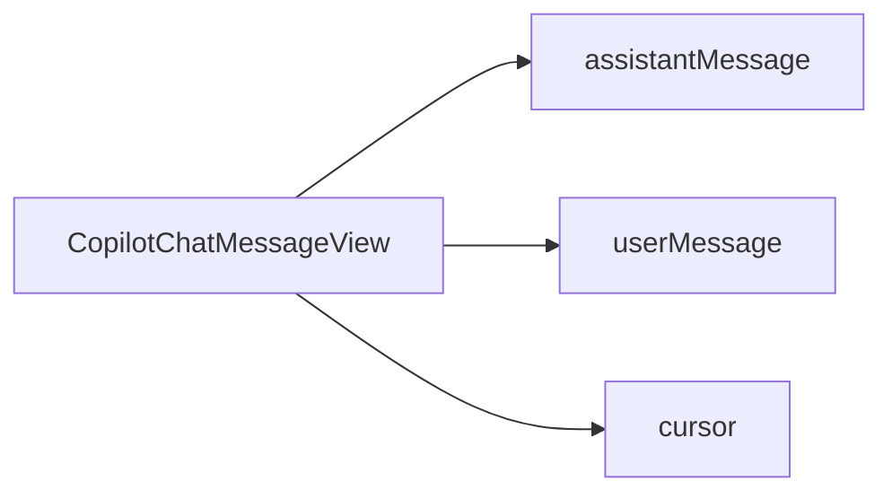

`CopilotChatMessageView` is the default component used by [CopilotChat](/reference/copilot-chat) to render the message list. It handles rendering user messages, assistant messages, activity messages, and custom message renderers with optimized memoization for performance.

## What is CopilotChatMessageView?

The CopilotChatMessageView component:

- Renders the conversation message list
- Handles user, assistant, and activity message types
- Supports custom message renderers for extensibility
- Optimizes re-renders with memoization
- Shows a typing cursor during streaming responses
- Built on the [slot system](/reference/slot-system) for deep customization

## Component Architecture

CopilotChatMessageView provides slots for customizing message rendering:



### Slot Descriptions

| Slot | Description |
|------|-------------|
| `assistantMessage` | Component for rendering assistant (AI) messages |
| `userMessage` | Component for rendering user messages |
| `cursor` | Typing indicator shown during streaming |

## Basic Usage

Customize the message view through the `messageView` prop on [CopilotChat](/reference/copilot-chat):

```tsx
<CopilotChat
  messageView={{
    className: "space-y-4 p-4",
    assistantMessage: "bg-blue-50 rounded-lg",
    userMessage: "bg-gray-100 rounded-lg",
  }}
/>
```

## Slot Customization

CopilotChatMessageView uses the [slot system](/reference/slot-system). Each slot accepts four types of values:

1. **Tailwind class string** - Add or override CSS classes
2. **Props object** - Pass additional props to the default component
3. **Custom component** - Replace the component entirely
4. **Nested sub-slots** - Drill down to customize child components

### Assistant Message Customization

The `assistantMessage` slot controls how AI responses are rendered:

```tsx
<CopilotChat
  messageView={{
    assistantMessage: {
      className: "bg-slate-50 border border-slate-200 rounded-xl p-4",
      onThumbsUp: (message) => sendFeedback(message.id, "positive"),
      onThumbsDown: (message) => sendFeedback(message.id, "negative"),
      onRegenerate: (message) => regenerateResponse(message.id),
    },
  }}
/>
```

#### Assistant Message Sub-Slots

| Sub-Slot | Description |
|----------|-------------|
| `markdownRenderer` | Renders the message content with markdown support |
| `toolbar` | Container for action buttons |
| `copyButton` | Button to copy message content |
| `thumbsUpButton` | Positive feedback button |
| `thumbsDownButton` | Negative feedback button |
| `readAloudButton` | Text-to-speech button |
| `regenerateButton` | Button to regenerate the response |
| `toolCallsView` | Renders tool call executions |

For full details, see [CopilotChatAssistantMessage](/reference/copilot-chat-assistant-message).

### User Message Customization

The `userMessage` slot controls how user messages are rendered:

```tsx
<CopilotChat
  messageView={{
    userMessage: {
      className: "bg-primary text-primary-foreground rounded-2xl px-4 py-2",
      onEditMessage: ({ message }) => editMessage(message),
    },
  }}
/>
```

#### User Message Sub-Slots

| Sub-Slot | Description |
|----------|-------------|
| `messageRenderer` | Renders the message text content |
| `toolbar` | Container for action buttons |
| `copyButton` | Button to copy message content |
| `editButton` | Button to edit the message |
| `branchNavigation` | Navigation for conversation branches |

For full details, see [CopilotChatUserMessage](/reference/copilot-chat-user-message).

### Cursor Customization

The cursor appears while the AI is generating a response:

```tsx
<CopilotChat
  messageView={{
    cursor: "bg-blue-500 w-3 h-3",
  }}
/>
```

Or with a custom component:

```tsx
function CustomCursor() {
  return (
    <div className="flex gap-1">
      <span className="w-2 h-2 bg-blue-500 rounded-full animate-bounce" />
      <span className="w-2 h-2 bg-blue-500 rounded-full animate-bounce delay-100" />
      <span className="w-2 h-2 bg-blue-500 rounded-full animate-bounce delay-200" />
    </div>
  );
}

<CopilotChat
  messageView={{
    cursor: CustomCursor,
  }}
/>
```

## Replacing the Message View

To completely replace the message view with your own component, pass a custom component to the `messageView` prop:

```tsx
import { CopilotChatMessageView } from "@copilotkitnext/react";

function CustomMessageView({ messages, isRunning, ...props }) {
  return (
    <div className="custom-message-list">
      <div className="message-count text-sm text-muted-foreground mb-4">
        {messages.length} messages
      </div>

      {/* Use the default implementation with customizations */}
      <CopilotChatMessageView
        messages={messages}
        isRunning={isRunning}
        className="space-y-6"
        assistantMessage="bg-white shadow-sm rounded-xl p-4"
        userMessage="bg-blue-500 text-white rounded-2xl"
        {...props}
      />

      {isRunning && (
        <div className="text-center text-muted-foreground mt-4">
          AI is thinking...
        </div>
      )}
    </div>
  );
}

<CopilotChat messageView={CustomMessageView} />
```

### Using the Render Function

For even more control, use the children render function pattern:

```tsx
function CustomMessageView({ messages, isRunning }) {
  return (
    <CopilotChatMessageView messages={messages} isRunning={isRunning}>
      {({ messageElements, messages, isRunning }) => (
        <div className="custom-layout">
          <header className="sticky top-0 bg-background p-2 border-b">
            {messages.length} messages
          </header>

          <div className="messages p-4">
            {messageElements}
          </div>

          {isRunning && (
            <footer className="sticky bottom-0 bg-background p-2">
              Generating response...
            </footer>
          )}
        </div>
      )}
    </CopilotChatMessageView>
  );
}

<CopilotChat messageView={CustomMessageView} />
```

The render function receives:

| Property | Type | Description |
|----------|------|-------------|
| `messageElements` | `ReactElement[]` | Pre-rendered message components |
| `messages` | `Message[]` | Raw message data |
| `isRunning` | `boolean` | Whether AI is generating |

## Examples

### Styling All Messages

```tsx
<CopilotChat
  messageView={{
    className: "space-y-6 p-4",
    assistantMessage: "bg-white shadow-sm rounded-xl p-4",
    userMessage: "bg-blue-500 text-white rounded-2xl px-4 py-2",
  }}
/>
```

### Adding Feedback Handlers

```tsx
<CopilotChat
  messageView={{
    assistantMessage: {
      onThumbsUp: (message) => {
        analytics.track("positive_feedback", { messageId: message.id });
      },
      onThumbsDown: (message) => {
        analytics.track("negative_feedback", { messageId: message.id });
      },
    },
  }}
/>
```

### Custom Assistant Message Component

Replace the assistant message component entirely:

```tsx
function CustomAssistantMessage({ message, isRunning }) {
  return (
    <div className="flex gap-3">
      <Avatar src="/bot-avatar.png" />
      <div className="flex-1">
        <Markdown>{message.content}</Markdown>
        {isRunning && <TypingIndicator />}
      </div>
    </div>
  );
}

<CopilotChat
  messageView={{
    assistantMessage: CustomAssistantMessage,
  }}
/>
```

## Related

- [CopilotChat](/reference/copilot-chat) - Parent component that uses CopilotChatMessageView
- [CopilotChatAssistantMessage](/reference/copilot-chat-assistant-message) - Assistant message customization
- [CopilotChatUserMessage](/reference/copilot-chat-user-message) - User message customization
- [Slot System](/reference/slot-system) - Deep dive into slot customization
