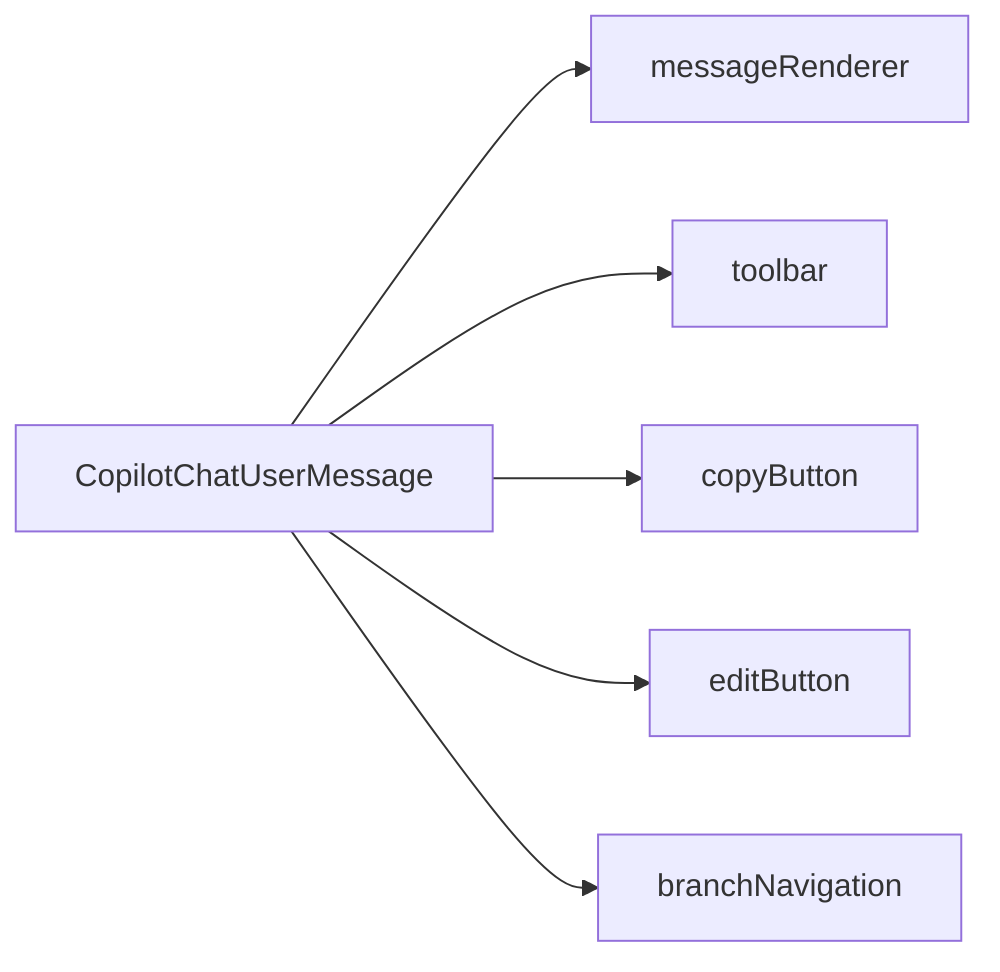

`CopilotChatUserMessage` is the default component used by [CopilotChatMessageView](/reference/copilot-chat-message-view) to render user messages. It handles message display, editing functionality, and branch navigation for conversation history.

## What is CopilotChatUserMessage?

The CopilotChatUserMessage component:

- Renders user messages in a styled bubble
- Provides a toolbar with copy and edit buttons
- Supports message editing functionality
- Handles branch navigation for conversation forks
- Built on the [slot system](/reference/slot-system) for deep customization

## Component Architecture

CopilotChatUserMessage provides slots for customizing each part of the message:



### Slot Descriptions

| Slot | Description |
|------|-------------|
| `messageRenderer` | Renders the message text content |
| `toolbar` | Container for action buttons (appears on hover) |
| `copyButton` | Button to copy message content |
| `editButton` | Button to edit the message |
| `branchNavigation` | Navigation controls for conversation branches |

## Basic Usage

Customize user messages through the `messageView.userMessage` slot on [CopilotChat](/reference/copilot-chat):

```tsx
<CopilotChat
  messageView={{
    userMessage: {
      className: "bg-blue-500 text-white rounded-2xl",
      onEditMessage: ({ message }) => handleEdit(message),
    },
  }}
/>
```

## Callbacks

CopilotChatUserMessage provides callbacks for user interactions:

```tsx
<CopilotChat
  messageView={{
    userMessage: {
      onEditMessage: ({ message }) => {
        // Open edit modal or inline editor
        setEditingMessage(message);
      },
      onSwitchToBranch: ({ message, branchIndex, numberOfBranches }) => {
        // Switch to a different conversation branch
        switchToBranch(message.id, branchIndex);
      },
    },
  }}
/>
```

### Callback Props

| Callback | Signature | Description |
|----------|-----------|-------------|
| `onEditMessage` | `({ message }) => void` | Called when user clicks the edit button |
| `onSwitchToBranch` | `({ message, branchIndex, numberOfBranches }) => void` | Called when user navigates between branches |

## Slot Customization

CopilotChatUserMessage uses the [slot system](/reference/slot-system). Each slot accepts four types of values:

1. **Tailwind class string** - Add or override CSS classes
2. **Props object** - Pass additional props to the default component
3. **Custom component** - Replace the component entirely
4. **Nested sub-slots** - Drill down to customize child components

### Message Renderer Customization

Style the message bubble:

```tsx
<CopilotChat
  messageView={{
    userMessage: {
      messageRenderer: "bg-gradient-to-r from-blue-500 to-purple-500 text-white",
    },
  }}
/>
```

### Toolbar Customization

The toolbar appears on hover and contains action buttons:

```tsx
<CopilotChat
  messageView={{
    userMessage: {
      toolbar: "bg-gray-50 rounded-lg p-1",
    },
  }}
/>
```

### Individual Button Customization

Customize specific toolbar buttons:

```tsx
<CopilotChat
  messageView={{
    userMessage: {
      copyButton: "text-gray-500 hover:text-gray-700",
      editButton: "text-blue-500 hover:text-blue-700",
    },
  }}
/>
```

### Hiding Buttons

Hide buttons by returning null:

```tsx
<CopilotChat
  messageView={{
    userMessage: {
      editButton: () => null,
      branchNavigation: () => null,
    },
  }}
/>
```

Note: The `editButton` only shows when `onEditMessage` callback is provided.

### Branch Navigation Customization

Customize the branch navigation controls:

```tsx
<CopilotChat
  messageView={{
    userMessage: {
      branchNavigation: "bg-gray-100 rounded-lg px-2",
    },
  }}
/>
```

Branch navigation only appears when there are multiple branches (conversation forks) available.

## Replacing the Component

To completely replace the user message component:

```tsx
import { CopilotChatUserMessage } from "@copilotkitnext/react";

function CustomUserMessage({ message, ...props }) {
  return (
    <div className="flex gap-3 items-start justify-end">
      <div className="flex-1">
        <CopilotChatUserMessage
          message={message}
          className="bg-blue-600 text-white"
          {...props}
        />
      </div>
      <Avatar src="/user-avatar.png" />
    </div>
  );
}

<CopilotChat
  messageView={{
    userMessage: CustomUserMessage,
  }}
/>
```

### Using the Render Function

For full layout control, use the children render function:

```tsx
function CustomUserMessage(props) {
  return (
    <CopilotChatUserMessage {...props}>
      {({ messageRenderer, toolbar, message }) => (
        <div className="flex flex-col items-end gap-1">
          <div className="flex items-center gap-2">
            <span className="text-xs text-gray-400">You</span>
            <span className="text-xs text-gray-400">
              {new Date(message.createdAt).toLocaleTimeString()}
            </span>
          </div>
          {messageRenderer}
          {toolbar}
        </div>
      )}
    </CopilotChatUserMessage>
  );
}

<CopilotChat
  messageView={{
    userMessage: CustomUserMessage,
  }}
/>
```

The render function receives:

| Property | Type | Description |
|----------|------|-------------|
| `messageRenderer` | `ReactElement` | The rendered message content |
| `toolbar` | `ReactElement` | The action buttons toolbar |
| `copyButton` | `ReactElement` | Copy button |
| `editButton` | `ReactElement` | Edit button |
| `branchNavigation` | `ReactElement` | Branch navigation controls |
| `message` | `UserMessage` | The message data |
| `branchIndex` | `number` | Current branch index |
| `numberOfBranches` | `number` | Total number of branches |

## Branch Navigation

When users edit messages and regenerate responses, CopilotKit creates conversation branches. The branch navigation allows users to switch between these alternative conversation paths:

```tsx
<CopilotChat
  messageView={{
    userMessage: {
      onSwitchToBranch: ({ message, branchIndex, numberOfBranches }) => {
        console.log(`Switching to branch ${branchIndex + 1} of ${numberOfBranches}`);
        // Your branch switching logic
      },
    },
  }}
/>
```

The branch navigation shows:
- Previous/Next arrows to navigate between branches
- Current branch indicator (e.g., "2/3")

## Examples

### Chat Bubble Style

```tsx
<CopilotChat
  messageView={{
    userMessage: {
      className: "items-end",
      messageRenderer: "bg-blue-600 text-white rounded-2xl px-4 py-2 max-w-[75%]",
      toolbar: "opacity-0 group-hover:opacity-100 transition-opacity",
    },
  }}
/>
```

### With Edit Functionality

```tsx
function ChatWithEdit() {
  const [editingMessage, setEditingMessage] = useState(null);

  return (
    <>
      <CopilotChat
        messageView={{
          userMessage: {
            onEditMessage: ({ message }) => setEditingMessage(message),
            editButton: "text-blue-500 hover:text-blue-700",
          },
        }}
      />

      {editingMessage && (
        <EditMessageModal
          message={editingMessage}
          onClose={() => setEditingMessage(null)}
        />
      )}
    </>
  );
}
```

### Minimal Style

Hide all toolbar elements for a clean look:

```tsx
<CopilotChat
  messageView={{
    userMessage: {
      toolbar: () => null,
    },
  }}
/>
```

### Custom Message with Avatar

```tsx
function UserMessageWithAvatar(props) {
  return (
    <CopilotChatUserMessage {...props}>
      {({ messageRenderer, toolbar }) => (
        <div className="flex items-start gap-3 justify-end">
          <div className="flex flex-col items-end">
            {messageRenderer}
            {toolbar}
          </div>
          
        </div>
      )}
    </CopilotChatUserMessage>
  );
}

<CopilotChat
  messageView={{
    userMessage: UserMessageWithAvatar,
  }}
/>
```

### Styled for Dark Mode

```tsx
<CopilotChat
  messageView={{
    userMessage: {
      messageRenderer: "bg-blue-600 text-white dark:bg-blue-500",
      toolbar: "text-gray-400 dark:text-gray-500",
      copyButton: "hover:text-white dark:hover:text-gray-300",
      editButton: "hover:text-white dark:hover:text-gray-300",
    },
  }}
/>
```

## Related

- [CopilotChat](/reference/copilot-chat) - Parent component
- [CopilotChatMessageView](/reference/copilot-chat-message-view) - Message list component that uses user messages
- [CopilotChatAssistantMessage](/reference/copilot-chat-assistant-message) - Counterpart for AI messages
- [Slot System](/reference/slot-system) - Deep dive into slot customization
