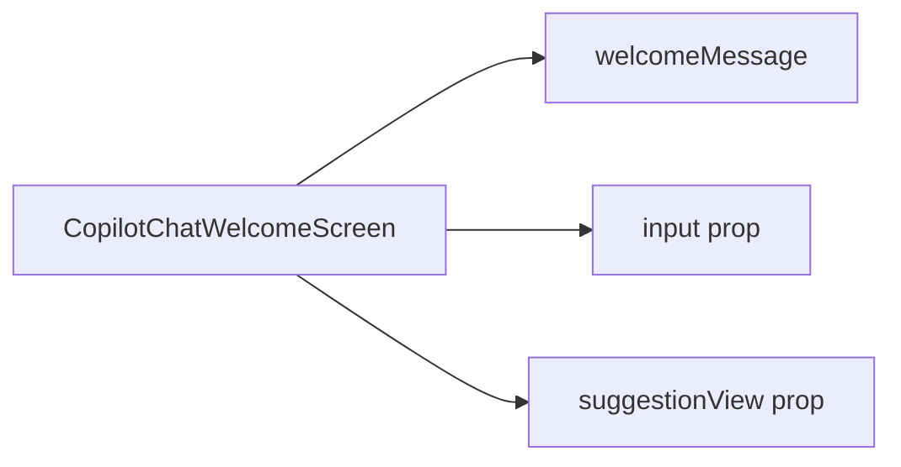

`CopilotChatWelcomeScreen` is the default component displayed by [CopilotChat](/reference/copilot-chat) when there are no messages. It provides a welcoming introduction with an input field and optional suggestion chips.

## What is CopilotChatWelcomeScreen?

The CopilotChatWelcomeScreen component:

- Displays when the conversation is empty (no messages)
- Shows a customizable welcome message
- Includes the chat input for starting conversations
- Displays suggestion chips for quick actions
- Built on the [slot system](/reference/slot-system) for deep customization

## Component Architecture

CopilotChatWelcomeScreen provides a slot for the welcome message and receives input and suggestions as props:



### Slot Descriptions

| Slot/Prop | Description |
|-----------|-------------|
| `welcomeMessage` | The greeting text or component displayed at the top |
| `input` | The chat input component (passed as a prop) |
| `suggestionView` | Suggestion chips component (passed as a prop) |

## Basic Usage

Customize the welcome screen through the `welcomeScreen` prop on [CopilotChat](/reference/copilot-chat):

```tsx
<CopilotChat
  welcomeScreen={{
    className: "bg-gradient-to-b from-blue-50 to-white",
    welcomeMessage: "text-2xl font-bold text-blue-900",
  }}
/>
```

## Customizing the Welcome Message

The simplest way to customize the welcome message is through labels:

```tsx
<CopilotChat
  labels={{
    welcomeMessage: "Hello! I'm your AI assistant. How can I help you today?",
  }}
/>
```

Or style the welcome message component:

```tsx
<CopilotChat
  welcomeScreen={{
    welcomeMessage: {
      className: "text-3xl font-bold bg-gradient-to-r from-blue-600 to-purple-600 bg-clip-text text-transparent",
    },
  }}
/>
```

## Disabling the Welcome Screen

To skip the welcome screen and show an empty chat directly:

```tsx
<CopilotChat welcomeScreen={false} />
```

## Slot Customization

CopilotChatWelcomeScreen uses the [slot system](/reference/slot-system). Each slot accepts four types of values:

1. **Tailwind class string** - Add or override CSS classes
2. **Props object** - Pass additional props to the default component
3. **Custom component** - Replace the component entirely
4. **Nested sub-slots** - Drill down to customize child components

### Welcome Message Customization

Style the welcome message:

```tsx
<CopilotChat
  welcomeScreen={{
    welcomeMessage: "text-4xl font-extrabold tracking-tight",
  }}
/>
```

Or with a custom component:

```tsx
function CustomWelcomeMessage() {
  return (
    <div className="text-center">
      
      <h1 className="text-2xl font-bold">Welcome to AI Assistant</h1>
      <p className="text-gray-500 mt-2">Ask me anything about your project</p>
    </div>
  );
}

<CopilotChat
  welcomeScreen={{
    welcomeMessage: CustomWelcomeMessage,
  }}
/>
```

## Replacing the Welcome Screen

To completely replace the welcome screen with your own component:

```tsx
import { CopilotChatView } from "@copilotkitnext/react";

function CustomWelcomeScreen({ input, suggestionView }) {
  return (
    <div className="flex flex-col items-center justify-center h-full bg-gradient-to-b from-indigo-50 to-white p-8">
      

      <h1 className="text-3xl font-bold text-gray-900 mb-2">
        Hi there!
      </h1>

      <p className="text-gray-600 text-center max-w-md mb-8">
        I'm your AI assistant. I can help you with coding, research,
        writing, and much more. What would you like to explore?
      </p>

      <div className="w-full max-w-2xl">
        {input}
      </div>

      <div className="mt-6">
        {suggestionView}
      </div>
    </div>
  );
}

<CopilotChat welcomeScreen={CustomWelcomeScreen} />
```

### Using the Render Function

For full layout control while keeping the default components:

```tsx
function CustomWelcomeScreen(props) {
  return (
    <CopilotChatView.WelcomeScreen {...props}>
      {({ welcomeMessage, input, suggestionView }) => (
        <div className="flex flex-col lg:flex-row h-full">
          <div className="lg:w-1/2 bg-indigo-600 text-white p-12 flex items-center justify-center">
            <div className="max-w-md">
              <h1 className="text-4xl font-bold mb-4">AI Assistant</h1>
              <p className="text-indigo-200">
                Your intelligent companion for coding, writing, and problem-solving.
              </p>
            </div>
          </div>

          <div className="lg:w-1/2 p-12 flex flex-col items-center justify-center">
            <div className="w-full max-w-md">
              {welcomeMessage}
              <div className="mt-8">{input}</div>
              <div className="mt-6">{suggestionView}</div>
            </div>
          </div>
        </div>
      )}
    </CopilotChatView.WelcomeScreen>
  );
}

<CopilotChat welcomeScreen={CustomWelcomeScreen} />
```

The render function receives:

| Property | Type | Description |
|----------|------|-------------|
| `welcomeMessage` | `ReactElement` | The rendered welcome message |
| `input` | `ReactElement` | The chat input component |
| `suggestionView` | `ReactElement` | The suggestions chips component |

## Examples

### Branded Welcome Screen

```tsx
<CopilotChat
  labels={{
    welcomeMessage: "Welcome to Acme AI Assistant",
  }}
  welcomeScreen={{
    className: "bg-brand-50",
    welcomeMessage: "text-brand-900 text-3xl font-display",
  }}
/>
```

### Minimal Welcome

```tsx
<CopilotChat
  labels={{
    welcomeMessage: "How can I help?",
  }}
  welcomeScreen={{
    welcomeMessage: "text-lg text-gray-500 font-normal",
  }}
/>
```

### Welcome with Custom Layout

```tsx
function CenteredWelcome({ input, suggestionView }) {
  return (
    <div className="flex flex-col items-center justify-center h-full p-8">
      <div className="animate-pulse mb-8">
        <div className="w-20 h-20 bg-gradient-to-br from-blue-400 to-purple-500 rounded-full" />
      </div>

      <h1 className="text-2xl font-semibold text-gray-900 mb-1">
        Ready to help
      </h1>

      <p className="text-gray-500 mb-8">
        Start a conversation below
      </p>

      <div className="w-full max-w-xl">
        {input}
      </div>

      <div className="mt-4 flex flex-wrap justify-center gap-2">
        {suggestionView}
      </div>
    </div>
  );
}

<CopilotChat welcomeScreen={CenteredWelcome} />
```

### Welcome Screen with Feature List

```tsx
function FeatureWelcome({ input, suggestionView }) {
  return (
    <div className="flex flex-col items-center justify-center h-full p-8">
      <h1 className="text-3xl font-bold mb-8">AI Assistant</h1>

      <div className="grid grid-cols-3 gap-4 mb-8 max-w-2xl">
        <div className="text-center p-4">
          <div className="text-2xl mb-2">💻</div>
          <div className="font-medium">Code Help</div>
        </div>
        <div className="text-center p-4">
          <div className="text-2xl mb-2">📝</div>
          <div className="font-medium">Writing</div>
        </div>
        <div className="text-center p-4">
          <div className="text-2xl mb-2">🔍</div>
          <div className="font-medium">Research</div>
        </div>
      </div>

      <div className="w-full max-w-xl">
        {input}
      </div>

      <div className="mt-4">{suggestionView}</div>
    </div>
  );
}

<CopilotChat welcomeScreen={FeatureWelcome} />
```

## Related

- [CopilotChat](/reference/copilot-chat) - Parent component that uses CopilotChatWelcomeScreen
- [CopilotChatInput](/reference/copilot-chat-input) - Input component displayed in welcome screen
- [CopilotChatSuggestionView](/reference/copilot-chat-suggestion-view) - Suggestions displayed in welcome screen
- [Slot System](/reference/slot-system) - Deep dive into slot customization
