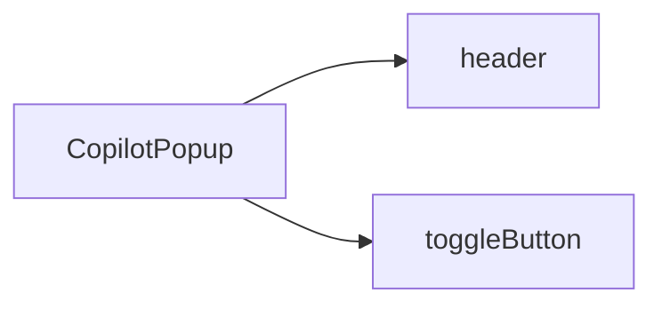

`CopilotPopup` is a React component that provides a floating popup chat interface. It wraps [CopilotChat](/reference/copilot-chat) with additional popup-specific behavior including a toggle button, fade/scale animation, and optional click-outside-to-close functionality.

## What is CopilotPopup?

The CopilotPopup component:

- Provides a floating dialog with smooth fade/scale animation
- Includes a toggle button for open/close
- Supports click-outside-to-close behavior
- Responsive design (fullscreen on mobile, fixed size on desktop)
- Built on [CopilotChat](/reference/copilot-chat) - inherits all its features and customization options

## Component Architecture

CopilotPopup extends [CopilotChat](/reference/copilot-chat#component-architecture) with additional slots:



### Slot Descriptions

| Slot | Description |
|------|-------------|
| `header` | Header bar with title and close button |
| `toggleButton` | Floating button to open/close the popup |

CopilotPopup also inherits all slots from CopilotChat: `messageView`, `scrollView`, `input`, `suggestionView`, and `welcomeScreen`.

See [Slot Customization](#slot-customization) for details on how to customize these slots.

## Basic Usage

```tsx
import { CopilotPopup, CopilotKitProvider } from "@copilotkitnext/react";

function App() {
  return (
    <CopilotKitProvider runtimeUrl="/api/copilotkit">
      <CopilotPopup />
    </CopilotKitProvider>
  );
}
```

## Props

### Popup-Specific Props

These props are unique to CopilotPopup:

| Prop | Type | Default | Description |
|------|------|---------|-------------|
| `defaultOpen` | `boolean` | `true` | Whether the popup is open initially |
| `width` | `number \| string` | `420` | Popup width in pixels or CSS unit |
| `height` | `number \| string` | `560` | Popup height in pixels or CSS unit |
| `clickOutsideToClose` | `boolean` | `false` | Close the popup when clicking outside |
| `header` | `SlotValue` | - | Custom header component with title and close button |
| `toggleButton` | `SlotValue` | - | Custom toggle button to open/close the popup |

### Shared Props

CopilotPopup inherits all props from [CopilotChat](/reference/copilot-chat), including:

- `agentId` - The agent to connect to
- `threadId` - The conversation thread ID
- `labels` - Customize text labels
- `autoScroll` - Auto-scroll behavior
- `className` - CSS class for the root container

See [CopilotChat Props](/reference/copilot-chat#props) for the complete list.

## Header Customization

The popup includes a header with a title and close button. Customize it through the `header` prop:

```tsx
<CopilotPopup
  header={{
    titleContent: "My Assistant",
    closeButton: "hidden",
  }}
/>
```

### Header Sub-Slots

| Sub-Slot | Description |
|----------|-------------|
| `titleContent` | The title text or component |
| `closeButton` | The close button (can be hidden) |

### Custom Header Component

Replace the entire header with your own component:

```tsx
function CustomHeader() {
  return (
    <div className="flex items-center justify-between p-4 border-b">
      <div className="flex items-center gap-2">
        <BotIcon className="w-5 h-5" />
        <span className="font-semibold">My AI Assistant</span>
      </div>
      <button onClick={() => /* close popup */}>
        <XIcon className="w-5 h-5" />
      </button>
    </div>
  );
}

<CopilotPopup header={CustomHeader} />
```

## Toggle Button Customization

The popup includes a floating toggle button to open and close it. Customize it through the `toggleButton` prop:

```tsx
<CopilotPopup
  toggleButton={{
    className: "bg-purple-500 hover:bg-purple-600",
    openIcon: "text-white",
    closeIcon: "text-white",
  }}
/>
```

### Toggle Button Sub-Slots

| Sub-Slot | Description |
|----------|-------------|
| `openIcon` | Icon shown when popup is closed (click to open) |
| `closeIcon` | Icon shown when popup is open (click to close) |

### Custom Toggle Button Component

Replace the toggle button entirely:

```tsx
function CustomToggleButton() {
  return (
    <button className="fixed bottom-4 right-4 p-3 bg-blue-500 rounded-full">
      <ChatIcon className="w-6 h-6 text-white" />
    </button>
  );
}

<CopilotPopup toggleButton={CustomToggleButton} />
```

## Slot Customization

CopilotPopup uses the same [slot system](/reference/slot-system) as CopilotChat. Each slot accepts four types of values:

1. **Tailwind class string** - Add or override CSS classes
2. **Props object** - Pass additional props to the default component
3. **Custom component** - Replace the component entirely
4. **Nested sub-slots** - Drill down to customize child components

### Custom Dimensions

```tsx
<CopilotPopup width={500} height={700} />

// Or with CSS units
<CopilotPopup width="30vw" height="80vh" />
```

### Click Outside to Close

```tsx
<CopilotPopup clickOutsideToClose={true} />
```

### Custom Header Styling

```tsx
<CopilotPopup
  header={{
    className: "bg-gradient-to-r from-blue-500 to-purple-500 text-white",
    titleContent: "AI Assistant",
  }}
/>
```

### Nested Slot Customization

```tsx
<CopilotPopup
  messageView={{
    assistantMessage: {
      onThumbsUp: (msg) => console.log("Liked:", msg.id),
      onThumbsDown: (msg) => console.log("Disliked:", msg.id),
    },
  }}
  input={{
    className: "border-2 border-gray-200",
    sendButton: "bg-blue-500 hover:bg-blue-600",
  }}
/>
```

## Related

- [CopilotChat](/reference/copilot-chat) - Base chat component with full customization options
- [CopilotSidebar](/reference/copilot-sidebar) - Slide-in sidebar chat interface
- [Slot System](/reference/slot-system) - Deep dive into slot customization
- [CopilotKitProvider](/reference/copilotkit-provider) - Provider configuration
