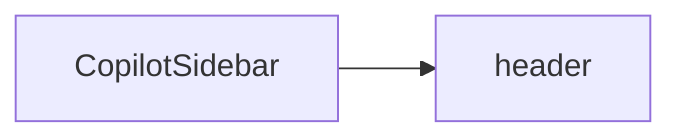

`CopilotSidebar` is a React component that provides a slide-in sidebar chat interface. It wraps [CopilotChat](/reference/copilot-chat) with additional sidebar-specific behavior including a toggle button, slide-in animation, and automatic body margin adjustment.

## What is CopilotSidebar?

The CopilotSidebar component:

- Provides a fixed right-side panel with smooth slide-in animation
- Includes a toggle button for open/close
- Automatically adjusts body margin when open to prevent content overlap
- Responsive design (full width on mobile, custom width on desktop)
- Built on [CopilotChat](/reference/copilot-chat) - inherits all its features and customization options

## Component Architecture

CopilotSidebar extends [CopilotChat](/reference/copilot-chat#component-architecture) with an additional `header` slot:



### Slot Descriptions

| Slot | Description |
|------|-------------|
| `header` | Header bar with title and close button |

CopilotSidebar also inherits all slots from CopilotChat: `messageView`, `scrollView`, `input`, `suggestionView`, and `welcomeScreen`.

See [Slot Customization](#slot-customization) for details on how to customize these slots.

## Basic Usage

```tsx
import { CopilotSidebar, CopilotKitProvider } from "@copilotkitnext/react";

function App() {
  return (
    <CopilotKitProvider runtimeUrl="/api/copilotkit">
      <CopilotSidebar />
    </CopilotKitProvider>
  );
}
```

## Props

### Sidebar-Specific Props

These props are unique to CopilotSidebar:

| Prop | Type | Default | Description |
|------|------|---------|-------------|
| `defaultOpen` | `boolean` | `false` | Whether the sidebar is open initially |
| `width` | `number \| string` | `480` | Sidebar width in pixels or CSS unit |
| `header` | `SlotValue` | - | Custom header component with title and close button |

### Shared Props

CopilotSidebar inherits all props from [CopilotChat](/reference/copilot-chat), including:

- `agentId` - The agent to connect to
- `threadId` - The conversation thread ID
- `labels` - Customize text labels
- `autoScroll` - Auto-scroll behavior
- `className` - CSS class for the root container

See [CopilotChat Props](/reference/copilot-chat#props) for the complete list.

## Header Customization

The sidebar includes a header with a title and close button. Customize it through the `header` prop:

```tsx
<CopilotSidebar
  header={{
    titleContent: "My Assistant",
    closeButton: "hidden",
  }}
/>
```

### Header Sub-Slots

| Sub-Slot | Description |
|----------|-------------|
| `titleContent` | The title text or component |
| `closeButton` | The close button (can be hidden) |

## Slot Customization

CopilotSidebar uses the same [slot system](/reference/slot-system) as CopilotChat. Each slot accepts four types of values:

1. **Tailwind class string** - Add or override CSS classes
2. **Props object** - Pass additional props to the default component
3. **Custom component** - Replace the component entirely
4. **Nested sub-slots** - Drill down to customize child components

### Custom Width

```tsx
<CopilotSidebar width={600} />

// Or with CSS units
<CopilotSidebar width="50vw" />
```

### Custom Header

```tsx
<CopilotSidebar
  header={{
    className: "bg-gradient-to-r from-blue-500 to-purple-500 text-white",
    titleContent: "AI Assistant",
  }}
/>
```

### Nested Slot Customization

```tsx
<CopilotSidebar
  messageView={{
    assistantMessage: {
      onThumbsUp: (msg) => console.log("Liked:", msg.id),
      onThumbsDown: (msg) => console.log("Disliked:", msg.id),
    },
  }}
  input={{
    className: "border-2 border-gray-200",
    sendButton: "bg-blue-500 hover:bg-blue-600",
  }}
/>
```

## Complete Example

```tsx
import { CopilotSidebar, CopilotKitProvider } from "@copilotkitnext/react";

function App() {
  return (
    <CopilotKitProvider runtimeUrl="/api/copilotkit">
      <div className="min-h-screen">
        <main className="p-8">
          <h1>My Application</h1>
          <p>Your main content here...</p>
        </main>

        <CopilotSidebar
          defaultOpen={false}
          width={500}
          agentId="my-assistant"
          header={{
            titleContent: "AI Assistant",
            className: "bg-slate-900 text-white",
          }}
          labels={{
            chatInputPlaceholder: "Ask me anything...",
            welcomeMessage: "Hello! How can I help you today?",
          }}
          messageView={{
            assistantMessage: {
              onThumbsUp: (msg) => trackFeedback(msg.id, "positive"),
              onThumbsDown: (msg) => trackFeedback(msg.id, "negative"),
            },
          }}
        />
      </div>
    </CopilotKitProvider>
  );
}
```

## Related

- [CopilotChat](/reference/copilot-chat) - Base chat component with full customization options
- [CopilotPopup](/reference/copilot-popup) - Floating popup chat dialog
- [Slot System](/reference/slot-system) - Deep dive into slot customization
- [CopilotKitProvider](/reference/copilotkit-provider) - Provider configuration
